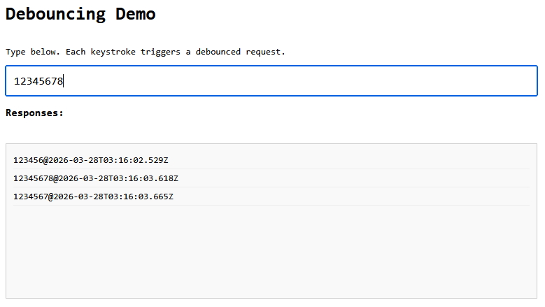
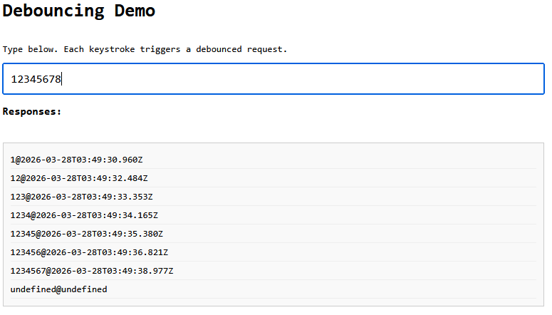

Debounce is one of those patterns every frontend developer learns early and keeps using forever.

At its core, debouncing does one thing well: it coalesces a burst of calls into one invocation after a quiet window. That is a great fit for noisy UI signals.

Its most familiar use case is autocomplete, but the same pattern applies to resize handlers, scroll listeners, live validation, filter controls, and telemetry hooks.

A typical implementation looks like this:

```js
function debounce(fn, delay) {
	let timer;
	return (...args) => {
		clearTimeout(timer);
		timer = setTimeout(() => fn(...args), delay);
	};
}

const search = debounce(async (q) => {
	const res = await fetch(`/api/search?q=${q}`);
	const data = await res.json();
	render(data);
}, 300);
```

It looks disciplined. It feels efficient. It ships fast.

And this is where the title comes from.

The issue is not debounce itself. The issue is this vanilla debounce + `fetch` pattern once real network behavior enters the picture.

It gives the feeling that requests are "under control," but it does not control request lifecycle: response ordering, cancellation of stale work, or failure behavior.

That is why it feels like debounce is "lying" in production: the UI looks smoothed, while the network layer is still fragile.

In this article, we will keep debounce for what it is good at (UI smoothing), then harden the request path with cancellation, retries, and better error handling.

## The Illusion of "Fixed" Behavior

Debounce is convincing: you type quickly, the UI triggers fewer calls, and the network tab looks quieter. It *feels* like the system is now stable. But in production, under real network conditions, many things can go wrong. You will experience stale data, wasted requests, silent failures and other unexpected behaviors.

This is true for any network request, but debounce adds another layer of complexity: it makes the UI look smooth while the network can still be unpredictable. This mismatch can create a false sense of security.

Debounce itself only guarantees one thing:

> "I won't call this function too often."

Debounce smooths input frequency, not request lifecycle. It does **not** guarantee:

- Responses arrive in order.
- Stale requests stop running.
- Failures are handled consistently.

In other words: it is **a UI pattern, not a network pattern**. So you have to make sure the underlying network layer is robust enough to handle real-world conditions. Before we examine what can go wrong, let's set the stage!

## The Companion Code

To make these problems visible, we have a companion demo app with a single text input where every keystroke triggers a debounced request to `/api/echo?q=<input>`. The backend is an Express server that returns `{ query, timestamp }`, and the frontend appends each response to a div as `query@timestamp`. The stack is minimal: Node.js + Express on the backend, and plain HTML/CSS/JavaScript in the browser.

Clone the repo and install dependencies:

```bash
git clone https://github.com/gkoos/article-debouncing.git
cd article-debouncing
npm install
```

Then start the app:

```bash
npm start
```

And navigate to http://localhost:3000 in your browser. You will see something like this:


Now, as you type in the input field, you will see the responses coming back in the list below:


The UI also shows toast notifications for request success and failure, which will become relevant in later sections.

This is our baseline setup, it demonstrates the basic pattern. There is a 300ms debounce on the input, and the backend immediately responds with the query and a timestamp. The UI appends each response to the list.

## Problem 1: Race Conditions (aka Stale UI)

On your local machine, everything is fast and smooth. But in production, network conditions are unpredictable. Requests can take varying amounts of time to complete, so there is no guarantee that responses will arrive in the same order they were sent. Let's see what happens if we add random delays to the server response to simulate real network conditions.

Check out the `01-stale-requests` branch and restart the server:

```bash
git checkout 01-stale-requests
npm start
```

We added a middleware that introduces a random delay of 0–1000ms for each request. Now, when you type quickly, you might see responses arriving out of order:



We typed `12345678`, but the UI shows `1234567`! The response for `7` came back *after* `8`, so the UI is now stale. This is a classic race condition, and debounce itself does not prevent it. The UI is showing results for an older query, which can lead to confusion and errors in a real application.

How to fix this? We need to ensure that only the latest request's response is processed, and any previous requests are either cancelled or ignored. We could implement a simple version of this by keeping track of the latest query and ignoring responses that don't match it. But that would still allow all requests to run, which is inefficient. A better approach is to use the [`AbortController`](https://developer.mozilla.org/en-US/docs/Web/API/AbortController) API to cancel stale requests, so they don't consume resources or trigger side effects when they complete.

`AbortController` is a browser-native API. You create a controller, pass its `signal` to `fetch`, and call `abort()` whenever you want to cancel the request. The fetch will throw an `AbortError`, which you can catch and ignore since it's expected.

Here is the updated debounce callback with cancellation:

```js
let controller;

const debouncedFetch = debounce(async (q) => {
  if (!q) return;

  if (controller) controller.abort();
  controller = new AbortController();

  try {
    const response = await fetch(`/api/echo?q=${encodeURIComponent(q)}`, {
      signal: controller.signal
    });
    const data = await response.json();
    // render data...
  } catch (err) {
    if (err.name === 'AbortError') return;
    // handle real errors...
  }
}, 300);
```

Two things changed:

- Before each request, we abort any in-flight request from the previous call and create a fresh controller.
- After catching an error, we check if it's an `AbortError` and return early: these are expected and not real failures.

The result: in normal flow, only the last request in a typing burst ever completes. Previous ones are cancelled at the network level, not just ignored after the fact. (For absolute safety, you can also guard the render step with a request ID check. This covers the tiny edge window where a response resolves right before a newer request aborts the previous one.)

## Problem 2: Network Failures

The network is not only unpredictable in terms of latency, but also in terms of reliability. Sometimes a request can fail that would have succeeded if retried. This can be due to transient server issues like network congestion, temporary spikes in load, or database timeouts. If we want a more robust user experience, we need to handle these failures gracefully.

Let's simulate random failures in our backend. Check out the `02-failures` branch and restart the server:

```bash
git checkout 02-failures
npm start
```

This version of the server adds a random failure mechanism: each request has a 40% chance to fail with a 500 error. Now this may be too aggressive, but it will help us see the problem clearly. When you type in the input field, you will see some requests fail:



Well, that's not good. First, our UI shows `undefined@undefined` when a request fails. That happens because the server returns `{ error: 'Internal Server Error' }` on a 500, so `data.query` and `data.timestamp` are both `undefined`. Vanilla `fetch` doesn't throw on HTTP error status codes: it only rejects on network failures. So we need to check `response.ok` ourselves:

```js
const response = await fetch(`/api/echo?q=${encodeURIComponent(q)}`, {
  signal: controller.signal
});
if (!response.ok) throw new Error(`HTTP ${response.status}`);
const data = await response.json();
```

Now a 500 throws before we ever touch the body, the `catch` handles it, and the error toast shows instead of broken output.

But that's just the start. In a real app, you would want to implement some retry logic for transient failures. For example, you could automatically retry a failed request up to 3 times with exponential backoff. This way, if a request fails due to a temporary issue, it has a chance to succeed without the user having to do anything.

To implement this manually you'd need to write retry loops, track attempt counts, implement backoff timing, and make sure none of it fires after a cancellation. That's not trivial, and it's not the interesting part of your app, so let's use a library for that.

`@fetchkit/ffetch` is a thin wrapper around `fetch` that handles exactly this. We'll use it for the retry behavior in our demo.

There are good alternatives in this space (for example `ky`, `axios`, or a custom wrapper). I chose `ffetch` here because it keeps a `fetch`-compatible API surface and handles abort-aware retries cleanly.

Since this is a minimal demo with no build step, we load it directly from a CDN rather than installing it. In a real project you'd `npm install @fetchkit/ffetch` and import it normally, but here a single import line is enough:

```js
import { createClient } from 'https://esm.sh/@fetchkit/ffetch';

const api = createClient({
  retries: 3, // retry up to 3 times on failure
  shouldRetry: (ctx) => ctx.response?.status >= 500, // only retry on 5xx errors
});
```

`api` has the exact same call signature as `fetch`: same arguments, same return type. You drop it in as a replacement:

```js
const response = await api(`/api/echo?q=${encodeURIComponent(q)}`, {
  signal: controller.signal
});
```

What this buys us in this specific scenario:

- **`retries: 3`** — if the server returns a 500, ffetch retries up to 3 more times before giving up
- **`shouldRetry`** — we only retry on 5xx; anything else (network error, abort) propagates immediately
- **abort-aware backoff** — if `controller.abort()` fires during the delay between retries, the wait exits immediately and the abort propagates; no stale work keeps running in the background

That last point is quite convenient here. Without it, aborting a request mid-retry would cut the active fetch but leave the backoff timer running, which would then fire another fetch attempt that instantly aborts. Now we handle this correctly.

There's one more thing we can clean up. Because the native `fetch` does not throw on HTTP error status codes (one of the pain points of the API), we had to add a manual check:

```js
if (!response.ok) throw new Error(`HTTP ${response.status}`);
```

`ffetch` can handle this too. With the `throwOnHttpError: true` config option, any HTTP error response throws automatically, no manual check needed.

```js
const api = createClient({
  retries: 3,
  shouldRetry: (ctx) => ctx.response?.status >= 500,
  throwOnHttpError: true,
});
```

Now the fetch call is just:

```js
const response = await api(`/api/echo?q=${encodeURIComponent(q)}`, {
  signal: controller.signal
});
const data = await response.json();
```

The `catch` block still handles everything - HTTP errors, network failures, real errors - without any extra branching in the happy path.

The final implementation can be found in the `03-fixed` branch:

```bash
git checkout 03-fixed
npm start
```

For reference, the full code for the debounce callback with `ffetch` can be found [here](https://github.com/gkoos/article-debouncing/blob/03-fixed/src/public/index.html).

## Conclusion

Debounce is not the problem. The problem is treating it as a complete solution for network control when it only handles one dimension of it: call frequency. It is a very useful pattern for smoothing out noisy UI signals, but it does not handle the complexities of real network behavior. To build a robust application, you need to complement debounce with proper request lifecycle management: cancellation of stale requests, retries with backoff for transient failures, and consistent error handling. This way, you can ensure that your UI remains not only responsive but also accurate even under unpredictable network conditions.