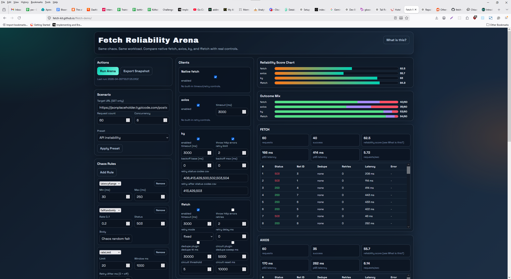

There are many HTTP clients in the JavaScript ecosystem, and while they all solve similar problems, they can behave very differently under stress, retries, and failures. Picking the right one is not always straightforward.

Introducing [ffetch-demo](https://fetch-kit.github.io/ffetch-demo/): a live browser arena for benchmarking JavaScript HTTP clients under controlled network chaos. The idea is simple: run the same request workload through different clients and compare how they behave when conditions get rough.

In the demo, you can configure chaos scenarios such as:

- latency injection
- random failures and drops
- status-code spikes
- retry pressure and timeout stress

## Built With chaos-fetch

The chaos layer in the arena is powered by `@fetchkit/chaos-fetch`, which makes it easy to apply deterministic and randomized network stressors through middleware-style configuration.

- npm: [@fetchkit/chaos-fetch](https://www.npmjs.com/package/@fetchkit/chaos-fetch)
- GitHub: [fetch-kit/chaos-fetch](https://github.com/fetch-kit/chaos-fetch)

Current clients in the arena:

- native `fetch`
- `axios`
- `ky`
- `@fetchkit/ffetch`

The output focuses on practical reliability signals (success/failure rates, error patterns, and latency distributions) so you can quickly see behavioral differences between clients.

Live demo: [fetch-kit.github.io/ffetch-demo](https://fetch-kit.github.io/ffetch-demo/)

GitHub: [fetch-kit/ffetch-demo](https://github.com/fetch-kit/ffetch-demo)

## Further Reading

If you want to go deeper into the testing philosophy and tooling around this demo, these earlier posts provide context:

- [Chaos-Driven Testing for Full Stack Apps: Integration Tests That Break (and Heal)](/posts/2025-10-07-Chaos-Driven-Testing-for-Full-Stack-Apps/) explains how to validate behavior under intentional failure in end-to-end flows.
- [Small-Scale Chaos Testing: The Missing Step Before Production](/posts/2025-10-01-Small-Scale-Chaos-Testing-The-Missing-Step-Before-Production/) makes the case for practical chaos experiments in dev and staging.
- [Introducing chaos-fetch: Network Chaos Injection for Fetch Requests](/posts/2025-09-27-Introducing-chaos-fetch-network-chaos-injection-for-fetch-requests/) introduces the library and core capabilities behind the arena's chaos model.

If you have ideas for additional scenarios or clients, feedback and contributions are very welcome.
