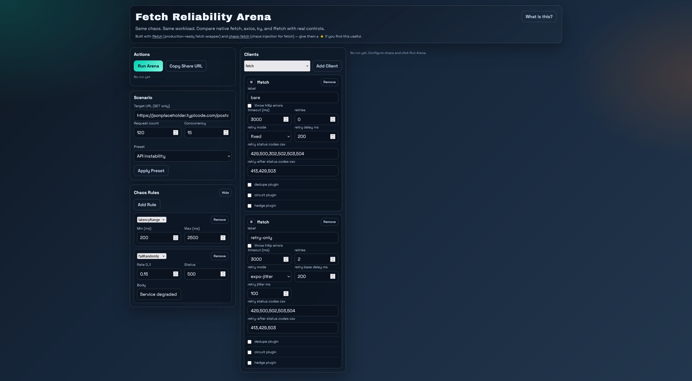

If you write frontend or Node.js code long enough, you eventually hit the same reliability wall: the network is fine in local testing, then production adds latency spikes, occasional 5xx responses, rate limits, and weird timing behavior that only appears under load.

The usual response is to harden the client: add retries, tune timeouts. Maybe add a [circuit breaker](https://blog.gaborkoos.com/posts/2025-09-17-Stop-Hammering-Broken-APIs-the-Circuit-Breaker-Pattern/) to prevent cascading failures. Or you might add [hedging](https://mintlify.wiki/App-vNext/Polly/strategies/hedging) later, to improve p99 latency. On paper, every one of these is a best practice. A gentle introduction to these techniques can be found [here](https://www.freecodecamp.org/news/how-to-go-from-toy-api-calls-to-production-ready-networking-in-javascript/), which covers the core patterns, how to configure them, and when they help.

But in practice, these patterns can interact in surprising ways. Sometimes they help. Sometimes they quietly make latency and reliability worse. To show this, we will run a few controlled experiments under realistic chaos conditions. The goal here is not a deep analysis, just a short, practical tour of a few counterintuitive outcomes I observed while running controlled chaos scenarios, plus a few recipes for deciding what to tune next.

## Welcome to the Arena

We will use [ffetch-demo](https://fetch-kit.github.io/ffetch-demo/), a browser-based chaos arena. Originally built to compare different HTTP clients under identical network conditions, it also makes a great sandbox for testing different resilience patterns and configurations against the same synthetic network chaos mix. We define the network behavior by adding chaos rules (latency, random failures, rate limits, etc.) to the transport layer, then run a repeatable workload against a test endpoint with a predefined set of http clients, and compare reliability scores, error patterns, and latency side-by-side. The chaos is deterministic and repeatable, but also randomized within configured bounds, so you can see how different patterns behave under the same conditions, but with some variability in the exact numbers. The goal is to show directional trends and tradeoffs, not exact values.

The results show the distribution of response times, error rates, and reliability scores and a few key metrics like p95 latency and success count. We will run a few scenarios with different client configurations and chaos mixes, and see how the patterns interact in practice.

The reliability score is a high-level health indicator that combines request success and latency quality into a single number, so higher usually means a client is both succeeding more often and behaving better under load.

## Scenario A: Retry can worsen tail latency under tight timeout

Let's see the [following setup](http://fetch-kit.github.io/ffetch-demo/#url=https%3A%2F%2Fjsonplaceholder.typicode.com%2Fposts%2F1&count=120&conc=15&chaos64=W3sidHlwZSI6ImxhdGVuY3lSYW5nZSIsIm1pbk1zIjoyMDAsIm1heE1zIjoyNTAwfSx7InR5cGUiOiJmYWlsUmFuZG9tbHkiLCJyYXRlIjowLjE1LCJzdGF0dXMiOjUwMCwiYm9keSI6IlNlcnZpY2UgZGVncmFkZWQifV0=&clients64=W3siaWQiOiJmZmV0Y2gtYmFyZSIsInR5cGUiOiJmZmV0Y2giLCJsYWJlbCI6ImJhcmUiLCJjb25maWciOnsiZW5hYmxlZCI6dHJ1ZSwidGltZW91dE1zIjozMDAwLCJyZXRyaWVzIjowLCJyZXRyeURlbGF5TW9kZSI6ImZpeGVkIiwicmV0cnlEZWxheU1zIjoyMDAsInJldHJ5Sml0dGVyTXMiOjEwMCwicmV0cnlTdGF0dXNDb2RlcyI6WzQyOSw1MDAsMzAyLDUwMiw1MDMsNTA0XSwicmV0cnlBZnRlclN0YXR1c0NvZGVzIjpbNDEzLDQyOSw1MDNdLCJ0aHJvd09uSHR0cEVycm9yIjpmYWxzZSwidXNlRGVkdXBlUGx1Z2luIjpmYWxzZSwiZGVkdXBlVHRsTXMiOjMwMDAwLCJkZWR1cGVTd2VlcEludGVydmFsTXMiOjUwMDAsInVzZUNpcmN1aXRQbHVnaW4iOmZhbHNlLCJjaXJjdWl0VGhyZXNob2xkIjo1LCJjaXJjdWl0UmVzZXRNcyI6MTAwMDAsImNpcmN1aXRPcmRlciI6MjAsImRlZHVwZU9yZGVyIjoxMCwidXNlSGVkZ2VQbHVnaW4iOmZhbHNlLCJoZWRnZURlbGF5TXMiOjUwLCJoZWRnZU1heEhlZGdlcyI6MSwiaGVkZ2VPcmRlciI6MTV9fSx7ImlkIjoiZmZldGNoLXJldHJ5IiwidHlwZSI6ImZmZXRjaCIsImxhYmVsIjoicmV0cnktb25seSIsImNvbmZpZyI6eyJlbmFibGVkIjp0cnVlLCJ0aW1lb3V0TXMiOjMwMDAsInJldHJpZXMiOjIsInJldHJ5RGVsYXlNb2RlIjoiZXhwby1qaXR0ZXIiLCJyZXRyeURlbGF5TXMiOjIwMCwicmV0cnlKaXR0ZXJNcyI6MTAwLCJyZXRyeVN0YXR1c0NvZGVzIjpbNDI5LDUwMCw1MDIsNTAzLDUwNF0sInJldHJ5QWZ0ZXJTdGF0dXNDb2RlcyI6WzQxMyw0MjksNTAzXSwidGhyb3dPbkh0dHBFcnJvciI6ZmFsc2UsInVzZURlZHVwZVBsdWdpbiI6ZmFsc2UsImRlZHVwZVR0bE1zIjozMDAwMCwiZGVkdXBlU3dlZXBJbnRlcnZhbE1zIjo1MDAwLCJ1c2VDaXJjdWl0UGx1Z2luIjpmYWxzZSwiY2lyY3VpdFRocmVzaG9sZCI6NSwiY2lyY3VpdFJlc2V0TXMiOjEwMDAwLCJjaXJjdWl0T3JkZXIiOjIwLCJkZWR1cGVPcmRlciI6MTAsInVzZUhlZGdlUGx1Z2luIjpmYWxzZSwiaGVkZ2VEZWxheU1zIjo1MCwiaGVkZ2VNYXhIZWRnZXMiOjEsImhlZGdlT3JkZXIiOjE1fX1d):

If you click on the Chaos Rules card, you can see the configured chaos mix: variable latency between 200ms and 2500ms, and random 500 errors with a 15% chance. We defined two clients: a bare client with no retries, and a retry-only client with 2 retries, 200ms retry delay, and a 3000ms timeout budget (the retry-only client will attempt to retry failed requests up to 2 times, but if the total time exceeds 3000ms, it will give up and return an error). In this article we will use the [`ffetch`](https://www.npmjs.com/package/@fetchkit/ffetch) client, because it has all the features we discuss here built in (native `fetch` has none of these features, [`axios`](https://www.npmjs.com/package/axios) and [`ky`](https://www.npmjs.com/package/ky) have some, but not all).

We configured the tool to send 120 requests with a concurrency of 15, which means it will try to keep 15 requests in flight at all times until it reaches a total of 120 requests. The arena applies the same chaos rules to both clients, so they are tested under identical conditions. Press the **Run Arena** button, and wait for the results to come in. Using the Download Card button, you can export the results in svg format:

What this run shows is a classic reliability-versus-latency tradeoff: the retry-only client improved outcomes, but only modestly on failures, while the tail got much worse. In this run, success moved from 99/120 to 106/120, and error rate improved from 17.5% to 11.7%. At the same time, p95 jumped from 2429ms to 4462ms and p99 from 2482ms to 4855ms. In other words, a bit less requests failed, but the slowest requests became dramatically slower.

Whether that is a win depends on the endpoint. For background processing, scheduled sync jobs, or internal tooling, this tradeoff is often reasonable because eventual success matters more than response speed. For user-facing paths such as checkout, search, or any fan-out workflow where one slow dependency delays the whole response, this can be unacceptable even if the error rate improves. The practical decision is endpoint-specific: do you value recovering those extra successful requests enough to pay the p95 and p99 latency cost?

Retries are definitely not bad, but they are not a silver bullet either. If you have a tight timeout budget and your endpoint has high latency variance, retries can make tail latency worse without improving success much. In that case, you might want to tune the retry delay, reduce the number of retries, or consider other patterns like hedging instead.

## Scenario B: Retry-After beats blind retries under rate limiting

In our [next setup](http://fetch-kit.github.io/ffetch-demo/#url=https%3A%2F%2Fjsonplaceholder.typicode.com%2Fposts%2F1&count=150&conc=10&preset=api-instability&chaos64=W3sidHlwZSI6ImxhdGVuY3lSYW5nZSIsIm1pbk1zIjo1MCwibWF4TXMiOjIwMH0seyJ0eXBlIjoicmF0ZUxpbWl0IiwibGltaXQiOjMwLCJ3aW5kb3dNcyI6MTAwMCwicmV0cnlBZnRlck1zIjo2MDB9XQ&clients64=W3siaWQiOiJmZmV0Y2gtbm80MjkiLCJ0eXBlIjoiZmZldGNoIiwibGFiZWwiOiJyZXRyeS1uby00MjkiLCJjb25maWciOnsiZW5hYmxlZCI6dHJ1ZSwidGltZW91dE1zIjozMDAwLCJyZXRyaWVzIjozLCJyZXRyeURlbGF5TW9kZSI6ImV4cG8taml0dGVyIiwicmV0cnlEZWxheU1zIjoyMDAsInJldHJ5Sml0dGVyTXMiOjEwMCwicmV0cnlTdGF0dXNDb2RlcyI6WzUwMCw1MDIsNTAzLDUwNF0sInJldHJ5QWZ0ZXJTdGF0dXNDb2RlcyI6WzBdLCJ0aHJvd09uSHR0cEVycm9yIjpmYWxzZSwidXNlRGVkdXBlUGx1Z2luIjpmYWxzZSwiZGVkdXBlVHRsTXMiOjMwMDAwLCJkZWR1cGVTd2VlcEludGVydmFsTXMiOjUwMDAsInVzZUNpcmN1aXRQbHVnaW4iOmZhbHNlLCJjaXJjdWl0VGhyZXNob2xkIjo1LCJjaXJjdWl0UmVzZXRNcyI6MTAwMDAsImNpcmN1aXRPcmRlciI6MjAsImRlZHVwZU9yZGVyIjoxMCwidXNlSGVkZ2VQbHVnaW4iOmZhbHNlLCJoZWRnZURlbGF5TXMiOjUwLCJoZWRnZU1heEhlZGdlcyI6MSwiaGVkZ2VPcmRlciI6MTV9fSx7ImlkIjoiZmZldGNoLXJhIiwidHlwZSI6ImZmZXRjaCIsImxhYmVsIjoicmV0cnktYWZ0ZXIiLCJjb25maWciOnsiZW5hYmxlZCI6dHJ1ZSwidGltZW91dE1zIjozMDAwLCJyZXRyaWVzIjozLCJyZXRyeURlbGF5TW9kZSI6ImV4cG8taml0dGVyIiwicmV0cnlEZWxheU1zIjoyMDAsInJldHJ5Sml0dGVyTXMiOjEwMCwicmV0cnlTdGF0dXNDb2RlcyI6WzQyOSw1MDAsNTAyLDUwMyw1MDRdLCJyZXRyeUFmdGVyU3RhdHVzQ29kZXMiOls0MTMsNDI5LDUwM10sInRocm93T25IdHRwRXJyb3IiOmZhbHNlLCJ1c2VEZWR1cGVQbHVnaW4iOmZhbHNlLCJkZWR1cGVUdGxNcyI6MzAwMDAsImRlZHVwZVN3ZWVwSW50ZXJ2YWxNcyI6NTAwMCwidXNlQ2lyY3VpdFBsdWdpbiI6ZmFsc2UsImNpcmN1aXRUaHJlc2hvbGQiOjUsImNpcmN1aXRSZXNldE1zIjoxMDAwMCwiY2lyY3VpdE9yZGVyIjoyMCwiZGVkdXBlT3JkZXIiOjEwLCJ1c2VIZWRnZVBsdWdpbiI6ZmFsc2UsImhlZGdlRGVsYXlNcyI6NTAsImhlZGdlTWF4SGVkZ2VzIjoxLCJoZWRnZU9yZGVyIjoxNX19XQ) we are focusing on rate-limiting behavior. We configured a 150-request run with concurrency 10, a low-latency baseline (50-200ms), and a strict rate-limit rule (30 requests per second with a 1000ms window and Retry-After set to 600ms) so that 429 behavior dominates the failure profile. Both clients use the same timeout and retry shape (3000ms timeout, 3 retries, exponential jitter backoff), but `retry-no-429` retries only 5xx responses while `retry-after` also treats 429 as retryable and honors Retry-After hints, which isolates the value of explicit rate-limit handling.

Running that setup produces the following result card:

In this run, `retry-no-429` finished at 54 reliability with 90/150 successful requests and a 40.0% error rate, while `retry-after` reached 90 reliability with 150/150 successful requests and 0.0% error rate. That is the core outcome: honoring `Retry-After` removes the rate-limit failure mode almost entirely.

The tradeoff is visible in latency and throughput. `retry-no-429` shows lower tail latency (p95 585ms, p99 667ms) and higher throughput (5.52 rps), but those numbers are misleading in this setup: they mostly reflect fast failures from repeated 429s, not better service quality. `retry-after` is intentionally slower at the tail (p95 1428ms, p99 1474ms) and lower throughput (2.09 rps), because it waits when instructed instead of hammering the limit window. For rate-limited APIs, this is usually the correct trade: accept controlled waiting to preserve completion and avoid self-inflicted request loss. For latency-critical user flows, you can then tune retry counts, delay, and timeout budgets to recover responsiveness without fighting the limiter.

## Scenario C: Hedging helps tail latency, not error recovery

In this [scenario](http://fetch-kit.github.io/ffetch-demo/#url=https%3A%2F%2Fjsonplaceholder.typicode.com%2Fposts%2F1&count=150&conc=6&chaos64=W3sidHlwZSI6ImxhdGVuY3lSYW5nZSIsIm1pbk1zIjo4MCwibWF4TXMiOjMwMDB9LHsidHlwZSI6ImZhaWxOdGgiLCJuIjoyMCwic3RhdHVzIjo1MDAsImJvZHkiOiJSYXJlIGJhY2tlbmQgZXJyb3IifV0=&clients64=W3siaWQiOiJmZmV0Y2gtcmV0cnkiLCJ0eXBlIjoiZmZldGNoIiwibGFiZWwiOiJyZXRyeSIsImNvbmZpZyI6eyJlbmFibGVkIjp0cnVlLCJ0aW1lb3V0TXMiOjQwMDAsInJldHJpZXMiOjEsInJldHJ5RGVsYXlNb2RlIjoiZXhwby1qaXR0ZXIiLCJyZXRyeURlbGF5TXMiOjE1MCwicmV0cnlKaXR0ZXJNcyI6NzUsInJldHJ5U3RhdHVzQ29kZXMiOls0MjksNTAwLDUwMiw1MDMsNTA0XSwicmV0cnlBZnRlclN0YXR1c0NvZGVzIjpbNDEzLDQyOSw1MDNdLCJ0aHJvd09uSHR0cEVycm9yIjpmYWxzZSwidXNlRGVkdXBlUGx1Z2luIjpmYWxzZSwiZGVkdXBlVHRsTXMiOjMwMDAwLCJkZWR1cGVTd2VlcEludGVydmFsTXMiOjUwMDAsInVzZUNpcmN1aXRQbHVnaW4iOmZhbHNlLCJjaXJjdWl0VGhyZXNob2xkIjo1LCJjaXJjdWl0UmVzZXRNcyI6MTAwMDAsImNpcmN1aXRPcmRlciI6MjAsImRlZHVwZU9yZGVyIjoxMCwidXNlSGVkZ2VQbHVnaW4iOmZhbHNlLCJoZWRnZURlbGF5TXMiOjIwMCwiaGVkZ2VNYXhIZWRnZXMiOjEsImhlZGdlT3JkZXIiOjE1fX0seyJpZCI6ImZmZXRjaC1oZWRnZSIsInR5cGUiOiJmZmV0Y2giLCJsYWJlbCI6ImhlZGdlIiwiY29uZmlnIjp7ImVuYWJsZWQiOnRydWUsInRpbWVvdXRNcyI6NDAwMCwicmV0cmllcyI6MCwicmV0cnlEZWxheU1vZGUiOiJleHBvLWppdHRlciIsInJldHJ5RGVsYXlNcyI6MTUwLCJyZXRyeUppdHRlck1zIjo3NSwicmV0cnlTdGF0dXNDb2RlcyI6WzQyOSw1MDAsNTAyLDUwMyw1MDRdLCJyZXRyeUFmdGVyU3RhdHVzQ29kZXMiOls0MTMsNDI5LDUwM10sInRocm93T25IdHRwRXJyb3IiOmZhbHNlLCJ1c2VEZWR1cGVQbHVnaW4iOmZhbHNlLCJkZWR1cGVUdGxNcyI6MzAwMDAsImRlZHVwZVN3ZWVwSW50ZXJ2YWxNcyI6NTAwMCwidXNlQ2lyY3VpdFBsdWdpbiI6ZmFsc2UsImNpcmN1aXRUaHJlc2hvbGQiOjUsImNpcmN1aXRSZXNldE1zIjoxMDAwMCwiY2lyY3VpdE9yZGVyIjoyMCwiZGVkdXBlT3JkZXIiOjEwLCJ1c2VIZWRnZVBsdWdpbiI6dHJ1ZSwiaGVkZ2VEZWxheU1zIjoyMDAsImhlZGdlTWF4SGVkZ2VzIjoxLCJoZWRnZU9yZGVyIjoxNX19LHsiaWQiOiJmZmV0Y2gtYm90aCIsInR5cGUiOiJmZmV0Y2giLCJsYWJlbCI6InJldHJ5K2hlZGdlIiwiY29uZmlnIjp7ImVuYWJsZWQiOnRydWUsInRpbWVvdXRNcyI6NDAwMCwicmV0cmllcyI6MSwicmV0cnlEZWxheU1vZGUiOiJleHBvLWppdHRlciIsInJldHJ5RGVsYXlNcyI6MTUwLCJyZXRyeUppdHRlck1zIjo3NSwicmV0cnlTdGF0dXNDb2RlcyI6WzQyOSw1MDAsNTAyLDUwMyw1MDRdLCJyZXRyeUFmdGVyU3RhdHVzQ29kZXMiOls0MTMsNDI5LDUwM10sInRocm93T25IdHRwRXJyb3IiOmZhbHNlLCJ1c2VEZWR1cGVQbHVnaW4iOmZhbHNlLCJkZWR1cGVUdGxNcyI6MzAwMDAsImRlZHVwZVN3ZWVwSW50ZXJ2YWxNcyI6NTAwMCwidXNlQ2lyY3VpdFBsdWdpbiI6ZmFsc2UsImNpcmN1aXRUaHJlc2hvbGQiOjUsImNpcmN1aXRSZXNldE1zIjoxMDAwMCwiY2lyY3VpdE9yZGVyIjoyMCwiZGVkdXBlT3JkZXIiOjEwLCJ1c2VIZWRnZVBsdWdpbiI6dHJ1ZSwiaGVkZ2VEZWxheU1zIjoyMDAsImhlZGdlTWF4SGVkZ2VzIjoxLCJoZWRnZU9yZGVyIjoxNX19XQ==), we examine tail-latency behavior under mixed delay plus rare hard failures. We configured 150 requests at concurrency 6, with one latency envelope (80-3000ms) and an additional periodic server error (`failNth`, every 20th request returns 500) to create occasional recovery pressure.

The three clients keep the same baseline timeout and backoff settings (4000ms timeout, exponential jitter), but vary strategy: `retry` uses one retry and no hedging, `hedge` uses hedging with no retries, and `retry+hedge` combines both.

Running that setup produces the following result card:

This run shows why hedging is primarily a tail-latency tool, not a general error-recovery strategy. `hedge` improved latency shape versus `retry` (p95 2414ms vs 2867ms, p99 2823ms vs 2943ms) and increased throughput (0.83 rps vs 0.58 rps), but it also introduced failures (145/150 success, 3.3% error) while `retry` completed 150/150 with 0.0% error.

The combined strategy, `retry+hedge`, recovered to 150/150 success and 0.0% error like `retry`, while keeping p95 better than retry-only (2510ms vs 2867ms). However, it did not dominate across all tail metrics: p99 rose to 3015ms, worse than both `retry` and `hedge` in this run. The practical takeaway is that hedging can improve tail behavior, but its benefit is workload-specific, and adding retries changes the shape again rather than producing a universal win.

## Limits of these findings

These runs are intentionally practical, not exhaustive. Even with the same URL and client settings, randomized chaos means exact values will move between runs, so the point is direction and tradeoff shape rather than a single canonical number.

The scope is also deliberately narrow: one endpoint pattern, one request shape, and a browser execution context. That is enough to reveal useful interactions, but not sufficient to claim universal behavior across all services, payload sizes, or runtime environments. Node.js services, mobile clients, and edge runtimes can show different latency and scheduling characteristics.

It is also important to separate client-level resilience knobs from application-level behavior. Retries, timeouts, hedging, and retry-after handling live in the HTTP client layer, but many reliability outcomes depend on higher-level controls such as caching strategy, idempotency design, request coalescing, fallbacks, queueing, and feature-level degradation paths. Those have to be designed and applied on top of the client, no client configuration can replace them on its own.

So treat synthetic chaos as a decision aid: it is excellent for building intuition and comparing strategies under controlled pressure, but it is not a substitute for production validation with real traffic patterns and service constraints.

## Practical Tuning Recipes

As these scenarios show, resilience tuning is neither just a coding concern nor just an infrastructure concern. It sits in the overlap between development and DevOps: request semantics, timeout budgets, retry behavior, rate-limit policy, and service capacity all interact, and changing one layer often shifts pressure to another.

As a developer, your responsibility is to understand the patterns, implement them correctly, and tune them based on observed behavior. As an operator, your responsibility is to provide accurate signals (latency, error rates, rate-limit feedback) and ensure that the infrastructure can handle the load patterns generated by different client strategies.

That is also why this is still not reliably automated in mainstream clients. Live signals are noisy, partial and delayed, policy knobs interact in non-linear ways, so naive auto-tuning can easily overreact, oscillate, or amplify traffic at the worst possible time. In practice, the safer workflow is still iterative: observe behavior, run controlled experiments, adjust one variable, and verify again.

Even so, a few generic rules hold up across most systems:

1. **Set a realistic timeout budget before increasing retries.** A retry policy on top of an unrealistically tight timeout usually makes tail latency worse without recovering enough failures. Start from end-to-end SLOs, reserve budget across hops, then decide how many retry attempts can actually fit.
2. **Retry only retryable statuses and idempotent operations.** Broad retry policies can turn transient errors into duplicated side effects or extra backend load. Restrict retries to safe operations and clearly transient classes (for example select 5xx/429 cases), and keep non-idempotent writes behind explicit safeguards.
3. **Handle 429 explicitly and honor Retry-After when available.** Rate limiting is feedback from the server, not just another failure code. Respecting Retry-After typically reduces request loss and stabilizes completion rates, even when it increases latency, because the client stops fighting the limit window.
4. **Use circuit breaker for sustained backend failure, not for rate-limit configuration mistakes.** Circuit breakers are best for repeated upstream instability and backpressure protection, where failing fast prevents cascading saturation. They are not a replacement for correct 429/retry-after handling.
5. **Consider hedging only when the dominant problem is tail latency, not response error rate.** Hedging can cut p95/p99 by racing slow requests, but it may increase request volume and does not inherently fix error-heavy failure modes. Use it when slow stragglers are the primary bottleneck, and validate the extra load cost.

## Conclusion

HTTP client resilience is a complex and nuanced topic. The interactions between retries, timeouts, hedging, and rate-limit handling are non-trivial, and the outcomes are sometimes counterintuitive. Retries can improve your error rate while quietly destroying your tail latency. Hedging can shave milliseconds off the median while leaving the p99 untouched. Blindly stacking these options on top of each other, or accepting tool defaults does not get you to a resilient client, it gets you to an unpredictable one.

What actually works is treating resilience configuration the same way you would treat a performance optimization: establish a baseline, form a hypothesis, change one thing, and measure again. Controlled experiments let you isolate the effect of each knob before you commit to it. The baselines you build this way are yours: tied to your traffic shape, your backend's failure modes, and your latency budget, not borrowed from a blog post or a library's README.

Once you have a configuration you trust from experimentation, apply it, observe it against real traffic, and expect to tweak it again. Production has a way of surfacing failure modes that no chaos scenario fully anticipates. The goal is not to find the one correct config, but to build the habit of reasoning about resilience as a measurable property rather than a checkbox.

## Try it with your own config

Run your own scenarios here: [https://fetch-kit.github.io/ffetch-demo/](https://fetch-kit.github.io/ffetch-demo/)

Configure chaos, start with one baseline client and one modified client, change one knob at a time, and compare reliability plus tail latency together.

Resilience patterns are not the only things lying to you:
- [Your Debounce Is Lying to You](/posts/2026-03-28-Your-Debounce-Is-Lying-to-You/)
- [Your Throttling Is Lying to You](/posts/2026-03-31-Your-Throttling-Is-Lying-to-You/)