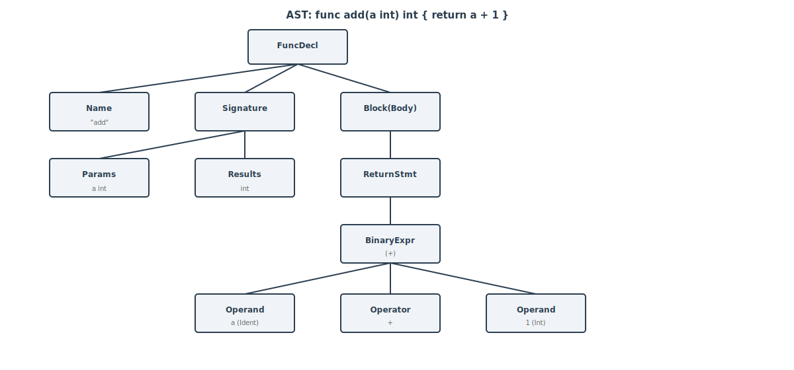
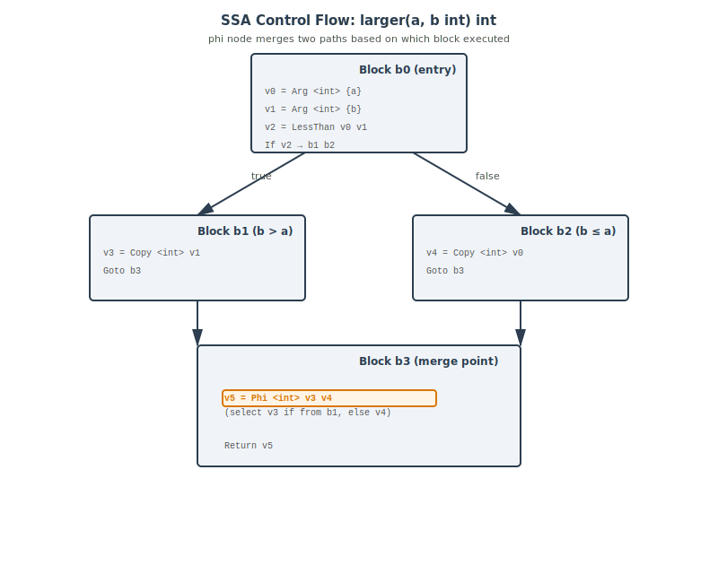
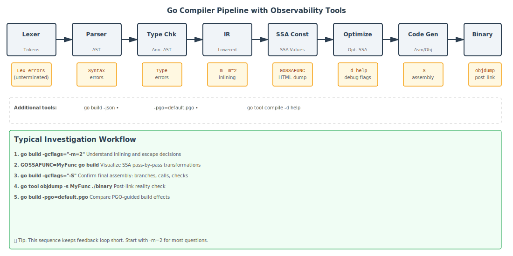

*Warning: This is a really long deep dive. If you are short on time, use the guided paths below instead of reading straight through end-to-end.*

## Navigation

### Guided paths

- Beginner track (conceptual flow, lighter internals): [Introduction](#sec-introduction) -> [Historical Context](#sec-historical-context) -> [Lexing](#sec-lexing) -> [Parsing](#sec-parsing) -> [Practical Implications](#sec-practical-implications) -> [Summary](#sec-summary)
- Advanced track (internals first: IR/SSA/optimizations/codegen): [Type Checking](#sec-type-checking) -> [IR](#sec-ir) -> [SSA](#sec-ssa) -> [Where Go Diverges from the Textbook Pipeline](#sec-go-diverges) -> [Optimization Passes](#sec-optimization-passes) -> [Code Generation](#sec-code-generation) -> [Tools and Experiments](#sec-tools)
- Need one specific answer fast? Use the table of contents below to jump directly to that section.

### Table of contents

1. [Introduction: What go build Is Really Doing](#sec-introduction)
2. [Historical Context: From C to Go, and Back](#sec-historical-context)
3. [Lexing - Turning Characters Into Tokens](#sec-lexing)
4. [Parsing - Building the AST](#sec-parsing)
5. [Type Checking - Giving the AST Meaning](#sec-type-checking)
6. [IR (Intermediate Representation) - The Compiler's Internal Language](#sec-ir)
7. [SSA - Static Single Assignment Form](#sec-ssa)
8. [Where Go Diverges from the Textbook Pipeline](#sec-go-diverges)
9. [Optimization Passes - Where the Magic Happens](#sec-optimization-passes)
10. [Code Generation - From SSA to Machine Instructions](#sec-code-generation)
11. [Tools and Experiments](#sec-tools)
12. [Practical Implications for Developers](#sec-practical-implications)
13. [Summary](#sec-summary)

<a id="sec-introduction"></a>
## Introduction: What go build Is Really Doing

Who this section is for: everyone; start here if you want the big picture before the internals.

You write a function, run `go build`, and it works. The binary appears. Milliseconds later you're running it. Easy, right?

But somewhere between the `.go` source file and the machine instructions the CPU executes, a lot happened. Not the module resolution, not the build cache (we covered both of those in [*The Go Build System: Optimised for Humans and Machines*](/posts/2026-01-08-the-go-build-system-optimised-for-humans-and-machines/)): the compiler itself. The thing that reads your Go source and turns it into actual object code.

Most of the time you don't need to think about it. But understanding the compiler pays dividends in ways that are immediately practical:

- Why does returning a pointer from a function sometimes allocate on the heap?
- Why does passing a concrete type to an interface method occasionally cost an allocation?
- Why is a small function "inlined" but a similar one isn't?
- Why does a tight loop sometimes run faster after you restructure an index access?

All of these have precise answers rooted in what the compiler does and when it does it. And unlike many compilers, Go's is entirely written in Go: it lives in `cmd/compile`, it's readable, and its design decisions are well-documented.

This post walks through the full compilation pipeline in order, naming the real packages, structs, and algorithms involved. By the end, you'll have a mental model that explains not just what the compiler does, but *why* it's structured the way it is.

Here's the path your code takes:

```
.go source → Lexer → Tokens → Parser → [AST](https://en.wikipedia.org/wiki/Abstract_syntax_tree) (Abstract Syntax Tree) → Type checker
→ IR (Internal Representation) nodes → SSA → Optimization passes → Code generation → .a object file
```

We'll cover each stage, the data structures that carry your code from one to the next, and the tools that let you observe every transformation yourself.

<a id="sec-historical-context"></a>
## Historical Context: From C to Go, and Back

Who this section is for: readers who want historical context and design rationale before implementation details.

To understand why Go's compiler looks the way it does today, it helps to rewind.

Early Go used a compiler and runtime largely written in C, with architecture-specific tool binaries like 6g, 8g, and 5g. That implementation worked, but it carried the usual costs of a mixed-language toolchain: harder refactoring, more fragile boundaries between runtime and compiler internals, and a steeper contributor path.

Go 1.5 was the turning point: the compiler and runtime were moved to Go itself (with a small amount of assembler where needed). This was not a greenfield rewrite from scratch: the compiler was mechanically translated and then iteratively improved. That detail explains why some parts of the codebase feel historically layered: old conceptual seams survived the language transition, then evolved release by release. (For example, the early compiler had a "front end" that handled lexing, parsing, and type checking, and a "back end" that handled optimization and code generation. The front end was more directly translated from the C version, while the back end was redesigned to be more modular and SSA-based. Over time, the distinction between front end and back end blurred as optimizations were added at various stages of the pipeline.)

Then came the second major shift: [**SSA**](https://en.wikipedia.org/wiki/Static_single_assignment_form). SSA stands for Static Single Assignment form, a powerful intermediate representation that makes many optimizations easier to implement.

In Go 1.7, the compiler introduced an SSA-based back end for amd64. This was a big deal for two reasons:
- It improved generated code quality and enabled cleaner optimization passes.
- It provided a much better internal model for dataflow-driven analyses such as bounds-check elimination and later PGO-related optimizations.

SSA support then expanded across architectures over subsequent releases, replacing older backend paths and gradually unifying optimization behavior.

There is a third historical thread that most users never notice, but compiler contributors feel constantly: **bootstrapping**.

Because the compiler is written in Go, building a new Go toolchain requires an existing Go toolchain. That minimum bootstrap version advances over time. Today, Go 1.24 requires Go 1.22.6 or newer to build from source. In other words, the compiler is a self-hosting system with a living dependency chain across releases.

This history explains the personality of `cmd/compile`:

- pragmatic rather than academic,
- aggressively performance-oriented,
- and designed to be inspectable by ordinary Go developers.

Now that we have the historical map, let's start with the first concrete phase in the modern pipeline: lexing.

<a id="sec-lexing"></a>
## Lexing - Turning Characters Into Tokens

Who this section is for: beginners and intermediate readers who want to understand how source text becomes tokens.

Your source file is just bytes. The word `package` is the same seven characters whether it's a keyword or someone's variable name. The job of the lexer is to transform raw text into a meaningful stream.

The Go compiler's lexer lives in [`cmd/compile/internal/syntax`](https://github.com/golang/go/tree/master/src/cmd/compile/internal/syntax), the same package that contains the parser. This is different from the standard library's `go/scanner`, which is designed for tools and has a different API. The compiler lexer is optimized for the specific job of feeding the parser: reading bytes and emitting `Token` values as fast as possible.

A token is not just a string, it's a structured value that includes:

- **Kind**: what the token is (the `TokenKind` enum). Examples: `_Func`, `_Ident`, `_Int`, `_String`, operators like `_Plus`, `_Assign`, brackets, semicolons, etc.
- **Position**: where in the file this token appears.
- **Literal value** (for some tokens): the actual text - e.g., the identifier name or the string's raw content.

Here's a simplified view of what the `Token` type looks like:

```go
type Token struct {
	kind TokenKind   // _Func, _Ident, _Plus, etc.
	pos  uint32      // encoded file position
	lit  string      // raw text of the token (for identifiers, keywords, literals)
}
```

The position is compact: a single 32-bit integer. The compiler doesn't store line and column separately for each token. Instead, it uses a `PosBase` type to represent a file, and encodes positions relative to that base. This is a design choice made for memory efficiency: when you have millions of tokens and AST nodes, saving a few bytes per position adds up. You can reconstruct the exact line and column from the compact position when needed.

### Semicolon Insertion

One of Go's well-known quirks is that semicolons are optional in source. You rarely write them. But internally, the parser still works with semicolon tokens.

Here's how it works:

The scanner (lexer) applies newline-sensitive rules and inserts synthetic semicolon tokens into the token stream before parsing. The parser then consumes those tokens like ordinary semicolons.

The rules are simple and deterministic:

1. If the last token before a newline can end a statement or expression (like `_Ident`, `_Int`, `return`, or a closing bracket `)`, `]`, `}`), the scanner inserts a synthetic semicolon token.
2. The parser does see semicolon tokens, but many are synthesized rather than typed in source.
3. `gofmt` usually removes explicit semicolons and relies on these insertion rules, which is why idiomatic Go code rarely shows `;`.

This is why you can write:

```go
x := 5
y := x + 1
```

without semicolons, but you must write:

```go
x := func() {
    return 5
}()
```

on one line (or use explicit semicolons) if you want the call to bind to the same statement. The closing `}` followed by a newline would otherwise trigger a semicolon insertion, breaking the function call chain.

### String Literal Handling

Another detail worth noting: **string literal escaping happens in the lexer, not the parser**. When the lexer encounters the bytes `\n` inside a string, it doesn't just pass the raw bytes to the parser. It decodes escape sequences right there. The parser receives the actual string value. This is efficient because the decoding logic is centralized, and the parser never has to worry about half-decoded strings.

### The Token Stream in Practice

If you were to inspect what the lexer produces for a simple function, it would look something like:

```
Token(_Func, pos=<encoded>, lit="func")
Token(_Ident, pos=<encoded>, lit="add")
Token(_Lparen, pos=<encoded>, lit="")
Token(_Ident, pos=<encoded>, lit="a")
Token(_Comma, pos=<encoded>, lit="")
Token(_Ident, pos=<encoded>, lit="int")
Token(_Rparen, pos=<encoded>, lit="")
Token(_Lbrace, pos=<encoded>, lit="")
Token(_Return, pos=<encoded>, lit="return")
Token(_Ident, pos=<encoded>, lit="a")
Token(_Plus, pos=<encoded>, lit="")
Token(_Int, pos=<encoded>, lit="1")
Token(_Semicolon, pos=<encoded>, lit="")  // synthetic semicolon inserted by the scanner
Token(_Rbrace, pos=<encoded>, lit="")
```

(Positions are compact 32-bit encoded values, not raw byte offsets — the `<encoded>` placeholders above reflect that. The compiler reconstructs exact line and column from the encoded value when needed.)

### Why This Design?

Why is the lexer separate from the parser? And why compact positions?

The separation is clean: the lexer handles the messy task of decoding bytes (including escape sequences, numbers, and keywords), while the parser focuses on structure. This makes both easier to test and reason about.

The compact positions pay off across the pipeline. Every node in the AST, IR, and SSA carries position information for error reporting. Compressing this from ~16 bytes per position (separate file, line, column fields) to 4 bytes per token or node saves significant memory during compilation of large codebases. Go's position encoding is a lesson in practical systems design: the overhead matters when scaling to real programs.

### Observing Lexing

You don't usually see the token stream directly, but you can see its effects. If you write code that the lexer would reject (e.g., an unterminated string), the compiler will tell you about it during lexing. Error messages like `unexpected EOF in string literal` come from the lexer phase.

With the token stream in hand, the parser's job is to build structure: to recognize patterns of tokens and assemble them into an Abstract Syntax Tree. That's our next stop.

<a id="sec-parsing"></a>
## Parsing - Building the AST

Who this section is for: readers learning how token streams become syntax trees and why parser design choices matter.

The parser reads the token stream and builds a tree. This tree respects the grammar of Go: function declarations branch into parameter lists and bodies, binary expressions have a left operand, an operator, and a right operand, and so on.

Like the lexer, the parser lives in [`cmd/compile/internal/syntax`](https://github.com/golang/go/tree/master/src/cmd/compile/internal/syntax). The key output is a `*syntax.File`, which is the root node. Every node in the tree is a `syntax.Node`.

Here are some real node types you'll encounter in the Go compiler source:

- `*syntax.FuncDecl` - a function declaration
- `*syntax.CallExpr` - a function call
- `*syntax.AssignStmt` - an assignment statement
- `*syntax.IfStmt` - an if statement
- `*syntax.BinaryExpr` - a binary operation (e.g., `a + b`)
- `*syntax.SliceExpr` - a slice operation (e.g., `arr[1:5]`)

Each node carries:

- **Position**: the same compact position encoding as tokens
- **Kind**: what type of node it is
- **Children**: pointers to child nodes (operands, statements, etc.)

A simplified node structure looks like:

```go
// Conceptually, all nodes share this interface
type Node interface {
	// Pos() returns the position of this node
	Pos() Pos
	
	// Each concrete type (FuncDecl, CallExpr, etc.) defines its own fields
}

// Example: a CallExpr node might look like this
type CallExpr struct {
	Pos_   Pos
	Func   Expr   // the function being called
	Args   []Expr // the arguments
	// ... other fields
}
```

### Hand-Written Recursive Descent Parsing

Go's parser is hand-written using recursive descent, not generated from a grammar specification (unlike some compilers that use tools like `yacc` or `bison`). This is a deliberate choice with real consequences:
- **Better error messages**: because the parser knows exactly what rule it's in, it can provide contextual help. When you write `if x = 5` instead of `if x == 5`, the parser recognizes the mistake in an `if` condition and can suggest the fix.
- **Easier to maintain**: you can read the parser code directly and understand what grammar rule each function implements. There's no generated code to decipher.
- **Simpler incremental changes**: adding a new syntax feature (like generics, which were added in Go 1.18) is a matter of adding parsing functions, not regenerating a state machine.

The trade-off is that a hand-written parser requires careful implementation to avoid bugs and to handle precedence correctly.

### Precedence and Associativity

Binary operators in Go have well-defined precedence and associativity. The expression `a + b * c` must parse as `a + (b * c)`, not `(a + b) * c`. 

The parser handles this via **precedence climbing**. When parsing a binary expression, the parser compares the precedence of the next operator to the precedence of the operator it's currently in. If the next operator binds more tightly, it recurses to parse the right operand first. This ensures that multiplication, for example, "climbs" higher than addition.

Here's the conceptual flow:

```
parseAddExpr():
  left = parseMulExpr()
  while next token is + or - :
    op = consume token
    right = parseMulExpr()
    left = BinaryExpr(left, op, right)
  return left

parseMulExpr():
  left = parseUnaryExpr()
  while next token is * or / :
    op = consume token
    right = parseUnaryExpr()
    left = BinaryExpr(left, op, right)
  return left
```

This simple structure ensures that `2 + 3 * 4` is parsed as `2 + (3 * 4)`.

### A Simple Example: Parsing a Function Declaration

Let's trace what the parser builds for a tiny function:

```go
func add(a int) int {
    return a + 1
}
```

The token stream looks like:

```
_Func, "func"
_Ident, "add"
_Lparen, "("
_Ident, "a"
_Ident, "int"
_Rparen, ")"
_Ident, "int"
_Lbrace, "{"
_Return, "return"
_Ident, "a"
_Plus, "+"
_Int, "1"
_Semicolon (synthetic, inserted by scanner)
_Rbrace, "}"
```

The parser consumes these tokens and builds an AST:

Each node has its position from the token stream, so error messages can point exactly to where a problem occurred.



*The AST for `func add(a int) int { return a + 1 }`. FuncDecl is the root; its three children are the function name, the signature (with Params and Results), and the Block(Body). The body contains a ReturnStmt whose BinaryExpr holds both operands and the operator as sibling leaf nodes.*

### Why This Matters: Better Error Recovery

Because Go's parser is hand-written, it can implement error recovery. If you write:

```go
func add(a int, b int {  // missing closing parenthesis before {
    return a + b
}
```

The parser detects the syntax error, emits a diagnostic, and then tries to recover by guessing where the error was and continuing to parse. This allows the compiler to report multiple errors in one run, instead of stopping at the first mistake. That's why `go build` can often tell you everything wrong with a file at once.

### From AST to the Next Phase

The AST is faithful to the source: every closing brace, every parameter, every statement is represented exactly as written. But the compiler doesn't optimize based on the AST; it's too tied to surface syntax.

The next step is type checking. The compiler will walk the AST, annotate every node with type information, resolve which identifier refers to which declaration, and verify that all operations are type-safe. Only then does the actual compilation begin.

<a id="sec-type-checking"></a>
## Type Checking - Giving the AST Meaning

Who this section is for: readers who want semantic understanding of how identifiers, interfaces, and generics are validated.

An AST node tells you the *structure* of the source, but not its meaning. The identifier `x` in an expression is just a name until the type checker resolves it. An addition `a + b` is syntactically valid but semantically invalid if `a` is a string and `b` is an int.

Type checking in Go lives primarily in [`cmd/compile/internal/typecheck`](https://github.com/golang/go/tree/master/src/cmd/compile/internal/typecheck). There is also `types2` (closely related to `go/types`) used for frontend type-checking infrastructure and language semantics.

One important nuance: this is not a single, fully unified type hierarchy across the entire compiler. Frontend checking logic relies heavily on `go/types`/`types2`-style machinery, while later compiler stages also use internal representations under [`cmd/compile/internal/types`](https://github.com/golang/go/tree/master/src/cmd/compile/internal/types).

The type checker does several things:

1. **Resolves identifiers**: walks the AST and maps each use of a name to its declaration (variable, function, type, etc.).
2. **Annotates with type information**: every expression gets semantic type information that later phases can consume.
3. **Checks assignability**: verifies that assignments, function arguments, and returns match expected types.
4. **Validates operations**: confirms that operators are applied to compatible types (e.g., you can't add a string to an int).

### Type Representations in Practice

For intuition, it helps to think in terms of `go/types`/`types2` concepts. In that world, you'll see familiar categories like:

- `*types.Basic` - primitive types like `int`, `string`, `float64`, `bool`
- `*types.Array` - array types, e.g., `[5]int`
- `*types.Slice` - slice types, e.g., `[]int`
- `*types.Map` - map types, e.g., `map[string]int`
- `*types.Chan` - channel types, e.g., `chan int`
- `*types.Struct` - struct types with named fields
- `*types.Pointer` - pointer types, e.g., `*int`
- `*types.Interface` - interface types, which define method sets
- `*types.Signature` - function types, which describe parameters and results
- `*types.Named` - named types, which wrap an underlying type and have a name and methods

These are great mental models for language-level reasoning. But in `cmd/compile`, backend and lowering phases are not limited to one public `types.Type` interface; they also rely on internal compiler type structures.

The key practical takeaway is:

1. frontend type checking uses `go/types`/`types2`-style semantics,
2. backend compilation uses additional internal type representations,
3. both cooperate through the pipeline rather than collapsing into a single type API.

As a conceptual model, the `go/types` side looks like this:

```go
// Conceptually, the interface looks like this
type Type interface {
	// Underlying returns the type "beneath" any type aliases
	Underlying() Type
	
	// String returns the type's string representation
	String() string
}

// Concrete types implement this interface
type Basic struct {
	kind BasicKind  // INT, STRING, FLOAT64, etc.
	name string     // "int", "string", "float64", etc.
}

type Signature struct {
	params   *Tuple  // the function's parameters
	results  *Tuple  // the function's return values
	// ... other fields
}

type Interface struct {
	methods *[]*Func  // the methods this interface defines
	// ... other fields
}
```

### Interface Satisfaction Checking

One of the most important type-checking tasks is determining whether a concrete type satisfies an interface. For example:

```go
type Reader interface {
	Read(p []byte) (n int, err error)
}

type File struct { /* ... */ }

func (f *File) Read(p []byte) (n int, err error) { /* ... */ }

// Does *File satisfy Reader?
```

The algorithm is straightforward: the type checker compares the *method set* of the concrete type to the interface. A concrete type satisfies an interface if its method set includes all the methods the interface requires, with the same signatures.

In the example above:
- Interface `Reader` requires a method `Read` with signature `func([]byte) (int, error)`
- Type `*File` has a method `Read` with the same signature
- Therefore, `*File` satisfies `Reader`

This check happens once during type checking, not at runtime. That's why Go can embed an interface into a struct (duck typing at compile time) but still provide safety.

### Type Inference for Generics

Go 1.18 introduced generics, and with them, type inference. When you call a generic function without explicitly specifying type arguments, the type checker infers them:

```go
func Map[T, U any](input []T, fn func(T) U) []U {
	// ...
}

ints := []int{1, 2, 3}
// Call without type arguments; the checker infers T=int, U=string
strs := Map(ints, func(i int) string { return fmt.Sprintf("%d", i) })
```

The type checker unifies the inferred types: it looks at the argument types, the function signature, and solves for the type parameters. This was extended in Go 1.21 to support more sophisticated inference patterns, like inferring type arguments based on the return type.

Go 1.24 added support for fully parameterized type aliases (a feature previewed in Go 1.23 via `GOEXPERIMENT=aliastypeparams`), allowing constructs like:

```go
type Mapper[T, U any] = func(T) U

func Apply[T, U any](input []T, fn Mapper[T, U]) []U {
	// ...
}
```

### Error Accumulation

Unlike many compilers that stop at the first error, Go's type checker accumulates multiple errors before giving up. This is why `go build` often reports several type errors at once:

```go
func foo() {
	x := "hello"
	y := x + 5         // error: can't add int to string
	z := x + y         // error: can't add int to string
	return "not int"   // error: wrong return type
}
```

The compiler reports all three errors in a single pass, then continues to the next phase (IR lowering). This is practical: you get a complete picture of what's wrong instead of a frustrating iterative loop of "fix one error, run compiler, find next error."

### Observable Type Information

Type-checking effects are observable through compiler diagnostics and internal debug flags, but exact dump options vary across Go releases. For stable day-to-day workflows, prefer the commands in the Tools and Experiments section (especially `-m`, `-m=2`, and `GOSSAFUNC`).

### From Source Types to Compilation Types

After type checking, the AST is now semantically meaningful. Every identifier is resolved, every operation is type-safe, and every expression has a known type. But the AST is still surface-level syntax.

The next phase, IR (Intermediate Representation), takes this type-checked AST and converts it into a form optimized for compilation: desugaring high-level constructs into more primitive operations, normalizing the representation, and setting up for optimization passes later.

<a id="sec-ir"></a>
## IR (Intermediate Representation) - The Compiler's Internal Language

Who this section is for: readers interested in lowering and desugaring between frontend semantics and optimizer-friendly forms.

At this point, the compiler has a fully type-checked AST. So why introduce another representation? Because the AST is designed to preserve source structure, not to make optimization easy. The compiler lowers syntax nodes into its own internal IR under [`cmd/compile/internal/ir`](https://github.com/golang/go/tree/master/src/cmd/compile/internal/ir). This IR is closer to execution semantics and easier to transform. In practice, this is where Go starts turning "what you wrote" into "what the machine should do".

### Why IR Exists

The AST is rich in surface syntax details that are useful for parsing and error messages, but noisy for optimization. IR strips away that syntactic variety and keeps the semantic core.

Three goals drive this stage:

1. Normalize equivalent source forms into a smaller set of internal shapes.
2. Annotate nodes with data needed by later passes.
3. Prepare functions for SSA construction.

You can think of it as a translation from a human-facing language model to a compiler-facing one.

### Real IR Types

In `cmd/compile/internal/ir`, you'll see concrete node types such as:

- `ir.Name` for variables, parameters, and function names
- `ir.CallExpr` for call sites
- `ir.AssignStmt` for assignment operations
- `ir.IfStmt`, `ir.ForStmt`, `ir.BlockStmt` for control flow
- `ir.Func` for an entire function being compiled

These nodes still carry source positions, so later diagnostics can still point back to the original line and column.

### Desugaring in Practice

**Lowering** is where higher-level constructs are rewritten into simpler forms.

Common examples:
- `switch` statements are transformed toward explicit conditional control flow.
- `defer` is rewritten into runtime calls plus bookkeeping.
- `range` loops are expanded into explicit iterator/index forms, depending on operand type.

This is one of the most important mental models in compiler work: many "language features" are not compiled directly, they are first reduced into a smaller core language.

### Go 1.23 Example: Range Over Function

Go 1.23 introduced range-over-function iterators. Source like:

```go
for v := range iter {
	use(v)
}
```

where `iter` is a supported iterator-function shape (a push iterator), such as `func(func(T) bool)` or `func(func(K, V) bool)`, is not emitted as a magical new machine-level loop form. Instead, the compiler lowers it into callback-oriented control flow that existing middle-end passes already understand.

That is exactly what IR is for: absorb high-level language evolution without forcing every later phase to learn every syntactic feature directly.

### Go 1.23 Example: Stack Slot Overlap

Another practical IR-adjacent improvement in Go 1.23 is stack slot overlap: locals whose live ranges do not overlap can share stack memory in the same function.

This reduces stack frame size, which can improve cache behavior and lower memory pressure. It's a good example of why normalization and liveness-aware internal representations matter before final code generation.

### What `ir.Func` Represents

`ir.Func` is the main unit passed forward into optimization and code generation pipelines. It contains:

- function metadata (name, ABI-related details, pragmas)
- parameter and local variable objects (`ir.Name`)
- body statements in lowered IR form
- links to type information and position metadata

By the time a function is in `ir.Func`, syntax-level ambiguity is mostly gone. The compiler now has a precise, manipulable model of control flow and data use.

### Observing IR-Like Effects

You typically don't print raw IR in normal workflows, but you can observe the consequences:

- A `switch` that looked high-level in source often appears as branch-heavy assembly in `-gcflags="-S"` output.
- `defer` in a hot loop clearly shows runtime overhead patterns in generated code. That's because the IR lowered it into explicit calls and bookkeeping, which then translates into more instructions.
- New language constructs (like range-over-function) compile down using familiar control-flow machinery.

### From IR to SSA

IR is where source code becomes compiler-native, but it is still mutable, statement-oriented structure. The next phase converts this IR into SSA form, where each value is assigned once and dataflow becomes explicit.

That conversion unlocks most of the optimizations people care about: inlining effects, bounds-check elimination, dead-code elimination, and register-friendly value propagation.

<a id="sec-ssa"></a>
## SSA - Static Single Assignment Form

Who this section is for: performance-minded readers who want to understand dataflow and optimization foundations.

SSA is the point where the compiler stops thinking in terms of variables that are reassigned and starts thinking in terms of values that are defined once.

That "assigned once" rule is the key idea:
- every SSA value has exactly one definition,
- uses of that value point back to that definition,
- control-flow joins use phi values to pick the right incoming definition.

In Go, this machinery lives in [`cmd/compile/internal/ssa`](https://github.com/golang/go/tree/master/src/cmd/compile/internal/ssa).

### Why SSA Matters

Most middle-end optimizations are dataflow questions:
- Is this value constant?
- Is this bounds check redundant?
- Is this branch dead?
- Can this temporary stay in a register?

Those are hard to answer cleanly in mutable, statement-style IR. SSA makes them much easier because each value is immutable and has explicit dependencies.

In short, SSA turns many global reasoning problems into local graph rewrites.

### Core Structures: `ssa.Func`, `ssa.Block`, `ssa.Value`

Go's SSA representation is a graph of blocks and values.

- `ssa.Func`: one compiled function in SSA form.
- `ssa.Block`: a basic block with ordered values and a control-flow edge shape.
- `ssa.Value`: one operation result, such as add, compare, load, or phi.

A simplified mental model:

```go
type Func struct {
		Blocks []*Block
		Entry  *Block
		// ... metadata, cache tables, ABI/liveness links
}

type Block struct {
		Kind    BlockKind
		Values  []*Value
		Succs   []*Block
		Preds   []*Block
		Control *Value
}

type Value struct {
		Op    Op
		Type  *types.Type
		Args  []*Value
		Block *Block
		Aux   any
}
```

The exact fields vary, but this shape is what matters: values in blocks, blocks in a function, with explicit control and data edges.

### Example: From Imperative Code to SSA

Take this function:

```go
func larger(a, b int) int {
		m := a
		if b > a {
				m = b
		}
		return m
}
```

In source form, `m` is assigned twice. In SSA form, it becomes separate values plus a **phi** (a special SSA value that selects among multiple incoming values based on control flow) at the merge point:

```text
b0:
	v0 = Arg <int> {a}
	v1 = Arg <int> {b}
	v2 = LessThan <bool> v0 v1
	If v2 -> b1 b2

b1:
	// path where b > a
	v3 = Copy <int> v1
	Goto b3

b2:
	// path where b <= a
	v4 = Copy <int> v0
	Goto b3

b3:
	v5 = Phi <int> v3 v4
	Return v5
```

The phi in block `b3` says: "if control came from `b1`, use `v3`; if from `b2`, use `v4`." That single construct captures merge semantics cleanly and enables aggressive optimization.



*The SSA control flow graph for `larger(a, b int) int`. Block b0 evaluates the condition and branches; b1 and b2 each copy the winning value; b3 is the merge point. The phi node `v5 = Phi v3 v4` selects the correct value depending on which block transferred control — no mutation needed.*

### What Go's SSA Is and Is Not

Go's SSA often gets compared to LLVM IR, but they are not interchangeable.
- Go's SSA is tightly integrated with Go runtime requirements.
- It carries information needed for garbage collection safety points and write barriers.
- Its op set and lowering rules are designed around Go's own backends and calling conventions.
- It is intentionally pragmatic: passes frequently mutate values in place and prioritize compile-time throughput over enforcing a textbook "minimal SSA" shape.

So while the high-level SSA concept is shared, the representation is purpose-built for the Go toolchain.

### SSA Construction and Early Simplification

During SSA construction, the compiler:
1. builds basic blocks from lowered IR control flow,
2. creates SSA values for operations,
3. inserts phi values at dominance frontiers,
4. runs early cleanups (constant folding, trivial copy elimination, unreachable block pruning).

This means optimization begins almost immediately once SSA exists; there is no strict wall between "build SSA" and "optimize SSA."

### Observable Effects

You can observe SSA-driven decisions indirectly:
- `go build -gcflags="-m"` shows inlining and escape outcomes that depend on later SSA-friendly simplification.
- `go build -gcflags="-d=ssa/check/on"` enables internal SSA consistency checks useful when exploring compiler internals.
- `go build -gcflags="-S"` shows final assembly where many SSA optimizations are visible as fewer branches, fewer loads, and tighter loops.

You do not need to memorize every pass name to benefit. The practical insight is that once your code reaches SSA, dataflow properties become explicit, and that is where performance-critical transformations become straightforward.

### From SSA to Optimization Passes

With SSA in place, the compiler now has the exact substrate needed for its core optimization passes. Next we move through those passes one by one: inlining context, escape analysis interactions, dead-code elimination, bounds and nil check elimination, and register allocation.

<a id="sec-go-diverges"></a>
## Where Go Diverges from the Textbook Pipeline

Who this section is for: compiler-savvy readers who want to map Go's implementation choices against the classic frontend/IR/SSA/backend framing.

Credit where it is due: this section is based on excellent reader feedback here: https://www.reddit.com/r/Compilers/comments/1t7pggj/comment/okrikwy/

- **SSA shape and pass style are pragmatic, not academic.** In [`cmd/compile/internal/ssa`](https://github.com/golang/go/tree/master/src/cmd/compile/internal/ssa), values are commonly rewritten in place and pass orchestration is tuned for fast, predictable compilation. This is different from the stricter IR invariants people may expect from LLVM-style pipelines, and the tradeoff is intentional.
- **Lowering is architecture-specific and rule-driven.** Go leans on per-target rule files (for example AMD64, ARM64, and RISCV64 rules under the SSA generator path), which are turned into rewrite code. There is no single backend-agnostic instruction-selection DAG layer to extend first.
- **Escape analysis happens before SSA.** Escape decisions are made earlier on frontend/lowered IR forms (see [`cmd/compile/internal/escape`](https://github.com/golang/go/tree/master/src/cmd/compile/internal/escape)), and those stack-vs-heap outcomes change the shape of later SSA and the optimizations available.
- **Nil-check and bounds-check elimination depend heavily on prove-style facts.** The `prove` pass ([`cmd/compile/internal/ssa/prove.go`](https://github.com/golang/go/tree/master/src/cmd/compile/internal/ssa/prove.go)) tracks facts through dominating conditions, and inlining context can materially change which checks survive.

These differences are not bugs or omissions, they reflect Go's compiler priorities: practical maintainability, strong compile-time performance, and robust code generation across many architectures.

<a id="sec-optimization-passes"></a>
## Optimization Passes - Where the Magic Happens

Who this section is for: practitioners tuning performance and trying to connect source changes to generated code outcomes.

This is the part everyone asks about first: where does Go decide stack vs heap, inline vs call, keep vs delete checks, register vs stack?

The short answer is: not in one place. Go runs multiple optimization passes across multiple representations.

- Some key decisions happen before SSA (notably inlining and escape analysis).
- Many local and global rewrites happen on SSA values and blocks.
- Final placement decisions happen near code generation and register allocation.

Thinking of it as a pipeline of cooperating passes is more accurate than looking for one "optimizer" stage.

### Inlining (IR-Level, Before SSA)

Inlining substitutes a function call with the body of the callee when profitable. In Go, this happens on IR before SSA construction, which matters because inlined code then participates in all later SSA optimizations.

Go uses a budget model: each candidate call has a cost estimate, and functions above threshold are rejected. Pragmas like `//go:noinline` force a function to remain as a call boundary.

Recent evolution:
- Go 1.22 introduced new call-site-sensitive inliner heuristics behind `GOEXPERIMENT=newinliner`.
- Go 1.23 made that heuristic path the default.
- PGO-guided inlining was previewed in Go 1.20 and production-ready in Go 1.21, with much lower build-time overhead by Go 1.23.

Observe it with:

```bash
go build -gcflags="-m"
```

Look for lines such as `inlining call to ...` and devirtualization notes when PGO is enabled.

### Escape Analysis (IR-Level, Before SSA)

Escape analysis decides whether an allocation can stay on the stack or must move to the heap. The rule of thumb: if a value may outlive the stack frame where it was created, the compiler conservatively treats it as escaping.

Typical escape triggers:
- returning pointer/reference-like values to callers,
- storing values into heap-reachable objects,
- some interface conversions and closure captures.

Observe it with:

```bash
go build -gcflags="-m=2"
```

You will see diagnostics like `moved to heap: x` and explanations about why.

### Dead Code Elimination (SSA)

Once SSA is built, unreachable blocks and unused values become straightforward to remove:
- constant-folded branches may expose dead successors,
- values with no side effects and no users are dropped,
- resulting CFG simplification unlocks further passes.

This is one reason small source changes can produce surprisingly different assembly: one constant or branch hint can cascade through the SSA graph.

### Bounds Check Elimination (SSA)

Go inserts bounds checks for [slice and array](/posts/2025-09-06-arrays-slices-and-maps-in-go/) safety, but SSA passes try to prove those checks redundant.

If the compiler can show that an index is always within range at a use site, it removes the check. Proofs come from dataflow facts: induction variables, dominating conditions, and range constraints.

In practice, much of this reasoning is concentrated in the `prove` pass ([`cmd/compile/internal/ssa/prove.go`](https://github.com/golang/go/tree/master/src/cmd/compile/internal/ssa/prove.go)), which propagates conditional facts over the dominator tree.

This is especially visible in tight loops over slices where loop structure communicates clear bounds.

### Nil Check Elimination (SSA)

Similarly, the compiler removes redundant nil checks when non-nilness is provable at a point in the graph. This frequently piggybacks on dominance and load/store ordering facts already established in SSA.

Inlining decisions feed directly into this: when caller and callee logic are fused earlier, prove-style reasoning often has stronger facts available, so more nil checks can disappear. Less redundant checking means fewer instructions and cleaner hot paths.

### Register Allocation (Late SSA/Backend Boundary)

SSA values are abstract. Before machine code is emitted, they must be mapped to real registers or stack slots.

Go uses a linear-scan style allocator tuned for compile speed and solid generated code quality. Spills happen when register pressure is high; spill reduction often depends on earlier simplification passes shrinking live ranges.

In practice, this phase can dominate the shape of final assembly in numerically heavy or branch-dense functions.

### Hot Block Alignment (Go 1.23+, amd64/386)

With PGO profiles, Go can align frequently executed loop blocks to cache-line boundaries on supported architectures. This typically yields modest throughput gains at a small code size cost.

Disable for experiments with:

```bash
go build -gcflags="-d=alignhot=0"
```

### Putting It Together

A single source-level optimization outcome usually comes from several passes working together:

1. Inlining exposes more local structure.
2. Escape analysis may keep data on stack.
3. SSA simplification removes dead branches/checks.
4. Register allocation packs the surviving values efficiently.

That is why compiler diagnostics are most useful when read as a sequence, not as isolated messages.

### Observability Cheat Sheet

```bash
go build -gcflags="-m"      # inlining decisions and some escape/devirtualization notes
go build -gcflags="-m=2"    # verbose escape analysis diagnostics
go build -gcflags="-S"      # final assembly
GOSSAFUNC=MyFunc go build    # SSA HTML dump for a target function
go tool compile -d help      # compiler debug flags
```

Now that optimization decisions have transformed and tightened the SSA graph, we can look at the final phase: lowering SSA ops to architecture-specific instructions and emitting object code.

<a id="sec-code-generation"></a>
## Code Generation - From SSA to Machine Instructions

Who this section is for: advanced readers who want to understand backend lowering and what actually reaches the CPU.

This is where the compiler commits to the target CPU. Up to this point, the compiler has been reasoning mostly in machine-agnostic terms. Now it must answer concrete questions:
- Which exact instruction does this add or compare become on amd64 vs arm64?
- Which values stay in registers and which spill to stack?
- How do branches, calls, and memory operations map to real opcodes and addressing modes?

The result of this phase is package object code and metadata the linker can combine into your final binary.

### Architecture Backends

Go keeps architecture-specific code generation logic under backend packages such as:
- [`cmd/compile/internal/amd64`](https://github.com/golang/go/tree/master/src/cmd/compile/internal/amd64)
- [`cmd/compile/internal/arm64`](https://github.com/golang/go/tree/master/src/cmd/compile/internal/arm64)
- [`cmd/compile/internal/riscv64`](https://github.com/golang/go/tree/master/src/cmd/compile/internal/riscv64)
- and other target directories

Those backends know the target instruction set, calling convention details, and target-specific lowering choices.

### Lowering: Generic SSA Ops to Target Ops

Earlier SSA ops are generic enough to support multiple architectures. During lowering, they become target-specific forms.

Go uses rewrite rules generated from files in [ `cmd/compile/internal/ssa/gen`](https://github.com/golang/go/tree/master/src/cmd/compile/internal/ssa/_gen), including architecture-specific `*.rules` files. Conceptually, rules look like pattern rewrites:

```text
(ADDconst (ADDconst x [c1]) [c2]) -> (ADDconst x [c1+c2])
```

or architecture-specific folds like combining an add and load into one addressing mode when legal on the target.

This rules-driven design gives two benefits:
1. Declarative optimization/lowering logic is easier to audit.
2. Target teams can improve codegen without rewriting the whole middle-end.

Compared to LLVM's shared instruction-selection framework, this is a different scaling strategy: Go favors relatively direct per-architecture rewrites and backend ops that keep compile times low and backend behavior explicit.

### Instruction Selection and Emission

After lowering, the backend emits instruction sequences represented in Go's internal object/assembler structures (from `cmd/internal/obj` and architecture-specific siblings).

Historically, Go's assembler syntax follows [Plan 9 conventions](https://go.dev/doc/asm). Even if you never write assembly, this heritage matters because compiler-emitted listings (`-S`) use that syntax and naming style.

At this stage, the compiler also finalizes:

- stack frame layout details,
- prologue/epilogue shape,
- relocation records for symbol references,
- metadata needed by runtime and linker.

### What the Compiler Produces

For package builds, the compiler emits object data that includes:

- machine code for compiled functions,
- symbol and relocation information,
- export data used by downstream package compilation.

In normal `go build` workflows this ends up in package archives (`.a`) in the build cache, later consumed by the linker.

So when people say "the compiler outputs a binary," the precise version is: **the compiler outputs package object artifacts, the linker builds the final executable**.

### Reading Real Output

You can inspect what this phase produced with:

```bash
go build -gcflags="-S"
```

and for post-link disassembly:

```bash
go tool objdump -s MyFunc ./your-binary
```

If a high-level source construct still seems mysterious, this is the phase where the mystery usually disappears: you can literally see every branch, move, call, and bounds-check remnant.

### End of the Compiler Pipeline

At this point, compilation is done. Source text has become machine-level package artifacts through a chain of explicit transformations: lexing, parsing, type checking, IR lowering, SSA construction, optimization passes, and architecture-specific code emission.

Next, we'll map these internals back to practical workflows: how to debug performance decisions quickly, what compiler diagnostics to trust first, and how to reason about generated code without reading the entire toolchain source.

<a id="sec-tools"></a>
## Tools and Experiments

Who this section is for: hands-on developers who want a practical toolbox to inspect compiler behavior quickly.

You do not need to read all of [ `cmd/compile`](https://github.com/golang/go/tree/master/src/cmd/compile) to get useful compiler insight. A handful of commands will answer most day-to-day performance and behavior questions.



*The Go compiler pipeline from source to binary, with the observability tool that gives the most insight at each stage. The workflow section shows the recommended investigation order: start with `-m=2` for inlining and escape decisions, then `GOSSAFUNC` for SSA visualization, then `-S` for final assembly.*

### Inlining and Escape Decisions

```bash
go build -gcflags="-m" ./...
go build -gcflags="-m=2" ./...
```

Use this first when you ask:

- Why did this allocate?
- Why was this call not inlined?

`-m` gives concise decisions; `-m=2` adds more detail. Look for messages like `inlining call to ...` and `moved to heap: ...`.

### Final Assembly for a Package Build

```bash
go build -gcflags="-S" ./...
```

Use this when you need to verify what code the backend actually emitted: branch shape, calls, bounds checks, nil checks, and register pressure symptoms.

If the output is too large, isolate one package or one file-sized example.

### SSA Visualization for One Function

```bash
GOSSAFUNC=MyFunc go build
```

This writes an SSA HTML report for the target function and shows how it changes across passes. It is one of the best ways to connect source code to pass-by-pass transformations.

Tip: use a uniquely named function in a tiny example package so the dump is easy to navigate.

### Compiler Debug Knobs Discovery

```bash
go tool compile -d help
```

This lists internal debug options supported by the current toolchain. It's useful when blog posts or old snippets mention a debug flag and you want to verify current support.

### Disassemble a Built Binary Symbol

```bash
go tool objdump -s MyFunc ./your-binary
```

Use this for post-link reality checks. It helps confirm whether package-level assembly expectations still hold once linking and layout are complete.

### Build Output as Structured Data

```bash
go build -json ./...
```

This emits machine-readable build events (available since Go 1.21, extended in Go 1.24). It is especially useful for CI tooling, diagnostics dashboards, and editor integrations that need structured compiler/build output rather than plain text.

### PGO-Enabled Build Comparison

```bash
go build -pgo=default.pgo ./...
```

Run this next to a non-PGO build and compare `-m` output and benchmark behavior. This is the practical way to see profile-guided devirtualization and inlining effects.

### A Simple Investigation Workflow

When a hot path behaves unexpectedly, this sequence is usually enough:

1. `-m=2` to understand inlining and escapes.
2. `GOSSAFUNC` for one suspicious function.
3. `-S` (and optionally `objdump`) to confirm final emitted shape.
4. Re-run with `-pgo` if profile data is available.
5. Optional sanity check: compile the same example with `gccgo` and diff assembly to separate language-level constraints from gc-specific implementation choices.

This keeps the feedback loop short and avoids premature deep-dives into compiler internals.

Now that we have an observation toolkit, we can close with the practical implications: what these compiler phases change about everyday Go code decisions.

<a id="sec-practical-implications"></a>
## Practical Implications for Developers

Who this section is for: engineers turning compiler insight into day-to-day coding and review decisions.

Compiler internals are only useful if they change how you write and review code. The good news is that they do, and in predictable ways.

### 1. Stack vs Heap Is a Design Choice, Not Random Fate

Escape analysis decisions are strongly shaped by API boundaries.
- Returning pointers, capturing locals in closures, and storing values behind interfaces can push allocations to heap.
- Keeping data flow local, concrete, and short-lived often keeps values on stack.

This does not mean "never use interfaces" or "never return pointers", just that performance-sensitive paths benefit from explicit ownership and lifetime thinking.

### 2. Small Structural Changes Can Unlock Inlining

Inlining is not purely about line count. Call-site context, budget, and profile information matter.
- Splitting large helper functions into smaller hot/cold pieces can improve inlining on hot paths.
- Error-building branches and logging paths often belong off the hot path.
- PGO can shift inlining and devirtualization decisions in your favor for production workloads.

If a critical call is not inlined, check diagnostics before guessing.

### 3. Loop Shape Directly Affects Bounds and Nil Check Elimination

SSA-based optimizations are proof-driven. The compiler removes checks when your code structure makes safety obvious.
- Canonical loops with clear induction variables are easier to optimize.
- Hoisting invariant work out of loops can reduce redundant checks.
- Complex aliasing or opaque helper calls inside loops can block proofs.

Readable code and optimization-friendly code are often the same code when invariants are explicit.

### 4. Interfaces Are Great, But They Have Mechanical Costs

[Interface](/posts/2025-08-13-go-interfaces-beyond-the-basics/) dispatch and conversion are essential Go tools, but they can introduce allocation and devirtualization barriers in tight loops. Guideline:
- use interfaces at package boundaries and abstraction seams,
- keep inner numeric or allocation-sensitive loops concrete when profiling says it matters.

The compiler keeps improving here, especially with profile guidance, but source shape still influences outcomes.

### 5. Generics Improve Expressiveness, Not Automatic Free Speed

Generics remove boilerplate and preserve type safety, but performance still depends on what the instantiated code enables downstream.
- Some generic abstractions optimize beautifully.
- Others can inhibit inlining or expose additional interface-like costs depending on usage.

The right approach is empirical: inspect diagnostics and benchmark representative inputs.

### 6. Unsafe Code Skips Safety Rails and Compiler Assumptions

unsafe can be the right tool in carefully constrained hotspots, but it bypasses checks that normally support optimizer reasoning and correctness guarantees. Treat unsafe blocks as low-level modules:
- isolate them,
- document invariants,
- verify behavior across Go version upgrades.

### A Practical Review Checklist

When performance matters, review code with this short list:
1. Which allocations are unavoidable, and which are accidental escapes?
2. Which hot calls are inlined, and which are not?
3. Do loop forms communicate bounds clearly?
4. Are interface boundaries placed at the right abstraction layer?
5. Are PGO and representative benchmarks part of the feedback loop?

This mindset turns compiler behavior from "black magic" into an engineering tool. With that, we can close by returning to the original question: what really happens between a .go file and a working binary, and why understanding that path makes everyday Go code better.

<a id="sec-summary"></a>
## Summary

Who this section is for: skimmers and finishers who want the condensed takeaway.

From the first byte the lexer reads to the final instruction sequence emitted for your target architecture, the Go compiler is a pipeline of explicit, inspectable transformations. Source becomes tokens, tokens become syntax, syntax becomes typed meaning, typed meaning becomes compiler-native IR, IR becomes SSA, and SSA is rewritten and lowered into machine code artifacts the linker can assemble into an executable.

That journey explains real day-to-day behavior: why some values escape, why some calls inline, why loop shape changes performance, and why a tiny refactor can alter assembly output. The key takeaway is not to memorize every internal pass. It is to develop a practical mental model and use the compiler's own diagnostics to test assumptions quickly.

Go's compiler is not a black box. It is a readable Go program with clear phases, evolving heuristics, and tools that let you observe nearly every decision. Once you see that path clearly, optimization becomes less superstition and more engineering. Happy coding!