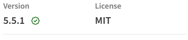
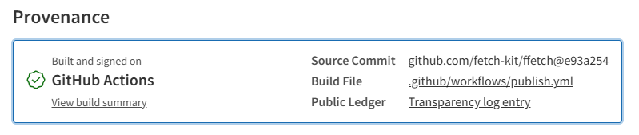

Every time you run `npm install`, you are adding code that will execute in your production environment: code written by someone you have never met, with access to whatever your process can reach. It might touch your filesystem, make outbound network requests, read environment variables, or quietly exfiltrate data. You are, in effect, trusting a stranger with your infrastructure.

Most developers manage this risk by checking two numbers: weekly downloads and GitHub stars. Neither tells you anything meaningful about whether a package is safe, maintained, or honest about what it does. (Most npm packages use GitHub. If a project is hosted elsewhere, apply the same principles.)

Supply chain attacks have made this worse. Event-stream, ua-parser-js, node-ipc, xz utils - the pattern is consistent: a legitimate, widely used package gets compromised, either through a maintainer being social-engineered, a typosquat, or a dependency buried three levels deep. The npm ecosystem, with its culture of small composable packages and deep transitive dependency trees, is a particularly attractive target. You can do everything right and still get hit through something you never directly installed.

There is a newer variation worth knowing about. AI coding assistants hallucinate package names. They confidently suggest `npm install some-plausible-sounding-package` for packages that do not exist. Attackers monitor those hallucinations and register the names - a technique now called **slopsquatting** - so that when a developer follows the suggestion without checking, they install something malicious. If an LLM suggests a package you have never heard of, verify that it exists, has a real history, and has provenance before you run the install.

None of this means you should stop using open source packages - that would make you less productive without making you meaningfully safer. What it means is that picking a package deserves more than a five-second glance at the star count.

This guide gives you a repeatable process for evaluating an npm package before you add it. It takes 5 to 10 minutes. It won't guarantee safety - nothing will - but it will help you make an informed decision rather than an optimistic one.

## 0. Do you actually need this package?

Before you audit anything, ask the simplest question first: should this dependency exist in your project at all?

Many npm incidents become severe not because one package is inherently catastrophic, but because a tiny convenience package gets copied across dozens of services and frontend apps until it is everywhere. If that package is compromised, abandoned, or suddenly unpublished, your blast radius is no longer small.

### What to check:

Do a **removal test** in your head: if this package disappeared tomorrow, how hard would it be to replace? If the answer is "we would have to refactor half the codebase," treat it as high-risk and apply stricter scrutiny.

If it is a tiny utility, ask whether you can implement the same thing in a few lines in your own codebase. Pulling a dependency for one helper function is often not worth the long-term risk.

Check the package dependency footprint. A package with zero runtime dependencies is not automatically safe, but fewer dependencies generally means a smaller attack surface and fewer transitive surprises. On npm, inspect the dependency count and scan what those dependencies actually are.

Then check where you plan to use it. A package used in one isolated internal tool has a different risk profile from one that will be imported across every service.

## 1. Is it actively maintained?

An unmaintained package is a liability that compounds over time. Security vulnerabilities go unpatched. Compatibility with newer Node versions breaks silently. The API freezes while the ecosystem moves on, and eventually you are pinned to an old version of something because updating it would require replacing a package nobody is touching anymore.

The obvious signal is recent commits, but commit frequency alone is misleading. A package can have a commit last week that does nothing but update a CI action. What you are looking for is whether the author is still engaged with the actual software.

### What to check:

On the GitHub repository, go to the **Issues** tab. Look at the oldest open issues. Are they acknowledged? If someone reported a bug 18 months ago and the author has never replied, that tells you something about what the maintenance relationship looks like when things go wrong.

Look at the **Commits** tab. Filter out bot commits and CI noise. When was the last time a human made a meaningful change to the source code, not just a dependency bump or a workflow tweak?

Look at who is doing the work. If almost every meaningful commit, release, and issue reply comes from one person, you have **maintainer concentration risk** (the "bus factor" - the number of people who would need to be hit by a bus before the project is in trouble). That is not automatically bad - many excellent packages are run by one maintainer - but it means your operational risk is tied to one human's availability and energy.

On the **npm page**, go to the Versions tab. Is there a recognizable release cadence - monthly, quarterly, whatever - or a 2-year gap followed by a burst of activity? Long gaps followed by sudden updates are sometimes a red flag in themselves: accounts do get taken over.

Check the **CHANGELOG**. If it just lists commit hashes, it is nearly useless. A changelog that says "Fixed: deduplication plugin now clones responses per waiter to prevent body-already-used errors" is a changelog written by someone who cares whether you understand what changed and why. The quality of the changelog is a proxy for how the author thinks about the people using their software.

Finally, if the package exposes a public API that has changed over time, look for a migration guide. An author who documents breaking changes and provides an upgrade path is an author who thinks about the downstream cost of their decisions.

## 2. Can you trust what's actually published to npm?

Maintenance is about the future. This section is about something more immediate: whether what is on the npm registry right now is actually what the author intended to publish.

The npm registry has no verification by default. When you install a package, you are trusting that the bytes you receive match the source code you can read on GitHub. For most packages, most of the time, that is true. But the mechanism that links source to publish - an `NPM_TOKEN` stored as a CI secret, or sometimes just on a developer's laptop - is exactly the kind of credential that attackers target.

The event-stream attack in 2018 is the clearest example: a maintainer handed over control of a popular package to a stranger. The stranger published a version with a malicious dependency. Millions of projects were affected before anyone noticed. No one hacked GitHub. No one broke npm's infrastructure. They just got the credentials.

[**Provenance attestation**](https://docs.npmjs.com/cli/v9/commands/npm-publish#provenance) is the modern answer to this. When a package is published with provenance, the npm registry receives a cryptographic attestation (signed by GitHub's OIDC infrastructure) that ties the specific package tarball to a specific commit in a specific repository, built by a specific GitHub Actions workflow run. You can verify it. The attestation is public. If someone publishes a package claiming to be from a specific repository but the attestation does not match, that is detectable.

### What to check:

Go to `npmjs.com/package/<package-name>`. Next to the version name, there should be a green "Provenance" badge if the package was published with provenance:



Click on it, then on the "View more details" link. It will take you to the bottom of the page:



It shows the repository URL, the commit SHA, and the GitHub Actions workflow run that published the package. You can click through to all of those things to verify that they exist and make sense. If the badge is there and the details check out, you can be reasonably confident that the package you are installing is what the author intended to publish.

If it is not there, the package was published without provenance - which is not automatically suspicious (most packages predate the feature), but it means you cannot verify the source-to-publish chain.

You can also check from the command line. In any project that has the package installed, run:

```sh
npm audit signatures
```

This verifies the cryptographic signatures of all installed packages and reports which ones have valid provenance attestation.

If you want to look at how a package is published, find the `.github/workflows/` directory in the repository and open the publish workflow. Look for three things:

- `npm publish --provenance` - this is what generates the attestation
- `id-token: write` in the job permissions - this is what allows the OIDC token exchange with npm
- The absence of `NPM_TOKEN` as a secret - if the workflow uses Trusted Publishing (OIDC), there is no long-lived token to steal

Finally, look at how GitHub Actions are referenced in the workflow files. Actions referenced as `uses: actions/checkout@v4` or `uses: actions/setup-node@main` are pinned to a mutable tag - the action author can change what that tag points to at any time, and your workflow will silently start running different code. Actions pinned to a full commit SHA (`uses: actions/checkout@de0fac2e4500dabe0009e67214ff5f5447ce83dd`) cannot be changed without updating the reference in the workflow file itself. It is a small thing, but it closes a real attack surface.

One more thing that runs code on your machine before you have reviewed any of it: install scripts. The `preinstall`, `install`, and `postinstall` hooks in `package.json` execute the moment you run `npm install`. Most legitimate packages do not need them - native addons that compile C++ bindings are the main genuine use case. If you see an install script in a package that has no obvious reason for one, that is worth understanding before you proceed.

## 3. Is the CI pipeline real or decorative?

A green badge in the README is easy to fake, or rather, easy to earn without it meaning much. A repository can have continuous integration that runs three tests on a single happy path and reports 100% pass rate. That badge is technically accurate and entirely useless.

What you want to know is whether the CI pipeline actually protects the codebase: whether it would catch a regression, a type error, or a broken edge case before it ships.

### What to check:

Go to the **Actions** tab on GitHub. Look at the workflow runs. Do they trigger on `pull_request` events, not just on pushes to `main`? A pipeline that only runs after merging is not protecting anything, it's just producing a record of what already happened.

Open a recent merged pull request. Did CI run on it? Did anyone have to wait for it to pass before merging? If the PR was merged 30 seconds after it was opened with no CI run, the pipeline is decoration.

Find the test configuration file: `vitest.config.js`, `jest.config.js`, or equivalent. Look for coverage thresholds. Something like:

```js
thresholds: {
  lines: 90,
  functions: 90,
  branches: 90,
}
```

If thresholds are configured, the CI pipeline will fail if coverage drops below them. If they are not configured, coverage might be reported but it is not enforced, an author can delete half the tests and the build will still pass.

Also look at what the tests actually cover. A `test/` directory that mirrors the `src/` structure, or unit tests co-located with the source files, is a good sign. A single `index.test.ts` file with a handful of smoke tests is a different thing entirely. You cannot audit the tests in detail, but you can get a sense of whether the author takes them seriously.

## 4. Is the code quality visible?

You are not going to audit the entire codebase of every package you consider. That is not realistic. But you can take a quick look at the signals that correlate with code quality, the things an author does or does not do that are visible at a glance and tend to predict whether the package is robust or fragile.

### What to check:

Look at the linting configuration: `eslint.config.js`, `.eslintrc`, or equivalent. Does it exist? Is it non-trivial? A blank or near-empty linting config suggests the author is not enforcing consistency or catching obvious mistakes automatically. Linting is table stakes; its absence is a signal.

Check whether the package ships a well-formed bundle. Look at the `exports` field in `package.json`. A modern package should specify named export conditions: `import` and `require` if it supports both module systems, or just `import` if it is intentionally ESM-only, and ideally `types` if it ships TypeScript declarations. A package that only sets `main` with no `exports` field at all was written before this became standard practice. That is not disqualifying, but it tells you something about how current the author's practice is.

Look at the `package.json` for a `prepublishOnly` script:

```json
"prepublishOnly": "npm run build && npm run test:ci"
```

This prevents an author from accidentally publishing a broken build or a build that skips tests. It does not protect against malicious publishes, but it does tell you the author has thought about accidental ones.

**For TypeScript packages specifically:** open `tsconfig.json` and check whether `strict: true` is set. Strict mode enables null checks, strict function types, and no-implicit-any - a whole class of bugs caught at compile time rather than in production. An author who turns it off has decided some of those bugs are acceptable.

Also search the repository for `any` and `@ts-ignore`. A few uses in genuinely awkward interop situations is normal. Dozens of them scattered through the source code means the TypeScript types are largely cosmetic: the package has the `.ts` extension but not the type safety.

## 5. What happens when something goes wrong?

Every non-trivial package will eventually have a security vulnerability. The question is how the author handles it when it does. Do they respond quickly? Do they disclose responsibly - privately first, then publicly with a fix? Do they document what happened so you can assess whether your version is affected?

### What to check:

Look for a `SECURITY.md` file in the repository root, or go to `github.com/<owner>/<repo>/security/policy`. This should tell you how to report a vulnerability privately, a contact method, a timeline for response, and some indication that the author takes disclosures seriously. Its absence does not mean the package is insecure, but it does mean that if you find something, you have no clear path to report it without accidentally disclosing it publicly.

Go to the **Security** tab on GitHub and look at the Advisories section. Has anything been published? If yes, how was it handled - was the disclosure coordinated, was a fix available when it went public, was the affected version range clearly documented? A well-handled historical advisory is actually a positive signal; it means the author knows what a responsible disclosure process looks like and has followed it.

Check `osv.dev` or `snyk.io` for known vulnerabilities in the package. These aggregate CVEs and GitHub Security Advisories. If the package has known unpatched vulnerabilities, that is something you need to know before installing it.

[Socket.dev](https://socket.dev) goes further than CVE databases. Rather than waiting for a vulnerability to be reported and cataloged, it does behavioral analysis: does this package access the network? Does it touch the filesystem in unexpected ways? Does it contain obfuscated code? Does it have install scripts? It also has a GitHub app that runs this analysis on pull requests and flags new dependencies before they are merged. For packages you are seriously considering, it is worth a quick check.

If you operate in a high-assurance environment, [Socket Firewall](https://socket.dev/features/firewall) is also worth knowing about. Instead of only warning at review time, it enforces package policy at install time and can block known-malicious packages from entering your environment at all. That is usually overkill for hobby projects, but for regulated or security-sensitive systems it can be a strong extra control.

Finally, look at how quickly past security issues were addressed. A critical vulnerability fixed within days is different from one that sat open for three months. Response time on security issues is one of the clearest signals of how seriously an author takes the responsibility of maintaining a public package.

## The Checklist

Not all of these checks carry equal weight. If you only have time for three things:

1. **Do you actually need it?** If you can replace it quickly or avoid it entirely, you remove risk instead of managing it.
2. **Does it have provenance?** This is the clearest signal that the published package is what the author intended to publish.
3. **Does it have unexplained install scripts?** Code runs on your machine the moment you run `npm install`.

If the package is production-critical, add a fourth check: **is the maintainer responsive?** If something goes wrong, you want to know that the person who can fix it will actually fix it.

Everything else is worth checking when the stakes are higher.

### Security-critical signals

These affect whether the package is safe to install and whether what you are installing is what the author published.

| Signal | Where to check | Green | Red |
|---|---|---|---|
| Provenance | npmjs.com version page | "Provenance" section present and matches repo | No provenance, or version published from unknown source |
| Trusted publishing | `.github/workflows/publish.yml` | OIDC + `--provenance`, no `NPM_TOKEN` | `NPM_TOKEN` secret, manual publish steps |
| Install scripts | `package.json` scripts field | None present, or obvious native-addon reason | `preinstall`/`postinstall` with no clear justification |
| Pinned CI actions | `.github/workflows/*.yml` | SHA-pinned third-party actions | `@v3`, `@latest`, `@main` |

### Operational maturity signals

These tell you how seriously the author takes maintenance, quality, and the long-term cost of depending on their package.

| Signal | Where to check | Green | Red |
|---|---|---|---|
| Active maintenance | GitHub commits + open issues | Commits in last 3 months, issues acknowledged | Last commit 2+ years ago, stale issues ignored |
| Dependency footprint | npm package page + lockfile tree | Few dependencies for package scope, no surprising transitive tree | Large transitive tree for a trivial utility |
| Maintainer concentration | Commits, releases, issue/PR responses | Work distributed across multiple active maintainers | One maintainer handles nearly all code, releases, and support |
| Coverage enforced | vitest/jest config | Thresholds configured at 80%+ | No thresholds, or coverage badge that never changes |
| Security policy | `SECURITY.md` or Security tab | Clear disclosure process, contact method | Missing, or just a generic template with no contact |

A package that is clean on security-critical signals but weak on operational maturity is a calculated risk. A package that fails the security-critical signals is a different category of problem.

## Risk is not binary

None of this is a pass/fail test. It is a risk assessment, and risk depends on context.

A utility that formats dates in a UI has a different risk profile than an HTTP client sitting between your service and a government API. A dependency that receives 50 million weekly downloads has more eyes on it than one that receives 500. A package from an organization with a dedicated security team is different from one maintained by a single developer in their spare time. None of these are disqualifying conditions on their own - some of the most reliable packages in the ecosystem are maintained by individuals - but they affect how much scrutiny you should apply.

The goal is not to find a package with a perfect score on every dimension. The goal is to understand what you are accepting when you add it to your project, and to make that decision deliberately rather than by default.
