*Most software is first built under unusually friendly conditions. On a developer machine, the database is nearby, the network is quiet, the service you need is running, the test user behaves sensibly, the clock moves forward, the queue drains, the deployment finishes, and the request succeeds. Those conditions are useful, they let us build the first version of a thing without having to worry about everything that can go wrong in production. Requests don't always succeed, networks are not always fast, databases don't always respond immediately, deployments are not instantaneous, users do not behave predictably, and dependencies have their own limits, maintenance windows, bugs, overloads, and bad days. A system designed only for the smooth path may work beautifully most of the time, but when reality bends away from that path, things fall apart.*

*This series is about making your programs more resilient. Each post looks at one part of the system we take for granted: networks, time, databases, storage, users, dependencies, deployments, queues, and concurrency. The question is always the same: what assumptions are we making here, and what should we do when they stop being true?*

- [Beyond Happy Path Engineering: the Network](/posts/2026-07-01-Beyond-Happy-Path-Engineering-the-Network/)
- [Beyond Happy Path Engineering: Time](/posts/2026-07-19-Beyond-Happy-Path-Engineering-Time/)

---

The network is where most application code leaves the current process. A request handler calls another internal service, a worker fetches a file from object storage, or a backend asks a third-party API to send an email, calculate tax, reserve inventory, or authorize a payment. These calls often disappear into client libraries and helper functions, but they are still conversations with systems the caller does not control.

A network call can look like a simple request and response, but it carries assumptions about latency, availability, ordering, duplication, and whether the caller can really know what happened on the other side.

## The happy path

Let's say we are working on the checkout flow of an e-commerce platform that needs to authorize a payment. The application has an order, a customer, and a card token, and it sends a request to a payment service asking for an authorization. On the happy path, the payment service receives the request, talks to whatever systems it needs internally, records the result, and sends a response back. The app receives that response and moves the checkout forward.

The diagram below shows the flow:

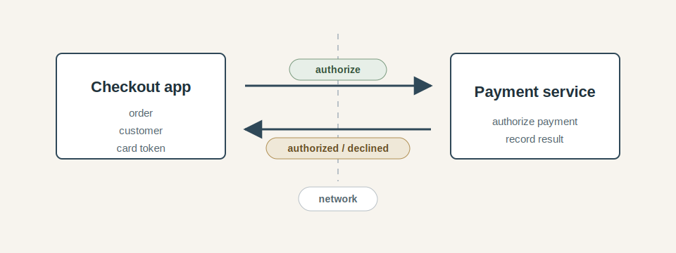

At this level, the flow is easy to reason about: there is a caller, a callee, a request, and a response. The caller asks for work to be done, the callee does the work, and the response tells the caller what happened. If the payment is authorized, the order can continue. If the payment is declined, the user can be told. The network appears as a narrow gap between two pieces of application behavior, and most client libraries are designed to make that gap feel as small as possible.

The code that sits behind this diagram often looks just as simple:

```text
authorization = payments.authorize(order, customer, cardToken)

if authorization.approved:
    continue_checkout(order)
else:
    ask_for_another_payment_method(order)
```

Clean and simple, this is what we want from the application code: ask for the thing the business process needs, then continue based on the result. But it suggests that the call either returns a useful answer or fails in a way the caller can understand. It assumes that the payment service receives one request, performs one authorization, and sends back one response that accurately describes the result, and that the caller and the callee can always agree about what happened.

Those assumptions are often true enough during development and testing: the payment service is reachable, the test dependency responds quickly, the network is local or nearly local, and the result comes back before anyone has to think too hard about timing. Under those conditions, the network behaves like a transparent pipe: the application always sends something through one end and always receives something back from the other.

## Reality

Production is less neat. The network is not a single, reliable pipe, it is a collection of routers, switches, load balancers, firewalls, and other systems that can fail in many ways. A particular path gets slow, a connection pool fills up, a DNS lookup fails, a load balancer closes an idle connection, a packet is dropped and retransmitted, a service accepts the request but cannot answer in time, or the answer is produced and then lost on the way back.

The first adjustment is to stop thinking of "the network is down" as the main failure case, clean failures are only one part of the story. A network call can fail before the request is sent, while the request is in flight, while the remote service is doing the work, or while the response is coming back. Some of those failures are clear, others leave the caller with an uncomfortable lack of knowledge.

The diagram below shows a payment authorization request with several failure points:

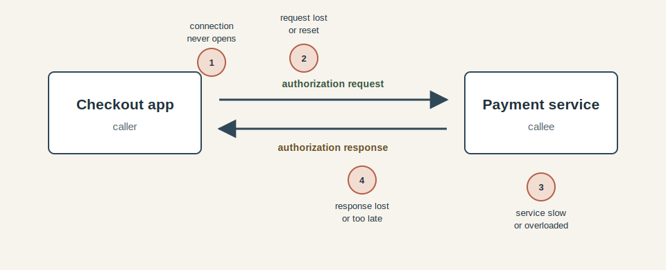

If the connection never opens, the caller can be reasonably confident that the payment service did not receive the request. That is annoying, but at least it is fairly easy to classify. If the request reaches the payment service and the response never comes back, the situation is different: the caller may see a timeout, but the timeout does not say whether the authorization happened. It only says that the caller stopped waiting.

And that is important because many networked operations are not just queries, they change something: authorizing a payment, reserving inventory, creating an account, sending an email, publishing a message, or starting a deployment all have side effects. Once a request with side effects crosses the network, the caller needs to be careful about what it believes after a failure. **"I did not receive the response" is not the same as "the operation did not happen".**

This is where network failures become application design problems. The code cannot treat every unsuccessful call as a clean negative answer, because the network may not be able to provide one. Sometimes the system knows the operation failed. Sometimes it knows the operation succeeded. Sometimes it only knows that the conversation ended before the answer arrived.

### Latency is a failure mode

Another problem is that a network call does not have to fail to damage the system, it can simply take too long. A payment authorization that normally returns in 120 milliseconds may still return correctly after two seconds, but those two seconds are not free. During that time, the checkout request is still open, the application is still holding whatever worker or thread is handling it, a connection may still be occupied, and the user is still waiting.

This is why latency belongs in the same conversation as failure. From the user's point of view, a very slow checkout can feel broken even if every component eventually returns a technically successful response. From the system's point of view, slow calls consume capacity while they are waiting. If enough requests are waiting at once, the caller can run out of workers, connection slots, memory, or queue space even though the downstream service is still answering some of the time.

If most payment authorizations return quickly and a small fraction take several seconds, the average may still look healthy. The users who land in that slow fraction do not experience the average, though. They experience the tail. More importantly, the system has to carry the tail: those slow requests stay in memory, hold on to resources, and reduce the amount of useful work the application can do for everyone else.

Tail latency also compounds. A single network call with occasional slow responses is manageable. A request path with several remote calls has more chances to hit a slow one. If checkout needs a payment authorization, an inventory reservation, a tax calculation, and a fraud check before it can respond, the user does not experience each dependency in isolation, they experience the combined path, and the slowest part of that path often defines the whole request.

This is one reason production incidents so often begin with language like "the dependency was slow" rather than "the dependency was down". Slowness keeps the caller engaged: it encourages users and upstream systems to retry. It makes queues grow gradually enough that the system can look alive while it is becoming less and less able to recover. By the time the failure is obvious, the original problem may no longer be just the slow payment service, it may be the checkout service full of waiting requests, the gateway full of waiting clients, and a user population pressing the button again because nothing seems to be happening.

## Engineering beyond the happy path

We have seen what can go wrong at the network boundary: slow calls, ambiguous outcomes, duplicate attempts, abandoned work, and pressure that spreads from one service to another. The next step is to design the boundary deliberately, so the system has a clear response when the happy path stops being enough.

### Timeouts are design decisions

Once latency is part of the problem, timeouts become part of the design. A timeout is often treated as a small technical setting on an HTTP client, but it is really a decision about how long the caller is willing to keep waiting for this particular work. That decision affects user experience, capacity, correctness, and what the rest of the system is allowed to assume.

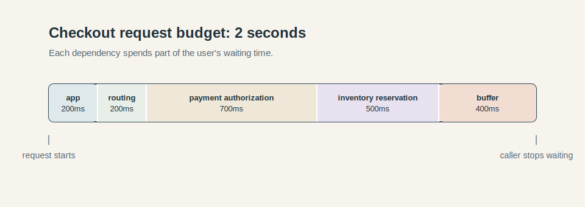

In a checkout flow, there may be a product expectation that the user should get a response within two seconds. But that does not mean every dependency gets two seconds. If the checkout application gives the payment service two seconds, and the payment service gives its own dependencies two seconds, and another downstream service does the same, the original user request has already lost any meaningful budget. Each layer has made a locally reasonable choice that adds up to a globally unreasonable one.

A better mental model is to treat the request as carrying a remaining budget. The checkout flow has some amount of time to do useful work before the caller should stop waiting. Some of that time belongs to application logic, some belongs to the payment authorization, some may belong to inventory reservation or tax calculation. Some should be left as buffer, because production systems do not run exactly at the numbers written in a design document. When the budget is gone, continuing to wait is just work getting done after the answer has stopped being useful.

Without a timeout, the caller can wait far longer than the user, upstream system, or resource pool can afford. A very large timeout has a similar shape: it may avoid visible errors for a while, but it does so by allowing requests to pile up slowly. A very small timeout creates a different problem, turning normal variation into artificial failure. The useful timeout is neither "as long as possible" nor "as short as possible", it is long enough for the dependency to succeed under expected conditions and short enough to protect the caller when those conditions stop holding.

Timeouts also need to line up across the path. If the gateway gives checkout one second, it should not spend two seconds waiting for payment. If checkout gives payment 700 milliseconds, payment should not spend several seconds attempting work that the caller has already abandoned. This does not mean every downstream operation can always be cancelled perfectly, some work may already be in progress, and some side effects may still complete. But the system should at least pass along the idea that time is finite, so each layer can decide whether starting or continuing the work still makes sense. If you want a practical walk-through of wiring these controls in application code, [Making Your Fetch Requests Production-Ready with ffetch](/posts/2025-09-13-Making-Your-Fetch-Requests-Production-Ready-With-Ffetch/) is a useful companion.

This is why timeout handling cannot stop at "catch the timeout exception". The timeout tells the caller that its waiting budget has expired, it does not necessarily classify the remote operation. After a payment authorization times out, the checkout application still has to decide what state the order should be in, what the user should see, whether the operation can be retried safely, and how the system will later reconcile what actually happened. The timeout protects the caller from waiting forever, but it does not remove the ambiguity created by the network.

### Retries are not a plan

Retries are attractive because they often work: a connection reset, a brief packet loss, a restarted service instance, a momentary overload, or a stale connection in a pool may all disappear on the next attempt. From the caller's point of view, the retry turns a transient failure into a successful operation, and the user never needs to know that anything unusual happened.

That usefulness is exactly why retries are dangerous when they are treated as a reflex. But a retry is not simply "try the same thing again", it's another request entering the system. If the first request definitely never arrived, a retry may be harmless. However, if the first request arrived and the response was lost, the retry may ask the remote system **to perform the same side effect twice**.

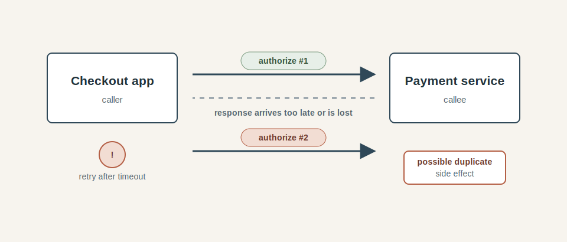

In the payment example, the checkout application sends an authorization request and waits. The payment service receives the request, authorizes the card, and starts sending a response. Somewhere on the way back, the response is delayed or lost. The checkout application reaches its timeout and retries. Without some additional contract between the two systems, the payment service may see two valid authorization requests. The caller intended to recover from uncertainty, the callee may interpret that recovery attempt as new work.

This is the central retry problem: the caller's reason for retrying is not automatically visible to the callee. The caller is thinking, "I did not get an answer", the callee may only see "here is another request to authorize this payment". Those are different statements, and the gap between them is where duplicate charges, duplicate emails, duplicate account creation, and duplicate messages come from.

Retries also create load at awkward moments. If a payment service is slow because it is overloaded, immediate retries add more requests to the same struggling service. If many callers share the same timeout and retry schedule, they can retry together in waves. A small slowdown can become larger, which causes more timeouts, which causes more retries. The retry logic was added to make the system more resilient, but under pressure it can become a traffic multiplier.

This does not make retries bad, just means they need conditions. The operation should be safe to repeat, or the request should carry an identity that lets the receiver recognize repeated attempts as the same operation. The retry should fit inside the caller's remaining time budget. It should usually wait a little before trying again, and that waiting should include some randomness so every caller does not retry at the same moment. The system should also measure retries separately from ordinary requests, because a service that is succeeding only after repeated attempts is already telling you something important.

The practical rule is that **retries belong to a contract, not just a loop**. For a read-only request, that contract may be simple: asking twice should not change anything. For a request with side effects, the contract has to be explicit: the payment service needs a way to understand that the second request is not "authorize this card again", but "complete or report the result of the authorization attempt I already started". That idea leads directly to *idempotency*.

### Idempotency gives retries an identity

Idempotency is the property that lets the same operation be repeated without changing the intended result. In everyday application code, some operations are naturally idempotent. Setting a user's preferred language to English has the same intended effect whether the request is processed once or five times. Incrementing an account balance by ten dollars does not. Authorizing a payment is closer to the second category unless the system adds an explicit identity for the attempt.

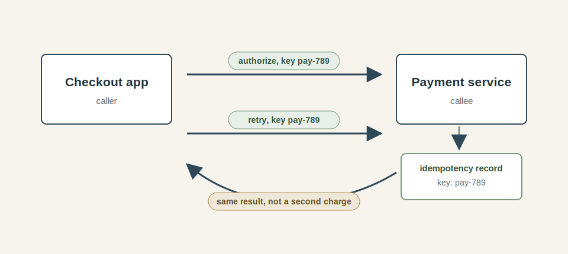

An idempotency key is that identity. Instead of sending a request that only says "authorize this card for this order", the checkout application sends a request that says "authorize this specific payment attempt." If the caller times out and retries, it sends the same key again. The payment service can then look up the key and decide whether it is seeing a new operation or another attempt to learn the result of an operation already in progress.

In shape, the request might look like this:

```text
POST /payment-authorizations
Idempotency-Key: pay-789

order: order-123
amount: 49.00
cardToken: tok_abc
```

The business operation has a stable identity that survives the network failure: if the first request succeeds but the response is lost, the retry with the same key should not create another authorization. It should return the stored result, wait for the in-progress attempt to finish, or report a well-defined state that the caller can handle.

This means idempotency is not only a client-side habit, the receiving service has to participate. It needs to store the key, associate it with the operation, remember enough of the result to answer future attempts, and reject suspicious reuse. If the same idempotency key is later sent with a different amount or a different order, that should not silently become a new interpretation of the old request. The key identifies one operation, not a convenient label that can be reused for whatever comes next.

There is also a subtle but important distinction between "safe to retry" and "guaranteed to succeed." Idempotency does not make the network reliable, and it does not make the payment provider available, it simply narrows the meaning of a retry. The retry no longer means "maybe do this side effect again", but "continue or tell me about this same side effect". That is a much easier contract to reason about.

Once idempotency is in place, the checkout application has better options after a timeout. It can retry within the remaining request budget. It can show the user a pending state and reconcile later. It can ask the payment service for the result of the same payment attempt without risking a duplicate authorization. The system may still be dealing with uncertainty, but the uncertainty is now attached to a named operation rather than floating around as an anonymous failed request.

### Backoff and jitter keep retries from arriving in waves

Idempotency makes a retry safer for correctness, and every retry still consumes network capacity, caller capacity, and payment-service capacity. When a dependency is already slow or overloaded, retry timing matters almost as much as retry safety. Sending the next attempt immediately may turn a short disruption into a larger one.

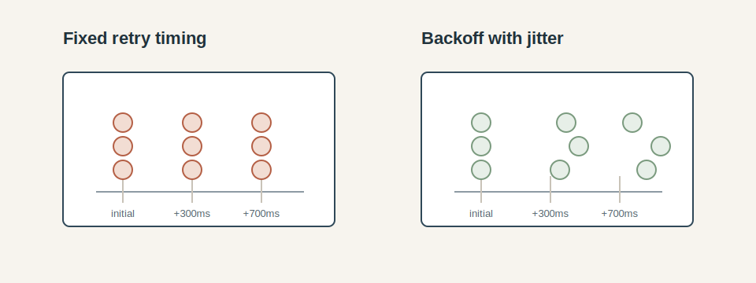

Backoff means the caller waits before trying again, and usually waits longer after each failed attempt. The first retry might happen after a short delay, the next after a longer delay, and the next after a longer delay again, all within the remaining request budget. That spacing gives a struggling dependency a little room to recover and reduces the chance that the caller simply adds more work to the pile at the worst possible moment. In practice, the backoff is often exponential: for example the first retry waits 100 milliseconds, the next 200 milliseconds, the next 400 milliseconds, and so on.

Jitter adds randomness to those delays. Without it, many callers can still line up. If thousands of checkout requests all time out after the same interval and all retry exactly 100 milliseconds later, the payment service receives a synchronized burst of traffic. If they all retry again 300 milliseconds after that, the burst repeats. Jitter spreads those attempts out so the retries arrive as a smear of work rather than a wave.

The useful retry policy is bounded in three ways. It has a maximum number of attempts, so a single user request cannot keep creating work indefinitely. It has a time budget, so retries stop once the answer would no longer be useful to the caller. Finally, it has spacing, so each retry is less likely to intensify the condition that caused the previous attempt to fail.

The checkout flow might make one quick retry after a connection reset, then one later retry if there is still enough time left in the user's request budget. It should not keep retrying a payment authorization in the background without a clear state model, and it should not allow every layer in the path to retry independently without coordination. A gateway retrying checkout, checkout retrying payments, and the payment client retrying its own upstream call can multiply into far more attempts than anyone intended.

Retries also need to be observable. A system where 99 percent of payment authorizations eventually succeed may still be unhealthy if many of them succeed only after two or three attempts. That retry volume is early evidence of latency, packet loss, overload, or a dependency beginning to fail. Treating retries as invisible cleanup hides the signal that the network boundary is getting worse.

Backoff and jitter control pressure, idempotency gives repeated attempts a stable meaning. A resilient network call usually needs both.

### Cancellation keeps abandoned work from piling up

Timeouts decide how long the caller is willing to wait, *cancellation* is how the caller tells the rest of the system that the answer may no longer be useful. Without that signal, downstream work can continue long after the user has gone away, the gateway has returned an error, or the checkout request has moved into a different state.

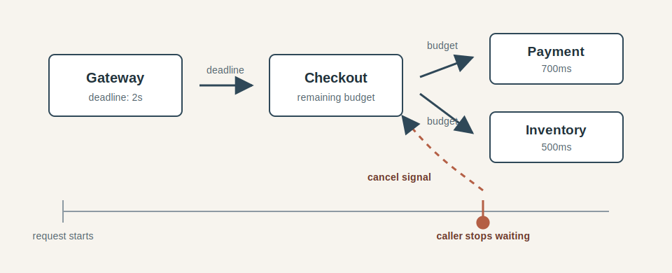

In the checkout flow, imagine the gateway gives the whole request two seconds. Checkout spends some of that time doing local work, then calls payment and inventory with the remaining budget. If the gateway stops waiting after two seconds, checkout should know that. If checkout gives up on payment after 700 milliseconds, the payment client should know that too. Each layer has a chance to stop starting new work, release resources, close streams, or abandon calculations whose results will no longer be used.

This is especially important for slow failures. A payment service under pressure may already be doing too much work. If callers time out and retry while the original attempts keep running, the system pays twice: once for the abandoned work and again for the retry. Cancellation gives the downstream service a chance to reduce that waste. It also helps the caller release local resources earlier instead of waiting for work that has already missed its usefulness window. For a deeper treatment of why cancellation is usually cooperative rather than absolute in JavaScript, see [Cancellation In JavaScript: Why It's Harder Than It Looks](/posts/2025-12-23-Cancellation-In-JavaScript-Why-Its-Harder-Than-It-Looks/).

Cancellation has limits: a request may already have crossed a point where the side effect will complete, a payment authorization may already have been submitted to a processor, an email may already be handed to a provider, a database transaction may be close to committing. In those cases, cancellation can reduce wasted computation and waiting, but it cannot rewrite history. The caller still needs idempotency, reconciliation, and explicit states for operations whose outcome remains uncertain.

*Deadlines* are often more useful than isolated timeout values because they travel with the request: instead of every layer inventing a fresh timeout, they can ask how much time remains and decide whether the next piece of work still has a realistic chance to finish. If only 80 milliseconds remain, starting a payment authorization that normally takes 300 milliseconds is usually just creating future cleanup. Passing the deadline makes that visible.

The useful mental model is that a request carries both intent and time. The intent says what work the caller wants done. The deadline says how long that work remains useful to the caller. As the request crosses network boundaries, both pieces of information matter. Losing the intent creates incorrect behavior, losing the deadline creates work that nobody is waiting for.

### Circuit breakers and load shedding protect the caller

The patterns so far make individual calls more honest: timeouts limit waiting, retries get a contract, idempotency gives repeated attempts an identity, and cancellation reduces abandoned work. The next question is what a caller should do when the dependency is clearly unhealthy. Continuing to send ordinary traffic into a dependency that is timing out, overloaded, or failing in the same way over and over can make both sides worse.

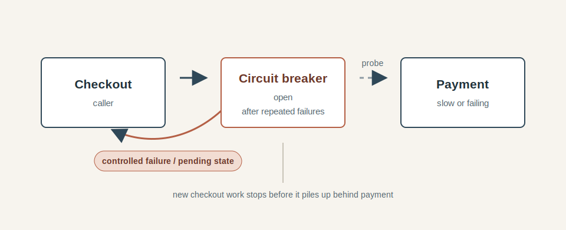

A *circuit breaker* is a **memory of recent failure**. When calls to payment are succeeding, checkout sends traffic normally. When enough calls fail or time out, checkout opens the breaker and stops sending most new payment requests for a short period. During that period, it can fail fast, return a pending state, disable checkout temporarily, or take whatever product behavior makes sense for that operation. After a while, it can allow a small number of probe requests through to see whether payment has recovered. For a focused implementation guide, see [Stop Hammering Broken APIs - the Circuit Breaker Pattern](/posts/2025-09-17-Stop-Hammering-Broken-APIs-the-Circuit-Breaker-Pattern/).

The point is to protect the caller as much as the callee. If payment is already overloaded, another thousand checkout requests waiting on payment will not help payment recover. It will also consume checkout workers, gateway connections, user patience, and retry budget. Failing fast is unpleasant, but it can preserve enough capacity for the rest of the system to keep rolling.

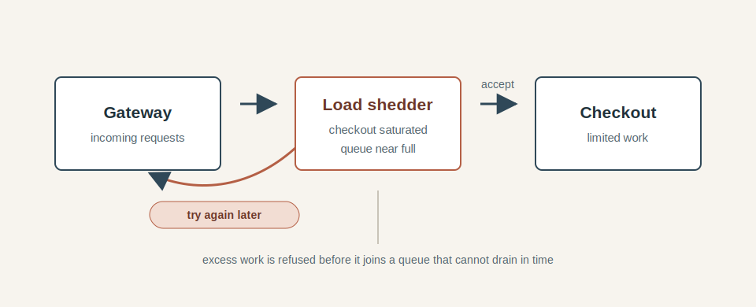

*Load shedding* is the same instinct applied at the entrance to a system: if checkout is already saturated, accepting more work may only increase latency for everyone. At some point, rejecting a new request quickly is better than accepting it into a queue where it will wait until its deadline is gone. A clear "try again later" is often kinder than a spinner that lasts thirty seconds and ends with the same answer.

These mechanisms need care because they change user-visible behavior. Opening a breaker for payment may mean checkout cannot complete new orders for a short time. Shedding load may mean some users are rejected while others succeed. Those choices should be tied to business priorities, not hidden inside a default library setting. A system can prefer existing checkouts over new ones, paid operations over optional enrichment, or authenticated users over anonymous traffic, but those preferences need to be intentional.

Circuit breakers and load shedding also need observation. A breaker that opens constantly is telling you that a dependency boundary is unhealthy. A load shedder that frequently rejects traffic is telling you that capacity or traffic shape has changed. These patterns are protective, not curative. They buy the system room to avoid collapse while operators, autoscaling, recovery logic, or upstream fixes deal with the underlying problem.

For the checkout flow, this usually means treating payment as a required dependency with controlled failure behavior. If payment is unavailable, checkout should probably stop promising that an order is complete. It might place the order into a pending payment state, ask the user to try again, or temporarily disable checkout. What it should avoid is the least informative behavior: accepting the request, waiting until every budget is exhausted, retrying blindly, and leaving the user and the system unsure what happened.

### Graceful degradation starts with knowing what is required

Once the system can fail fast, shed load, and stop abandoned work, the next design question is what the user-facing request actually needs before it can respond. Some dependencies are part of the promise being made to the user. Others are useful, important, or valuable, but they do not need to complete while the user is staring at the checkout page.

In the diagram below, payment and inventory are required for the checkout to complete. The receipt email, analytics event are not required for the user to see the next screen, they can be deferred or run on a best-effort basis.

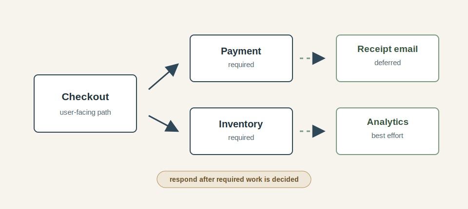

In checkout, payment is usually required: the system should avoid telling the user that an order is complete if it has no idea whether payment was authorized. Inventory may also be required, depending on the business rules. A receipt email, analytics event, recommendation update, loyalty calculation, or marketing attribution call has a different shape: those operations may matter to the business, but they rarely need to decide whether the user can see the next screen.

*Graceful degradation* begins by separating those categories. Required work needs clear failure behavior: complete it, mark it pending, or tell the user that checkout cannot continue. Deferrable work can move out of the synchronous path and run after the response. Best-effort work can be skipped under pressure, sampled, delayed, or retried later through a more durable mechanism. The design becomes calmer when every dependency has an answer to the question: does this need to finish before the user gets a response?

This also changes how failures feel. If the receipt email provider is slow, the checkout flow can still complete the order and queue the email for later. If the analytics endpoint is unavailable, the user should probably never notice. If payment is unavailable, the system needs to be honest because the core business operation has not reached a state it can safely promise. The same network failure has different product meaning depending on which dependency it touches.

Degradation should be visible to the system even when it is invisible to the user. If receipt emails are delayed, that should show up in metrics and operational dashboards. If analytics events are being dropped, someone should know the data is incomplete. If checkout is placing orders into a pending state because payment is unreliable, support and reconciliation workflows need to account for that. Hiding degradation from users can be a good experience, hiding it from operators is how small problems become mysterious ones.

The important habit is to design the unhappy path before production invents one. Without an explicit degraded behavior, the system tends to deteriorate in whatever way falls out of timeouts, retries, queues, and user impatience. With an explicit behavior, the system can preserve the parts of the experience that still make sense and be honest about the parts that cannot continue.

### Observe the boundary

All of these patterns depend on feedback. Timeouts need to be tuned against real latency. Retries need to be watched for amplification. Circuit breakers need thresholds. Load shedding needs a signal that the system is saturated. Degraded paths need to be visible even when they are deliberately hidden from the user. Without observation, the system may be making better decisions than the happy path version, but the team will not know whether those decisions are working.

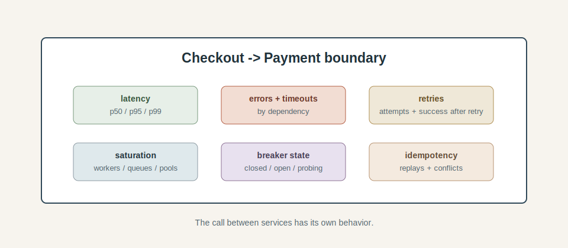

The useful unit of observation is often the **boundary between two systems**. Both checkout and payment can look healthy on their own, while the call between them is getting slower, noisier, or more ambiguous. That boundary has latency, timeout rate, error rate, retry volume, retry success rate, queueing, connection pool saturation, circuit breaker state, and idempotency replays. Each of those signals answers a different question.

Latency percentiles tell you what users and callers are actually experiencing. Averages can stay calm while the tail gets ugly, so **p95 and p99 matter more than a single mean value**. Timeout counts tell you when callers have stopped waiting. Error counts tell you when the dependency is giving clear negative answers. Retry counts tell you how much extra work the caller is creating. Retry success rates tell you whether retries are recovering from brief failures or simply adding load.

Saturation metrics explain why latency is changing. A payment call may be slow because payment itself is slow, because checkout has run out of workers, because a connection pool is exhausted, or because requests are sitting in a queue until most of their budget is already gone. Looking only at response codes misses that shape. The boundary is a little production system of its own, with capacity, queues, and failure modes. If you want a deeper discussion of queue growth and flow control, [Backpressure in JavaScript: The Hidden Force Behind Streams, Fetch, and Async Code](/posts/2026-01-06-Backpressure-in-JavaScript-the-Hidden-Force-Behind-Streams-Fetch-and-Async-Code/) complements this section.

The resilience mechanisms also need their own signals. If a circuit breaker opens, that event should be visible. If load shedding rejects requests, the rejection rate should be visible. If idempotency keys are replayed, that is also useful information that may indicate a caller bug or a dangerous misunderstanding of the API contract. These are not just implementation details, they are the system telling you how often it is leaving the happy path.

Good observability also makes trade-offs easier to discuss. If checkout is returning pending payment states, the business can see how often that happens. If analytics is being dropped under pressure, data consumers can understand why a dashboard looks thin. If receipt emails are delayed, support can answer user questions without guessing. Once degradation is visible, it becomes an operating mode rather than a mystery.

The goal is not to measure everything with equal urgency. The goal is to measure the assumptions that matter for the boundary. For a payment authorization, that means the time spent waiting, the number of attempts, the ambiguity after timeout, the use of idempotency keys, and the states users can end up seeing. Those measurements turn the network from an invisible source of surprises into a part of the system that can be reasoned about.

### Pulling the pieces together

The checkout flow now looks different from the first happy-path diagram, even though the business goal has not changed. The user still wants to place an order; the application still needs to authorize payment, decide what state the order is in, and eventually send supporting signals such as receipts and analytics. The difference is that the network boundary now has an explicit contract.

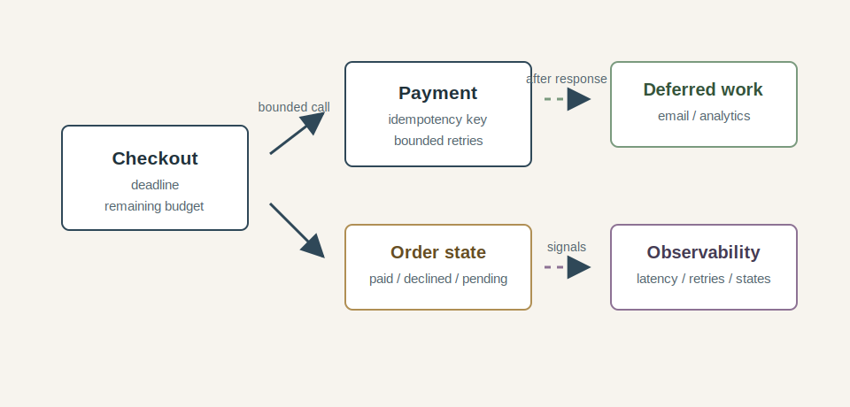

The call to payment has a timeout derived from the user-facing request budget. It carries an idempotency key so retries refer to the same payment attempt. Retries are limited, spaced out, and jittered. Cancellation tells downstream work when the caller has stopped waiting. A circuit breaker can stop checkout from feeding a dependency that is already failing. Load shedding can reject new work before checkout fills with requests that cannot finish in time.

The order model has also become more honest. Instead of pretending every checkout attempt ends as either complete or failed, it can represent states such as payment pending, payment declined, payment authorized, and unknown until reconciliation. Those states are not accidental database flags; they are how the business process admits that networked side effects can outlive the request that started them.

Optional work has moved out of the user-facing path. Receipt emails can be queued. Analytics can be best effort. Recommendation updates can happen later. Those choices reduce the number of dependencies that can break checkout for the user, and they make the remaining dependencies easier to reason about because the critical path is smaller.

The system also produces signals about what is happening at the boundary. Operators can see timeouts, retries, tail latency, idempotency replays, breaker state, pending orders, and degraded paths. Those signals matter because resilience patterns are easy to add and hard to tune blindly. Observability turns them from folklore into operational behavior.

None of this makes the network reliable, but it makes the application less fragile. The happy path remains simple: send the request, receive the response, continue checkout. It is still there; it is just no longer the only path the system understands. The rest of the design exists for the times when that response is slow, missing, duplicated, late, or impossible to classify with certainty.

### Patterns for sharper edges

The design above is where most systems should spend their effort: timeouts, bounded retries, idempotency, cancellation, circuit breakers, load shedding, graceful degradation, and good observation are ordinary tools for ordinary network uncertainty. But there are other patterns that become useful when the system is operating closer to its limits: very high request volume, strict tail-latency targets, expensive shared dependencies, or failure modes that concentrate in one part of the service. These techniques can help, but they buy reliability with extra moving parts. They belong after the simpler controls, not beside them, because each one changes the shape of the system the team has to reason about.

*Hedged requests* are one example. If a call is taking unusually long, the caller sends a second copy to another replica and uses whichever response comes back first. This can reduce tail latency when the problem is an unlucky slow backend, but it also creates extra work by design. Hedging a read from a replicated service may be reasonable in a high-throughput system with careful limits, but applying it to a payment authorization would be reckless unless the operation has a very strong idempotency contract and the receiving side is built for it.

*Bulkheads* isolate capacity so one dependency or class of work cannot consume everything. A checkout service might reserve separate worker pools or connection pools for payment, inventory, and internal admin calls. If inventory becomes slow, it can exhaust its own pool without consuming every worker needed for payment. The trade-off is that capacity becomes partitioned. A quiet pool may sit unused while another pool is saturated, so bulkheads need to reflect real priorities rather than an arbitrary diagram.

*Adaptive concurrency limits* adjust how much work a caller sends based on observed latency and failure. When a dependency is healthy, the caller allows more in-flight requests. When latency rises or errors increase, it tightens the limit. This can be powerful because it responds before total failure, but it needs careful tuning and good metrics. A bad adaptive limit can oscillate, starve useful work, or hide the real capacity problem behind clever control logic.

*Request coalescing* collapses identical in-flight work. If many callers ask for the same expensive read at the same time, the system performs the work once and shares the result. This is useful for cache misses, configuration fetches, feature flag reads, and other read-heavy paths where duplicate work adds pressure. It fits poorly with unique side effects, where each operation needs its own identity and audit trail. For a concrete distributed implementation, see [One Cache to Rule Them All: Handling Responses and In-Flight Requests with Durable Objects](/posts/2026-03-29-One-Cache-to-Rule-Them-All-Handling-Responses-and-In-Flight-Requests-with-Durable-Objects/).

These patterns belong near the edge of the toolbox. They make sense when the simpler controls are already in place and the remaining problem is specific enough to justify the extra machinery. A good rule of thumb is to ask what failure the pattern is supposed to reduce, what new failure it can introduce, and how the team will know which one is happening in production.

## Production example: a short partition, a long recovery

In October 2018, GitHub published a [post-incident analysis](https://github.blog/news-insights/company-news/oct21-post-incident-analysis/) for an outage that began with a brief loss of connectivity between sites. The initial network interruption lasted less than a minute. The service degradation lasted more than a day.

The interesting part, for this chapter, is the shape of the failure: a short network partition affected systems that were responsible for database topology and failover. When connectivity returned, the application tier began writing to a different site, while some writes still existed only in the original site. The system had crossed from a simple availability problem into a consistency and reconciliation problem. The network had recovered, but the business state could no longer be treated as if every write had one obvious home.

GitHub's response was deliberately conservative. They paused some background work, including webhook delivery and Pages builds, while they worked through the database state. That is graceful degradation in a very real form: preserve the integrity of user data first, reduce or delay supporting features, and make recovery slower if that is what the business promise requires. The degraded behavior was painful, but it was also a decision about priorities rather than a random side effect of timeouts and queues.

This is why network design cannot stop at "can service A reach service B?" For a while, the answer may be different depending on which site, replica, control plane, or application process is asking. A caller may receive a timeout while the callee continues working. A failover system may make a decision that is locally reasonable and globally awkward. A recovery path may depend less on reconnecting machines than on understanding which side effects happened during the uncertainty.

Amazon's Builders' Library makes the same point from the client side in its discussion of [timeouts, retries, backoff, and jitter](https://aws.amazon.com/builders-library/timeouts-retries-and-backoff-with-jitter/). Retries can help with transient failures, but they also add load to a dependency at the moment when it may have the least capacity available. Side-effecting APIs need idempotency before retries are safe. Backoff and jitter spread retry traffic out so clients do not turn a small disturbance into a synchronized wave.

Together, these examples point back to the same mental model. The network is part of the product's behavior. When it becomes slow, partitioned, or ambiguous, the application needs more than a socket timeout. It needs contracts for side effects, budgets for waiting, limits on repeated work, explicit degraded states, and enough observation to tell recovery from wishful thinking.

## Conclusion

A network call may look small in code, but it is a boundary between two independently failing pieces of the system. That boundary has latency, capacity, uncertainty, and business meaning. It can accept a request and lose the response. It can finish work after the caller has gone away. It can make the caller wait long enough that the failure spreads upward into queues, retries, abandoned requests, and user impatience.

Engineering beyond the happy path starts when that boundary becomes explicit. The caller has a budget for useful waiting. The callee has an operation contract. Side effects have identity. Retries have limits. Optional work has somewhere else to go. Required work has honest states for the moments when the system cannot safely promise success. Operators can see when the system is waiting, retrying, shedding load, degrading, or reconciling.

This does not make the network tame, but it does give the application a way to behave when the network is ordinary in all the inconvenient ways production networks are ordinary: slow for a few calls, broken for one path, overloaded for one dependency, ambiguous at the exact point where a business action may already have happened.

The happy path still matters, it is the path users want and the one the business is usually trying to deliver. The difference is that the happy path is now surrounded by decisions instead of assumptions. When communication is fast and clear, the system moves cleanly. When it is slow, duplicated, lost, completed late, or impossible to classify, the system has a vocabulary for what should happen next.
