*Featured in [Pointer #735](https://www.pointer.io/archives/post_94eb1316-ef73-4f82-8579-70be294baa03/)*

*Most software is first built under unusually friendly conditions. On a developer machine, the database is nearby, the network is quiet, the service you need is running, the test user behaves sensibly, the clock moves forward, the queue drains, the deployment finishes, and the request succeeds. Those conditions are useful, they let us build the first version of a thing without having to worry about everything that can go wrong in production. Requests don't always succeed, networks are not always fast, databases don't always respond immediately, deployments are not instantaneous, users do not behave predictably, and dependencies have their own limits, maintenance windows, bugs, overloads, and bad days. A system designed only for the smooth path may work beautifully most of the time, but when reality bends away from that path, things fall apart.*

*This series is about making your programs more resilient. Each post looks at one part of the system we take for granted: networks, time, databases, storage, users, dependencies, deployments, queues, and concurrency. The question is always the same: what assumptions are we making here, and what should we do when they stop being true?*

- [Beyond Happy Path Engineering: the Network](/posts/2026-07-01-Beyond-Happy-Path-Engineering-the-Network/)
- [Beyond Happy Path Engineering: Time](/posts/2026-07-19-Beyond-Happy-Path-Engineering-Time/)

---

Time looks like one of the simplest dependencies in a program: you ask for the current moment, compare it against another, and make a decision. That decision might be whether a reservation has expired, a session is still valid, a retry should wait a little longer, or a report belongs to yesterday. The code often handles that with a timestamp, a duration, or a call to `now()`, and the answer feels obvious.

In production, the answer is less obvious than the code suggests. Machines disagree about the current time, and wall-clock corrections can move a clock forward or backward mid-operation. A duration and a calendar date are different things, and a timestamp is not reliable proof that one event happened before another. Scheduled work can run late, run twice, or catch up in a burst. User-facing time also carries local and business meaning — midnight, billing periods, store hours, and daylight saving rules all depend on more than a universal clock.

This post looks at time as a **design boundary**. The right kind of time depends on the question being asked: elapsed duration for measuring work, a stable instant for recording events, a version or transaction for ordering competing writes, a time zone and a business rule for anything the user sees. Once those distinctions are explicit, time stops being a hidden assumption and becomes something the system can reason about.

## The happy path

Consider a checkout flow that reserves an item while the user finishes payment. The reservation lasts for fifteen minutes. If the user completes payment before that window closes, the order becomes complete and the reservation no longer needs to expire. If the user walks away, a background job eventually releases the inventory so another customer can buy it.

The happy path is easy to draw because every decision agrees about the order of events:

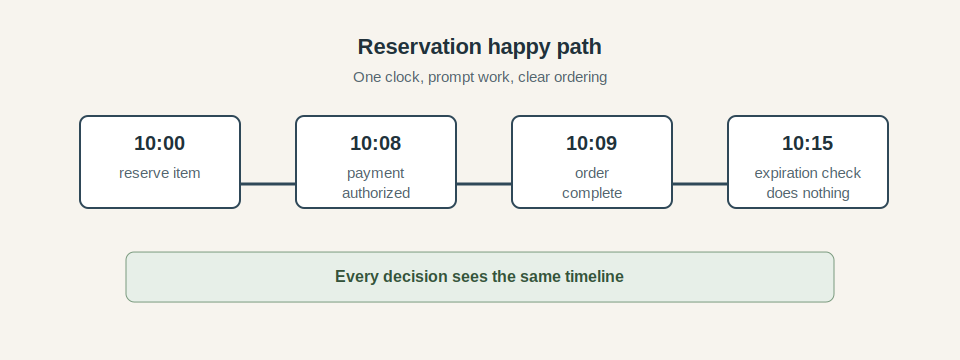

At this level, time behaves like a shared fact. The checkout flow records that the reservation expires at `10:15`. The payment completes at `10:08`. The order is marked complete at `10:09`. When the expiration job runs later, it sees that the reservation already became an order and leaves it alone. There is no disagreement about which event happened first, no gap between machine time and user time, and no delayed worker trying to make an old decision in a new context.

That model naturally leads to code that treats time as a simple comparison:

```text
if now() > reservation.expiresAt:
    release(reservation)
```

In isolation, this is perfectly reasonable. It says what the programmer means, and it is easy to test. Create a reservation, move the clock past the expiration time, and verify that the item is released. Most of the time, production will also be kind enough for this mental model to appear correct.

The hidden assumptions start to surface once the system grows beyond that clean timeline. The code assumes that `now()` means the same thing wherever the decision runs. It assumes the stored timestamp still has the meaning the writer intended. It assumes the expiration job runs after the events it is judging, and that sorting records by timestamp tells the same story as the business process. The happy path still has value, but it is quiet about how much agreement it needs from the clocks, schedulers, databases, and workers around it.

## Reality

The first crack in the model is that **time is not a single tool**. A program may use the same type, the same column, or the same word for several different questions: how long did this take, when did the user do this, which update should win, is this reservation still valid, what business day does this event belong to? Those questions look related because they all involve time, but they are not the same engineering problem.

The diagram below is the mental split the rest of the post will use:

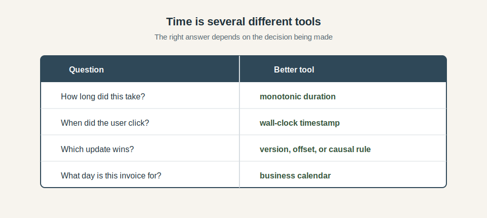

*Wall-clock time* is the time people usually mean when they look at a clock or calendar. It is useful for recording that a user clicked a button at a particular instant, showing timestamps in an audit log, or explaining to support when an order moved from one state to another. It is also the time most likely to carry human expectations, because users do not think in monotonic counters; they think in days, hours, time zones, and appointments.

*Monotonic time* answers a different question: how much time has elapsed? That is the clock you want for measuring latency, enforcing a timeout, spacing out retries, or deciding whether a request has spent its useful waiting budget. A monotonic clock does not need to tell you that it is `10:08`; it needs to keep moving forward so the system can measure duration without being confused by wall-clock corrections.

*Logical time* is about ordering rather than clocks. If two updates race, the important question may be which version of the record each update saw, which event came next in a stream, or which state transition the business process allows. A timestamp can be helpful evidence, but it is a weak substitute for a version number, sequence, transaction, or explicit state rule when correctness depends on order.

*Business time* is the meaning attached to a domain. A billing period, a delivery cutoff, a reservation window, a store's opening hours, and "yesterday's report" all depend on rules that a raw timestamp does not contain. Some of those rules depend on a user's time zone. Some depend on a warehouse, bank, exchange, or legal jurisdiction. Some change over time. Treating them as plain instants strips away the information the product actually needs.

The reservation example already touches several of these at once. The fifteen-minute hold is a duration. The expiration timestamp is an instant. The race between payment completion and expiration is an ordering problem. The message shown to the user may be local calendar time. The system can store and compare all of those values, but it should not pretend they are interchangeable.

### Clocks drift and disagree

Clock disagreement between machines is usually called **clock skew**. Operating systems and infrastructure try to keep clocks close, but close is not the same as identical, and small differences are enough to matter when code uses timestamps to expire records, claim work, order events, or decide ownership.

The reservation flow shows the problem:

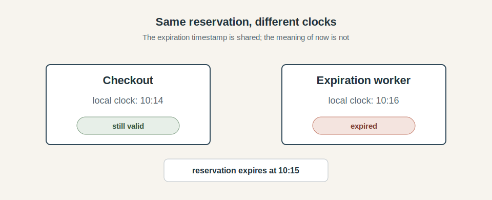

Checkout writes a reservation that expires at `10:15`. A minute before that deadline, the user is still paying. From the checkout machine's point of view, the reservation is valid. On another machine, an expiration worker has a clock that is two minutes ahead. It reads the same row, compares the same `expiresAt` value, and decides the reservation is old enough to release. Nothing in that story requires a broken database or a dramatic outage. The systems simply disagree about `now()`.

Clock synchronization reduces this disagreement, and in many systems it keeps the error small enough that nobody notices. It should still be treated as an operational dependency rather than a correctness proof. Machines can drift between syncs. Hosts can be misconfigured. Virtual machines and containers inherit time behavior from the layers beneath them. During an incident, the difference between "a little wrong" and "wrong in the direction that releases inventory early" is the difference the user experiences.

The safest designs avoid making important business transitions depend only on one worker's local wall clock. The expiration worker can use the timestamp as a candidate filter, but the state transition still needs a rule: expire this reservation only if it is still reserved, no payment has completed, and the system is willing to make that decision *now*. If the decision is close to a boundary, the design may include a grace window, a pending state, or reconciliation rather than pretending the timestamp comparison settled everything.

This is where time starts to resemble the network boundary from the [previous post](/posts/2026-07-01-Beyond-Happy-Path-Engineering-the-Network/). A timeout was a budget for useful waiting, not a magic statement about whether remote work happened. An expiration timestamp is similar: it is useful evidence for a decision, but the system still needs to decide what state can change, who is allowed to change it, and how to recover if another part of the system saw the world differently.

### Measuring elapsed time

Time also appears in a more ordinary place: measuring how long work took. A request handler wants to know how long payment authorization took. A client wants to know whether there is still time left in its deadline. A retry loop wants to wait a little before trying again. Those are duration questions, and those are easy to get wrong when they are answered with wall-clock timestamps.

The tempting implementation is to record the current wall-clock time before the work starts, record it again after the work finishes, and subtract the two. That feels natural because the timestamps look precise. The problem is that the clock being subtracted is allowed to change while the work is running.

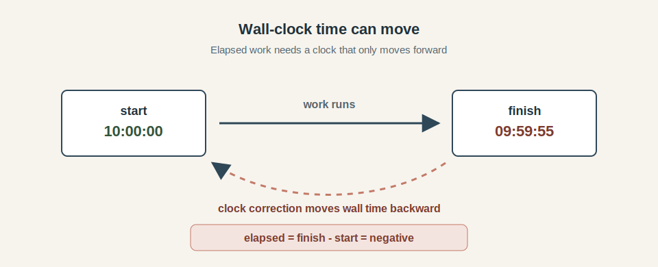

Imagine a worker records a start time of `10:00:00`, does some work, and then records a finish time of `09:59:55` because the system clock was corrected backward during the operation. A simple subtraction now says the operation took negative five seconds. If the correction went the other way, a quick operation might look as if it took minutes. The measurement used a clock that was built to answer a different question - **elapsed-time measurement belongs on a monotonic clock**. Latency metrics, timeout budgets, retry delays, backoff calculations, lock lease durations, and request deadlines all care about duration. They need a clock that moves forward consistently while the process measures work.

This distinction also keeps production data easier to trust. If a dashboard says payment authorization took negative time, the team now has two problems: the original behavior and the measurement that made the behavior harder to understand. If a timeout fires because the wall clock jumped forward, the system may create a false failure and then react to that failure with retries, cancellation, or user-visible errors. Choosing the right clock is a small implementation detail that protects much larger decisions.

### Timestamps do not prove order

The next trap is using timestamps to decide which event came first. That works when every event is written by the same process, using the same clock, on a quiet timeline. It becomes much weaker once events come from different machines, queues, browsers, jobs, and services. A timestamp says when one clock believed an event was recorded, it does not automatically say what caused what, or which update should win.

The reservation flow can fail this way too:

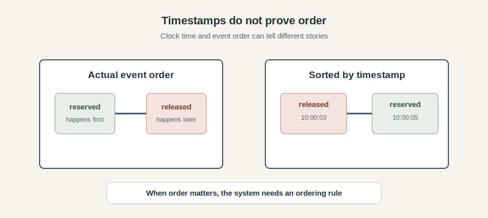

Imagine checkout records that an item was reserved. A separate worker later records that the same reservation was released. Because the worker's clock is behind, the release receives an earlier timestamp than the reservation. If an audit view, reconciliation job, or conflict resolver simply sorts those records by timestamp, it tells the story backward: released, then reserved.

That reversed story matters when another part of the system treats the log as something it can replay into state. If it applies `released` and then `reserved`, the final record may say the item is still held even though the real sequence released it. The replay needs something stronger than timestamp sorting: a database transaction, a version number, an event stream offset, a compare-and-swap update, or a domain state machine that says which transitions are allowed.

This is especially important near business boundaries like payment authorization arriving after cancellation, inventory release racing with order completion, or an old browser tab submitting a stale form. Choosing whichever event has the later clock reading gives the timestamp too much power - the real question is **what transition is allowed from the current state**. Time can help explain when events were observed, but the state owner should decide what those events mean.

### Expiration is a state transition

The reservation expires after fifteen minutes, but the timestamp does not perform the expiration. Some piece of code still has to read the reservation, decide what it is allowed to do, and write a new state. That distinction matters because expiration often races with the rest of the workflow. Payment may complete near the boundary. The expiration worker may run late. A retry may arrive after the user has already seen a timeout. The timestamp tells the system when the reservation became a candidate for expiration; it does not describe the whole business situation.

The state model is the more useful picture:

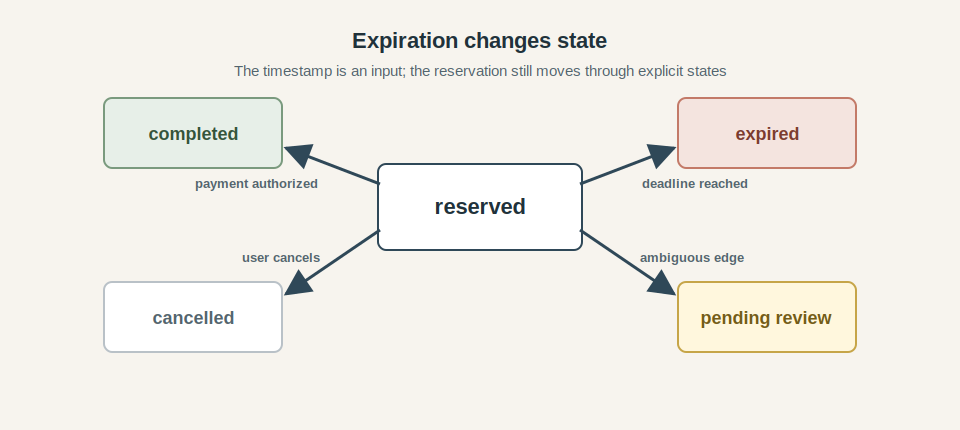

From `reserved`, payment authorization can move the reservation to `completed`. A user cancellation can move it to `cancelled`. A deadline can move it to `expired`. Some edge cases may need a `pending review` state if the system cannot safely decide whether payment, cancellation, or expiration won the race. The important part is that each change starts from the current state instead of an isolated timestamp check somewhere else in the codebase.

The expiration worker should therefore behave like a participant in the state machine. It can scan for reservations whose expiration time has passed, but the write should still be conditional:

```text
update reservations
set state = "expired"
where id = reservationID
  and state = "reserved"
  and paymentAuthorizationID is null
```

That conditional write makes a late or duplicated worker much less dangerous. Once payment, cancellation, or another worker has already moved the reservation forward, the expiration update no longer matches the record. The worker may still run at an awkward time, but it can only make the narrow change the current state allows.

The user-facing behavior becomes easier to explain once expiration has that shape. The system can preserve completed orders, send expired reservations back through checkout, and route ambiguous boundary cases into reconciliation instead of inheriting whichever answer a cleanup job happened to write first. Expiration becomes a visible state change with business meaning, owned by the same model as completion and cancellation.

### Scheduled work is still work

Once expiration becomes a state transition, the next question is how that transition gets triggered. A common answer is a scheduled job: every minute, find reservations whose expiration time has passed and try to expire them. That design can be perfectly reasonable, but the schedule is only the plan for starting work. It does not prove that the work started on time, finished on time, ran exactly once, or handled the same amount of load every time.

The difference becomes obvious after a pause:

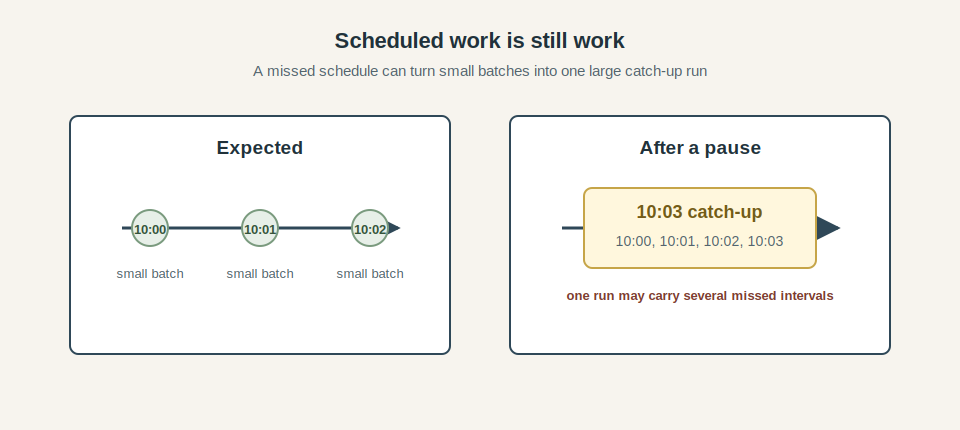

Under normal conditions, the expiration worker might process a small batch at `10:00`, another at `10:01`, and another at `10:02`. If the worker is paused for a few minutes during a deploy, a failover, or a resource shortage, the next run may discover all of that delayed work at once. From the scheduler's point of view, it is catching up. From the rest of the system's point of view, it may be a sudden burst of database updates, inventory releases, notifications, reconciliation work, and user-visible state changes.

This is why scheduled jobs need the same engineering attention as request handlers. A retried job should be able to repeat a write safely. A multi-worker job should have a clear owner for each batch. Catch-up work should move through the system at a rate the database and downstream services can absorb. Long runs should record progress durably, so a restart resumes from a known point instead of starting the whole sweep again.

For reservation expiration, that might mean processing records in bounded batches, claiming a batch before updating it, and recording progress after each chunk. The job can still be simple, but it should have a shape the system can survive: claim a little work, attempt guarded state transitions, commit progress, and continue. Late runs catch up gradually, duplicated runs are constrained by the same state checks, and a growing backlog becomes an operational signal instead of a surprise users discover first.

The schedule tells the system when to look. The workflow decides what happens to the work it finds.

### User time has product meaning

So far, the examples have mostly used time inside the system: deadlines, durations, timestamps, state transitions, and scheduled jobs. User-facing time adds another layer. A customer does not usually care that an order was created at `2026-03-29T00:30:00Z`; they care whether it was placed before the delivery cutoff, whether a reservation lasts until the time shown on the screen, whether a subscription renews on the expected local day, or whether a report includes the business day they asked for.

That difference is easy to miss because a UTC timestamp looks so precise:

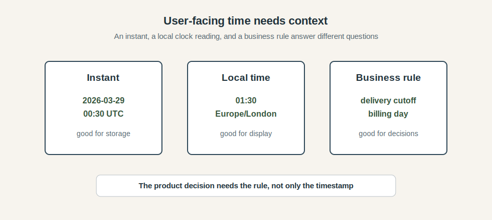

An instant is excellent for storing when something happened. It gives the system a stable point on the timeline. Displaying that instant to a user requires a time zone. Making a product decision often requires more than display: the system needs to know which calendar, cutoff, billing period, store location, or legal rule owns the decision. "End of day" means very little until the system knows whose day.

The reservation flow can carry this distinction too. A fifteen-minute hold is a duration. Showing "reserved until 14:30" is a local-time presentation. Deciding whether the order qualifies for same-day delivery may depend on a warehouse cutoff in a different time zone from the user. These values can be related, but collapsing them into one timestamp loses the reason each value exists.

Daylight saving time is where this becomes visible to users. Some local times never happen, others happen twice. A meeting scheduled for a future local time needs the intended time zone, not only the offset that happened to apply when the user created it. An offset like `+01:00` describes one moment. A zone like `Europe/London` carries the rule set the system needs when the future arrives.

The practical habit is to **store the context with the time**. Store instants for events that already happened. Store local date, local time, and time zone when a future human appointment must keep its local meaning. Store billing periods, delivery windows, and reporting days as domain concepts instead of pretending they are only timestamps. UTC is a good way to represent instants. Product time also needs the rule that gives the instant meaning.

If you write JavaScript, the built-in `Date` API makes most of these distinctions harder to maintain than they should be. [Your JS Date Is Lying to You](/posts/2026-07-21-Your-JS-Date-Is-Lying-to-You/) covers the specific API-level traps: parsing ambiguity, mutation, local-vs-UTC method confusion, and where `Temporal` replaces them with explicit types.

### Time bugs spread quietly

Time failures are often harder to recognize than outright crashes. A service may stay up, requests may keep flowing, and dashboards may show ordinary success rates while the system is making slightly wrong decisions. The bug is rarely announced as "the clock assumption is wrong." It arrives as a support ticket, a confusing state transition, a report that looks off by one day, or a cleanup job that seems to have touched the wrong records.

The shape often looks like this:

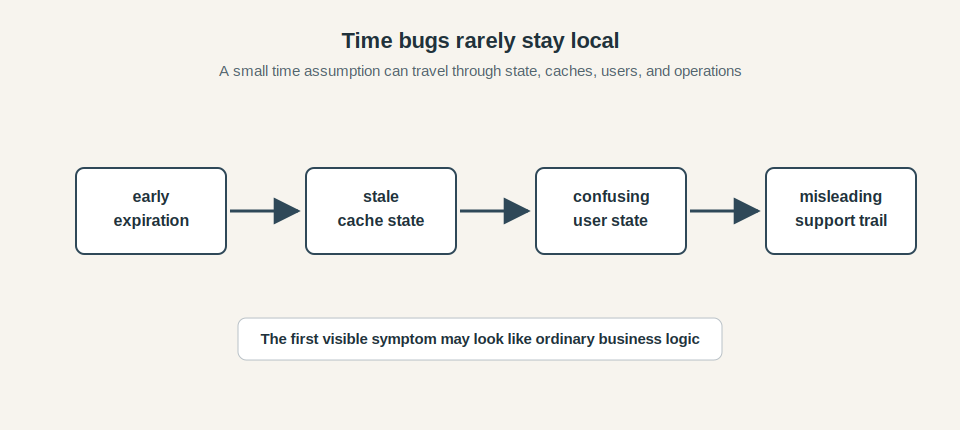

A reader shared a clean example of this pattern on [Reddit](https://www.reddit.com/r/webdev/comments/1v1iz4z/comment/oyu4tuw/):

> Every profile in a leaderboard I built gets cached for 12 hours and recomputes on the next request past that window. Fine, until I retuned one of the scoring weights. Rows that happened to refresh in the next few hours picked up the new weights, rows that had not yet hit their TTL kept showing scores computed under the old formula.
>
> For about half a day the leaderboard was quietly comparing two different scoring systems, and nothing in the logs said so, because every individual read looked correct in isolation.

The bug came from a config change, and was not observable until someone noticed the rankings made no sense. Every cached entry was fresh within its own window, every recomputed entry was correct under the new weights. The inconsistency only existed between them.

The hard part is that every symptom has a plausible local explanation. A stale cache can look like a cache invalidation bug. An early expiration can look like checkout logic. A report boundary can look like a query problem. Those explanations may even be partly true, which is what makes the investigation slippery. The time assumption sits underneath the visible behavior, shaping several parts of the system without looking like a single failing component.

Logs can make the investigation harder when they inherit the same time problem. Sorting events by timestamp may hide the causal order. Ingested logs may arrive late and appear to describe the past after the team has already moved on. Metrics based on event time and metrics based on processing time may disagree without saying why. The system is still producing evidence, but the evidence needs the same context as the application data: which clock produced it, when it was observed, and what ordering rule it belongs to.

The practical lesson is to treat time-sensitive decisions as things worth observing directly. Count expirations, late jobs, stale writes, clock skew, queue age, event age, and reconciliation cases. Surface the boundary conditions rather than only the final state. If reservations are frequently expiring within a few seconds of payment completion, that is useful information even when every individual transition was technically allowed. Time bugs become much less mysterious once the system can show where its time assumptions are under pressure. If you want practical ways to inject these failure conditions before production, [Small-Scale Chaos Testing: The Missing Step Before Production](/posts/2025-10-01-Small-Scale-Chaos-Testing-The-Missing-Step-Before-Production/) is a good companion.

## Engineering beyond the happy path

We have seen how easily time slips into a source of ambiguity. The practical response is to make each time-sensitive decision explicit: what question is being answered, what kind of time can answer it, and what the system should do when the answer arrives late or remains uncertain.

### Choose the clock for the question

Start by naming the decision the code is making. A timestamp may be the right tool, but it should not be the default answer before the system knows whether it is measuring duration, recording an instant, ordering events, expiring state, scheduling work, or applying a human calendar rule.

For the reservation flow, those questions are all present at once. The fifteen-minute hold is a duration. The `createdAt` field is an instant. The transition from `reserved` to `completed` or `expired` is a state question. The message shown to the user is a local-time presentation. The delivery cutoff may belong to a warehouse calendar. Treating those as separate concerns does not make the design elaborate; it keeps one convenient timestamp from becoming responsible for five different jobs.

A time-sensitive path should make those choices deliberately. Elapsed work belongs to monotonic time. Recorded events need instants. Competing updates need versions, transactions, event offsets, or state transitions. Product rules need the time zone, calendar, cutoff, or period that gives the timestamp meaning. Scheduled work needs a workflow that can tolerate lateness and duplication.

The checkout example becomes much calmer when those choices are explicit. The request deadline is measured against a monotonic budget. The reservation stores an expiration instant, but expiration itself is a guarded state transition. The confirmation screen formats time in the user's zone. The delivery promise uses the warehouse cutoff. The expiration worker records job lag and batch progress. Each part still uses time, but each part uses time for one job at a time.

This is the same kind of discipline as treating a network call as a boundary. A timestamp in a database column may look like a small implementation detail, but it often carries a promise about what the system believes, what the user sees, or what a later worker is allowed to do. Choosing the right clock for the question makes that promise visible.

### Use monotonic time for durations and deadlines

The [Network post](/posts/2026-07-01-Beyond-Happy-Path-Engineering-the-Network/) discusses timeout budgets in detail: how long the caller should wait, how that budget moves through the request path, and what happens when the caller gives up. Here, the important point is narrower: **once the system has a duration budget, measure it with monotonic time**. A deadline can still expire, a dependency can still be slow, and a side effect can still finish after the caller gives up. Monotonic time keeps the measurement stable while the rest of the system decides how to handle those outcomes.

The same principle applies to retry spacing, backoff delays, lock leases, latency metrics, and job runtimes: those values describe elapsed work or remaining budget. Wall-clock timestamps can still be recorded for audit and debugging, but the operational decision should use a duration source that moves forward consistently while the work is being measured.

### Store instants carefully, display dates deliberately

When the system stores a time value, the field should make its meaning clear. A column named `time` or `date` rarely says enough by itself. The durable shape should show whether the value is an instant on the timeline, a local time chosen by a person, or a period defined by the business.

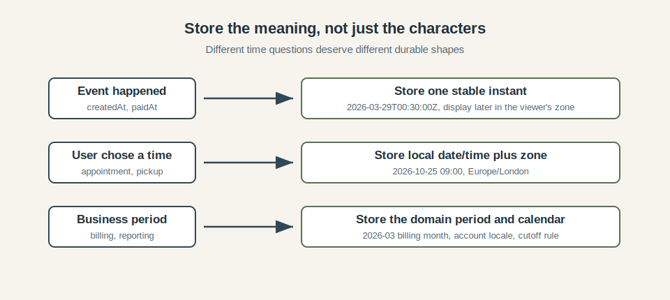

For events that already happened, store an instant in a stable representation. Fields such as `createdAt`, `paidAt`, and `cancelledAt` usually answer one question: when did this event happen on the shared timeline? UTC works well for that job. The same stored instant can later be displayed in the user's zone, an operator's zone, or the zone used by a support tool without changing the underlying fact.

Future human commitments have a different shape. If a user schedules a pickup for 9 AM in London next month, the local intention matters. The record should keep the local date, the local time, and the time zone or calendar rule needed to interpret them. Storing only a formatted string makes the value hard to validate, compare, reschedule, or explain. Converting too early to one instant can also hide the user's intended local time, which is often the thing the product actually promised.

Business periods deserve domain names as well. A billing month, delivery window, trading day, or reporting period is a product concept with rules attached to it. Store the period and the rule that owns it: the account locale, warehouse calendar, regional cutoff, or reporting calendar. A timestamp may still be recorded beside it. The rule belongs in the model, where later code can read it directly.

A useful test is to ask what the value would mean in a support conversation. "The payment was captured at this instant" is a different claim from "the customer chose 9 AM in London" or "this invoice belongs to the March billing period." When the schema preserves that difference, display formatting becomes a presentation concern, and later business decisions do not depend on guessing what an old timestamp was supposed to mean.

### Let the state owner decide competing writes

A write that changes business state needs protection beyond an audit timestamp. If two pieces of work race, it's safer to ask whether the current state still allows the attempted transition. The code that owns the record should answer that question at the moment it writes.

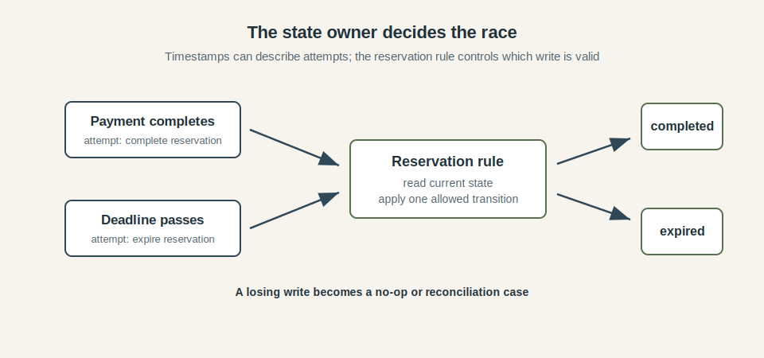

In the reservation example this is a potential race condition. Payment completion may try to move the reservation to `completed` near the same time an expiration worker tries to move it to `expired`. During the race, the record needs a rule that protects its current state. The reservation can only move from `reserved` to one of those terminal states, and the write should express that rule directly.

```text
update reservations
set state = "expired"
where id = reservationID
  and state = "reserved"
  and paymentAuthorizationID is null
```

The same pattern applies to payment completion:

```text
update reservations
set state = "completed",
    paymentAuthorizationID = authorizationID
where id = reservationID
  and state = "reserved"
```

Only one of those updates should match the row. The other attempt sees that the reservation has already moved and becomes a no-op, a retry with fresh state, or a reconciliation case if the business needs one. The timestamp still belongs in the audit trail, where it can help operators explain what happened. The state rule carries the authority for the write.

Different systems enforce this rule in different ways. A database transaction may lock and update the row. An optimistic write may check a version number. An event stream may rely on offsets. A compare-and-swap operation may check the value it last read. The mechanism can vary, but the ownership should be clear: ordering is enforced by the system that owns the state, using the current state of the record.

### Make expiration safe to retry and possible to repair

An expiration worker usually runs after the timestamp it is checking. By then, another worker may have tried the same update, payment may have completed, or checkout may still be finishing. The expiration path should be written for that uncertainty, because the timestamp only says when the item became eligible for a decision.

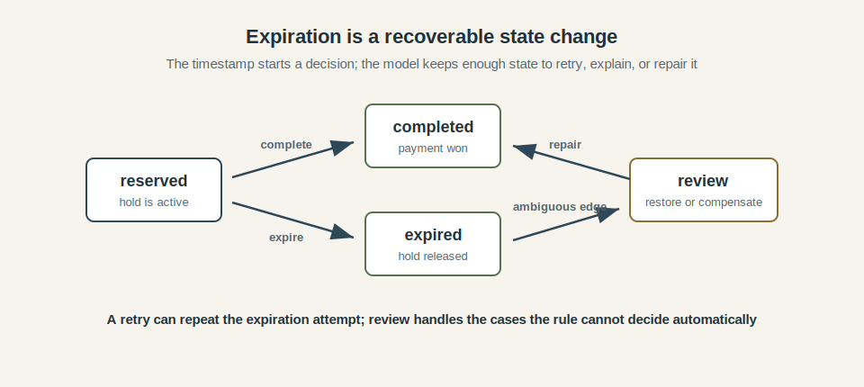

For a reservation, the first rule is idempotence: repeating an expiration attempt must be harmless. If the reservation is still `reserved`, mark it `expired` and release the hold. If it is already `expired`, finish cleanly. If payment completed first, leave the reservation `completed`.

That shape usually argues for marking state before deleting data. An expired reservation can preserve the original hold, the expiration time, the worker that changed it, and any payment or checkout activity near the boundary. Support, reconciliation, analytics, and repair jobs all need that evidence after the cleanup path has run.

Some boundary cases need an explicit place to land. A payment callback may arrive seconds after expiration. A user may finish checkout with a page that still showed an active hold. During a payment-provider delay, the expiration worker may make a technically valid decision that still deserves a second look. The common cases can remain expired. The ambiguous ones should move into a review or reconciliation path with enough context for the system to resolve them deliberately.

The same idea applies outside reservations: session expiry can invalidate future use while keeping audit history, offer expiry may include a short grace rule for checkout in progress, and temporary access grants can move to revoked before cleanup deletes old records. Expiration is more robust when it records what changed, preserves enough context to explain it, and leaves a controlled repair path for edge cases.

### Design scheduled jobs as workflows

A schedule tells the system when to start looking for work. The reliable part of the design is the workflow that follows: how work is claimed, how much is processed at once, how progress is recorded, and how recovery behaves when a run is late or repeated.

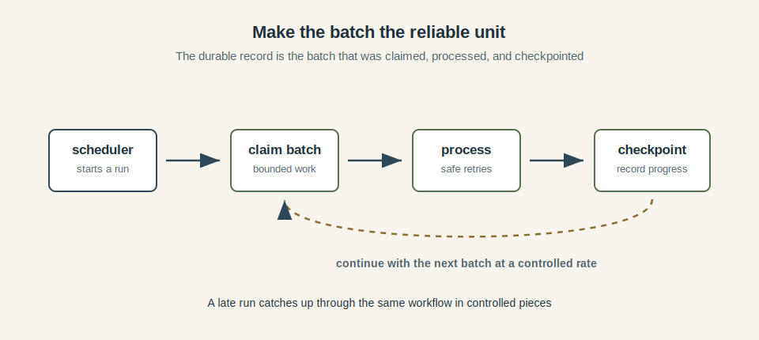

For expiration, process reservations in bounded claimed batches through the same guarded state transitions described above. The batch becomes a unit of ownership and progress, and it keeps retries, lag tracking, and catch-up controlled after a pause. If the worker was down for ten minutes, recovery should still move through those bounded claims so each chunk can be processed, checkpointed, and released without flooding the rest of the system. For a deeper treatment of why unchecked queues and producer/consumer imbalance become system pressure, see [Backpressure in JavaScript: The Hidden Force Behind Streams, Fetch, and Async Code](/posts/2026-01-06-Backpressure-in-JavaScript-the-Hidden-Force-Behind-Streams-Fetch-and-Async-Code/).

Ownership also needs to be explicit when more than one worker can run. A claimed batch should have an owner, a lease or timeout, and a way for another worker to pick it up if the owner disappears.

Operationally, a scheduled job should be observable like any other workflow. The system should expose how many items are eligible, how many are claimed, how old the oldest item is, how many updates succeeded, how many were skipped by state checks, and how long catch-up is taking. "Cron ran at 10:00" is a weak comfort. "This batch was claimed, processed, and checkpointed" is the fact the system can build on.

### Treat time zones as domain data

Time-zone handling starts with ownership. Before the code converts or formats a value, it should know which rule owns the decision: the user's chosen zone, the warehouse calendar, the account locale, the store location, the reporting region, or some other domain rule.

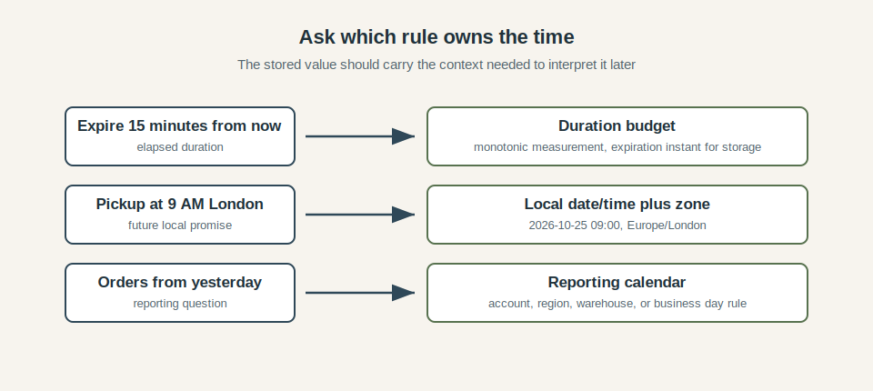

A short reservation hold is mostly a duration question. The system can measure fifteen minutes with monotonic time and store the resulting expiration instant for later checks. A future pickup time has a different owner. If the user chose 9 AM in London, the record should keep that local date, local time, and `Europe/London`, because the user's promise is tied to the local clock reading.

Date-only values need the same care. "Orders from yesterday" sounds simple until the system has to decide whose yesterday counts. Support reports, merchant dashboards, warehouse cutoffs, and regional compliance reports may all attach the date to different calendars. The correct zone is part of the product rule, so it belongs near the data and the query that use it.

Offsets are too small for this job. `+01:00` describes the offset that applied at one moment; `Europe/London` names a rule set that can answer future questions. Those rules can include daylight saving transitions, historical changes, and local exceptions maintained by the time-zone database. Application code should rely on that maintained data instead of carrying hand-written offset tables or assuming a fixed number of hours from UTC.

The awkward cases deserve tests. Some local times are skipped when clocks move forward, and some happen twice when clocks move back. A scheduling flow should define what happens if a user chooses a missing local time, and it should preserve enough information to distinguish the two occurrences of a repeated local time when that distinction matters. These cases are rare in daily traffic and common enough in production to deserve explicit behavior.

### Observe time assumptions

Time-sensitive workflows need signals around the assumptions they depend on. A checkout path can have ordinary request success rates while expiration is running late, clocks are drifting apart, or a growing number of writes are being rejected because the state already moved. Those conditions should be visible before they become support tickets.

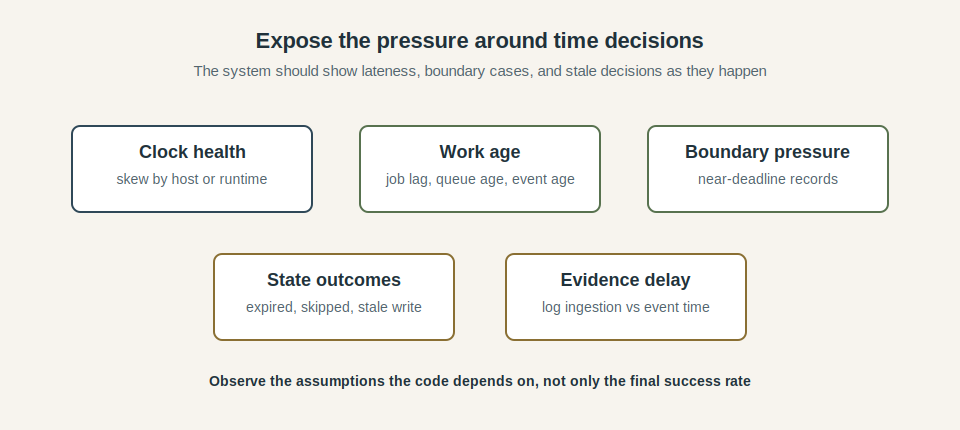

Delay is the first signal to make visible. Job lag, queue age, event age, and processing duration show whether the system is acting on fresh information or catching up from behind. For expiration work, the age of the oldest eligible reservation is often more useful than a simple count of successful updates. A small backlog of very old work tells a different story from a large backlog that is draining steadily.

Boundary decisions deserve their own counters. Count reservations that expire near payment completion, state transitions rejected because the record already moved, stale writes avoided by version checks, and cases routed to review. These are the places where the system is relying on the rules from the previous sections. If they start rising, the design is telling you where the pressure is.

Clock and evidence quality need their own signals. Where the platform exposes it, track clock skew by host, runtime, or region. Compare event timestamps with ingestion time so delayed logs and late events are easier to recognize during an incident. A dashboard sorted by event time can be misleading when the evidence itself arrives late; observing the delay makes that limitation explicit.

The useful signals are the ones that expose the time assumptions behind the workflow: whether the system is late, deciding near a boundary, seeing stale writes, or reconstructing events from delayed evidence. Once those signals exist, time bugs stop looking like scattered oddities and start looking like pressure on specific parts of the design.

### Reconcile when time cannot decide

Some outcomes remain ambiguous even when the clocks, state checks, and job workflow are designed carefully. The system may see a payment callback after a local expiration, a partial subscription renewal after a failed batch, or an event stream whose processing order does not match the recorded timestamps. Those cases need a repair path that compares current facts and chooses a controlled outcome.

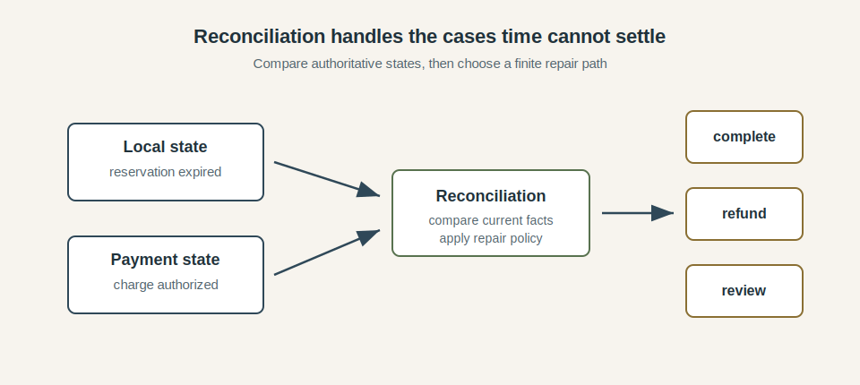

For the reservation flow, reconciliation might compare the local reservation state with the payment provider's authoritative state. If the reservation is `expired` and the provider says the charge was authorized, the timestamp alone cannot say what the customer should experience. The repair policy may complete the order if inventory is still available, refund the authorization if the hold was released, or send the case to review if the facts are incomplete.

The important part is that ambiguous cases stay visible and finite. Reconciliation should have a queue, an owner, retry behavior, and metrics. It should record which facts it compared and which repair action it took. A case that cannot be repaired automatically should move to a known manual or compensating path instead of disappearing into logs.

This pattern appears in many time-sensitive systems. Renewal jobs compare local billing records with payment-provider state. Inventory repair compares reservations with warehouse movements. Event processors rebuild projections from the source stream when local state looks suspect. Time still helps explain what happened; the repair decision comes from the authoritative facts the system compares. For a concrete pattern that unifies cached results and in-flight work ownership, see [One Cache to Rule Them All: Handling Responses and In-Flight Requests with Durable Objects](/posts/2026-03-29-One-Cache-to-Rule-Them-All-Handling-Responses-and-In-Flight-Requests-with-Durable-Objects/).

Reconciliation gives the design a way to recover when the world was observed in the wrong order, too late, or from two places that briefly disagreed. It turns uncertainty into explicit work: gather the authoritative facts, apply the repair rule, record the outcome, and keep the number of unresolved cases small enough to understand.

### Pulling the pieces together

The original reservation flow looked small because time was doing several jobs invisibly: the code stored an expiration timestamp, compared it with `now()`, and released inventory when the comparison said the hold was over. On the happy path, that is enough. In production, it leaves too many decisions inside one timestamp check.

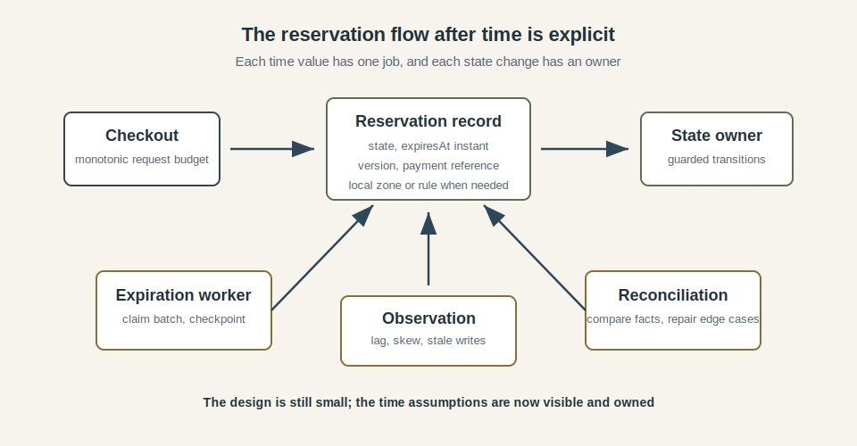

The time-aware version is still a small system. The checkout uses a monotonic budget for request work; the reservation record stores state, an expiration instant, a version, and any local-time context the product needs. Completion and expiration move through guarded state transitions. The expiration worker claims bounded batches and records progress. Observation shows lag, stale writes, boundary cases, and clock health. Reconciliation handles the cases where local state and external facts disagree.

The design gives each use of time a narrower job. A duration measures useful waiting. An instant records when something happened or when a record becomes eligible for expiration. A state transition decides what is allowed to change. A time zone or business calendar gives user-facing dates their meaning. A scheduled job turns elapsed time into repeatable work. Reconciliation repairs the cases that clocks and local state cannot settle cleanly.

The practical difference is ownership. The request path owns its deadline, the reservation model owns its state transitions, the worker owns batches and progress. The product rule owns the calendar, the observability layer owns the signals that show when the assumptions are under pressure. Once those responsibilities are visible, a time bug has somewhere to be investigated and somewhere to be fixed.

### Patterns for sharper edges

Clear clock choice, guarded state transitions, retryable jobs, domain time zones, observation, and reconciliation cover a surprising amount of production reality. The sharper tools belong in systems built around distributed coordination, event-time processing, large fan-out workflows, or strict ordering rules.

*Logical clocks* help when the important question is ordering: which event follows which, which update was based on which version, or which replica observed another replica's work. They require discipline across the whole workflow, because one component treating the logical clock casually can weaken the ordering guarantee for everyone else.

*Hybrid logical clocks* appear in systems that need both a physical-time signal and a logical ordering signal. They fit databases, replicated systems, and coordination layers where many nodes need a shared way to talk about order. Ordinary application code usually gets more value from explicit versions, transactions, stream offsets, and state transitions.

*Leases* can give a worker temporary ownership of a batch, partition, or leadership role. The design has to account for clock skew, renewal timing, slow pauses, and what happens when the old owner keeps working after another owner has taken over. A lease is a time-based claim, so it should be paired with guarded writes and clear recovery behavior.

Streaming systems often add *watermarks* and *time-windowed deduplication*. A watermark tells the system how complete it believes an event-time window is. A deduplication window gives receivers a bounded memory of recent event identities. Both patterns encode trade-offs: late events may wait, be corrected later, or be dropped depending on the policy.

These tools should enter the design with a specific failure in mind. If the problem is ordinary expiration, a guarded state transition and a retryable worker are usually simpler. If the problem is event-time completeness, replica ordering, or lease-based ownership across many workers, the sharper pattern may be worth the extra rules. The question is the same as before: what decision is time helping us make, and what can go wrong if that signal is late, duplicated, or interpreted differently by another part of the system?

## Production example: a clock moved backward

On January 1, 2017, Cloudflare published a [write-up of a leap-second-related DNS incident](https://blog.cloudflare.com/how-and-why-the-leap-second-affected-cloudflare-dns/). The failure began with a small assumption in resolver-performance measurement: the code recorded a start time, later called `time.Now()`, and subtracted the two. Around the leap second, that subtraction produced a negative duration.

The immediate business logic was ordinary: Cloudflare's DNS system measured how quickly internal resolvers answered CNAME lookups, smoothed those measurements, and used them to choose a resolver. The bug was in the kind of time used for the measurement: the code was measuring elapsed duration with a wall-clock source that could move backward. Once a negative value entered the resolver-selection data, later code received an input it was never supposed to see and panicked.

The incident is a clean example of why clock choice matters. A timestamp can only tell a system when something was observed - a duration measurement needs a source that behaves like elapsed time. When those two jobs share the same wall-clock call, the code can look reasonable until the machine's wall clock is corrected underneath it.

It also shows how a time bug spreads: the negative measurement moved through smoothing, then into weighted resolver selection, then into a panic path. By the time customers saw errors, the original mistake no longer looked like "time moved backward." It looked like DNS resolution failing in some places for some requests.

The fix in Cloudflare's write-up prevented negative measurements from being recorded and allowed resolver performance data to normalize again. The incident is small and focused enough to understand but large enough to matter: one wrong clock choice turned an internal measurement into bad operational state.

## Conclusion

Time looks simple when it stays in the background. A request starts, a timestamp is written, a reservation expires, a job runs, a report asks for yesterday. The trouble begins when one time value is asked to answer all of those questions at once.

Production systems need a more careful model. Durations need clocks that measure elapsed work. Events need stable instants. State changes need owners and guarded transitions. User-facing dates need zones, calendars, and business rules. Scheduled work needs workflow state, retry behavior, and observation. Ambiguous outcomes need reconciliation.

That is the shape of engineering beyond the happy path for time. The design chooses what kind of time a decision depends on, what authority that time value has, and what happens when the answer is late, repeated, corrected, or incomplete. Once those choices are explicit, time stops being a hidden assumption and becomes part of the system's behavior.
