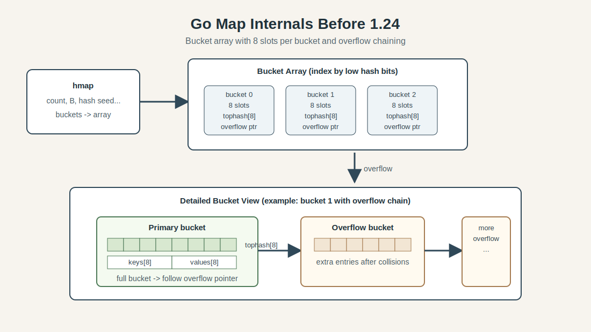
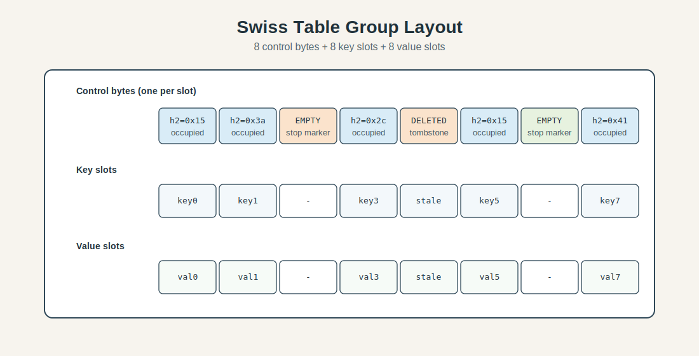
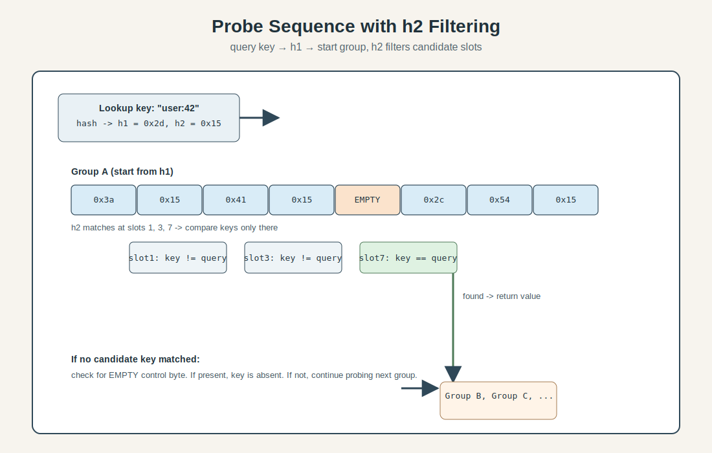

## Introduction

Maps sit on the hot path of almost every non-trivial Go program: they power request routing, cache lookups, deduplication sets, aggregation pipelines, and a lot of the glue code we barely notice until it gets slow. Because they are so common, even small runtime-level improvements in map behavior can produce measurable gains across real systems.

Go 1.24 shipped one of the biggest map-internals changes in years: the classic bucket-plus-overflow implementation has been replaced by a Swiss Table-inspired design. The external API did not change, your code still writes `map[K]V` and calls `make`, indexing, `delete`, and `range` the same way as before. Under the hood, however, lookup and insert paths were reshaped around tighter metadata, flatter probing patterns, and much better cache locality.

The practical effect is straightforward: less pointer chasing, fewer cache misses, higher useful load factors, and faster common operations in many workloads. In microbenchmarks this can be dramatic, while full applications usually see smaller but still meaningful aggregate wins. Memory behavior also improves in many scenarios, especially where old overflow chains used to accumulate.

This post focuses on what changed specifically in Go's runtime design, why those choices matter, and where the trade-offs still show up. If you want a conceptual refresher on hash tables first, see [Hash Map Deep Dive](/posts/2025-08-03-Hash-Map-Deep-Dive/).

## Go's Old Map Implementation (Pre-1.24)

Before Go 1.24, maps used a bucketed design that had been refined for years and worked well for a wide range of workloads. Each map owned an array of buckets. Each bucket held up to 8 key/value pairs, plus metadata used to speed up matching and track slot state. When a bucket filled up, the runtime allocated an overflow bucket and chained it to the original one.

At a high level, the layout looked like this:



The key idea was simple and practical. Hash the key, use part of the hash to pick the bucket, then scan that bucket's entries. If no matching key was found and an overflow bucket existed, keep walking the chain until the key was found or the chain ended.

In simplified form, the core structures were roughly:

```go
// Conceptual shape, not the exact runtime source.
type hmap struct {   // map header
	count      int
	B          uint8   // number of buckets is 1<<B
	buckets    *bmap
	oldbuckets *bmap   // previous bucket array during growth
}

type bmap struct {   // bucket with 8 slots
	tophash  [8]uint8
	keys     [8]K
	values   [8]V
	overflow *bmap
}
```

This design had real strengths: it was stable, battle-tested, and supported incremental growth so resize work did not arrive as one huge latency spike. During growth, the map kept both old and new bucket arrays for a while, and operations gradually evacuated old buckets into their new positions as the map was accessed.

The main cost was memory locality under pressure. Overflow chains introduced pointer chasing, and pointer chasing means cache misses. Once hot buckets started spilling into overflow, lookups and inserts could bounce across non-contiguous memory. The implementation also had practical load-factor limits around 81 percent (roughly 6.5 filled slots per 8-slot bucket) before growth pressure and collision costs became harder to ignore.

So the old map was not a broken design waiting to be replaced, but an effective implementation with trade-offs that became more visible as modern CPUs, cache behavior, and high-throughput services pushed for tighter, flatter probe paths.

## Swiss Tables: Core Design

Historically, Swiss Tables came out of Google's internal performance work on hash tables and were later documented and open-sourced through [Abseil](https://abseil.io/) — Google's open-source C++ library collection — as `flat_hash_map` and related containers. The [design notes](https://abseil.io/about/design/swisstables) are still the best primary reference for the model and its trade-offs.

Swiss Tables keep the same high-level hash-table contract, but reorganize the data path around two ideas: **compact per-slot metadata** and **probe-friendly contiguous groups**. The design has since been adopted across several runtimes and databases because it moves the common-case probe work onto a much more cache-efficient path.

The first thing to understand is that Swiss Tables do not start probing by reading full keys. They start by reading metadata bytes that are cheap to scan in bulk. Only candidates survive to full key comparison. This sounds small, but it changes where CPU time goes.

### Hash split: one part for placement, one part for filtering

A key is hashed once, then split into two logical pieces:

- `h1`: used to choose the initial group index.
- `h2`: a short fingerprint stored in per-slot metadata.

You can think of `h2` as a fast pre-check. If a slot's fingerprint does not match, there is no reason to touch that slot's key bytes at all. Most probes end up rejecting many slots at this metadata stage, which is much cheaper than repeatedly loading and comparing full keys.

### Group-oriented layout

Instead of treating each slot as an isolated unit, Swiss Tables organize slots into fixed-size groups. In Go's design, that group size is 8 slots, which aligns with compact metadata handling and practical cache behavior.

Each group stores:

- a control word (one metadata byte per slot, packed together),
- 8 key slots,
- 8 value slots.

Conceptually:

```text
group i:
	ctrl: [c0 c1 c2 c3 c4 c5 c6 c7]
	keys: [k0 k1 k2 k3 k4 k5 k6 k7]
	vals: [v0 v1 v2 v3 v4 v5 v6 v7]
```

Control bytes encode slot state (empty, deleted, occupied) and, for occupied slots, include the `h2` fingerprint bits. Because those 8 control bytes are contiguous, the runtime can inspect all slot states for a group in one tight operation.



### Probe sequence: filter first, compare keys second

Lookup becomes a two-stage loop:

1. Read the current group's control bytes.
2. Find control-byte positions whose fingerprints match `h2`.
3. For those positions only, compare real keys.
4. If no match, advance to the next group in the probe sequence.
5. Stop when an empty slot proves the key is absent.

Simplified pseudocode:

```text
g = startGroup(h1)
for {
	matches = matchFingerprint(ctrl[g], h2)
	for each pos in matches {
		if keys[g][pos] == key {
			return vals[g][pos]
		}
	}

	if hasEmpty(ctrl[g]) {
		return not found
	}

	g = nextGroup(g)
}
```



The `hasEmpty(ctrl[g])` check is key. In open addressing, an empty slot means probing can terminate: if the key had ever been inserted along this sequence, the probe would have encountered it before the first truly empty slot.

### Insertion and the role of deleted slots

Insert follows the same probe path used by lookup, but it tracks the first reusable position it sees. Reusable can mean either:

- an empty slot, or
- a deleted slot (tombstone), depending on policy and probe progress.

When lookup fails to find the key, insert writes into the best reusable slot discovered so far. This preserves probe invariants while limiting uncontrolled cluster growth.

Deletion does not usually compact the cluster immediately. Instead, it marks metadata as deleted. Immediate compaction would make single deletes expensive and can break probe continuity guarantees. The trade-off is that too many tombstones can lengthen future probes, so implementations need cleanup behavior during growth or reorganization phases.

### Why this maps well to modern CPUs

Swiss Tables are often described as "SIMD-friendly," but the broader point is locality plus branch behavior:

- **Contiguous metadata scan:** a group's control bytes are read together, reducing scattered memory touches.
- **Fewer full key loads:** most slots fail at fingerprint stage, so key comparisons are sparse.
- **Predictable hot loop:** probe steps are simple and repetitive, helping branch prediction.
- **Better cache residency:** metadata and nearby slots are packed to favor cache lines.

Even without architecture-specific vector instructions, this shape tends to perform better than pointer-heavy traversals once maps reach realistic production sizes.

### Load factor and practical ceiling

The old bucket-overflow model had to balance overflow growth costs relatively early. Swiss-style open addressing tolerates denser occupancy before performance degrades sharply, because probe work remains mostly linear scans over compact metadata and nearby slots.

In practice, this pushes useful load factors upward into the high-80% range (often discussed around 87.5% for 8-slot group designs). The exact threshold is implementation-dependent, but the key result is consistent: denser tables are possible before lookups and inserts become too expensive.

Higher usable density means less memory overhead per stored entry and fewer growth events for the same number of elements — both effects that show up directly in heap profiles and allocation rates.

### The trade-offs do not disappear

Swiss Tables are not universally faster in every corner case. At high tombstone density or under specific delete-heavy patterns, probe lengths can regress until cleanup or growth restores table quality. Extremely adversarial hash distributions still hurt any open-addressing design, even with strong metadata filtering.

The improvement comes from moving the common case onto a much more cache-efficient path, not from eliminating all hard cases.

That is why the shift matters so much for Go: maps are used everywhere, and the common case is where most CPU cycles are spent.

## Go-Specific Adaptations

If this were only a straightforward port of Abseil-style Swiss Tables, the runtime work would have been simpler. Go maps, however, have constraints that come from language behavior, GC integration, and long-standing expectations around latency and iteration. The interesting part of Go 1.24 is not just adopting Swiss-style probing, but adapting it so those constraints still hold.

### Growth without long stop-the-world style spikes

Classic open-addressing tables are often resized by allocating a larger table and reinserting everything in one large migration step. That is fine in some systems, but Go maps are used on hot request paths where single-operation latency matters. A resize strategy that occasionally performs a full-table rehash can create exactly the kind of long tail the runtime tries to avoid.

Go's adaptation avoids that monolithic jump by spreading growth across smaller units. Instead of treating the map as one giant table that doubles and fully rehashes at once, the runtime can split work so expansion happens incrementally. Operationally, this keeps mutation costs more stable because a single insert is less likely to inherit the full cost of moving every existing element.

The practical effect is similar in spirit to the old map's gradual evacuation model: growth still happens, but migration work is amortized across normal operations rather than concentrated into one expensive event.

### Multiple independent tables and directory-style routing

One of the key Go-specific choices is to organize storage as multiple smaller Swiss-style tables rather than one ever-growing monolith. A higher-level directory (conceptually similar to extendible hashing) routes keys to a specific table segment, and only the segment under pressure needs to split.

Keeping growth local means hot key regions can expand without forcing a global rebuild, and bounding memory movement to the splitting segment improves latency predictability under write-heavy bursts.

At a conceptual level, insertion looks like this:

```text
hash key
use high bits to select table segment
probe within that segment's Swiss groups
if segment exceeds thresholds, split that segment and update directory
```

That directory update is much cheaper than rebuilding every segment, and it composes well with Go's preference for incremental runtime work.

### Preserving Go's range semantics while tables change

One of the hardest constraints is preserving Go's map iteration behavior while inserts, deletes, and growth are happening.

In Go, iterating with `range` over a map has deliberately loose ordering guarantees, but it still has safety and consistency expectations. The runtime cannot expose torn state, lose reachability to entries that should still be visible under the language rules, or let relocation mechanics violate iterator correctness.

With segmented Swiss-style storage, this means iterators must understand that entries may move as segments split or internal probe layouts change. The runtime therefore couples iteration state to map-internal versioning and traversal metadata so the iterator can continue safely even while structure evolves.

The implementation details are complex, but the user-visible result is simple: `for k, v := range m` keeps working while the runtime earns better cache locality and denser storage under the hood.

### GC and write-barrier friendliness

Go cannot treat table entries as purely mechanical bytes. Keys and values may contain pointers, and pointer movement interacts with garbage collection and write barriers. Any redesign of map internals must preserve accurate pointer visibility and barrier behavior during insert, delete, grow, and iterator transitions.

Segmented growth helps here too. Smaller relocation steps are easier to integrate with barriered writes and reduce the size of any single pointer-moving operation. This does not remove complexity, but it narrows blast radius and keeps runtime bookkeeping more tractable.

Swiss-style metadata probing delivers the raw algorithmic win, but Go-specific adaptations — segmented growth, iterator-safe migration, and GC-barrier integration — are what make that win usable at scale in a garbage-collected, latency-sensitive runtime. The performance numbers in the next section reflect both layers working together.

## Performance & Memory Analysis (Deeper Dive)

The easiest way to get misled by map benchmarks is to look only at a single synthetic test and assume that number transfers directly to production. For Swiss maps in Go, the public data tells a more nuanced story: the micro-level wins are real and often large, the application-level aggregate win is smaller but still positive, and a few workload shapes do regress enough to deserve attention.

The official release notes for Go 1.24 report that runtime work, including the new Swiss map implementation, lowered CPU overhead by about 2 to 3 percent on average across a representative benchmark suite ([Go 1.24 release notes, Runtime section](https://go.dev/doc/go1.24#runtime)). That is a whole-runtime number, not a map-only number, but it is useful as a reality check because it is measured across mixed workloads.

For map-focused results, the most concrete summary from the runtime team is in Michael Pratt's closing comment on the Swiss map tracking issue: large-map access and assignment were reported around 30 to 35 percent faster, iteration about 10 percent faster overall and up to about 60 percent faster on low-load large maps, while full-application benchmarks in Sweet showed a geometric-mean speedup around 1.5 percent ([golang/go#54766 comment](https://github.com/golang/go/issues/54766#issuecomment-2542444404), [Sweet benchmark suite](https://cs.opensource.google/go/x/benchmarks/+/master:sweet/)).

That gap between "30 percent here" and "1.5 percent there" is exactly what we should expect. Microbenchmarks isolate map operations, keep code paths hot, and often stress one operation type at a time. Real services spend time in parsing, syscalls, RPC boundaries, scheduling, GC assists, and dozens of non-map code paths, so map wins are diluted unless maps dominate the profile.

There is also evidence that benchmark design itself can exaggerate or mask effects. In a follow-up issue about map benchmarking quality, the Go team called out branch-predictor-friendly key patterns, power-of-two map sizes, and benchmark harness overhead as distortions, then showed that changing benchmark structure altered observed deltas substantially ([golang/go#70700](https://github.com/golang/go/issues/70700)). One concrete data point from those follow-ups is that a small-map lookup fix for unpredictable keys improved hit latency by roughly 1.7x (about 25ns to about 14ns in the posted numbers), with misses also improving by about 1.3x in the same benchmark set ([CL 634396 summary in #70700](https://github.com/golang/go/issues/70700)).

On memory, two facts are well supported by public sources. First, Swiss-style probing can run at higher practical occupancy than the old overflow-chain design, which tends to reduce per-entry overhead in many cases ([Abseil Swiss table design](https://abseil.io/about/design/swisstables), [golang/go#54766](https://github.com/golang/go/issues/54766)). Second, Go's early public Swiss-map benchmark summary reported memory reductions in a broad but workload-dependent range, described there as 0 to 25 percent in most cases, with specific notes about avoiding extra allocations when reusing fixed-size maps ([performance summary in #54766](https://github.com/golang/go/issues/54766)).

The cautionary side however, is equally important. The Go team and users tracked several regressions or edge cases after the 1.24 rollout, especially around cold-cache behavior and sparse-large-map patterns. The open cold-cache tracking issue explains why directory indirection and multiple allocations can increase miss costs and discusses layout experiments aimed at that problem ([golang/go#70835](https://github.com/golang/go/issues/70835)). A concrete external report in that thread from Prometheus benchmarking showed higher `runtime.mapaccess1_fast64` CPU time on Go 1.24.2 versus 1.23 for that workload shape, which is exactly the kind of profile-specific behavior that can hide behind positive geomeans ([Prometheus report in #70835](https://github.com/golang/go/issues/70835)).

`clear(m)` on large-capacity sparse maps is another example of non-uniform behavior. The issue discussion shows that clear cost can track allocated table size in some patterns, and runtime contributors discuss mitigations plus related CLs that skip unnecessary work on empty groups ([golang/go#70617](https://github.com/golang/go/issues/70617)). In other words, Swiss maps improved many paths, but they did not erase every pathological corner on day one.

The practical interpretation is straightforward: if your service is lookup- or insert-heavy with medium to large maps, Go 1.24+ likely gives you a free speedup and often better memory efficiency. If your profile is dominated by cold misses, very sparse huge maps, or tight clear/reuse loops, you should measure directly on your workload and watch ongoing runtime work, because those are active optimization areas rather than solved history.

## Practical Takeaways for Go Developers

Understanding where the new implementation earns its wins helps you make better profiling decisions, write map-friendly patterns, and calibrate what upgrading to 1.24+ will actually deliver for your specific service.

### Where you will see the most impact

The gains are largest when maps are the actual bottleneck. Large maps with frequent access are the clearest case: lookup and insert speed up most noticeably once a map has enough entries to expose pointer-chasing and cache-miss costs in the old implementation. A service that maintains large in-memory lookup tables, a cache keyed on structured identifiers, or a concurrent-access pattern over many sharded maps all stand to benefit measurably.

Iteration over large but sparsely populated maps also improves significantly. The old design had to walk all buckets regardless of occupancy; Swiss-style control-byte metadata lets the runtime skip empty groups quickly. If your code uses `range` to scan or drain big maps, that path gets faster.

Memory-constrained services are another case worth measuring. Higher load factors and the elimination of overflow bucket chains can reduce heap pressure from map storage, which in turn reduces GC frequency and can improve heap efficiency across the board.

The gains are smallest for maps that are tiny (a handful of keys), dominated by cold access, or never escape the runtime's fast-path specialization for small integer and string keys. For those maps, the new design may be neutral or show small regressions in some microbenchmarks. In practice, if those maps are not showing up as hotspots in your profiles, the difference is rarely relevant.

### Profiling map behavior in your service

If maps do appear in CPU profiles, `runtime.mapaccess1`, `runtime.mapassign`, `runtime.mapiterinit`, and related symbols are the functions to watch. A large fraction of CPU time in those symbols combined with a flat or slowly improving heap is a good signal that you are in the "before Swiss tables" performance regime, or that some of the known cold-cache edge cases are affecting you.

For memory, heap profiles can show whether map entries contribute disproportionately to live allocation. Go 1.24+ should help here in many workloads, but if you see large map allocations persisting after keys are deleted, it is worth remembering that Go maps still do not shrink their allocated backing storage after deletions. That has not changed.

A quick way to probe whether maps contribute meaningfully to a benchmark or production workload is to compare `go tool pprof` profiles between Go 1.23 and 1.24+ builds. The runtime-level speedup is automatic, but quantifying it for your own code tells you whether it is worth emphasizing or ignoring.

### Delete patterns and the clear idiom

The one code-level pattern worth some thought involves heavy delete usage. If your hot path is a tight loop that repeatedly deletes and reinserts many keys, you are exercising the tombstone path inside each probe group. Swiss-style open addressing handles this correctly, but at high tombstone density probes lengthen until cleanup happens during growth or at table reorganization points. This is the same trade-off that exists in other open-addressing designs, and Go's implementation manages it without application involvement, but it does mean delete-dominated workloads may see less benefit than pure lookup or insert workloads.

The `clear(m)` idiom used to wipe and reuse a map is something else to be aware of. Go maps do not shrink their backing storage when cleared, so calling `clear` on a map that previously grew large does not release that memory. The cost of `clear` itself is proportional to the number of allocated groups in the current design, which can be expensive for maps that were once large but now hold few entries.

```go
// This pattern is fine and common.
// clear(m) resets map entries without releasing backing storage.
// If the map previously held many keys, the next iteration of inserts
// skips re-allocation, which is the intent.
m := make(map[string]int)
for {
    populate(m)
    process(m)
    clear(m)   // fast if m is consistently sized; more expensive if m grew large once
}
```

If you use this pattern with maps that burst to large sizes and then shrink back, consider whether the cleared map's long-term backing size is actually appropriate, or whether creating a fresh map in those cases is preferable.

### What the runtime might still change

There is ongoing work around map cold-cache behavior. Runtime contributors are actively experimenting with memory layout changes, including separating keys from values within groups (the `GOEXPERIMENT=mapsplitgroup` experiment tracked in [#70835](https://github.com/golang/go/issues/70835)), and the cold-cache issue itself remains open for Go 1.27. These are not user-facing API changes, but they mean the performance profile of maps will continue to evolve.

SIMD-based control-byte scanning, which Abseil's C++ implementation uses on x86, is not currently part of Go's Swiss map path. As noted in the [CockroachDB swiss README](https://github.com/cockroachdb/swiss), implementing the probe loop in pure Go assembly with SIMD has non-trivial overhead from function call boundaries, and the Go team has taken a SWAR (SIMD Within A Register) approach instead. That may change in future versions as Go's assembly model and CPU support evolve.

## Conclusion

Go 1.24's map redesign is a clear demonstration that significant improvements are still available in well-trodden code. The bucket-and-overflow model served Go programs reliably for years, and it was not replaced out of novelty but out of accumulated evidence that a Swiss Table-inspired layout could make the common case genuinely faster, with better memory efficiency, at production scale.

The core design choices, tighter group-level metadata, faster candidate filtering before full key comparisons, and a flat probe path, come directly from Abseil's Swiss Tables. What Go added on top is the runtime infrastructure that makes those choices safe and compatible with garbage collection, iterator semantics, and latency-sensitive growth. That second layer is less visible but equally important.

For developers, the change is mostly transparent. Upgrading to 1.24 or later is enough to pick up the improvements. The caveat is that aggregate production gains tend to be modest unless maps dominate your CPU profile, cold-access patterns can regress in specific shapes, and the runtime team is still iterating. Measure your actual workload rather than extrapolating from microbenchmark headlines.

Go continues to treat its runtime as something that can be improved through careful, verified engineering. The Swiss map work is a good example of that discipline: a multi-year effort across proposal, design, implementation, and benchmarking that ultimately shipped without changing the language surface at all.
