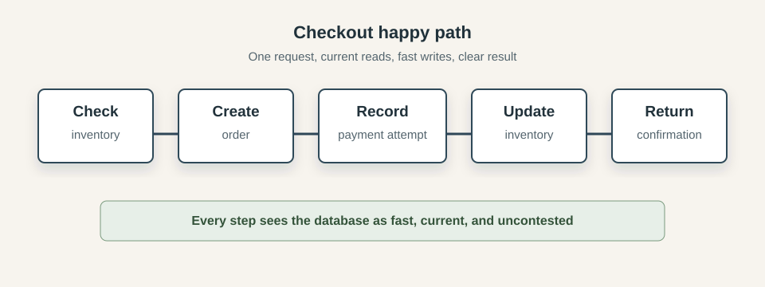
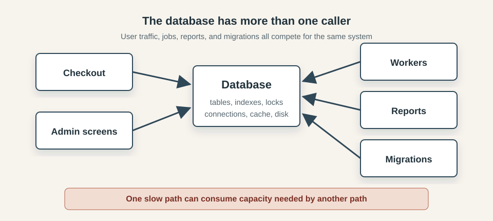
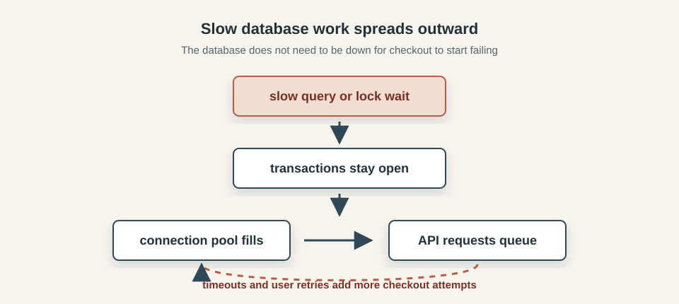
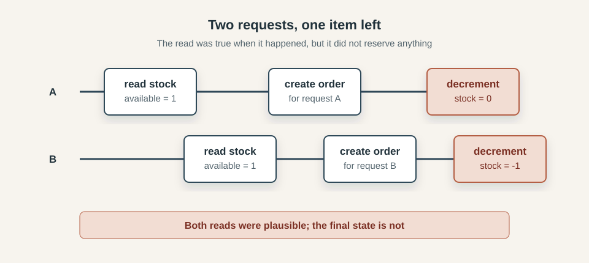
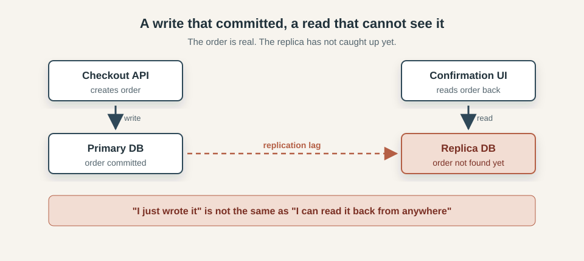
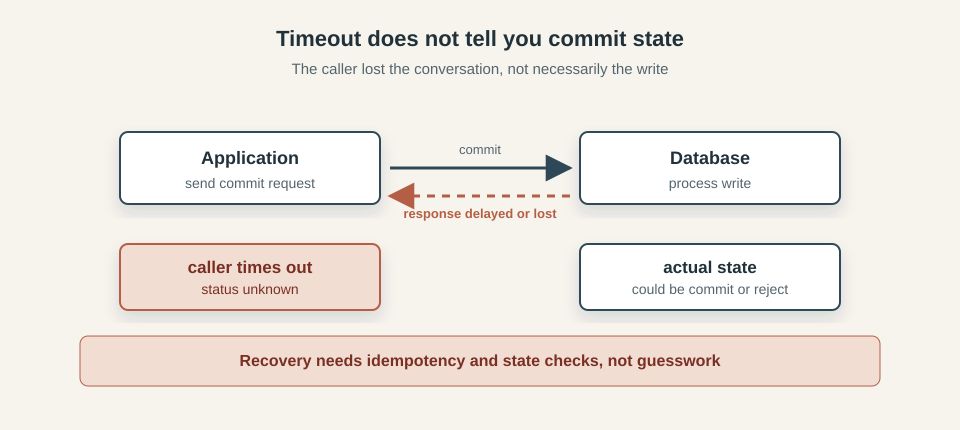
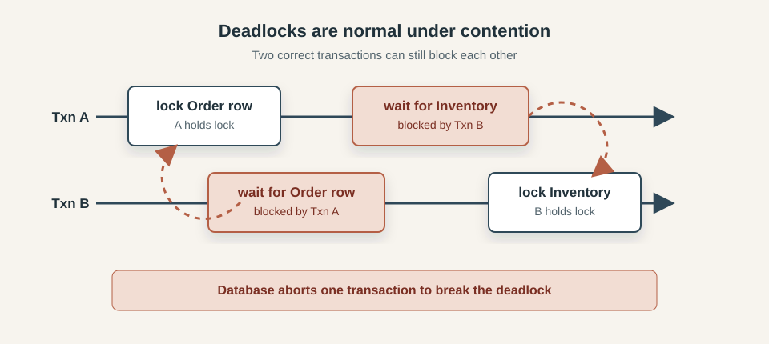
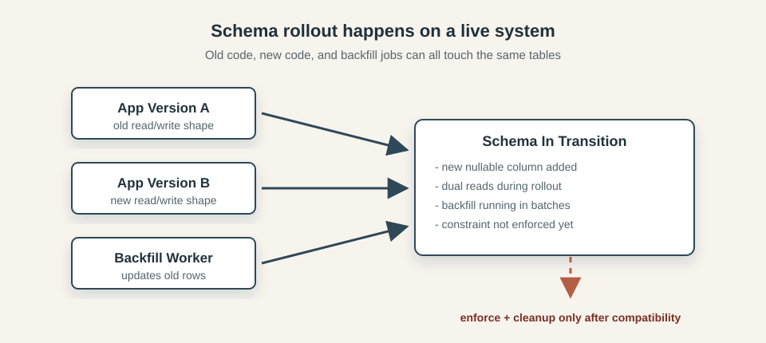
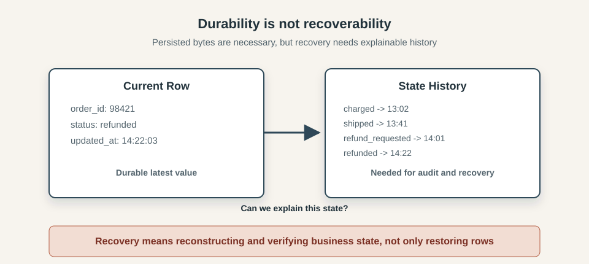

*Featured in [TLDR Data - 2026-08-03](https://tldr.tech/data/2026-08-03) and [Pointer #741](https://www.pointer.io/archives/post_b548ea9f-be30-4703-8ba1-54dc34932625/)*

*Most software is first built under unusually friendly conditions. On a developer machine, the database is nearby, the network is quiet, the service you need is running, the test user behaves sensibly, the clock moves forward, the queue drains, the deployment finishes, and the request succeeds. Those conditions are useful, they let us build the first version of a thing without having to worry about everything that can go wrong in production. Requests don't always succeed, networks are not always fast, databases don't always respond immediately, deployments are not instantaneous, users do not behave predictably, and dependencies have their own limits, maintenance windows, bugs, overloads, and bad days. A system designed only for the smooth path may work beautifully most of the time, but when reality bends away from that path, things fall apart.*

*This series is about making your programs more resilient. Each post looks at one part of the system we take for granted: networks, time, databases, storage, users, dependencies, deployments, queues, and concurrency. The question is always the same: what assumptions are we making here, and what should we do when they stop being true?*

- [Beyond Happy Path Engineering: the Network](/posts/2026-07-01-Beyond-Happy-Path-Engineering-the-Network/)
- [Beyond Happy Path Engineering: Time](/posts/2026-07-19-Beyond-Happy-Path-Engineering-Time/)
- [Beyond Happy Path Engineering: Databases](/posts/2026-08-01-Beyond-Happy-Path-Engineering-Databases/)
- [Beyond Happy Path Engineering: Storage](/posts/2026-08-11-Beyond-Happy-Path-Engineering-Storage/)

---

Databases often feel like the most dependable layer in an application. Once a transaction commits, the awkward work appears to be over: the system has made a decision, recorded it, and can move on.

That model works well for simple cases, and it is one of the reasons databases are so useful. They give us transactions, constraints, indexes, and durable records. They let different parts of a system agree on shared state.

Production however makes that shared state more complicated. The database is not only serving one request at a time. It is handling users, background jobs, admin tools, reports, migrations, retries, replicas, backups, and operational scripts. A query that was fast in development can become slow. Two correct-looking requests can race. A write can commit while the caller times out. A read can hit a replica that has not caught up yet. A schema change can be valid but still unsafe while old and new application versions are running together.

This post is about these edges. We will look at databases as shared production systems, not just places to store data: how invariants are protected, when transactions help, what constraints enforce, how stale reads happen, why retries can duplicate writes, and why migrations and backfills need to be treated as live workflows.

For scope, this post will mostly talk about relational databases. "Database" can mean a lot of things: document stores, graph databases, [time-series databases](/posts/2025-09-20-The-Database-Zoo-Time-Series-Databases/), [vector databases](/posts/2025-11-25-The-Database-Zoo-Vector-Databases-and-High-Dimensional-Search/), columnar systems, event streams, search indexes, and more. You can write a [whole book](https://link.springer.com/book/9798868827082) about that landscape. Here, we will stay closer to the kind of transactional relational database that sits behind many application backends, because it is where these happy-path assumptions show up most often.

## The happy path

Consider a checkout flow for an online store. A user clicks Buy, the application checks that the item is still in stock, creates an order, records the payment attempt, updates the inventory, and returns a confirmation page.

The diagram below shows the happy path:



In a local test, this is usually straightforward: one request runs against a small database, with no competing checkout trying to buy the same item and no background job touching the same rows. The schema matches the code, the queries return quickly, and the confirmation page sees the state the checkout just created.

The code might look something like this:

```text
if inventory.available(itemId) > 0:
    order = orders.create(userId, itemId)
    payments.recordAttempt(order.id)
    inventory.decrement(itemId)
    return confirmation(order.id)
else:
    return soldOut()
```

This follows the business process closely: check the stock, create the order, record the payment attempt, update the inventory, and tell the user what happened.

## Reality

Checkout is only one caller: account pages, admin searches, payment workers, reports, and migrations may all be using the same tables, indexes, connections, and cache.

The diagram below shows the shape of that pressure:



Most production databases are built to handle many callers at once, but application boundaries do not isolate database resources. Code in different services, jobs, dashboards, and operational scripts can still compete for the same connections, locks, cache, disk, and replication bandwidth.

A report that scans too much data can evict useful pages from cache, a long transaction can hold locks that checkout needs, a worker with an aggressive retry loop can consume connection slots, a migration can make ordinary writes wait behind schema work. Even an index added for one query can slow down another path, because every insert or update has extra bookkeeping to do.

From the checkout handler's point of view, contention often looks like ordinary latency: a query takes longer, a transaction waits, the connection pool has no free connection, and the request times out while the original attempt may still be in progress. The database can be accepting queries and still be too congested to keep the product behavior healthy.

Database work needs the same production thinking as network work: time is finite, capacity is shared, and slow paths can spread pressure into parts of the application that did not cause the original slowdown. The happy path shows that a sequence of queries can produce the right answer; production tests whether the same sequence still behaves well when the database is busy, the data is large, and other code is touching the same rows.

### Slow queries become system failures

A slow database operation is easy to underestimate because it still looks like progress. The query has not failed, the transaction has not rolled back, and the database may still be accepting new connections. From inside the request handler, the system appears to be waiting for one piece of work to finish.

The wider system sees something else:



The cost of waiting is paid in resources. A checkout request waiting on the database may be holding an application worker, a database connection, memory, and possibly locks inside an open transaction. If enough requests reach the same slow point, the connection pool fills and new requests queue before they can even ask the database for anything useful.

From the user's point of view, "the database is slow" often becomes "checkout is down". The first slowdown may be a query plan change, a missing index, a lock wait, a large report, or a migration that ran at the wrong time. The visible failure arrives later, when requests time out and users submit the same action again because the page never gave them a clear answer.

Retries can make the situation worse if the original request is still running. A second click on Buy may enter the application while the first attempt is waiting on the database. A client retry may take another worker and another connection. A background job retrying failed records may add more write pressure during the same window. The database did not need to disappear; it only needed to become slow enough that the rest of the system kept sending more work than it could drain.

Treating slow queries as application failures changes how we look at database performance. Query latency and connection pool wait time are part of the user-facing behavior of the product, because every millisecond spent waiting inside a request is also a millisecond where the application is holding capacity it may need for the next request.

### Concurrency makes correct-looking code wrong

The checkout code in the happy path reads naturally because each line follows from the previous one. Check the stock, then create the order, then decrement inventory. Under concurrency, the gap between "check" and "change" is where the race appears.

The last item in stock is a simple example:



Request A reads the inventory row and sees one item available. Before A updates the row, request B reads the same value and reaches the same conclusion. Both requests can be acting on information that was true at the moment they read it, but neither read reserved the item. If both continue, the application may create two orders for one unit of stock.

The problem is that each statement can look reasonable in isolation: the read worked, the comparison made sense, the insert succeeded, and the update changed a row. The failure lives **between** those statements, where another request can observe and change the same data before the first request finishes.

The same thing happens when two requests create the same logical account, two workers pick up the same job, two updates overwrite each other from older copies of a row, or a cancellation races with payment completion. A retry arriving after the original request commits also belongs to the same family of problems: the code path is reasonable on its own, but it is no longer alone.

Concurrency turns database correctness into a question about the whole operation, not just each statement. The important rule asks whether this request can reserve one unit of stock exactly once, even if another request is trying at the same time.

### Transactions are powerful, not magic

Transactions are the first tool many engineers reach for when several database changes need to be treated as one unit. That instinct is good, especially when checkout is creating an order and changing inventory in the same operation. The transaction gives those statements a shared boundary, but it does not decide whether the operation was safe to perform in the first place.

A transaction can make a group of statements commit or roll back together. Depending on the database and isolation level, it can also change what another checkout request is allowed to see or update at the same time. But the transaction still needs to be built around the actual rule for the operation. In the inventory example, that rule is not simply "run these three statements together", it's "do not sell the same unit of stock twice".

For the last item in stock, the rule is to reserve one unit only when one is still available. That condition has to be part of the write that consumes the stock, or part of a locking strategy with the same effect. Without it, the transaction may faithfully commit a sequence of statements after the wrong decision has already been made. Stronger isolation can reduce some of these races, but it also changes the cost profile: transactions may wait longer, block each other, or be aborted and retried by the application. Long transactions make those costs worse because they hold database resources while the application continues doing work.

The practical lesson is to be precise about what the transaction is protecting. Atomicity protects a group of changes from being half-committed. Isolation controls how that group interacts with other groups. The business invariant still needs to be named in a form the database can enforce, such as a conditional update, a uniqueness constraint, a guarded state transition, or a deliberate lock.

### Constraints are production code

The previous section noted that a transaction can faithfully commit a wrong decision. A deeper version of that problem appears when the write comes from a path that never entered that transaction boundary in the first place. Admin endpoints can write directly to orders, workers can adjust inventory outside checkout, and migrations can bypass application checks entirely. Any one of those paths can commit the same bad state, so validation inside the checkout handler alone is not enough.

This is the argument for moving invariants as close to the data as possible. A business rule expressed only in application code is only in force when that code path runs, whereas a rule expressed in the database applies whenever anything writes to the table.

In our inventory example, checkout should check available stock early, and that can give the user a useful response before touching anything, but that check is advisory. The write that actually decrements stock is where the rule needs to live. Instead of reading the current value and then writing a new one separately, the update can express the condition directly:

```text
update inventory
set available = available - 1
where item_id = ? and available > 0
```

If the item has already sold out by the time this runs, the database updates zero rows instead of committing a negative quantity. The application checks the row count and treats zero as the failure. The constraint is not a separate check before the write, it is built into the write itself.

The same logic applies to uniqueness. A retry or a network fault can send two requests with the same logical intent to the database. The application might try to guard against this with a check-then-insert, but that check has the same race window as any other read-then-write. A better approach is for the caller to include a stable identifier with the request — a client-generated order ID that represents this specific attempt — and for the database to enforce uniqueness on it. That way the database itself rejects the duplicate rather than the application having to detect it:

```text
unique(user_id, client_order_id)
```

The second insert fails instead of creating a second order. The application does not have to win the race against concurrent requests, it just has to handle the error when the database rejects the duplicate.

Foreign keys, not-null columns, and check constraints follow the same principle. A foreign key on order items means an item cannot reference an order that was deleted or never created. A not-null constraint on a required column means a missing value is rejected before the row exists. A check constraint on a quantity means a negative value is caught at the database layer before any application code discovers it downstream. 

There's also a useful side effect: constrained failures hold extra context: a duplicate-key error says another request already created that logical record, a check constraint violation says the value broke a rule the database is enforcing. Those errors still need to be handled, but they are better than discovering later that two versions of the same order are both committed, or that a quantity has gone negative and no part of the system noticed until a report ran.

### Reads are not always fresh

Committing a write is not the same as making it visible everywhere. A single database instance can hide this: the writer and the reader talk to the same thing, and the answer comes back immediately. Add a replica, a cache, or an asynchronous read model, and the application can be reading from a copy that has not caught up yet.

The simplest version of this problem is a read replica. Replicas exist for good reasons: they spread read load, reduce pressure on the primary, and can serve reports and analytics without competing with transactional writes. But replication has lag, an instance may be milliseconds behind the primary, or it may be seconds behind during a period of heavy write traffic. Any read that goes to the replica may see the world as it was some time ago, not as it is now.

Our checkout flow creates this problem immediately:



Checkout creates an order on the primary and returns a confirmation page. The confirmation page loads and reads the order back, but the read goes to a replica that has not yet replicated that row. The user sees a "not found" error for an order that genuinely exists. The write succeeded, the read just could not see it yet.

This is the **read-your-writes** problem. Application code that writes to the primary and then reads from a replica cannot assume it will see its own recent changes. The assumption is natural - the same request just created the data - but the infrastructure does not guarantee it.

Replicas are one source of stale reads, but not the only one. Caches can hold values that no longer match what the database contains. Search indexes update asynchronously, so a freshly created record may not appear in search results for several seconds. Read models built from event streams apply updates with some delay. Even within a single database, a long-running transaction reading from a snapshot may see a version of the data that predates commits other transactions have already made.

Each of these is a different kind of lag with different characteristics. Replica lag depends on write throughput and network conditions, cache staleness depends on TTL settings and how invalidation is handled, index lag depends on the pipeline between the write path and the search layer. The important point is not which mechanism causes the gap, but that the gap exists, and the application has to decide which reads actually require freshness.

Most reads do not. Historical data, aggregate counts, and dashboard metrics are usually fine with slightly stale values. But some reads carry an implicit promise: the user just did something, and they expect to see it. The confirmation page is one example. An inventory status page after an admin update is another. A worker that reads a record it is about to process is a third.

When freshness matters, the options are to route the read to the primary, to use a mechanism that forces the replica to catch up before responding, or to design the read path so it does not need to round-trip to the database at all - for example by passing the just-written data forward rather than reading it back. The right answer depends on the read pattern, the architecture, and what the product is willing to accept. The starting point is recognizing that "I just wrote it" is not the same as "I can read it back from anywhere".

### Commit outcomes can be ambiguous

Inside the database, commit vs rollback is clear, but outside the database, it often isn't. The request can time out, the connection can drop, or the process can crash after sending the write but before getting a reply. In that moment, the caller does not know what happened to the write.

From the caller's perspective, any of these outcomes is possible:
- the database never received the write
- the database received it and rejected it
- the database committed it, but the response was lost
- the database is still processing while the caller has already retried

The diagram below shows why the caller cannot know the write outcome yet:



From the caller's point of view, "I got a timeout" says only that waiting ended. It does not tell you whether the write failed, succeeded, or is still in progress.

That is why retries are only safe when the write is **idempotent** (running it more than once produces the same result as running it once). Without that property, timeout handling turns into a duplication bug: the caller retries, the original write was already committed, and now there are two.

That property covers individual writes, but a multi-step workflow can still stall partway through. The database may already contain a valid committed write while the steps around it are incomplete. Persisting one step safely does not guarantee the rest finished, so operation state checks and reconciliation jobs are still needed to close those gaps.

### Deadlocks, lock waits, and retries are normal

Not every database error means bad application logic. Under load, correct transactions can still collide. Example: transaction A updates `orders` then `inventory`. Transaction B updates `inventory` then `orders`. Each one holds a lock the other one needs. The diagram below shows that shape:



The database resolves this by aborting one transaction.

Lock waits are a softer version of the same problem. No cycle, just queueing. A valid transaction waits because another one got there first. Short waits are normal. Long waits are expensive.

Retries help only for transient failures. Deadlock victim? Retry. Short lock timeout? Maybe retry. Constraint violation? Do not retry, it would never succeed.

For checkout, the rule is simple: classify errors, retry only the safe ones, and cap retry count tightly. If every retry holds another worker and connection, a short lock spike quickly becomes user-visible downtime.

### Schema changes are live-system changes

Schema changes look harmless in development, but in production, they run while the application is live. During this transition, multiple app versions can run at once. Workers keep processing jobs. Admin screens and reports still hit the same tables. So one schema change can break several paths at the same time. The diagram below shows the shape of this live transition:



The risk in this phase is change order. If strict constraints arrive before all writers are updated, requests fail immediately. If cleanup removes fields that some readers still expect, those code paths fail just as quickly. Even when compatibility is correct, backfill can still cause user-facing issues if it runs too fast and competes with checkout for locks and I/O.

In all three cases, the SQL can be correct and still be unsafe in that transition window. The practical pattern is compatibility first, cleanup later:
1. Add schema changes in a backward-compatible form.
2. Deploy code that can read both old and new rows.
3. Start writing the new shape.
4. Backfill slowly with limits.
5. Enforce constraints and remove old columns only after old reads and writes are gone.

A successful migration command is necessary, but not sufficient: requests, workers, and admin workflows need to keep working while the schema change and cleanup are in progress.

### Durability is not the same as recoverability

Durability means the write is persisted, recoverability means that after an incident we can rebuild a correct business state and explain every critical transition that produced it.

A system can satisfy the first and still fail the second. A durable current row may tell us the final value, while missing the history needed to verify money movement, reverse a bad change, or safely replay a workflow.

The diagram below shows the difference:



The left side is enough for normal reads. The right side is what recovery work needs.

That is why incidents can become expensive even when data is technically durable, if recovery is not engineered properly. A backup can exist but still be unusable because it is too old or restore takes too long. The latest row can exist but still be insufficient because there is no reliable history to audit money movement or undo a bad change safely.

Recovery has to be engineered explicitly: tested restore procedures, measured recovery time, and enough historical records to reconcile critical state transitions.

## Engineering beyond the happy path

The Reality section shows how database failures appear at the application boundary: timeouts, lock waits, stale reads, ambiguous outcomes, and unsafe migrations. Now let's turn those failure modes into design rules.

### Design around invariants first

Start from the business rule that must always hold, then pick SQL and transaction boundaries that enforce that rule under concurrency.

For the checkout example, "do not oversell" is stronger than "run these statements together." The practical shape is a guarded write that succeeds only when stock is still available, plus explicit handling for the zero-row case.

The same pattern applies to duplicate creates and illegal transitions:
- use unique keys for logical uniqueness and idempotency
- use check constraints and foreign keys for data validity
- use guarded updates for state transitions that must not race

Application checks still matter for user feedback, but the database must enforce the invariant where the write happens.

### Keep transactions short and intention-revealing

Open transactions consume scarce resources even while "just waiting". Keep the transaction body focused on the minimum set of reads and writes needed to enforce one invariant.

Avoid network calls, slow external I/O, and long application processing inside an open transaction. When that work must happen, do it before opening the transaction or after commit.

When lock contention appears, optimize for predictability first:
- access shared tables in a consistent order across code paths
- avoid batch updates that lock large row sets during peak traffic
- classify retryable vs non-retryable failures explicitly

Retries are a pressure multiplier, so retry budgets should be small and deliberate.

### Treat retries as part of correctness

A timeout from the caller does not prove the write failed. Design write APIs as if duplicate attempts are guaranteed.

A practical baseline is:
1. Require a stable operation ID from caller to storage.
2. Enforce uniqueness for that ID in the database.
3. Return the existing result when the same operation is repeated.
4. Reconcile unfinished multi-step workflows asynchronously.

This turns ambiguity from "did it happen?" into "fetch and continue from known state".

### Design explicit freshness contracts

Not every read needs the newest data, but some reads carry a user promise. Make that promise explicit per endpoint.

For each read path, define one of three modes:

- strong: must reflect the latest successful write
- bounded stale: may lag within a known window
- eventually consistent: stale data is acceptable

Then route reads accordingly. Confirmation pages and immediate post-write views usually need strong or bounded-stale behavior; dashboards and historical aggregates usually do not. The main engineering mistake is leaving the mode undefined and discovering the requirement only during an incident.

### Run schema changes as production workflows

Migrations are not a single command; they are a sequence across app versions, workers, and data shape changes.

Use a repeatable rollout protocol:
1. Expand schema in backward-compatible form.
2. Deploy dual-read or dual-write code where needed.
3. Backfill in throttled batches with abort controls.
4. Verify old readers and writers are gone.
5. Contract schema by enforcing strict constraints and removing legacy fields.

Treat every step as observable production work. If rollback is impossible for a step, stop and redesign that step before rollout.

### Engineer for recovery, not just durability

Durable bytes are a starting point. Recovery needs tested procedures and enough historical evidence to reconstruct critical business transitions.

For critical workflows, teams should know in advance:

- target recovery time and tested restore time
- oldest acceptable backup point for business impact
- where transition history is stored and how it is reconciled
- which operations require compensation rather than blind replay

A mature database architecture is not the one that never fails. It is the one that can explain state, recover safely, and return to normal operation without guesswork.

### Patterns for Sharper Edges

Constraints, guarded writes, short transactions, idempotency, explicit freshness contracts, careful migrations, and good observability will handle most production scenarios. Some systems, though, run into sharper edges: very hot rows, heavy cross-service workflows, strict audit requirements, or read workloads that compete with transactional traffic. The patterns below can help, but each one adds operational complexity and new failure modes.

*Transactional outbox* is the standard way to handle "write committed, event not published". The business write and outbox row commit together, then a worker publishes asynchronously. This reduces lost-event risk, but it introduces backlog management, duplicate delivery handling, and cleanup failure modes.

*Append-only records* help when the latest row is not enough to explain money movement, inventory transitions, or permission changes. They improve auditability and reconciliation, but they make reads, compaction, and correction workflows more complex.

*Materialized read models* and *workload isolation* help when heavy reads threaten primary write traffic. They reduce pressure on the hot path, but they introduce lag, rebuild operations, and more coordination across data paths.

*Serializable isolation* and *advisory locking* are useful when anomalies are unacceptable in a critical workflow. They can simplify correctness reasoning for specific operations, but they usually increase contention cost and require tighter operational tuning.

The rule is the same as in other chapters: exhaust the simpler controls first, then add sharper tools for a specific, measured pressure.

## Production example

These incidents show that database failure modes are common and expensive to recover from, even for mature teams.

### Atlassian 2022: recovery capability became the bottleneck

In 2022, Atlassian published a detailed post-incident review after maintenance work led to large-scale service disruption and a long restoration effort. The core engineering lesson was recoverability under pressure: how quickly and safely data and service state can be restored, and how prepared teams are to run that recovery process at scale.

This maps directly to the section above on durability versus recoverability. Having bytes on disk is not the same as being able to return the business to a known, explainable state inside an acceptable time window.

Source: [Atlassian April 2022 incident review](https://www.atlassian.com/blog/atlassian-engineering/post-incident-review-april-2022-outage)

### GitHub 2018: short disruption, long reconciliation

In 2018, GitHub published an incident analysis after a brief network partition between data centers caused database failover and a prolonged recovery period. The interruption itself was short; the recovery was long because data placement and consistency had to be reconciled carefully before all features could return to normal operation.

This maps to several chapter themes at once: ambiguous outcomes across boundaries, stale or diverged read paths, and the need to prioritize data correctness over fast but unsafe recovery.

Source: [GitHub October 21 post-incident analysis](https://github.blog/news-insights/company-news/oct21-post-incident-analysis/)

The common pattern in both incidents is the same: database reliability is not one property, it's a stack of properties that must hold together under pressure: invariants, contention behavior, freshness contracts, migration discipline, and practiced recovery.

## Conclusion

The happy path shows that a database can store the right value, but a production system asks something harder: whether that value holds when requests race, replicas lag, callers time out, and migrations run alongside live traffic.

Getting there requires more than correct SQL. It means enforcing invariants at the database boundary rather than only in application code, keeping transactions short and purposeful, designing writes to survive retries, being explicit about which reads require freshness, treating migrations as live workflows, and building recovery procedures before they are needed.
