---
layout: layouts/post.njk
title: "Beyond Happy Path Engineering: Storage"
date: 2026-08-11
description: "Object storage is separate from application state: how partial uploads, stale URLs, key collisions, CDN caches, and deletion create inconsistencies, and how to design for cleanup and recovery."
excerpt: "Saving a file looks simple until the database and object store disagree. An upload can leave orphaned bytes or a broken record, a deleted object can remain cached, and a presigned URL can outlive the permission that created it. This article examines how to design storage workflows with explicit states, stable keys, direct uploads, reconciliation, and recoverable deletion."
tags:
- posts
- tutorials
- reliability
- distributed systems
- software architecture
- storage
- beyond happy path engineering
---
*Most software is first built under unusually friendly conditions. On a developer machine, the database is nearby, the network is quiet, the service you need is running, the test user behaves sensibly, the clock moves forward, the queue drains, the deployment finishes, and the request succeeds. Those conditions are useful. They let us build the first version of a thing without having to simulate all of production at once.*

*Production adds the rest of the picture. Requests do not always succeed, networks are not always fast, databases do not always respond immediately, deployments are not instantaneous, users do not behave predictably, and dependencies have their own limits, maintenance windows, bugs, overloads, and bad days. A system designed only for the smooth path may still work beautifully most of the time, but when reality bends away from that path, the design has very little left to say.*

*This series is about giving the design more to say. Each post looks at one part of the system we often treat as dependable: networks, time, databases, storage, users, dependencies, deployments, queues, and concurrency. The question is always the same: what assumptions are we making here, and what should we do when they stop being true?*

- [Beyond Happy Path Engineering: the Network](/posts/2026-07-01-Beyond-Happy-Path-Engineering-the-Network/)
- [Beyond Happy Path Engineering: Time](/posts/2026-07-19-Beyond-Happy-Path-Engineering-Time/)
- [Beyond Happy Path Engineering: Databases](/posts/2026-08-01-Beyond-Happy-Path-Engineering-Databases/)
- [Beyond Happy Path Engineering: Storage](/posts/2026-08-11-Beyond-Happy-Path-Engineering-Storage/)

---

Saving a file feels like a simpler problem than [writing a database row](https://blog.gaborkoos.com/posts/2026-08-01-Beyond-Happy-Path-Engineering-Databases/). There are no schemas to define or migrate, no isolation levels to think about, no transactions to manage. The code sends some bytes to a path or a key, the storage layer accepts them, and the content is there until something removes it.

In production, that simplicity has a gap that is easy to miss: the application keeps a reference to the file in its database, but **the database and the object store are two separate systems with no shared transaction boundary**. Either one can succeed while the other fails, and either one can be in an inconsistent state while the other looks healthy. A URL or storage key is a reference the object store resolves against its own state: whether the key exists and whether the bucket policy allows access. It has no knowledge of what the application's database says about that file, whether the record has been deleted, or whether the application considers the content still valid.

This post is about the engineering around that gap: why a single upload can partially succeed and leave the database and the object store in different states, what a URL can and cannot guarantee, how CDN caching and presigned access interact with content that can change or be deleted, and why the lifecycle of stored objects is application work rather than something infrastructure handles automatically.

## The happy path

Consider a document management feature where users upload contracts, reports, or attachments. The application receives the file, stores it, and lets the user come back later to download it.

The happy path is straightforward:

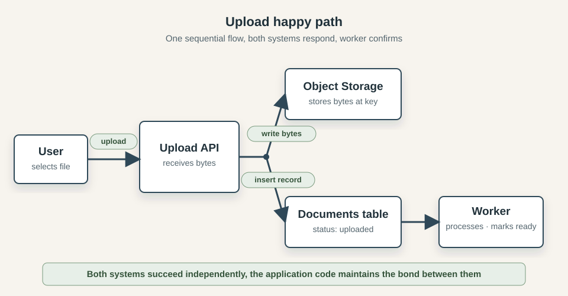

The flow maps naturally to a few lines of code:

```text
key = generateKey(userId, filename)
storage.put(key, fileBytes)
db.documents.insert({ userId, key, status: "uploaded" })
return { url: storage.publicUrlFor(key) }
```

After the upload, a background worker picks up the document record and runs whatever processing the product requires (a virus scan, a text extraction, a thumbnail) and marks the document ready. When the user returns to the document list, the URL in the database record takes them straight to the file.

This design feels natural because the operations are sequential and the problem looks local. The application is the only actor, each step follows the last, and a successful response at the end is reasonable evidence that the work is done. Object storage has excellent durability guarantees; the bytes are not going to vanish due to hardware failure. The database is transactional. The URL is stable. The only remaining concern seems to be the processing worker, and that is ordinary async work.

What the code does not show is that nothing coordinates the two writes. If one succeeds and the other fails, neither system can detect or repair the mismatch. That asymmetry is easy to miss because the failures that reveal it are partial, which is harder to test for than "everything failed" or "everything worked".

## Reality

The document upload flow works when both systems are available, both complete their writes, and the application moves forward in sequence. Production finds the edges of those conditions.

### The two-system boundary

The order of the two writes determines which mismatch a partial failure leaves behind.

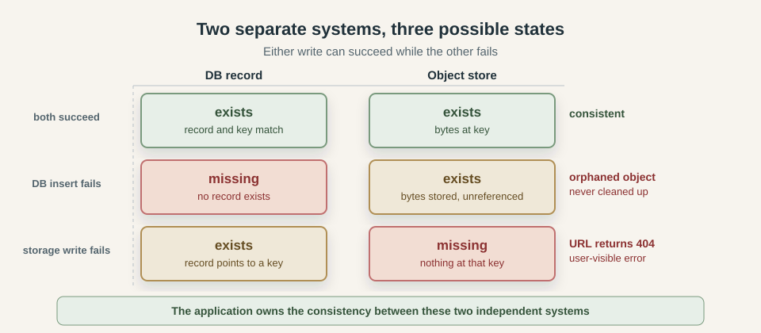

If the bytes arrive but the database insert fails, the application cannot serve or process the object, and nothing will clean it up unless an audit looks for orphaned keys. If the record is inserted but the storage write fails, the product claims the document exists and every attempt to serve it returns a 404.

A retry makes both states harder to reason about. If the application retries the entire upload without knowing which step succeeded, it may create a new object on top of a committed record, or write a new record pointing to a key the object store already has from the first attempt. Knowing which write committed is the prerequisite for recovering cleanly.

### Uploads can fail midway

Small file failures are binary: the connection drops before anything is stored, or the payload arrives and the write completes. Large files behave differently because most object stores split large uploads into parts and require an explicit completion request after all parts are delivered. The object does not exist until that final step.

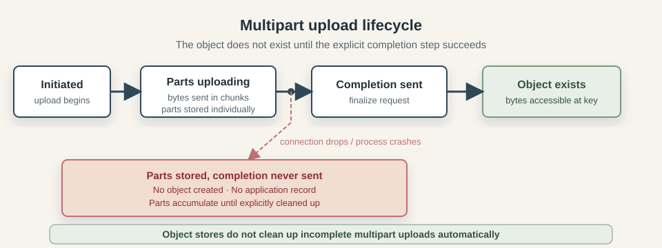

A network drop, a timeout, or a process crash after some parts have been sent but before the completion request leaves the upload in an intermediate state. The parts are stored. No object exists yet. The object store does not clean them up automatically, and the application has no record of the failed attempt. The user sees an error, retries, and the abandoned parts stay behind. Over time, across many users and many failures, incomplete multipart uploads accumulate silently on the storage bill.

### The URL and the object can diverge

The object behind a stored key can be deleted, replaced, or moved independently.

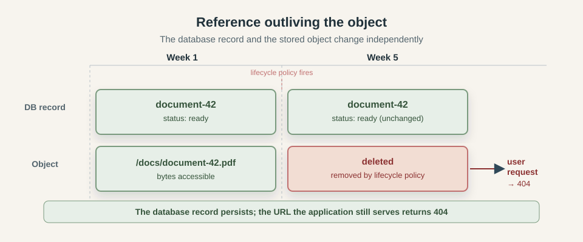

For example, a bucket policy may delete an object after 90 days even though its database record is still active. The record remains `ready`, but downloads return 404. If the application deletes the database record before the object, a failed object deletion leaves orphaned bytes. If it deletes the object first, a failed database update leaves an active record pointing to a key that no longer exists.

A presigned URL adds another layer. It can outlive the record that generated it. A document deleted from the database may still be fetchable from the object store using a previously issued URL for as long as the signature remains valid.

### Concurrent writes to the same key

Object stores are generally last-write-wins with no conflict detection. Two requests writing to the same key both succeed, and the second silently replaces the first.

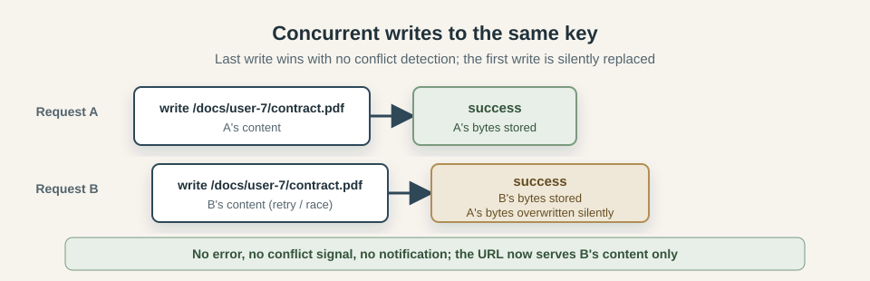

A key derived from `userId + filename` is the same for every attempt. A retry, duplicate batch, or upload from two browser tabs can therefore replace content without producing an error; the database record simply points at whatever was written last.

### Storage latency is application latency

A small payload write is fast enough that it rarely appears on a latency chart. A large file upload holds a connection to the object store open for several seconds and occupies an application worker for the full duration. Other requests that arrive during that window queue behind it. This is the same capacity pressure [the network post](https://blog.gaborkoos.com/posts/2026-07-01-Beyond-Happy-Path-Engineering-the-Network/) described for slow downstream dependencies: the bottleneck does not have to fail to degrade the whole service, it only has to be slow.

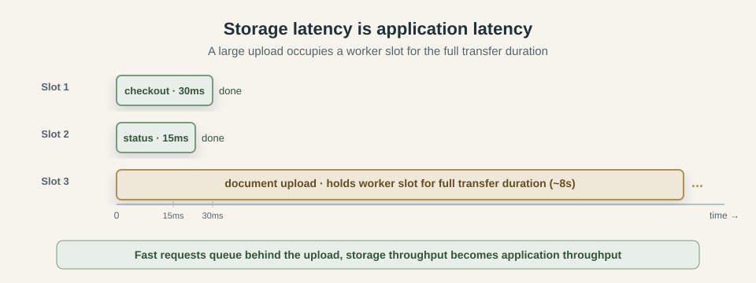

Serving large downloads through the application has the same shape in the other direction. The process holds a connection and streams bytes to the client for the duration of the transfer. One active download competes with every other request sharing the same worker pool for as long as the transfer takes. A surge in upload or download volume can saturate workers even when the application logic is trivially fast, because the bottleneck is the transfer, not the code.

### Presigned URLs leave the application's control

A presigned URL is a signed access grant the object store honors on its own terms. Once issued, it cannot be selectively revoked; revoking requires either deleting the object itself or rotating the signing credential, which cancels every presigned URL issued under that credential at once. The object store has no way to expire one specific URL early.

This matters because URLs travel. A document link sent by email can be forwarded. A presigned URL captured in a proxy log, cached by a browser, or saved to a bookmark lives past the moment it was intended for. A short expiry window reduces the exposure but does not eliminate it. A bucket configured for public read access with a guessable key structure sidesteps presigning entirely: anyone who can construct the path can fetch the content.

### CDN caching

A CDN caches responses by URL and does not watch the object store for changes. A user who replaces a document may see the previous version for the remainder of the TTL. A deleted object may continue to be served from edge nodes after it is gone from the object store. An error response can also be cached: a period of storage unavailability can produce a 404 that the CDN holds and serves for minutes after the underlying object is accessible again.

Cache invalidation is an explicit API call that must be wired into every update and delete path. Without it, the object store and the CDN show different content to different users depending on where each request is routed.

### Orphaned objects

Storage also accumulates content outside the application's normal lifecycle. Development and test uploads may have no expiry rule, while incomplete multipart uploads require cleanup rules that apply specifically to abandoned parts.

Left unmanaged, orphaned objects grow the storage bill, complicate retention and compliance audits, and occasionally cause confusion when a key from a deleted document collides with a new upload.

### Durability is not the same as recoverability

Object stores advertise high durability: the bytes survive disk failures, hardware errors, and availability zone outages. That durability does not extend to the application deleting the wrong object, a lifecycle policy with an overly broad prefix match, or an operator running a bulk delete against the wrong bucket. A delete operation is just as durable as a write. Once committed, the content is gone unless the bucket has versioning enabled or a separate backup exists.

High durability and good recoverability are different goals. Durability means the object store reliably preserves what it is told to store. Recoverability means the application can return the business to a correct, explainable state after a mistake. The second requires a separate design decision: bucket versioning, point-in-time snapshots, an append-only event record, or some combination.

## Engineering beyond the happy path

The engineering response is to define how the upload proceeds, what state the record holds, what keys look like, where large transfers happen, how access is scoped, and how every object's lifecycle ends.

### Choose the upload order that fails safely

Two writes go to two systems, and they can be sequenced in either order. The choice determines what the failure residue looks like.

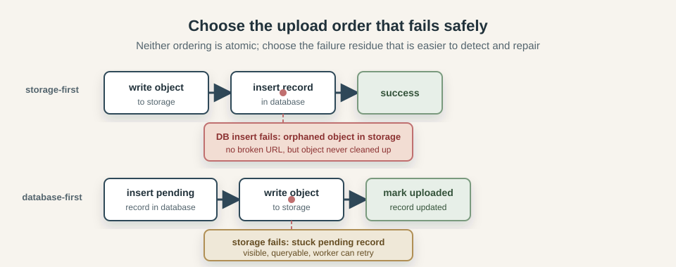

In the storage-first order, the bytes are written to the object store before the database record is created. If the storage write succeeds and the database insert fails, an orphaned object is left behind, but the application never claims ownership of a file that does not exist. Every record in the database points to a real object. The downside is that orphaned objects accumulate silently unless an audit job reconciles the two systems.

In the database-first order, a record is inserted in a `pending` state before the upload begins. The storage write happens next, and the record is updated to `uploaded` on success. If the storage write fails, a pending record with no corresponding object is left behind. That pending record is visible and queryable, which makes the failure easier to detect and retry. The downside is that the application has to ensure pending records that never complete are identified and resolved.

Neither ordering is atomic. Choose based on which failure is easier to repair: a silent orphan in storage, or a visible stuck record in the database.

### Use pending states and confirmations

A `pending` record is more honest than a missing one. It says "an upload was started and has not yet confirmed". A reconciliation job can query for records that have been pending longer than expected and either retry them, mark them failed, or escalate for review.

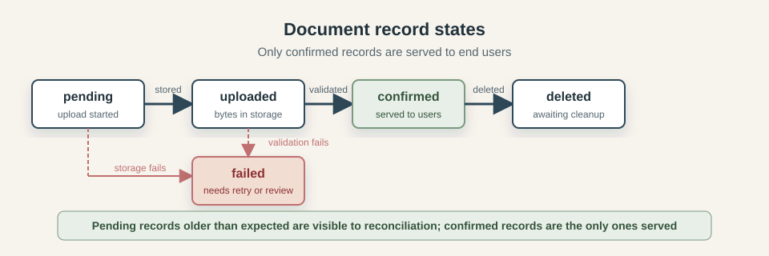

The state progression is: `pending` when the upload intent is recorded, `uploaded` after the storage write completes, `confirmed` after content validation passes, `failed` if any step cannot be completed, and `deleted` when the record is soft-deleted and awaiting object cleanup. The application only serves content in `confirmed` state to end users.

A `confirmed` record means both systems agree: the database has a record pointing to a key, and the object store has bytes at that key, and those bytes have passed whatever validation the product requires.

### Use stable, collision-resistant keys

The storage key must be unique enough to prevent accidental overwrites and stable enough for the application to find the object later.

User-provided filenames collide across attempts. Mutable attributes such as email addresses or usernames break when they change. Predictable structures such as `userId/documentType` make keys easy to infer, which is a security risk if the bucket is public or presigned URLs are leaked.

A database-generated UUID, used as the primary component of the key, avoids all of these. Each upload attempt gets a unique key, retries do not collide with the original, and guessing another user's key requires knowing their document IDs.

```text
/documents/{document-uuid}           stable, unique, not guessable
/documents/{document-uuid}/v2        versioned when content changes
/documents/{sha256-of-content}       content-addressed, immutable
```

Content-addressed keys are worth understanding as a separate strategy. When the key is derived from a hash of the content, the same bytes always produce the same key, different bytes always produce a different key, and the object is effectively immutable. This makes CDN caching permanent and deduplication free. The trade-off is that updating a document requires a new key and a new record, not an in-place overwrite.

### Move large transfers off the application server

Move the transfer path directly between the client and the object store, leaving the application as the authorization and coordination layer rather than the data pipe.

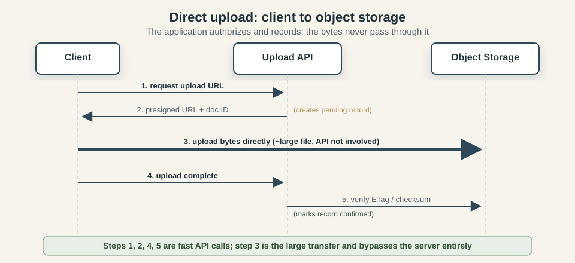

The sequence is: the client tells the application it wants to upload. The application creates a pending record and generates a short-lived presigned upload URL, which is a signed instruction from the object store that lets the client write to one specific key for a limited time. The client sends the bytes directly to the object store. When the transfer completes, the client tells the application, which validates the content and marks the record confirmed.

The application never touches the bytes; its worker slots are occupied for the duration of the pending-record insert, the URL generation, and the confirmation request, all of which are fast. A 500 MB upload no longer ties up a server process for ten seconds.

### Validate content before confirming

The object store accepts whatever bytes it receives, validation is the application's job.

At minimum, the upload should include an explicit checksum that the object store validates before accepting the object. File size should be checked against the declared size and any business limits. Content type should be inferred from the actual bytes rather than the `Content-Type` header provided by the client, which can be set to anything.

For documents that will be processed, shared, or served to other users, a security scan belongs in the upload lifecycle before the record is confirmed. If the scan is slow or external, it can run in the background worker. The record stays in `uploaded` state until validation completes, then moves to `confirmed` or `failed` depending on the result.

### Own the object lifecycle

Every object that enters the bucket should have a plan for how it leaves.

When a document record is deleted, the object should be deleted too. The reliable way to do this is to soft-delete the record in the database first, then have a cleanup worker handle the object deletion separately and record when it completed. This gives the application a durable audit of what was deleted and when, and avoids the situation where an object is deleted but the record update fails, or the record is deleted but the object remains behind.

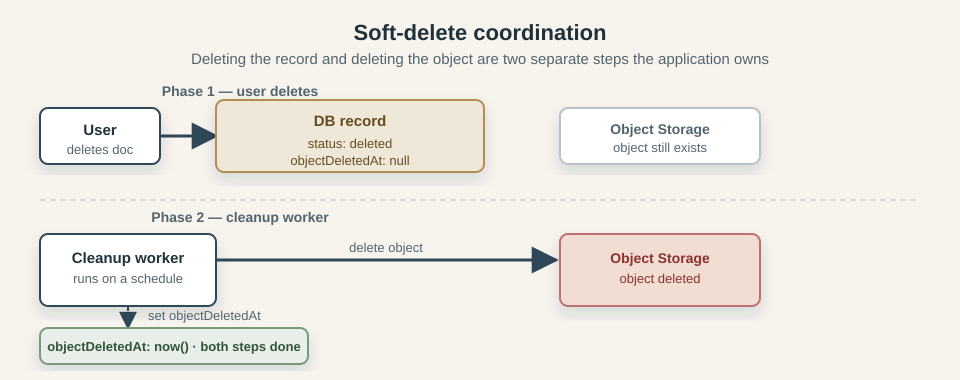

Incomplete multipart uploads need their own cleanup rule. The object store can be configured with a lifecycle rule that aborts incomplete multipart uploads after a set number of days. Without this, parts from failed or abandoned uploads accumulate indefinitely.

Periodic reconciliation fills the gap for everything else: a job that compares the database records against the actual keys in the object store and reports or cleans up objects that have no corresponding record, and records that have no corresponding object. The first reveals orphaned bytes, the second reveals broken references.

### Design access control around what can be revoked

Generating presigned URLs at access time, with a short expiry, limits the window during which a leaked or forwarded URL remains useful. A URL generated at the moment a user requests a file, valid for fifteen minutes, has a much smaller exposure window than a URL generated at upload time, stored in the database, and served to any user who queries the record.

For sensitive content where access needs to be revocable on demand, every download must pass through a component that checks current permissions. That check can happen in the application or at the CDN edge. Routing the bytes through the application is the simplest implementation, but it reintroduces the latency problem from the previous section.

### CDN caching needs a strategy

For content that never changes, this is not a problem. A content-addressed key points to one specific version of the bytes by definition. The CDN can be instructed to cache it indefinitely with `Cache-Control: immutable`. If the content changes, the key changes, and a new URL is served.

For mutable content, every update or deletion requires an explicit cache invalidation call to the CDN. Without it, the CDN serves the old version for the remainder of the TTL. A document that a user replaced may appear unchanged for an hour. A document that was deleted may continue to load from edge nodes after the object is gone.

The safest approach for user documents is to use versioned keys, so each update produces a new URL, and old URLs become stale naturally as the database record is updated to point to the new key. This eliminates the need to invalidate, at the cost of accumulating object versions in storage.

### Observe storage as application behavior

Storage failures show up in application behavior before they appear in storage infrastructure metrics. A broken URL is visible in error logs and user reports before any alarm fires on the object store. A growing population of stuck pending records is visible in the database before storage costs reflect the accumulating orphans.

The useful metrics are on the application side: upload success and failure rates, upload latency by file size, the count of records in each status state, the age of the oldest pending record, the count of records with no corresponding object detected by reconciliation, and download error rates broken down by error type. Storage-side metrics such as request counts and error rates complement these but do not replace them.

CDN hit rate and invalidation latency matter when the application is serving mutable content. A low hit rate means most requests are reaching the object store directly, which increases both latency and cost. A high invalidation error rate means some users are seeing stale content after updates.

### Pulling the pieces together

The complete flow now looks like this:

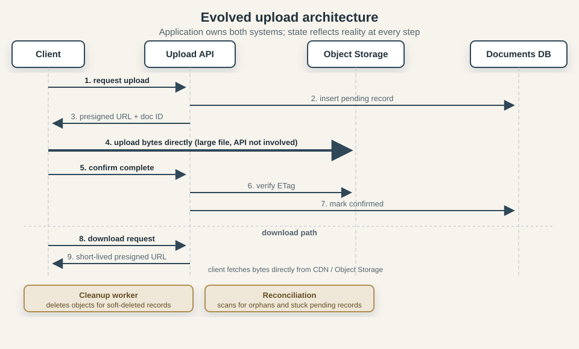

The application records intent and authorizes a direct upload. Confirmation and processing move the document through explicit states. Downloads receive short-lived access, deletion becomes background work with a recorded outcome, and scheduled reconciliation finds anything left between those paths.

The object store behavior is the same as before. What changed is that the application treats the two-system boundary as something it owns and observes, rather than something it assumes away.

### Patterns for sharper edges

A few specialized situations call for more:

*Content-addressed storage* (CAS) treats the content hash as the key. Identical bytes produce identical keys, which gives free deduplication and permanent cacheability. Updates require new keys rather than in-place overwrites. Useful when immutability is a product requirement or deduplication matters at scale.

*Object versioning* in the bucket preserves every version of every key. A delete adds a delete marker rather than removing the bytes. This enables recovery from accidental deletes and satisfies some audit requirements. The cost is that every write adds a version, and retention rules must be designed to prevent unbounded growth.

*Signed cookies* allow a CDN to enforce authenticated access without a per-URL signature. The application sets a cookie that covers a path prefix, and the CDN checks the cookie on each request. Useful for authenticated video streaming or bulk document access where generating per-URL presigned links is impractical.

*Write-once-read-many* buckets prevent any modification or deletion of stored objects. Useful for financial records, legal archives, or regulatory retention requirements where the stored content must remain exactly as written for a defined period.

Each adds operational complexity and belongs in a design with a specific requirement the simpler patterns cannot meet.

## Production examples

### AWS S3 US-EAST-1 2017: a support tool removed too much

In February 2017, AWS published a detailed summary of a large-scale S3 outage in the US-EAST-1 region. The root cause was a typo during a routine debugging session: a support tool that was intended to remove a small number of servers from a billing subsystem was given a larger-than-intended input. The tool removed a significant number of index servers and metadata subsystems that were needed for S3 to operate correctly.

Recovery took longer because the path had not been exercised at that scale. The incident also shows that operational tooling capable of wide-impact actions remains a production risk regardless of how well application code is designed.

Source: [AWS S3 Summary of the Amazon S3 Service Disruption in the Northern Virginia (US-EAST-1) Region](https://aws.amazon.com/message/41926/)

### Incomplete multipart uploads as a storage cost problem

AWS has documented publicly that incomplete multipart uploads are a common and non-obvious contributor to S3 storage costs. When a multipart upload is initiated but never completed, the uploaded parts are stored and billed indefinitely. The application typically has no record of these attempts because the failure happened before the database write. The object store has no automatic cleanup unless a lifecycle rule is configured to abort incomplete multipart uploads after a number of days.

AWS recommends an `AbortIncompleteMultipartUpload` lifecycle rule, but it has to be configured deliberately; it is not the default.

Source: [AWS documentation on managing multipart upload lifecycle](https://docs.aws.amazon.com/AmazonS3/latest/userguide/mpu-abort-incomplete-mpu-lifecycle-config.html)

### Code Spaces 2014: high durability, no recovery

In June 2014, Code Spaces — a code-hosting and collaboration service — shut down permanently within 12 hours of an attacker gaining access to their AWS control panel. The incident began as a DDoS. The attacker used it as cover to access the EC2 console, leave extortion demands, and create backup credentials. When Code Spaces noticed and tried to regain control, the attacker began deleting: all EBS snapshots, all S3 buckets, all AMIs, database volumes, and the offsite backups. Most data was either partially or completely gone.

Their own statement afterward noted: "Backing up data is one thing, but it is meaningless without a recovery plan — and one that is well-practiced and proven to work."

All of Code Spaces' backups and primary data were reachable from the same compromised credential, and the object store durably committed every deletion. Recoverability requires backups under separate credentials, in a separate account or location, outside the application's operational blast radius.

Source: [Code Spaces shutdown notice, archived June 2014](https://web.archive.org/web/20140619003817/http://www.codespaces.com/)

Together, the incidents show the range of storage risk: service disruption, abandoned intermediate state, and durable deletion.

## Conclusion

Object storage is durable, highly available, and largely self-managing at the infrastructure level. What it does not manage is the relationship between the stored bytes and the rest of the application. The database record and the stored object are independent facts, maintained in consistency only by the code.

Engineering beyond the happy path means owning that gap explicitly: choose an upload order whose failure residue is detectable, keep record state honest about what has actually been confirmed, derive storage keys from stable identifiers, keep large transfers out of the application request path, design access control around what can actually be revoked, treat the CDN as part of the serving path rather than invisible infrastructure, and run cleanup and reconciliation as ordinary scheduled work rather than emergency responses.
