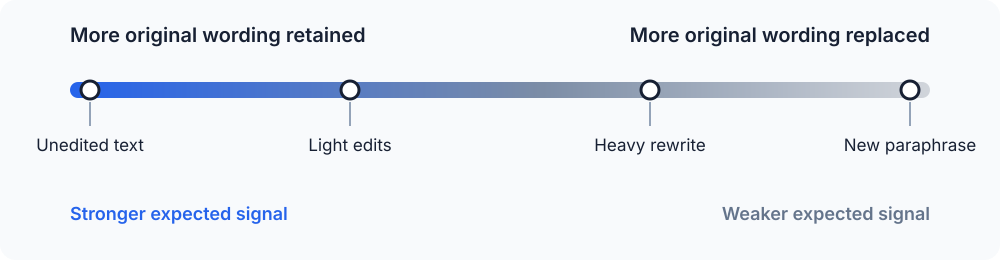

*Anthropic has just announced [how Claude marks AI-generated content](https://support.claude.com/en/articles/16266773-how-claude-marks-ai-generated-content), bringing text watermarking into immediate practical discussion. A watermark in plain text is less intuitive than one in an image or a file because copied text appears to leave its provenance behind. These two articles examine the mechanism and its implications. This first article explains how statistical text watermarking works from first principles, the [second](/posts/2026-08-12-What-Does-a-Text-Watermark-Actually-Prove) examines what detecting such a watermark would allow us to conclude.*

## How Do You Watermark Plain Text?

Images provide an obvious place for a watermark: a system can alter pixel values by amounts too small for a person to notice, while a detector can still recover the resulting pattern. Digital files can also carry metadata that records their origin or editing history. Plain text appears to offer neither option because it consists only of characters on a page.

Copy a paragraph from a document into Notepad and save it as a new file. The operation discards most of the surrounding information, including document metadata and details of the original formatting. What remains is the sequence of words and punctuation that the reader can see. Any marker that depends on the original file has disappeared.

The text still contains more information than its literal meaning, however. A writer repeatedly chooses between words such as `but` and `however`, contractions such as `don't` and `do not`, and several ways of arranging the same thought. Sentence length, punctuation, vocabulary, and grammatical construction introduce further choices. Each version can communicate substantially the same idea while leaving a different sequence of characters behind. Natural language as an encoding system is inherently redundant, and **that redundancy allows a writer to leave a statistical signal in the text itself**.

A language model makes comparable choices whenever it generates text. Given the passage produced so far, the model assigns probabilities to possible next tokens and selects one according to its generation settings. A token can be a whole word, part of a word, a punctuation mark, or another text fragment. The visible sentence is therefore the result of many selections from many possible continuations.

A simple completion illustrates the available freedom. The list below contains several plausible continuations for the same opening:

```text
The result was ...

unexpected
surprising
interesting
quite different
hard to explain
...
```

Several completions can be fluent and appropriate. Selecting one of them changes the text without requiring hidden characters or attached metadata. The chosen words themselves preserve the selection after someone copies the passage into another document.

Text watermarking uses this freedom in a controlled way. During generation, a watermarking system can influence which acceptable continuation the model selects. Across a long passage, those influenced choices form a statistical pattern that a detector can test for later. The pattern lives in how the text was chosen, so it remains part of the text after ordinary copying and pasting.

An individual choice reveals almost nothing. A person can write `however`, and an unmodified language model can select it as well. Evidence starts accumulating when many small choices lean in a coordinated direction more often than chance would predict. This dependence on accumulated evidence is why statistical text watermarking belongs to a different category from a visible label or a fixed hidden message.

*[Anthropic's announcement](https://support.claude.com/en/articles/16266773-how-claude-marks-ai-generated-content) gives the subject new practical relevance, but the general technique is broader than Claude or any other product. Vendors can use different token-selection rules and detection methods, and public descriptions do not provide a complete implementation specification. The principles in this article describe the technology rather than attributing a particular design to Anthropic.*

## Humans Already Have Statistical Fingerprints

Of course the choices encoded in a piece of text existed long before language models. Every writer develops habits through education, reading, geography, profession, and personal preference. Some habits are easy to notice, while others appear only after someone counts them across a substantial body of work. Apparently, a text without any pattern would be very difficult to read. Two writers expressing similar ideas can consistently favour different forms. Their tendencies might look like this:

```text
Writer A                  Writer B

but                       however
for example               for instance
don't                     do not
shorter sentences         longer sentences
few semicolons            frequent semicolons
simple punctuation        lots of em dashes (the classical LLM watermark)
```

Finding `however` in a document provides no useful attribution on its own. Writers use words outside their usual habits, and the subject of a document strongly affects its vocabulary. A contract and a message to a friend will differ even when the same person wrote both. Individual observations become informative only when they form a consistent pattern.

The study of such patterns is called **stylometry**. It measures features of writing and uses them to compare texts or estimate authorship. Useful features include the frequency of common function words, preferences in spelling and punctuation, sentence-length distributions, and recurring grammatical constructions. Many of these features attract little conscious attention from the writer, which can make them more stable than conspicuous turns of phrase.

Stylometric analysis works by comparing measurements rather than searching for a unique signature embedded in every document. Given several texts known to come from a writer, an analyst can estimate how often that writer makes particular linguistic choices. The same measurements taken from an unknown text can then be compared with the known samples. A closer match raises the evidence for common authorship, while a weaker match lowers it.

**Sample length controls how much evidence is available.** Ten words contain few choices and can easily resemble the habits of many writers by chance. Ten thousand words provide repeated observations of vocabulary, punctuation, syntax, and sentence structure. Accidental variation begins to average out, allowing persistent tendencies to become clearer.

More text, however, does not remove every source of uncertainty. Topic affects vocabulary, genre changes formality, editing can replace an author's usual constructions, and people alter their style over time. Reliable analysis has to account for these influences and compare like with like. A collection of informal emails offers a poor baseline for attributing a technical manual, even when both sets of text involve the same candidate author.

Authorship attribution therefore produces a statistical conclusion. An analysis can show that one candidate's writing is more consistent with the observed text than another candidate's, or that a match would be unusual under a stated alternative. The result depends on the available samples, the measured features, the comparison population, and the assumptions in the method. It does not provide the certainty of reading an author's name from an intact document record.

**Statistical identification of writing did not begin with AI.** Human writing already demonstrated that repeated linguistic choices can act as evidence about a text's source. Language models create text through a different process, but they also make repeated choices with measurable tendencies. That connection allows the same statistical intuition to carry into machine-generated text.

## Language Models Have Fingerprints Too

A language model generates text by repeatedly estimating what token should come next. The estimate takes the form of a probability distribution over the tokens in its vocabulary. After the phrase `The result was`, a simplified view of that distribution might look like this:

```text
unexpected     18%
surprising     15%
interesting    11%
quite           8%
not             6%
encouraging     4%
...             ...
```

These numbers are illustrative, but the structure reflects the real process. The model assigns different probabilities to possible continuations, then a decoding procedure uses those probabilities to choose a token. That token becomes part of the context for the next calculation, and the process continues until the response is complete.

Different models assign different probabilities in the same context. One model might favour `unexpected`, while another gives more weight to `surprising`. The difference can be too small to notice in a single response, yet it influences which words and constructions appear across a larger collection of outputs. Taken together, those tendencies form a **natural model fingerprint**.

The fingerprint comes from the entire system that produces the text. Several parts of that system shape the observed pattern:

- **Training data and model architecture** shape the underlying probability distribution.
- **Post-training** changes which kinds of responses the model favours.
- **System prompts and product-level instructions** influence the model before it generates a response.
- **Decoding and sampling settings**, including temperature (a control that makes token choices more predictable at lower values and more varied at higher values), determine how the system selects from the available tokens.

Even when the underlying model remains fixed, changes to its system prompt or sampling settings can alter the pattern in its output. A fingerprint therefore characterizes the complete generation setup rather than the model alone. This means versions of the same model can leave different fingerprints. A provider can update training, adjust post-training, revise its system prompts, or change how the product samples tokens. An attribution method built around the old behaviour can lose accuracy after such a change. A fingerprint describes a particular generation process under particular conditions rather than a permanent identity attached to a brand name.

So model fingerprinting is essentially stylometry taken one step further. Human stylometry infers likely authorship from linguistic patterns that arise through a person's ordinary writing habits. The writer does not need to place a signature in the text or follow a secret procedure. The evidence comes from tendencies already present in the writing. Model fingerprinting applies the same broad idea to text generated from a model's ordinary probability distributions. It looks for patterns associated with a likely generation setup. The model does not need to cooperate with the detector, and the generation process does not need to encode a deliberate signal.

And finally, we have arrived at the final idea: what if we deliberately influence the model's choices to create a stronger, more detectable signal? That is the essence of **text watermarking**: 

> By guiding the model's token selection in a controlled way, we can embed a statistical pattern that a detector can later identify. 

From a technical perspective, I'm finding the idea fascinating: there is nothing new about the underlying statistical principles, but the whole process of altering a model's output to leave a detectable signal in plain text is pure evil genius. Let's see how it works in practice.

## Tiny Differences Become Evidence

Creating a statistical pattern does not make every affected token identifiable. A model choosing `however` instead of `but` proves nothing because both people and models can choose either word regardless of whether a watermark is present. The useful evidence lies in the balance of choices across the text rather than in any particular word.

Suppose a detectable pattern makes one group of otherwise reasonable tokens slightly more likely to be selected. A short sentence might contain only a few places where that preference can affect the output. Its final token sequence can easily match the pattern by chance, or miss the pattern even when the generation process applied it. A confident conclusion would demand more evidence than the sentence contains.

A 50,000-word document, on the other hand, presents a radically different measurement problem. It contains many opportunities for the generation process to express the same small preference. Some choices will lean away from the expected pattern, as random variation guarantees, while the aggregate can still show a persistent imbalance. The detector becomes less concerned with any single selection and more concerned with whether the observed total is plausible under ordinary generation.

The intuition resembles repeated measurement. One noisy observation leaves many explanations open, while a large collection can reveal a small effect that remains invisible at the individual level. Statistical tests turn that accumulated difference into a score by comparing the observed pattern with an expected baseline. The strength of the result depends on both the size of the measured effect and the amount of usable text.

Token choices are not independent observations. Each selected token becomes context for the next selection, so neighbouring choices influence one another. Topic and prompting change which vocabulary is available, while editing can remove or replace parts of the original pattern. Distribution shift creates another problem when the analysed text comes from different conditions than the text used to design or calibrate the detector.

## Engineering the Fingerprint

A watermarking system creates a stronger pattern by changing the probabilities the model already calculated. Consider a moment when the model has several reasonable ways to describe a server under load. Its original distribution could look like this:

```text
Normal distribution

slow          27%
overloaded    23%
struggling    19%
saturated     17%
unhappy       14%
```

The watermarking rule marks some of the available tokens as preferred for this particular position. It then moves a small amount of probability towards those tokens before the sampling process makes its choice:

```text
Watermarked distribution

slow          24%
overloaded    26%  <- preferred
struggling    17%
saturated     20%  <- preferred
unhappy       13%
```

The model remains free to select any of the candidates. Preferred tokens simply become a little more likely, allowing fluency and variation to remain. A reader has no reason to find `overloaded` or `saturated` suspicious because both fit the context perfectly well.

The shift becomes visible only in aggregate, as the previous section explained. Preferred choices appear more often than the original distribution predicts, and a detector measures that excess. **A statistical text watermark is an engineered fingerprint:** the generation process deliberately strengthens a pattern that ordinary text would exhibit only by chance.

## Where the Secret Pattern Comes From

A fixed list of preferred words would be easy to discover and remove. Practical proposals instead derive the preference from a secret key and the local context. A deterministic calculation uses the key to process the preceding tokens, with some designs also incorporating the current position, and divides suitable next tokens into preferred and ordinary sets.

The calculation is pseudorandom, which means its results look random to someone without the key while remaining exactly reproducible for someone who has it. The generator and detector can therefore agree on which tokens were preferred at every position without storing a copy of each decision. An observer who sees only the finished text cannot reconstruct the pattern from a simple vocabulary list.

The same word can play a different role each time it appears. `However` might belong to the preferred set after one sequence of tokens and to the ordinary set after another. Descriptions claiming that a model will use a collection of special watermark words miss this context dependence. The signal comes from the relationship between each token and the context in which the model selected it.

Keeping the key private also protects the scheme. Someone who learns the selection rule can deliberately avoid preferred tokens to weaken the signal or favour them to imitate it. The security of the mechanism therefore depends partly on controlling access to the information needed to reconstruct the pattern.

This is why the idea has a very high ceiling: the patterns can be arbitrarily complex, and a detector that knows the key can reconstruct the same sets and test for the expected imbalance. Over time, we can expect to see more sophisticated watermarking schemes that are harder to remove and easier to detect, while still leaving the text fluent and natural. Applying the same increasingly complex, evolved patterns to fingerprinting and stylometry has huge potential too.

## Detecting and Damaging the Signal

Detection repeats the keyed calculation against the finished text. Given the text and the information defining the watermark, the detector works through four operations:

1. Reconstruct the preferred token set at each usable position.
2. Record how often the text selected a preferred token.
3. Compare that count with the result expected from ordinary text.
4. Calculate how surprising the observed excess would be by chance.

The output is a statistical score rather than a hidden field reading `AI_GENERATED=true`. A detection service chooses a threshold above which it reports the watermark as present. Raising that threshold reduces false positives but misses more genuinely watermarked text, while lowering it catches weaker signals at the cost of more false alarms.

Obviously, copypaste preserves the signal because it preserves the selected text. Editing behaves differently because every replacement removes one observation and introduces another. The expected signal weakens as more of the original wording is replaced:



Ordinary corrections often leave enough original choices for detection, especially in a long passage. Extensive rewriting replaces a larger share of the evidence, and a fresh paraphrase can produce a new token sequence with little connection to the original pattern. A watermark's **robustness** is its ability to remain detectable after the text has been edited. It can be measured by how the detector's confidence falls as more of the original choices are replaced.

Things get tricky when someone edits specifically to defeat detection. A strong watermark should tolerate ordinary transformations while avoiding unnatural language or a rigid generation process. Making the pattern harder to remove generally requires influencing more choices or applying a stronger bias, which increases the chance that the intervention affects the output itself.

## Does the Watermark Affect the Output?

Watermarking changes the generation distribution, but a changed distribution does not establish a loss of quality. A slightly less probable token can remain correct, fluent, clear, and appropriate for the context. If the highest-probability choice were always the best one, selecting the top token at every step would consistently produce the best possible response, which it does not.

The amount of safe room depends on the uncertainty at a particular position. Some contexts leave almost no reasonable choice:

```text
The capital of France is ...

Paris    99.9%
```

Moving substantial probability towards another token would risk a factual error. A watermarking system gains little useful capacity from such a position and should leave the dominant choice alone. Other contexts offer several continuations with similar probabilities:

```text
The result is ...

interesting   21%
surprising    20%
notable       18%
unexpected    17%
```

Here the system has more room to favour one reasonable option without making the sentence worse. Watermarking methods can concentrate their influence on these higher-uncertainty positions and reduce it where the model strongly prefers one answer. The design balances signal strength, resistance to editing, fidelity to the original distribution, and output quality.

Quality also depends on the task being measured. A change that leaves ordinary prose fluent can still alter a precise factual answer or a program. Evaluations therefore need to test the properties relevant to the output rather than treating probability shifts as a complete measure of quality.

Code makes the constraint particularly visible: a prose sentence often has many acceptable formulations, while a line of code must satisfy syntax and preserve behaviour. Identifiers, formatting, comments, and alternative implementations provide some freedom, but each choice can also affect readability or correctness.

```js
return err
```

A short statement such as this contains little harmless room for encoding a statistical preference. Larger programs contain more choices, although many are constrained by language rules and the surrounding codebase. The available capacity depends on the kind of content, and no conclusion about how a commercial system treats code follows from the general mechanism alone.

## What the Detector Finds

A successful detector provides evidence that the examined text contains the statistical pattern the watermark was designed to create. The strength of that evidence depends on the scheme, the detector's calibration, the available text, and any transformations applied after generation. Note that the detector doesn't prove that the text was generated by LLMs, or that it was generated by a particular model, or that it was generated by a model at all. It only shows that the text contains the expected statistical pattern. Also cannot determine how much of the text was generated by a model, or how much was edited, or rewritten. The detector can only report on the presence of the watermark pattern in the text.

## Conclusion

Plain text has no separate layer in which a durable marker can hide, yet the choices that compose the text provide another channel. A watermarking system uses a secret rule to favour certain acceptable tokens in particular contexts. Those small interventions accumulate into a pattern that copying preserves, editing weakens, and a detector can measure against chance. The mechanism gives a provenance system a measurable signal. A complete history of the text remains outside its reach. Detection cannot reveal who requested the output or who later revised it, and the final document can contain material assembled through several different processes. The statistical result describes the text presented to the detector under the assumptions built into that detector.

The difficult questions begin when people turn that result into a claim about authorship or conduct. Technical confidence becomes one piece of evidence inside a larger judgement about where the text came from and how it was used. The [second article](/posts/2026-08-12-What-Does-a-Text-Watermark-Actually-Prove) examines what a detected watermark actually proves, which conclusions go beyond the evidence, and what happens when institutions treat a statistical signal as a verdict.
