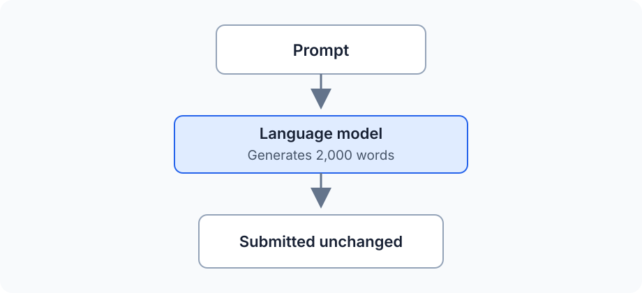
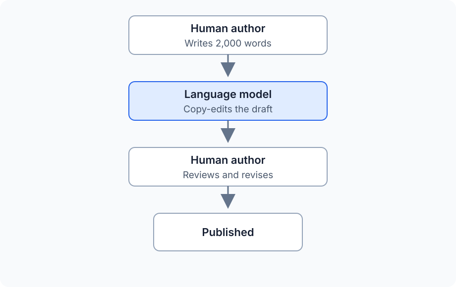

*Anthropic has just announced [how Claude marks AI-generated content](https://support.claude.com/en/articles/16266773-how-claude-marks-ai-generated-content), bringing text watermarking into immediate practical discussion. Detecting a signal in a passage and reconstructing the history behind that passage are separate problems. These two articles examine the mechanism and its implications. The [first article](/posts/2026-08-12-Text-Watermarking-for-Non-Academics) explains how statistical text watermarking works, this second article examines what a positive result allows us to conclude.*

A text watermark appears to offer a simple answer to a difficult question: the generator places a detectable pattern in its output, and a detector later reports whether that pattern is present. When the result is positive, it is tempting to treat the measurement as a record of who wrote the text and how it was produced. However, the detector has access only to the finished text. It cannot observe the original idea, the drafts that preceded publication, the people who revised the material, or the rules governing their work. A technically accurate result can therefore become evidence for a conclusion that requires information the watermark never contained.

That problem remains even under ideal conditions. Assume the watermark has negligible effect on quality, survives ordinary editing, produces reliable results over suitable samples, and has independently understood statistical behaviour. The difficult question is what the successful detection establishes.

## Give the Technology Every Advantage

Implementation weaknesses can obscure the more important argument, so assume an excellent watermarking system. For the rest of this article, grant it all of the following properties:

- negligible measurable effect on output quality
- an extremely low statistical false-positive rate
- reliable detection over sufficiently long samples
- resistance to ordinary editing and format changes
- independently understood statistical behaviour

These assumptions remove easy objections about a weak detector or a visibly degraded model. They also make the consequences more important because institutions will place greater trust in a result that appears technically mature. The question becomes which conclusions the successful measurement supports.

Some applications require only that narrow measurement. Others use it as evidence for authorship, disclosure, policy compliance, or misconduct. Each additional claim introduces facts that the detector never observed.

## The Measurement

As we saw in [Part 1](/posts/2026-08-12-Text-Watermarking-for-Non-Academics), a detector examines a text for the pattern created by a particular watermarking process. Its narrow output can be expressed in one sentence, but the surrounding qualification belongs with it:

```text
This text contains statistical evidence consistent with generation under watermark W.
```

The detector has measured a property of the submitted text. It has not directly observed any of the following claims:

```text
Claude wrote this document.

The person submitting it used Claude.

ChatGPT originated the ideas.

Most of the document was generated by AI.

The author intended to conceal AI use.

The author violated a policy.
```

Moving from the measured pattern to any statement on that list requires more evidence. A positive result can support an account of how some surviving text was processed, while the detector has no access to conversations, drafts, editorial decisions, or the rules governing the work. **The detector measures a property of the text. Humans decide what that property means.**

The same limit applies when the detector is highly accurate. Accuracy answers whether the detector finds its target pattern correctly, but it does not expand the target to include authorship or intent.

Statistical errors still matter at scale because even a very low false-positive rate can produce many incorrect alerts when the target pattern is rare. An absent mark also carries limited information: unmarked models, unsupported product surfaces, short passages, and extensive rewriting can all produce the same result. Detector evaluations need to quantify both kinds of error without treating either result as a complete account of provenance.

## A Watermark Does Not Assign Authorship

Two documents can contain comparable watermark evidence despite emerging from very different workflows. In the simplest case, the model supplies almost everything that reaches the reader:



Here a detected watermark aligns closely with the ordinary description of AI-generated text. The prompt still came from a person, but the model selected the language and structure of the submitted document. Few intermediate steps complicate the account.

A second workflow produces a different authorship story:



The surviving text can contain choices introduced during the copy-editing step. A detector can recover evidence of that processing even though the argument, research, and original draft came from the human author. Calling the finished document “written by Claude” collapses editorial assistance into authorship.

Real workflows contain more exchanges than either example. A person can develop the idea and outline, ask a model for a draft, rewrite the result, return it for proofreading, and make a final edit. Another person can ask a model for possible ideas, write the draft independently, use the model for criticism, and then restructure the work. The final text does not preserve a complete record of these contributions.

“Human-written” and “AI-written” treat authorship as a binary field. Collaborative production behaves more like a history in which people and tools influence different parts of the work at different times. A statistical trace can identify part of that history without reconstructing the whole process.

## Policies Ask About Behaviour

Institutional policies usually regulate conduct rather than token distributions. Their wording can make similar-looking detector results relevant to very different questions:

| Setting | Policy question |
|---|---|
| University | Did the student submit model-generated work where independent authorship was required? |
| Publisher | Did model involvement exceed the permitted level of editorial assistance? |
| Employer | Was required disclosure provided before AI-assisted material was delivered? |
| Public agency | Was the approved process followed when automated tools handled official material? |

A watermark can provide evidence that a supported generation process touched the text. The policy question also depends on who initiated that processing, what the model contributed, whether the use was disclosed, and which version became the submitted work. Those facts live in workflow records and human testimony rather than in the watermark alone.

The wording of the policy determines whether the signal fits the rule. A blanket prohibition on any Claude processing aligns more closely with a Claude-processing mark than a rule distinguishing proofreading from generation. Policies that use "AI-generated" without defining the permitted workflows leave the detector attached to an ambiguous category.

This ambiguity cannot be repaired by increasing detector accuracy. A perfect measurement of the wrong property still leaves the policy question unanswered. Institutions need rules expressed in terms that available evidence can support.

## Old Text Can Become Newly Measurable

Statistical evidence can become detectable after publication. Natural model fingerprints exist even when the generator did not deliberately create them, and later research can discover patterns that earlier detectors missed. Historical authorship attribution already works this way: the text remains fixed while the methods used to analyse it improve.

Deliberate watermarking creates a related situation. If a watermark was active during generation, later access to a better detector or the required detection information can make old material easier to identify. Nobody has inserted a new mark into the published text. The earlier generation process placed the relevant choices there, and the ability to measure them arrived later.

This possibility changes the time horizon for public writing. Books, academic work, blogs, documentation, and public archives can remain available for decades. A disclosure decision made under current expectations can be re-examined using tools that did not exist when the material was released.

Large archives also change the statistical problem. An 80-word email provides few observations, while a 200,000-word publication history contains many opportunities for a weak pattern to accumulate. A signal that cannot support a conclusion about one paragraph can become measurable across a substantial corpus.

Aggregation introduces its own complications. An archive can span different models and several writing styles, with quotations or editorial contributions mixed into the author's words. Detection across such material needs to preserve dates, sources, boundaries, and revision history. Combining everything into one score can create apparent certainty by erasing the structure of the evidence.

## Detection Changes User Incentives

People who use AI openly have little reason to attack the watermark. They can copy a draft, make ordinary edits, and publish the result with much of the signal intact. Their workflow leaves exactly the kind of evidence the detector was designed to recover.

A person trying to conceal model use has a different incentive. Aggressive rewriting or paraphrasing through another process replaces more of the original token choices and weakens detection. The amount of work required depends on the watermarking design, and a strong implementation can make casual removal difficult.

The difference in incentives creates a selection effect. Honest users who preserve ordinary wording remain easier to identify, while determined users spend effort moving their output away from the detector's target. Detection can therefore become least reliable for the behaviour that creates the strongest reason to detect.

This does not make watermarking useless, but it does change the population represented by positive and negative results. A positive mark can remain meaningful evidence, while an absent mark supports little by itself because unsupported models, short samples, extensive editing, and other generation systems can all produce the same absence.

## Rewriting Through Another Model

A determined user can give the complete marked text to a smaller open-weight model and ask for a thorough rewrite. The second model receives the original facts, argument, structure, and examples as its source material. It only needs to express that material through a new sequence of tokens, which is a much narrower task than recreating the work from the original prompt.

Wholesale regeneration attacks the material carrying the watermark. A statistical text watermark depends on choices made during the first model's generation process. When the rewriting model replaces those choices across the document, evidence of the original pattern falls even if the meaning remains substantially unchanged.

The rewriting model does not need the secret watermark key. Key secrecy prevents an attacker from identifying each preferred token directly, but broad regeneration replaces token choices without identifying them first. The attack operates on the text as a whole rather than reversing the watermarking rule.

Open weights give the user more control over this process. The model can be fine-tuned to preserve meaning while changing wording aggressively, and it can run locally without sending the text through a provider that applies another known watermark. If the attacker can repeatedly query a detector, detector scores can also guide the rewriting process until the signal falls below its reporting threshold.

The final document now has a layered generation history. It can lose the first model's watermark while acquiring the natural fingerprint of the rewriting model. A second watermark can also appear if the rewriting system applies one of its own. Detecting either pattern describes surviving statistical evidence rather than identifying which system supplied the ideas or performed the important intellectual work.

This workflow widens the gap between an absent mark and human authorship. A clean result can describe text that passed through several models, including one selected or modified specifically to remove evidence of another. Watermark detection remains strongest against users who preserve the marked wording and weaker against users who replace the wording at scale.

## Changed Output and Measured Quality

A statistical token watermark changes the generation distribution because influencing token selection is how it carries a signal. That change does not establish degradation. The original probability distribution ranks likely continuations rather than assigning an objective quality score to each possible response.

Model providers already alter generation through temperature, top-p sampling, system instructions, post-training, and decoding rules. Each intervention changes which output appears. The relevant empirical question is whether the watermark reduces the properties that users care about under representative conditions.

For prose, an evaluation can examine factual accuracy, clarity, grammar, style, originality, and instruction following. Code evaluation can measure correctness, maintainability, performance, security, and conformity with established conventions. "No measurable quality reduction" means that chosen evaluations found no reduction in their chosen properties under the tested conditions.

That can be a strong result. It remains bounded by the tasks, languages, models, and measurements included in the evaluation. A distribution can change without a benchmark detecting a quality difference, while an unmeasured property can still respond to the intervention.

Code also exposes the authorship problem in a more concrete form. A developer can ask a model to refactor a function, change its error handling, rename variables, add validation, repair a bug, and integrate the result into a larger system. If part of the watermark survives, the detector establishes contact with the marked generation process rather than assigning authorship of the completed software.

Code often offers fewer harmless alternatives than prose because syntax and behaviour constrain acceptable choices. The available watermarking capacity depends on where the signal is encoded and how the generated code is later transformed. Nothing in the general statistical model establishes how Anthropic applies marking to code or how a particular detector behaves on it.

## Who Can Verify the Result?

The institutional value of a detection result depends on how it can be examined. A proprietary service can return a label while withholding the key, calibration data, threshold history, or model-version details needed for independent verification. That arrangement can serve internal moderation while falling short of the evidence required for disciplinary or legal decisions.

Any serious process needs answers to practical questions:

- Does the detector report a score and an interpretable confidence level?
- Can an authorized third party reproduce the result?
- Does the evidence identify the relevant watermark and model version?
- Can detection rules or thresholds change after the disputed text was submitted?
- Is the original text retained together with its boundaries and formatting?
- How can a person challenge the result and introduce workflow evidence?
- What audit record connects the detector output to the final decision?

Statistical watermark detection also differs from signed provenance metadata. A valid digital signature can establish that a particular system signed a particular artifact under a key, assuming the verification chain remains trustworthy. A statistical detector estimates how surprising a pattern is under stated assumptions. Both can contribute provenance evidence, but their confidence models and failure modes differ.

The standard of evidence should follow the consequence of the decision. A platform ranking system can tolerate uncertainty differently from an academic disciplinary panel. Employment action and legal proceedings demand stronger procedures because the cost of an unsupported inference falls on an identifiable person.

## Uses That Fit the Measurement

Watermarking works best when the operational question closely matches the signal. A model provider can ask whether a large corpus contains statistically significant amounts of output produced through its marked generation process. The detector was designed to measure precisely that relationship.

This alignment supports several useful applications:

- analysing provenance across large collections
- identifying marked material in model-training corpora
- measuring how generated output propagates between platforms
- supporting transparency systems that preserve detector limitations

These uses operate at the level of content flows and aggregate patterns. They do not require the detector to decide who had an idea or whether a particular person behaved dishonestly. The policy action stays close to the property actually measured.

Individual decisions can also use watermark evidence when combined with stronger provenance records. Draft histories, disclosure forms, access logs, and testimony can connect the statistical result to a documented workflow. The watermark then contributes one observation to an evidentiary record rather than standing in for the entire record.

## Conclusion: The Detector Can Be Right and We Can Still Be Wrong

A statistical text watermark can answer a narrow question with high accuracy: whether the examined text contains the pattern created by a particular marked generation process. That answer can reveal model-output propagation and support provenance analysis across large collections. It can also provide one useful fact in a carefully designed investigation.

Authorship and misconduct require information about people and the process governed by the applicable rules. The watermark records none of that history directly. A detector cannot recover who supplied the ideas or which parts of the text they created. It also cannot determine whether later transformations and disclosure complied with the policy.

The central risk comes from attaching a reliable technical measurement to a broader human conclusion. The confidence displayed by the detector can make the unsupported inference feel equally precise. **A good detector can still support a bad conclusion when the policy asks it to measure something the watermark never contained.**
