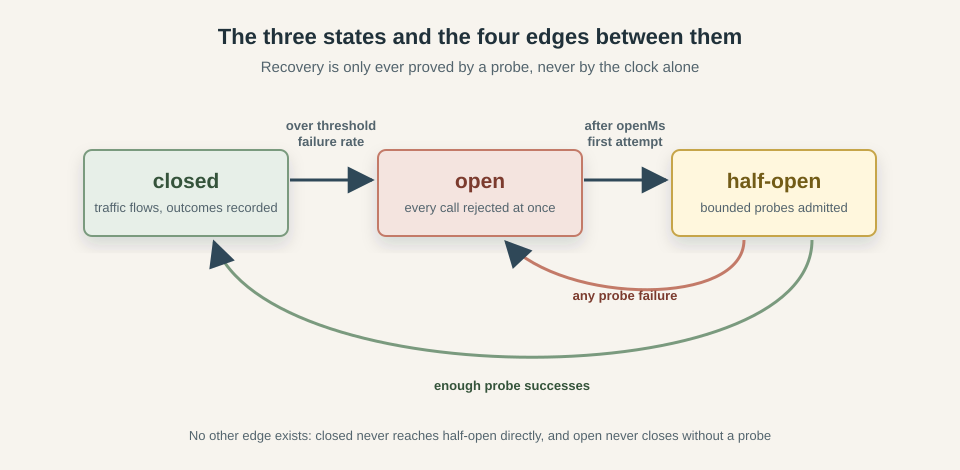
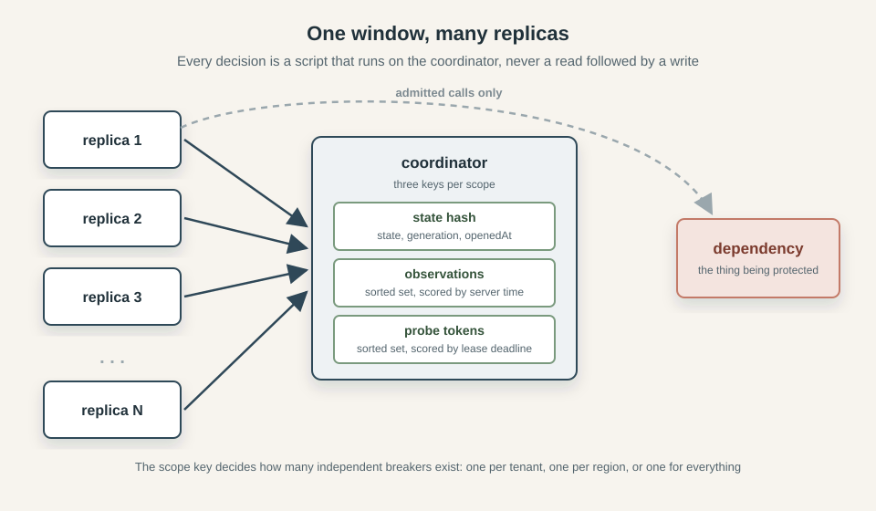
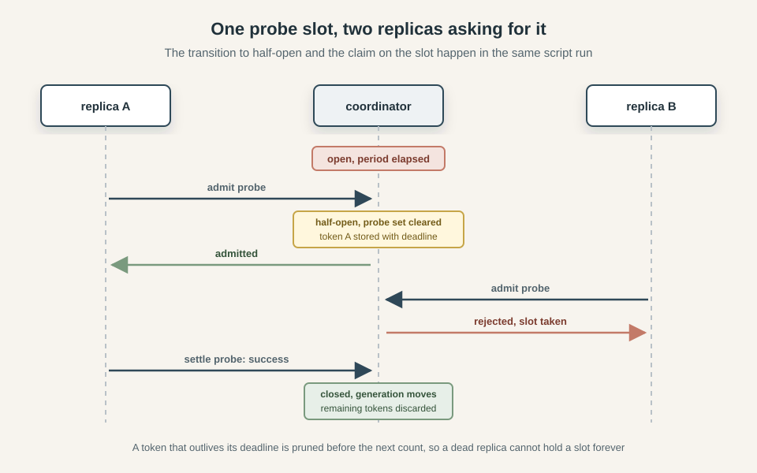
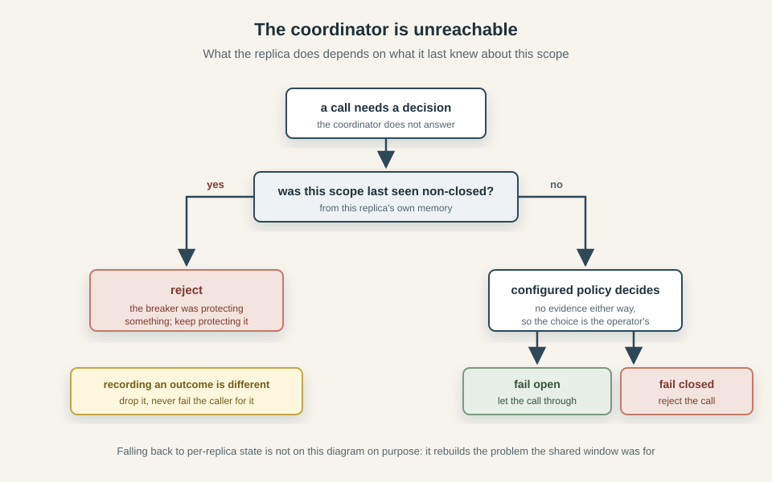

*Featured in [Node Weekly - 2026-09-17](https://nodeweekly.com/issues/641)*

*This series explores three classic resilience patterns: circuit breakers, bulkheads, and rate limiters. We build each from its in-process foundations and examine what changes when multiple replicas must share the same decisions. The examples come from [Caracal](https://github.com/gkoos/caracal), a TypeScript resilience library with working Redis-backed implementations.*

1. [How to Implement a Distributed Circuit Breaker](/posts/2026-09-14-How-to-Implement-a-Distributed-Circuit-Breaker/)
2. [How to Implement a Distributed Bulkhead](/posts/2026-09-17-How-to-Implement-a-Distributed-Bulkhead/)
3. [Rate Limiting Without the Refill Loop: Token Bucket vs GCRA](/posts/2026-09-22-Rate-Limiting-Without-the-Refill-Loop-Token-Bucket-vs-GCRA/)
4. [How to Implement a Distributed Rate Limiter](/posts/2026-09-24-How-to-Implement-a-Distributed-Rate-Limiter/)
5. [How to Combine Circuit Breakers, Bulkheads, and Rate Limiters](/posts/2027-09-25-How-to-Combine-Circuit-Breakers-Bulkheads-and-Rate-Limiters/)

Imagine you run a SaaS and your payment service starts timing out. Every checkout request that needs it now sits and waits for the full timeout before failing, holding a worker and a connection the whole time. The users who get an error press the button again, so the failing service receives more traffic than it did while it was healthy, and the callers upstream fill with requests that are all waiting on the same thing. Nothing here is down in a way that a health check would notice, the system is simply spending all of its capacity on calls whose outcome is already decided. [Beyond Happy Path Engineering: the Network](/posts/2026-07-01-Beyond-Happy-Path-Engineering-the-Network/) goes through this shape of failure in more detail, along with the timeouts and retry rules.

The answer usually is the [circuit breaker design pattern](https://en.wikipedia.org/wiki/Circuit_breaker_design_pattern): the caller keeps a record of how recent calls to that dependency went, and once the failure rate crosses a threshold it stops sending traffic there for a while, failing immediately instead. That takes load off a service which is already struggling and gives the caller its capacity back. Inside one process the whole thing is a sliding window of recent outcomes and a timestamp for when the breaker last tripped. It's discussed in [Stop Hammering Broken APIs](/posts/2025-09-17-Stop-Hammering-Broken-APIs-the-Circuit-Breaker-Pattern/), which ends by noting that it gets complicated once it has to work in a distributed system, and leaves it for a future article. This is that article.

Run the same service on twenty replicas and each one keeps its own window. Every replica has to be hurt independently before it reacts, so the dependency absorbs roughly twenty times the damage before anything trips at all. Moving the window into shared storage fixes that - at the cost of added complexity and potential performance bottlenecks. Once the window lives somewhere else, reading it and acting on it are no longer the same step, a result can arrive after the state it was recorded against has already changed, and the storage you just made load-bearing can itself go away.

This article covers the in-process version quickly, then moves on to what breaks when the state is shared and what to do about each failure. The code comes from [caracal](https://github.com/gkoos/caracal), a resilience library where the breaker is backed by Redis, so the examples are a working implementation rather than some pseudocode.

## The 3 states: closed, open, half-open

A breaker in the `closed` state passes every call through to the dependency and records how each one turned out. This is the normal operating state, and a healthy system spends effectively all of its time here. Once the recorded failure rate crosses the configured threshold the breaker moves to `open`, where it stops calling the dependency at all and rejects immediately. Rejecting everything leaves the breaker with no information about whether the dependency has recovered, because it is no longer making the calls that would tell it.

So how does it ever close again? The naive answer is to flip back to `closed` after a fixed cooldown, which sends the full traffic load at a service that may still be broken and produces the thundering herd described in [Stop Hammering Broken APIs](/posts/2025-09-17-Stop-Hammering-Broken-APIs-the-Circuit-Breaker-Pattern/). The `half-open` state exists to avoid that: after the open period elapses, a bounded number of probe attempts are admitted while everything else continues to be rejected, and the outcome of those probes decides what happens next. Enough successes close the breaker, and a single failure sends it straight back to open.

That gives us exactly four transitions:

| From | To | Trigger |
|---|---|---|
| `closed` | `open` | failure ratio reaches `failureThreshold`, after at least `minimumThroughput` observations |
| `open` | `half-open` | first admission attempt once `openMs` has elapsed |
| `half-open` | `closed` | `halfOpenSuccesses` probe successes |
| `half-open` | `open` | any probe failure |



The edges that are missing matter just as much as the ones that are there. A closed breaker cannot jump to `half-open`, since that state only means something as a recovery attempt from `open`. An open breaker cannot close directly, because recovery has to be demonstrated by a probe rather than assumed from the passage of time. Keeping that set small is what makes the state machine testable later on. Caracal's [property and fuzz suites](https://github.com/gkoos/caracal/tree/main/test) both encode this exact table and assert that no emitted transition ever falls outside it.

The second row deserves more attention, because there are two ways to build it. One is to schedule something: when the breaker opens, set a timer for the open period, and have it move the breaker to `half-open` when it fires. The other is to store the time the breaker opened and do nothing else, then compare that timestamp against the clock on every incoming call and make the transition inside the first call that finds the period has elapsed.

The second approach is usually the better. A breaker that has stopped receiving traffic has nothing to recover for, so a timer firing into an idle process only serves to make the state change on a schedule nobody is watching. It also means the state a breaker reports is always the result of a transition that really happened, rather than one a background task performed while the system was quiet. Dropping the timer removes a piece of per-breaker machinery that has to be created, cleared on every transition, and torn down when the process shuts down.

Under the lazy approach, the call that observes the open period has elapsed is the same call that wants to run the first probe, so noticing the transition and claiming a probe slot can happen in one transaction. With a timer, those are two separate events with a gap between them, and that gap is where every replica in a fleet can see a freshly half-open breaker at once and rush it together, causing the very thundering herd we were trying to avoid. The lazy approach is also simpler to implement, because it doesn't require a background task or any scheduling at all.

## The in-process breaker

Inside a single process the whole thing is pretty straightforward. The window of recent outcomes is a circular buffer of booleans with the failure count maintained as entries go in and out, so the threshold check never has to walk the buffer:

```ts
record(failure: boolean): void {
  const evicted = this.#buf[this.#head] === true
  if (this.#count === this.#size) {
    if (evicted) this.#failures--
  } else {
    this.#count++
  }
  this.#buf[this.#head] = failure
  if (failure) this.#failures++
  this.#head = (this.#head + 1) % this.#size
}
```

Around that sit two functions. One decides whether a call may proceed, returning `closed`, `half-open` or `rejected`, and it is where the lazy transition from the previous section lives along with the probe budget check. The other takes the settled outcome and feeds it back, either into the window or into the half-open success counter. The opening rule itself is a single comparison:

```ts
if (
  window.count >= minimumThroughput &&
  window.failures / window.count >= failureThreshold
) {
  transitionToOpen(context, "closed")
}
```

Without `minimumThroughput`, one failed call out of the first one ever made is a failure rate of 100% and the breaker opens on a single unlucky request.

What is less obvious is that even here, in one process with no network involved, results can arrive against a state that has moved on. Calls are concurrent, and a call admitted while the breaker was half-open may not settle until several transitions later. If that stale success is counted, it can close a breaker that another probe already re-opened. The fix is a generation counter that increments on every transition. Each call captures the current value when it is admitted, and its result is discarded if the value has changed by the time it settles:

```ts
if (admittedGeneration !== generation || admitted !== state) return
```

The caller still receives whatever the underlying call produced, it is only the breaker's bookkeeping that ignores it. Keep this in mind, as it is the seed of a much larger problem once the window is shared.

There is one more trap worth knowing about before moving on. A half-open probe occupies one of a small number of slots, and in the simple implementation nothing releases that slot except the attempt settling. A call that hangs forever therefore holds its slot forever, and with a probe budget of one that leaves the breaker stuck in `half-open`, rejecting everything, for the life of the process, the breaker has quietly become a permanent outage of its own making. You can prevent this with a timeout on the wrapped call, which is why a timeout belongs *inside* the breaker rather than around it. Its job there is not to improve the caller's latency but to guarantee that every admitted attempt eventually settles.

## Moving the window out of the process

Everything above assumes the breaker and the calls it governs live in the same memory. Take that away and each piece has to be rebuilt.

### Whose window is it

With a local breaker on twenty replicas, each one needs `minimumThroughput` observations of its own before it can react, and each one only sees the fraction of traffic the load balancer happened to send it. The dependency absorbs roughly twenty times the failures before the first breaker trips, and if traffic is spread thinly enough, some replicas never accumulate enough observations to trip at all. There is also no agreement about what state the system is in: at any moment some replicas are rejecting calls and others are sending them.

The fix is to keep one window in a store every replica can reach, and to make each replica ask that store rather than its own memory. The unit of sharing is a key, and choosing it is an important design decision. Everything mapped to the same key shares one window, one state and one probe budget:

```ts
scope: (ctx) => `region:${String(ctx.metadata.region)}`   // one breaker per region
scope: (ctx) => `tenant:${String(ctx.metadata.tenantId)}` // one breaker per tenant
scope: () => "global"                                     // one breaker for everything
```



A global scope reacts fastest, because every replica's failures land in the same window, but it also means one bad tenant or one bad region can open the breaker for everyone. Narrower scopes contain the damage at the cost of each window filling more slowly, which pushes you back toward the problem you were trying to solve. In caracal the full key is `(namespace, policy name, operation name, scope)`, so two different operations pointed at the same dependency keep separate windows by default.

Two practical notes. Scope keys end up in the coordinator's keyspace where they are visible to anyone with access to it, so they should be stable and contain nothing sensitive. And every replica sharing a key has to agree on the configuration behind it, since nothing stops one replica from using a different threshold against the same shared window.

### Reading and deciding are no longer one step

In a single process, checking the window and acting on what it says can happen in one go. Across a network they are two roundtrips, and whatever you read may be wrong before you act on it. A replica that fetches the window, computes a failure rate above the threshold and writes back `open` can be racing a dozen other replicas doing exactly the same thing, and the same is true of the probe budget, where every replica can read three slots free and every one of them can take the last slot.

The way out is to stop reading and deciding separately, and instead send the decision to where the data is. In Redis that means a Lua script, which runs to completion without interleaving. The client sends the outcome and the configuration, and the script does the recording, the evaluation and the transition as one indivisible operation, returning what it decided:

```lua
if wTotal >= minTP and wFail * 1000 >= threshNum * wTotal then
  gen = gen + 1
  redis.call('HSET', KEYS[1], 'state', 'open', 'generation', gen,
             'openedAt', now, 'probeCount', 0, 'probeSuccesses', 0)
  redis.call('PERSIST', KEYS[1])
  return {2, 1, gen, wTotal, wFail}
end
```

The second reason to push the work down is time. Every replica has its own clock and they do not agree, so a deadline written by one and compared by another is measured against two different notions of now. Timestamps that matter to the breaker are therefore read on the coordinator, from the same clock, on every call:

```lua
local t   = redis.call('TIME')
local now = t[1] * 1000 + math.floor(t[2] / 1000)
```

No timestamp ever travels from a client into a decision. Clock skew between replicas stops being something the breaker's correctness depends on, which removes an entire category of failure that is miserable to reproduce. (For more on time-related problems, see [Beyond Happy Path Engineering: Time](/posts/2026-07-19-Beyond-Happy-Path-Engineering-Time/).)

### The threshold does not survive the trip intact

Moving the comparison into Lua has a consequence that is easy to miss: Lua numbers are doubles, and a failure threshold is a fraction, so comparing `wFail / wTotal` against it invites the usual floating point surprises at the exact boundary the breaker is supposed to act on. The comparison above avoids division entirely by scaling the threshold to an integer numerator of thousandths, so `0.5` arrives as `500` and the test becomes `wFail * 1000 >= 500 * wTotal`.

That works, and it quietly narrows what a threshold can mean. Anything below `0.0005` rounds to a numerator of zero, which makes the comparison true no matter what the window contains, so the breaker opens on a window of pure successes and re-opens immediately after every recovery. Anything at or above `0.9995` rounds to `1000`, requiring every single observation to be a failure, so the breaker effectively never opens. Both are configurations that look reasonable in a config file and fail in a way that is hard to debug. The simplest solution is to reject them at the point of configuration, so no need to bother later:

```ts
function assertResolvableThreshold(failureThreshold: number): void {
  const numerator = Math.round(failureThreshold * FAILURE_THRESHOLD_SCALE)
  if (numerator < 1 || numerator >= FAILURE_THRESHOLD_SCALE)
    throw new RangeError(
      `failureThreshold must be at least 0.0005 and below 0.9995 (thresholds are resolved to thousandths); got ${failureThreshold}`,
    )
}
```

### Generations become epochs

The generation counter from the in-process breaker solved a small problem: discard a result that settles after the state it was admitted against has moved on. Shared state gives it a second job.

A local breaker empties its window on every transition, which is one line of code because the window is an array it owns. Doing the same remotely means another call to the coordinator, on a path that already costs a roundtrip, and it introduces a window of time where the state has changed but the observations have not been cleared yet. The alternative is to leave the old observations where they are and stop counting them. Each observation is written with the generation it belongs to, and counting only looks at members carrying the current one:

```lua
local member = tostring(gen) .. ':' .. uuid .. ':' .. outcome
redis.call('ZADD', KEYS[2], 'NX', now, member)
```

```lua
local prefix  = tostring(gen) .. ':'
for _, m in ipairs(all) do
  if string.sub(m, 1, #prefix) == prefix then
    wTotal = wTotal + 1
    if string.sub(m, -8) == ':failure' then wFail = wFail + 1 end
  end
end
```

A transition now costs nothing beyond incrementing a number, and the superseded observations age out on their own. The generation has become an epoch label as well as a staleness token, and those two roles are what makes the next part subtle.

Because the epoch is what decides membership, moving it is how you throw a window away, and *not* moving it is how you keep one. That is why the distributed breaker does not increment on the `open` to `half-open` edge, even though the local one increments on every transition. Recovery is a continuation of the same epoch, so the window stays. What has to be discarded there is the set of probe tokens from the previous recovery attempt, which is a separate key and a separate `DEL`.

There is a failure mode hiding in this arrangement: the state hash carries the current generation, and the observations are just members in another key, so if the hash disappears while the observations survive, which an eviction policy or an administrative delete will happily do, then a breaker that restarts its generation from zero adopts every orphaned member whose label happens to be zero. The window it believes is current is actually a window from the past.

Luckily, you can restart from a value nothing can be carrying. When the script finds no state hash but does find observations, it derives a fresh epoch from the incoming observation's own identifier:

```lua
if redis.call('EXISTS', KEYS[2]) == 1 then
  gen = tonumber(string.sub(redis.sha1hex(uuid), 1, 11), 16)
  if not gen or gen == 0 then gen = 1 end
else
  gen = 0
end
```

Forty-four bits is at most fourteen decimal digits, which stock Lua prints in full. A wider value can come out in scientific notation, and since the epoch roundtrips through the hash as a decimal string, a generation written as `1e+15` stops matching the members it labels. A number that cannot survive being printed and parsed is not usable as a key prefix.

### The probe budget has to be a global one

Half-open admits a small number of probes, and in one process that number is enforced by a counter that admission and settlement both touch. Twenty replicas each enforcing a budget of three means sixty concurrent probes arriving at a dependency that has just fallen over, which is the thundering herd the half-open state wants to prevent.

The budget has to live with the window, and it needs to handle a case the local version never faced: a replica that is admitted and then dies. A counter cannot recover from that, because the decrement it was relying on is never coming. So instead of a count, the coordinator keeps one member per in-flight probe, scored with the time its claim expires. Since 0.6.0 the local breaker arms the same probe lease, for a different wedge: a probe whose adapter promise never settles would otherwise hold half-open forever. Counting live probes means first dropping the ones whose deadline has passed:

```lua
redis.call('ZREMRANGEBYSCORE', KEYS[2], '-inf', now)
local activeProbes = redis.call('ZCARD', KEYS[2])
if activeProbes >= maxProbes then
  return {0, 2, gen, activeProbes, transitioned}
end
```



This is where the lazy transition from earlier pays off. The script above is the same one that moves the breaker out of `open`, so the call that notices the open period has elapsed is the call that takes the first slot, with no gap in between for anyone else to arrive. Had a timer performed the transition, every replica would learn about the new half-open state independently and race for the slots.

The expiring claim creates a problem of its own: once a deadline passes, the slot is available to whoever asks next, so a probe that was slow rather than dead can come back with a perfectly good result against a slot that now belongs to someone else. Counting it would mean acting on the outcome of a probe that, as far as the budget was concerned, was no longer running. The settlement script checks the deadline before doing anything with the result:

```lua
if tonumber(deadline) <= now then
  probeCnt = math.max(0, probeCnt - 1)
  redis.call('HSET', KEYS[1], 'probeCount', probeCnt)
  return {0, sc, gen}
end
```

Note what the deadline does *not* do. It is a backstop for probes that never report back, not a timer for probes that are simply taking a while, so a probe that settles normally releases its slot immediately rather than holding it until expiry. The same applies to a result the classifier decides to ignore: nothing is recorded and no progress is made toward closing, but the slot goes back into the pool so the next probe is not kept waiting for a deadline that has nothing to do with it.

### When the coordinator itself is the problem

Putting the window in shared storage means the breaker now has a dependency of its own, and that dependency can be unreachable at the exact moment a decision is needed. There is no correct answer here, only a choice about which failure you prefer, and the choice is different depending on what the replica already knows.

The case with a clear answer is a scope the replica has previously seen open or half-open. The breaker was protecting something, nothing has said it recovered, and the only reason the replica cannot confirm that is the coordinator being down. Letting calls through because the bookkeeping is unavailable removes the protection at the moment it is doing its job, so a scope known to be non-closed rejects regardless of configuration.

Everything else is genuinely ambiguous. A scope last seen closed, or never seen at all, gives no evidence that the dependency is in trouble. Blocking all traffic because a coordinator is unreachable turns one outage into two, which is usually worse than letting calls through unprotected. Usually, not always, and it depends on what the call does rather than on anything the library can work out, so it is a configuration option with a documented default rather than a decision made silently:

```ts
onCoordinatorError: "fail-open",  // or "fail-closed"
```

That is the same argument [Beyond Happy Path Engineering: the Network](/posts/2026-07-01-Beyond-Happy-Path-Engineering-the-Network/) makes about breakers generally, that opening one changes user-visible behaviour and should be tied to business priorities rather than buried in a library default. Refusing all checkouts during a Redis blip is a product decision, not an implementation detail.



Recording an outcome is a different matter from deciding about a call. If the coordinator is unreachable when a result comes back, there is nothing useful to do with it and no reason to fail a call that has already completed, so the observation is dropped. One missing datapoint moves a window of a hundred by one percent. The same applies to a probe settlement that cannot be delivered: the claim expires on its own and the slot returns to the pool without anyone needing to be told.

Remembering which scopes were non-closed has a cost, so it's worth being precise about what is kept. Only open and half-open are retained, because "closed" and "never heard of it" lead to the same decision and storing closed would grow the map with every scope the process ever sees. Entries are keyed by operation as well as scope, so one policy shared across operations cannot answer for the wrong one:

```ts
const keyFor = (operation: string, scope: string) =>
  JSON.stringify([operation, scope])
```

The caveat is that entries leave only when that same scope is later seen closed, which requires traffic. A scope that opens once and then goes quiet stays in the map for the life of the process, holding a belief that may be long out of date.

One option is falling back to a local breaker when the coordinator is unavailable. It is tempting, because the fallback looks like graceful degradation and the process keeps working, but what it actually does is rebuild the per-replica window that the shared one existed to replace, at the moment the system is already under stress, while continuing to report itself as a distributed breaker. A breaker that silently changes what it protects is worse than one that tells you it cannot decide.

### Trusting logic that runs somewhere else

Moving the decisions into Lua means the interesting behaviour no longer runs in the language the rest of the code is written in, cannot be stepped through in a debugger, and is exercised only when a real coordinator is present. That is a poor place to rely on reading the code carefully and hoping.

What works better is keeping a second implementation of the same contract in memory, then running both against the same generated sequences of operations and comparing the results field by field. Any disagreement is a bug in one of them, and it does not matter which, because the two were written from the same specification by different means. The in-memory version also makes most of the test suite runnable without a coordinator at all.

The trap with generated sequences is a generator that only produces boring ones. A run where the breaker never opens will pass happily and prove very little, so the suite counts how many times each interesting path was reached, opened, admitted, rejected at the probe limit, settled, transitioned, stale, and fails if any of them stayed at zero. The test verifies the behaviour, the counters verify the test.

## The settings are not independent

A distributed breaker has more settings than a local one, and each may look sensible on its own while the combination does nothing useful. They constrain each other, so changing one usually means revisiting the others too.

Shared observations cannot live forever, which gives the window two ways of forgetting one: by count, once enough newer ones have arrived, and by age, once its retention period has passed. Whichever comes first wins. Under normal traffic that is the count, on a quiet scope it is the age. If the window needs twenty observations before it may open and observations expire after a minute, a scope receiving ten calls a minute never holds twenty at once. It can fail every single call and stay closed forever. Whatever default a library picks for retention is a guess at a reasonable period rather than a measurement of your traffic, so a low-volume scope is worth checking by hand.

The same shape of mistake produces a breaker that cannot open for a different reason: a window smaller than the minimum number of observations required to evaluate it means the count-based trim removes entries before the window is ever big enough to be looked at. Along with the threshold bounds from earlier, this is the kind of thing worth rejecting when the breaker is configured rather than leaving to be discovered in production.

The lease on a probe slot has a range rather than a target. Too short and a live probe loses its slot while it is still running: the slot is handed to someone else, more probes run than the budget allows, and the original probe's result is discarded as stale when it finally arrives. It therefore has to exceed the slowest a probe can possibly take, which is what the timeout inside the breaker is for. Too long and a crashed replica's claim blocks recovery for that whole period, so the recovery window stalls while nothing is wrong with the dependency. Both ends of that range move when the timeout does. Since 0.6.0 the local breaker takes the same lease via `probeLeaseTtlMs` (defaulting to `openMs × 2`), so the range argument applies in-process too - there it reclaims a probe whose adapter promise never settles, rather than one whose replica died.

The number of successes required to close interacts with the probe rate in a way that is easy to get wrong. Any single probe failure resets progress and sends the breaker back to open, so requiring many successes on a scope with a low probe budget means recovery depends on a long unbroken run. On a dependency that is mostly better but still occasionally failing, a high value keeps traffic shut off long after it recovered.

Then there is the storage itself. Since a missing state record reads as closed, letting an open breaker expire silently admits all traffic and loses the epoch that labels the current window, so a breaker that is not closed must not be allowed to expire at all. Only the closed state can carry an expiry, for cleaning up scopes that have gone quiet, and even that is bounded below by the window retention: the record that says which epoch is current has to outlive the observations carrying that label, or the orphan problem from earlier is created deliberately by the cleanup.

One last thing that is not a setting: a distributed breaker reads the coordinator's clock and a local one reads the host's, so a machine whose clock steps backwards extends its open period and one that steps forward can admit a probe early. Neither breaks anything, but if you are comparing recovery timing between the two and the numbers do not line up, the clock is a reasonable place to look.

## Closing

The rule at the centre of all this is still the one from the top of the article: count the recent outcomes, and if too many of them failed, stop calling for a while. But in distributed systems the simple rule is now surrounded by complex logic and a dozen ways to get it wrong.

Most of the work goes into problems the local version never had. The window belongs to a key rather than a process, so the key has to be chosen. Reading and deciding are two roundtrips, so the decision moves to the data. A result can arrive for a window that no longer exists, so observations carry the epoch they belong to. The probe budget is global, so a slot has to be claimable and reclaimable from a replica that has died. The store holding all of it can be unreachable, so there has to be an answer for that which does not quietly turn the breaker into something else. None of these are exotic, they are the same problems that appear whenever shared state replaces local state, and they show up here in a smaller system to see all of them at once.

If you want to read the whole implementation rather than the excerpts, it is in [caracal](https://github.com/gkoos/caracal), where the breaker runs either against local memory or against Redis behind the same interface, so both variants can be compared directly.