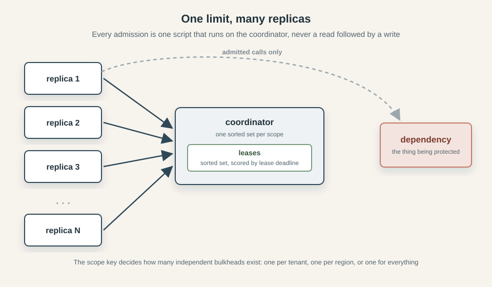
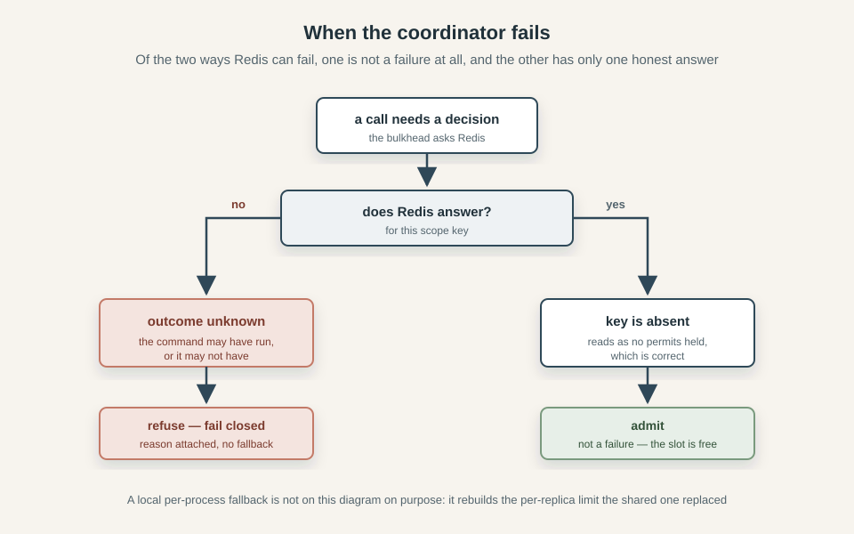

*This series explores three classic resilience patterns: circuit breakers, bulkheads, and rate limiters. We build each from its in-process foundations and examine what changes when multiple replicas must share the same decisions. The examples come from [Caracal](https://github.com/gkoos/caracal), a TypeScript resilience library with working Redis-backed implementations.*

1. [How to Implement a Distributed Circuit Breaker](/posts/2026-09-14-How-to-Implement-a-Distributed-Circuit-Breaker/)
2. [How to Implement a Distributed Bulkhead](/posts/2026-09-17-How-to-Implement-a-Distributed-Bulkhead/)
3. [Rate Limiting Without the Refill Loop: Token Bucket vs GCRA](/posts/2026-09-22-Rate-Limiting-Without-the-Refill-Loop-Token-Bucket-vs-GCRA/)
4. [How to Implement a Distributed Rate Limiter](/posts/2026-09-24-How-to-Implement-a-Distributed-Rate-Limiter/)

Say your service calls a partner API that answers in 80 ms, and you have sized it for thirty of those calls in flight at once. Then they have a slow afternoon, or your traffic doubles, and 80 ms becomes two seconds. Nothing fails and no health check notices. Every request that calls that API now holds a worker, a socket and a few hundred kilobytes of buffers while it waits for an answer, and response times climb on every endpoint - including the ones that never speak to the API at all, because the process has one worker pool and one event loop. You keep starting requests you can no longer finish, and the partner gets slower because you are sending it more.

That's what a [bulkhead](https://learn.microsoft.com/en-us/azure/architecture/patterns/bulkhead) is for. The name comes from shipbuilding, where a hull is divided into watertight compartments so that one flooded compartment does not sink the ship. In software it is a cap on how many calls to a dependency may be in flight at once, with everything above the cap refused immediately rather than queued. The point is containment, not throughput: a bulkhead deliberately finishes fewer requests so that the ones it does finish stay fast and the rest of the service keeps working. [Beyond Happy Path Engineering: the Network](/posts/2026-07-01-Beyond-Happy-Path-Engineering-the-Network/) goes through this shape of cascading failure in more detail, along with the timeouts and retry rules that belong around it.

Inside one process the pattern is astonishingly simple: it's basically a counter, incremented on admission and decremented in a `finally`, compared against a limit. Run the same code on twenty replicas and things get messy. If 40 replicas each enforce a local concurrency limit of 20, the downstream can still receive 800 concurrent requests. In this article, we examine the pattern, quickly cover the in-process version, then move on to what changes when the counter moves out of the process: permits, leases, renewal, ownership, and what a shared limit can guarantee. The code comes from [Caracal](https://github.com/gkoos/caracal), a resilience library where the bulkhead is backed by Redis, so the examples are a working implementation rather than some pseudocode. It is a sequel to [How to Implement a Distributed Circuit Breaker](/posts/2026-09-14-How-to-Implement-a-Distributed-Circuit-Breaker/).

## What a bulkhead is (and is not)

A bulkhead is a cap on how many calls may be in flight at once. When the cap is reached, the bulkhead rejects and the call simply fails. The mechanism is called *shedding*, and what a shed request turns into - a cached answer, a degraded response, a job in a queue you own - is the caller's decision rather than the library's. That split is easy to keep straight inside one process and harder to hold across twenty, which is why our distributed bulkhead has no queue at all.

There is no state machine either, nothing transitions, nothing cools down, nothing probes. A breaker remembers outcomes, a bulkhead remembers holders. It's worth comparing three similar patterns that protect a service from a dependency, because they are often confused:

| Pattern | What it measures | What it protects | Fires when |
|---|---|---|---|
| Rate limit | calls per unit of time | the downstream's request budget | traffic is arriving too fast |
| Circuit breaker | failure ratio over a recent window | the caller's capacity, by not calling a broken dependency | the dependency is failing |
| Bulkhead | calls in flight *right now* | your capacity, and the dependency's concurrency | work is piling up |

The ship metaphor deserves one more look, because it is more exact than it appears. A bulkhead is not a pump that drains an overloaded dependency and not a valve that admits traffic at a measured rate: it is a wall. Water stays on one side of it whether or not the flooding ever stops, and the compartment behind it stays dry. Where you build the wall is the `scope`, and the rest of this article is largely about the fact that a wall only does its job if the whole fleet can see it.

## The in-process bulkhead

Inside one process the whole thing is a counter and an array. The counter is occupancy, the array is the queue, and admission is a comparison:

```ts
let occupancy = 0
const waiting: (() => void)[] = []
// ...
if (occupancy >= limit) { /* queue or reject */ } else occupancy++
event(context, "local", name, "process", "admitted", occupancy)
```

That's it. There is no window to fill, no threshold to cross and nothing to sample: either a slot is free or it is not, and the answer is immediately available because the process asking is the process holding the state.

The queue is optional and bounded at both ends. In Caracal, `queue: { limit: 24, timeoutMs: 250 }` holds up to 24 waiters in FIFO order, and a waiter consumes no permit while it waits - it is holding a place, not a slot. One that runs out of time or is cancelled leaves the queue and rejects with reason `wait-timeout` or `cancelled`, so the queue can neither grow without limit nor hold a caller indefinitely. What it does do is **turn a rejection into latency**: those 24 callers are not refused, they are delayed, by a number you chose. We'll later explain why that trade has no distributed equivalent.

The release is where the local version already states the rule the distributed one will have to enforce by other means:

```ts
try {
  signal?.throwIfAborted()
  return await next(context)
} finally {
  occupancy--
  event(context, "local", name, "process", "released", occupancy)
  waiting[0]?.()
}
```

Read it from the inside out. `next(context)` is the rest of the pipeline - ultimately the actual API call. A policy does not perform the work, it decides whether the work may run, then hands it down and returns whatever comes back. The `return await` is that hand-off: run the call, pass its result or its rejection up unchanged.

`signal?.throwIfAborted()` is the bulkhead checking, one last time, whether the caller has already given up. Caracal threads an admission signal through the pipeline that a timeout or a cancellation aborts, it is what drops a queued waiter and what stops a fresh attempt from starting, and it is deliberately never forwarded to the adapter. The `?.` is because the signal is optional - with no signal there is nothing to check.

Inside `finally`, `occupancy--` gives the slot back on every path out of the block. `waiting[0]?.()` wakes the oldest queued waiter: each waiter is a function, calling it admits that waiter and resolves its wait, and `?.()` means "call it only if one exists", since an empty queue has no `waiting[0]` and calling `undefined` would throw.

A permit belongs to the work, not to the caller. Because the release lives in a `finally` around `next(context)`, a caller that gave up at 500 ms - a timeout above it, a client that disconnected - keeps its slot until the underlying call settles. The caller can leave early; the permit cannot. Since 0.6.0 `bulkhead.local` takes an optional `leaseMs` that aborts a holder which has not settled by then, so an adapter that declares abort supported settles on the abort and the `finally` releases the slot early - the permit can leave early too, once you opt in.

Two details in that block are worth another look. First, the order of the last two lines: `bulkhead.released` is emitted before the queued successor is granted its permit, so that the released/admitted pair reads monotonically. Grant first and the release event's occupancy would already include the next admission, which makes the graph show occupancy rising before the permit came back. Nobody notices until they try to plot it.

The second is that a permit is only as good as the promise underneath it. A call that never settles holds its slot forever, and with `limit: 1` that is a permanent self-inflicted outage with nothing failing loudly enough to explain it. A `timeout` in the pipeline is what guarantees settlement, for the same reason the breaker article bounds a probe: a probe's lease has to outlast the slowest probe there can be, and the timeout inside it is what makes that bound finite. There is one difference though, and it comes back later: when an adapter declares `abort: "unsupported"`, the attempt settles as far as the policy is concerned while the work keeps running, and the permit stays held.

Against the local breaker, the local bulkhead has very little to get wrong. No window, no generation counter, no transitions. The only stale-state question it has is whether every permit came back exactly once, and the answer is simply the `finally` block that runs on every path out of the block, including the ones that throw.

## Moving the limit out of the process

The [breaker article](/posts/2026-09-14-How-to-Implement-a-Distributed-Circuit-Breaker/) worked through three problems: whose window it is, that reading and deciding stopped being one step, and that the shared storage became load-bearing. A bulkhead has all three, plus a fourth the breaker never met: a permit has to be returned by a process that may no longer exist. The shared state also changes: a breaker describes the past and can be corrected by the next observation, while a bulkhead describes the present, and being wrong about the present can cost.

### Whose limit is it

A limit only means something if every replica agrees on what it is counting against. 40 replicas at a local limit of 20 is 800 concurrent calls, but 40 replicas at a shared limit of 20 is 20 concurrent calls. The local policy counts its own occupancy, the distributed one counts the occupancy of all replicas together. The local policy can only see its own permits, the distributed one can see all of them.

In Caracal, which budget a call belongs to is the `scope` function, which maps each execution to a string key:

```ts
scope: (ctx) => `region:${String(ctx.metadata.region)}`   // one budget per region
scope: (ctx) => `tenant:${String(ctx.metadata.tenantId)}` // one budget per tenant
scope: () => "global"                                     // one budget for everything
```



Everything that resolves to the same string shares a budget. Scopes need to be chosen carefully: a too-narrow breaker scope reacts slowly, each window filling lazily, while a too-narrow bulkhead scope allows more concurrency than you asked for.

### A permit that nobody can return

In the local version the permit always comes back, because the `finally` runs on every path out of the block, but a dead process does not get a `finally`. It stops between acquire and release, and the permit it held is gone with it - not returned, not queued, gone. A shared counter only decrements when someone decrements it, so occupancy never falls back. Every crash leaks a permit, and the leak is permanent: run long enough - deploys, OOM kills, spot instances - and a limit of 20 quietly becomes 12, then 8, then 3.

The fix is to make the permit **expire**. Give each admitted claim a lease that is valid for a fixed time and only stays valid while its holder renews it. A healthy replica keeps its permit alive by renewing on a timer. A dead one stops renewing, the lease lapses, and the slot returns to the pool without anyone having to be told. Expiry is the only release a dead holder can still perform.


A lease is not proof that the work stopped, it just proves that nothing has been heard from the holder for a while. A process can be alive and doing the work while its lease lapses - a garbage-collection pause, a network partition, a stalled event loop, a Redis restart - and once the lease is gone a successor can be admitted for the same slot while the original work is still running downstream. The distributed bulkhead does not know whether the work is still running, it only knows that the holder has not renewed its lease. The caller can still cancel, and the adapter can still abort, but the policy cannot claim that the work has stopped.

Caracal names the window `leaseMs`, defaults it to 30 seconds, and renews at about a third of that so a single missed renewal is not enough to lapse a healthy permit. The sizing rule is the one that bounded the breaker's probe: make the lease comfortably longer than the slowest the work can take - `max(p99 × 3, 30_000)` is the documented starting point - because too short loses live permits and too long stalls recovery after a real death. When renewal fails, the policy marks the lease lost, emits `bulkhead.lease-lost`, and asks the adapter to abort if it can - but it does not claim the work stopped, and it does not try to reacquire the slot. Since 0.6.0 `bulkhead.local` takes the same optional `leaseMs` with the same abort-on-expiry behaviour, minus the crash-detection job: a dead holder vanishes with its process, so the lease there reclaims a hung holder instead.

### The decision moves to the data

As we saw, locally check-then-increment is atomic because nothing can happen between the check and the increment. Across a fleet it is a race. Two replicas both ask how many permits are live, both hear "4, limit 5", both admit - and the dependency gets 6 (2 on top of the 4), when the limit is 5. Reading the count and acting on it are two round-trips, and the answer is stale the moment the first reply leaves Redis. The breaker article calls this *Reading and deciding are no longer one step*, a bulkhead needs to address it too.

The fix is to stop reading a number and deciding on it, and to send the decision to Redis instead. One atomic operation does the whole admission: expire the leases whose time is up, count what is left, and either record a new claim or refuse - then return the decision and the new count from the same transition. The replica never trusts a separately read count because it never reads one: the check, the increment and the expiry are one step in one place.

The whole admission is one Lua script, sent to Redis and run there in a single step:

```lua
local action = ARGV[1]
local token = ARGV[2]
local ttl = tonumber(ARGV[3])
local limit = tonumber(ARGV[4])
local time = redis.call('TIME')
local now = time[1] * 1000 + math.floor(time[2] / 1000)
redis.call('ZREMRANGEBYSCORE', KEYS[1], '-inf', now)
local existing = redis.call('ZSCORE', KEYS[1], token)
if action == 'release' then
  return redis.call('ZREM', KEYS[1], token)
end
if action == 'renew' and not existing then return 0 end
if action == 'acquire' and existing then return 1 end
if action == 'acquire' and redis.call('ZCARD', KEYS[1]) >= limit then return 0 end
redis.call('ZADD', KEYS[1], now + ttl, token)
local latest = redis.call('ZREVRANGE', KEYS[1], 0, 0, 'WITHSCORES')
redis.call('PEXPIREAT', KEYS[1], math.ceil(tonumber(latest[2])))
return 1
```

Release is where ownership shows up. A release is not "decrement the count", it's "remove *this* permit". Each admission is recorded under a token the acquirer generated, and release removes that token, not the slot. If a permit expired and the slot was handed to a successor, the old token is no longer in the set, so the late release removes nothing and the successor's permit stands. An expired or replaced token cannot free a slot it no longer owns, which is the only way release stays accurate once permits can outlive their holders.

Two lines in it do more than they look. The `TIME` read is the server clock taken *inside* the script, so pruning and admission see the same time - the same move the breaker makes for its epochs. The token earns its keep twice: a retried acquire for the same token returns "allowed" again rather than counting twice, so an acquire whose reply was lost on the network cannot double-admit. One thing is still assumed: that Redis answers, we'll come back to it later.

### What a permit actually holds

A permit is held for the work, not for the caller. The local section said the caller can leave early but the permit cannot; shared, that rule decides everything about how a saturated bulkhead behaves. The permit covers the adapter promise (the underlying call), not the caller's wait for it and not the retry loop around it. It is released only when the adapter promise settles, and nothing the caller does before that - timing out, disconnecting, cancelling - frees the slot.

That sounds like a bug, but it's not. What the permit protects is concurrency at the dependency, and that concurrency is produced by the work, not by the caller's patience. When a caller times out at 500 ms, the call it started is still running downstream - still holding a connection, still burning a worker, still counting against whatever the dependency can handle. Releasing the permit at that moment would lie about the load: it would tell every other replica "a slot is free" while the thing that fills the slot is still there. The caller leaving early does not reduce the load, only the work settling does.

Where "the work" ends is then a definition the adapter makes, and it is worth choosing deliberately. Caracal's fetch adapter settles when the response headers arrive, so streaming a large body happens outside the permit - right for most callers, wrong if the body is the capacity you are protecting, in which case you write an adapter that settles when the body is done. The adapter promise is the accounting unit, not proof that the remote has finished. It's the line where you say the call is over.

Measured in [caracal-sandbox](https://github.com/gkoos/caracal-sandbox), this is a two-second query behind a 500 ms timeout holding its permit for about two seconds. The demo's Postgres study sets the bulkhead limit to 1, the timeout to 500 ms, and runs a `pg_sleep(2)` behind an adapter that declares abort unsupported. The longest permit hold recorded is 2,029 ms. The caller gets its timeout on schedule and the slot stays occupied until the query actually finishes. The result is what a bulkhead is for: a slow dependency keeps the bulkhead full for as long as its calls are slow, everything above the limit is shed, and the permit does not hurry the work - it makes the load visible and refuses to add to it.

### The queue that does not exist

The local bulkhead had an optional queue - waiters hold a place, not a slot, for a bounded time. The distributed bulkhead has no such thing, and it is not a missing feature. A queue needs an owner, and a fleet has none.

A local queue works because one process owns it. FIFO is a real ordering: the next waiter in the array is the next one served. A waiter can be timed out locally, because the timer lives in the same process as the array. Both of those depend on there being one place where "who is next" and "has this waiter given up" are decided.

Move the queue into Redis and both dissolve. "Who is next" has no answer, because a fleet has no single order of arrivals - the closest you can get is to poll Redis for a free slot, which turns a rejection into latency and multiplies the traffic against it by the number of waiters, at exactly the moment it is busiest. "Has this waiter given up" has no owner either: the waiter's process might be the one that stops existing, and no other replica is in a position to time it out or hand its place to someone else. A queue there would have to settle an ordering nobody owns, for a benefit the bulkhead can do without; its job is containment, not patience.

So the distributed bulkhead sheds immediately. There is no wait and no fairness across replicas, there is no promise about who gets in next. What happens to a shed request - a cached answer, a degraded response, a job enqueued in a system you own - is the caller's decision, not the library's. That is a product statement rather than a technical one, and it is the "degrade deliberately" argument from [Beyond Happy Path Engineering: the Network](/posts/2026-07-01-Beyond-Happy-Path-Engineering-the-Network/) made concrete: the library says "no" immediately, and you decide what "no" means.

It doesn't make the local queue useless though. It genuinely absorbs a short burst without shedding a single request, which is why the two coordinations differ rather than one being a subset of the other. But the queue is a property of the process that owns it, not of the limit, and it does not survive the move to shared state.

### When the shared storage itself fails

Now the bulkhead depends on Redis, and Redis can fail. There are two failure modes:

A missing record is not really a failure. Redis answers, the key is absent, and the bulkhead reads "no permits held" - which is correct, and which is exactly the state to admit into. This is also why recovery after a lease lapse needs no ceremony: the slot is not freed, it is simply no longer held.

Redis that will not answer is the hard case, because a timed-out command has an unknown outcome. It may have run on the server before the reply was lost, so "refused" and "admitted" are both possible. Treat the timeout as a denial and you under-serve, treat it as an admission and you might be the sixth caller of a five-call limit, running work against a slot that was never yours. The only honest answer to an unknown is to refuse, and to say that you refused because you could not find out.

That is fail closed, and it is the bulkhead's answer, with no local fallback. The breaker can afford more nuance - it remembers which scopes were last seen open so it can keep refusing a failing one while admitting the rest, as the *When the coordinator itself is the problem* section of the breaker article describes - because it has state worth remembering. A bulkhead has none: its record is "permits held" or "not", and "not" reads the same as "free". So there is nothing to remember, and every uncertain admission is refused.

The fallback that tempts everyone is a local counter: when Redis is unreachable, admit against a per-process count and keep serving. In the breaker article we already saw why it's not a great idea, and the argument is identical here. The fallback rebuilds the per-replica limit the shared one replaced, at the exact moment of maximum stress, while continuing to report itself as distributed. A bulkhead that quietly stops limiting what it claims to limit is worse than one that refuses and tells you why.



Caracal does this too. When the acquire cannot reach the shared storage it throws a `CoordinatorUnavailableError`, starts no adapter call, and records the admission as unknown rather than admitted or denied. The caller decides what "I don't know" means, which is the same no as a full bulkhead with a different reason attached.

### Multiple bulkheads, acquired in order

A real call rarely touches one constrained resource. A checkout touches the partner API and the shared database pool, and wrapped in two bulkheads it needs two permits. It takes them in array order, and the taking is not atomic: the first permit is granted before the second is even asked for.

The problem shows up when the second bulkhead is full. The first permit is already held, and it stays held while the second one rejects or waits, so a call that will never run has spent capacity in the first limit for the whole duration of the check. Under load, "one permit in each of two limits" from many callers is how two independent budgets get eaten by calls that never start. It is not a deadlock - there is no distributed queue, so the second rejection fails fast instead of blocking - but it is waste, and waste is what a bulkhead should prevent.

The rules are simple. Take the same pair of limits in the same order everywhere, so two operations cannot each hold the first permit while waiting on the other's second. Prefer immediate rejection when composing budgets, because a queue on the inner bulkhead does nothing but hold the outer permit longer. Anything fancier - like a "permit pool" that acquires across resources atomically - is a bigger problem than the one it solves.

### Trusting logic that runs somewhere else

The admission logic lives in a Lua script now, in a place you cannot step through with a debugger, so reading the code carefully stops being enough. The breaker article explains the response: keep a second implementation of the same contract in memory, run both against the same generated sequences, compare field by field, and count that each interesting path was actually reached, so a boring generator cannot pass. A bulkhead needs all of that - and it is not enough.

Not enough because those techniques verify *decisions*, and a bulkhead's interesting failures are not decisions. Two implementations can agree perfectly on who gets admitted and still say nothing about a process that dies between acquire and release, a lease that lapses while the work runs, an event loop that freezes and stops renewing. An in-memory twin reproduces none of that, because none of it is a decision. The evidence has to be behavioural and multi-process: real replicas against a real coordinator, broken on purpose, read from an instrument that is not the code under test.

[caracal-sandbox](https://github.com/gkoos/caracal-sandbox)'s chaos study does exactly that. Four replicas share a limit of 3 on a 600 ms lease, and the witness is Redis itself, sampling the live lease count every 50 ms independently of the replicas. Three seconds in, one replica is killed mid-permit; two seconds later another is frozen for 1,500 ms, longer than its lease. The live count never exceeds 3 through any of it and ends at 0, with `lease-lost` firing for the frozen worker. The kill is the leak from *A permit that nobody can return* recovered - a dead holder never releases, so its lease lapses and the slot returns. The freeze is the honest limit from *What a permit actually holds* made visible - the lease expires out from under a worker whose call may still be running, and the code reports it rather than pretending otherwise.

## What a bulkhead can guarantee

Here is the whole of what a distributed bulkhead promises, and it is short. Under healthy coordination - a reachable Redis, renewal firing on time, every replica agreeing on the configuration - admitted concurrency stays within the limit per scope. That's all.

It does not hold through failures. A lease can lapse while the work is still running, and a successor can be admitted into the slot; a coordinator that will not answer is an unknown outcome, not an admission and not a denial. What the design does instead is announce each of those moments: a lapsed lease is an emitted `lease-lost` event, an unreachable coordinator is a refusal with the reason attached, and nowhere does the code claim the work stopped when all it knows is that nothing was heard.

The settings are not independent, and `leaseMs` is the one that needs the most care. It has a range rather than a target. Too short, and a live permit lapses while its holder is still working, so the successor admits overlapping work that the healthy path exists to prevent. Too long, and a real death blocks the slot for the whole period - capacity reserved for a process that is gone. The breaker article makes the same argument about probe slots, and the same cure applies: the timeout inside the policy bounds the slowest the work can take, so both ends of the lease's range move when the timeout and the workload do.

Which is the honest way to say what a bulkhead is. It is not a promise that the dependency never sees more than N calls at once, that promise fails the first time a lease lapses or a coordinator goes quiet. It is a system for keeping the set of claims visible, bounded, and recoverable when a holder disappears. If you need the stronger thing - that the work itself cannot overlap - that is downstream fencing, and a bulkhead is not that.

## Closing

The rule at the centre of all this is still the one we started this writeup with: a bulkhead is a counter and a queue. Increment on admission, decrement on release, refuse everything above the limit. But once the counter is shared, that simple rule is surrounded by machinery, and every piece of it exists because a claim about running work has to survive the thing it describes disappearing.

Most of the work goes into problems the local version never had. The counter belongs to a key rather than a process, so the key and the scope have to be chosen. A permit has to be returned by a process that may no longer exist, so it becomes a lease. Reading and deciding are two round-trips, so the decision moves into the shared data. A release has to prove it owns the slot, so it carries a token. The limit is enforced by a store that can go away, so there has to be an answer for that which does not quietly turn the bulkhead into something else. None of these are exotic - they are the same problems that appear whenever shared state replaces local state, and a bulkhead is small enough to see all of them at once.

And the difference from the breaker, the point the article has been circling around since the limit left the process: a circuit breaker can be wrong about state and correct itself on the next observation. A permit cannot - by the time you know it was wrong, the work has already run downstream. That is why the bulkhead's hard part is not the counting and not the deciding, but the owning, and why every honest answer here is a way of saying what the system does and does not know.

If you want the whole implementation, not just the excerpts, it is in [caracal](https://github.com/gkoos/caracal), where the bulkhead runs either against local memory or against Redis behind the same interface, so they can be compared directly. The measurements are reproducible in [caracal-sandbox](https://github.com/gkoos/caracal-sandbox), and the shared-state mechanics this article pointed at are in the [distributed circuit breaker](/posts/2026-09-14-How-to-Implement-a-Distributed-Circuit-Breaker/) article.
