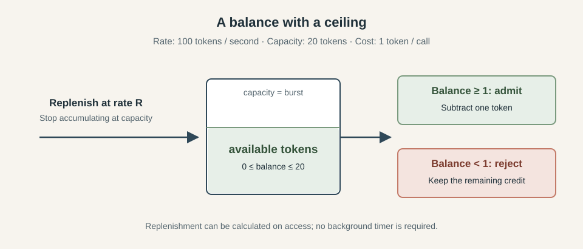
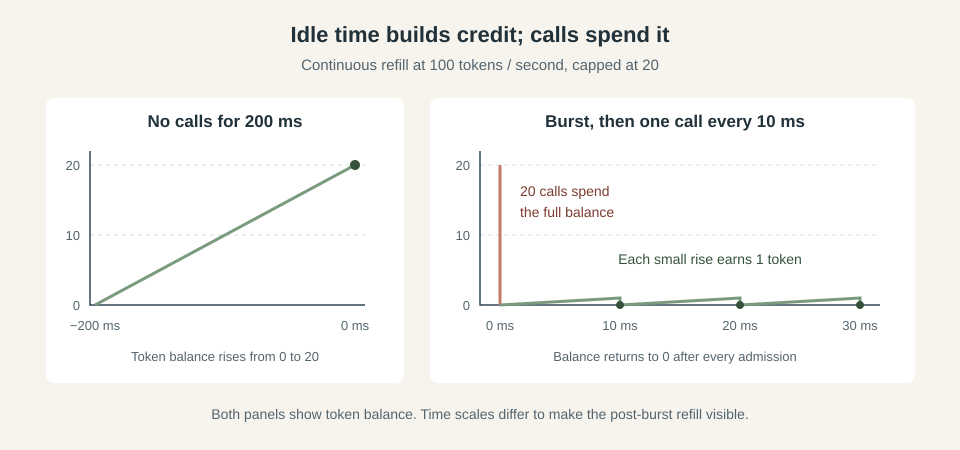
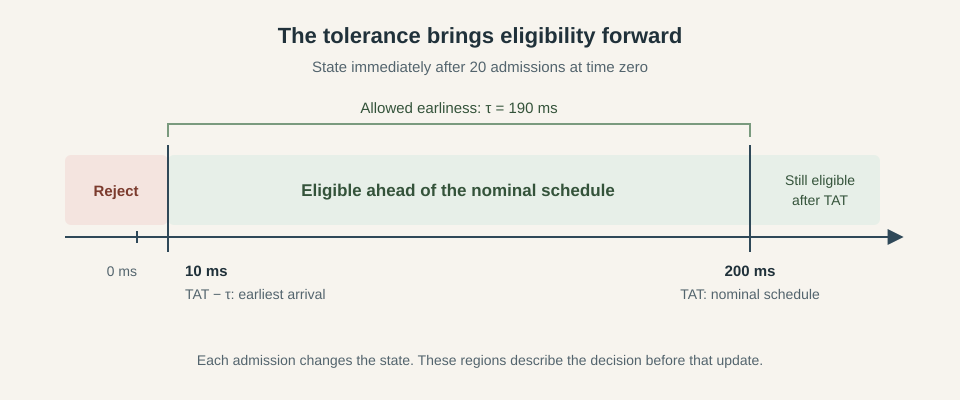
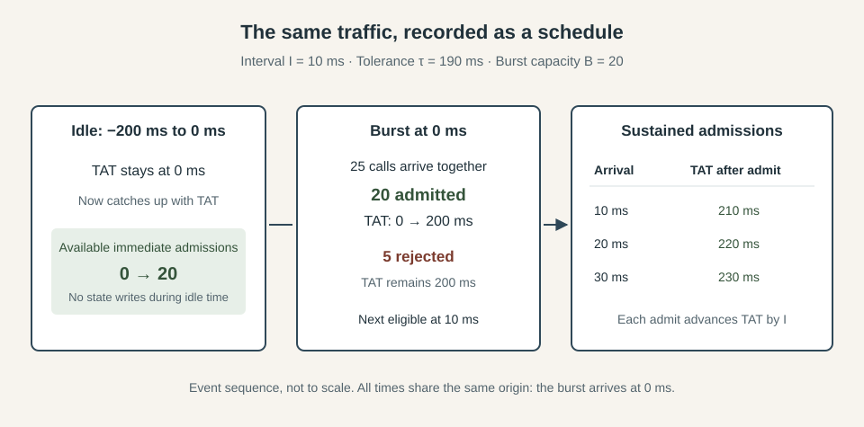
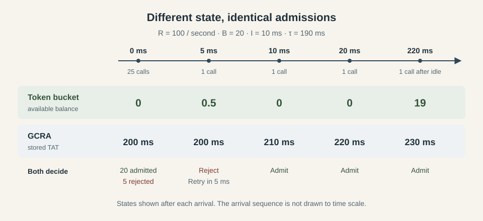

*This series explores three classic resilience patterns: circuit breakers, bulkheads, and rate limiters. We build each from its in-process foundations and examine what changes when multiple replicas must share the same decisions. The examples come from [Caracal](https://github.com/gkoos/caracal), a TypeScript resilience library with working Redis-backed implementations.*

1. [How to Implement a Distributed Circuit Breaker](/posts/2026-09-14-How-to-Implement-a-Distributed-Circuit-Breaker/)
2. [How to Implement a Distributed Bulkhead](/posts/2026-09-17-How-to-Implement-a-Distributed-Bulkhead/)
3. [Rate Limiting Without the Refill Loop: Token Bucket vs GCRA](/posts/2026-09-22-Rate-Limiting-Without-the-Refill-Loop-Token-Bucket-vs-GCRA/)
4. [How to Implement a Distributed Rate Limiter](/posts/2026-09-24-How-to-Implement-a-Distributed-Rate-Limiter/)
5. [How to Combine Circuit Breakers, Bulkheads, and Rate Limiters](/posts/2027-09-25-How-to-Combine-Circuit-Breakers-Bulkheads-and-Rate-Limiters/)

Say your service sends requests to a partner API with a budget of 100 calls per second and permission to send up to 20 at once after a quiet period. A batch of jobs becomes ready, and every worker wants to send its request immediately. The API is healthy and your workers have capacity, but you still need to decide which calls may start without spending that budget too quickly. A [rate limiter]((https://learn.microsoft.com/en-us/azure/architecture/patterns/rate-limiting-pattern)) makes that decision before each call begins: given a sustained rate and a bounded burst, may this call start now?

The **rate** controls how quickly the budget becomes available over time, while the **burst** sets how much unused allowance can accumulate for an immediate cluster of calls. With continuous replenishment at 100 calls per second and a burst of 20, a sender that has been idle long enough to recover its full allowance can start 20 calls together. After spending that allowance, it earns another admission every 10 milliseconds, assuming each call consumes one unit of the budget. The burst lets short clusters through while keeping the long-run admission rate within the replenishment rate.

Rate and concurrency limits control different aspects of the load sent to a dependency. A rate limiter controls how quickly calls may begin, while a [bulkhead](/posts/2026-09-17-How-to-Implement-a-Distributed-Bulkhead/) caps how many may be in flight at once. They complement each other: even within the allowed request rate, slow calls can accumulate, so a bulkhead provides a separate ceiling on concurrent work.

The intuitive way to implement a rate limiter request is a **token bucket**: picture a bucket that fills with tokens at a fixed rate, up to a fixed capacity, with each call taking one token before it starts. The refill rate sets the sustained allowance, and the capacity sets the burst. The **Generic Cell Rate Algorithm**, or **GCRA**, on the other hand, expresses the allowance as a schedule instead, keeping a timestamp and deciding whether each call has arrived too early. We'll begin with the bucket, then work through GCRA and show how the two models admit the same traffic under equivalent settings. From there, we'll compare their bookkeeping and retry hints to see when each representation is the better fit.

## The token bucket

A token bucket holds up to $B$ tokens and replenishes them at a rate of $R$ tokens per second. Each call costs one token, so admission means checking the balance and subtracting one if enough credit is available. A balance below one means the call cannot start yet, even if the bucket contains a fraction of a token. We'll start with a full bucket, giving the sender its entire burst allowance immediately.

*The replenishment rate controls sustained admission, while the bucket capacity limits the credit available for a burst.*

### Spending and rebuilding the burst

Suppose 25 calls arrive together after the sender has been idle. The first 20 consume the full bucket, and the remaining five are rejected. Ten milliseconds later, enough credit exists for another call. If calls continue arriving fast enough to consume every new token, admission settles to one call every 10 milliseconds. If the sender becomes quiet again, the balance builds back up, taking 200 milliseconds to recover from empty to full.

Once the balance reaches 20, further time earns no additional credit, so an hour of inactivity grants the same immediate burst as 200 milliseconds. A larger bucket lets the sender accumulate a larger allowance, but it leaves the rate at which that allowance returns unchanged.

*After the burst is spent, this example assumes a call arrives whenever the next token becomes available. The idle interval and the post-burst interval use different time scales.*

This also explains what a setting such as "100 calls per second" promises: a bucket with saved credit can admit more than 100 calls during a particular second, because it can spend its starting balance as well as the tokens earned during that second. Over an interval of duration $\Delta t$, the continuous model admits at most $B + R\Delta t$ unit-cost calls. As the interval grows, the fixed burst allowance contributes less to the average, which approaches $R$ under sustained demand.

### Refilling when a call arrives

The picture suggests a timer dropping tokens into the bucket, but the balance can be calculated whenever a call arrives. Keep the previous balance $b$ and the time $t_{\text{last}}$ at which it was updated. At time $t$, the available balance is:

$$
b_{\text{available}} = \min\left(B,\; b + R(t - t_{\text{last}})\right)
$$

Here, elapsed time is measured in seconds to match the rate. After calculating the balance, record $t$ as the new update time and subtract one token if the call is admitted. The bucket can sit untouched between requests because the next calculation accounts for the entire elapsed interval. A monotonic clock gives this calculation elapsed time without jumps caused by wall-clock adjustments.

A timer-based implementation makes a different choice about when credit appears. Adding 10 tokens every 100 milliseconds gives the same nominal rate as adding one every 10 milliseconds, but releases that credit in larger batches. With an empty bucket, a call just before the next tick waits much less than one just after the previous tick. Timer delays introduce further variation, so tick size and scheduling become part of the observed behavior. The comparison with GCRA later in this article uses continuous refill calculated on access.

### Keeping the balance accurate

Continuous refill requires preserving partial credit. At 100 tokens per second, five milliseconds earns half a token, which is insufficient for admission but still belongs in the balance. If an implementation rounds that half down to zero and advances the update time on every rejected call, repeated checks five milliseconds apart can prevent the bucket from ever accumulating a whole token. Floating-point balances are one option, fixed-point arithmetic or retaining the uncredited elapsed time can also preserve the remainder. High rates require adequate clock resolution, regardless of how the balance is represented.

The balance and its timestamp also have to change together. If two callers both read a balance of one before either records its deduction, both can admit work against the same token. In a threaded implementation, a lock can protect the entire refill, check and deduction sequence. In an event-loop implementation, that sequence must finish without yielding control to another caller. Synchronization belongs around the admission decision, so the actual API call runs after the state update has finished.

### Charging and rejecting

The token is spent when the call is admitted. A later timeout or error leaves that charge in place because the call has already consumed part of the start-rate budget. Refunding failed calls would let rapid failures buy further attempts, changing the rule the limiter enforces.

When the available balance is below one, the missing fraction determines the earliest retry time:

$$
\text{retryAfter} = \frac{1 - b_{\text{available}}}{R}
$$

At a balance of $0.4$ and a rate of 100 tokens per second, that is six milliseconds. This hint assumes no other caller consumes the credit first; it grants no reservation. The caller must check again when it retries.

A library can reject immediately or make the caller wait for an admission. Go's [rate limiter](https://pkg.go.dev/golang.org/x/time/rate#Limiter), for example, exposes both choices through `Allow` and `Wait`, along with a reservation API. Waiting introduces queueing and cancellation concerns, so we'll use immediate rejection with a retry hint for the rest of the comparison. That keeps the admission rule separate from the caller's decision about what to do with refused work.

The balance remains the bucket's main explanatory advantage: "six tokens available" translates directly into six calls that can start now. Implementing that picture means choosing a refill policy and keeping the balance consistent with elapsed time. GCRA gives us another way to represent the same allowance, with a timestamp taking the place of the token balance.

## GCRA: keeping a schedule

There is another way to express the same rate and burst. The **Generic Cell Rate Algorithm** (GCRA) tracks the next eligible time for a call, rather than how much credit is available. It uses the same rate and burst settings as the bucket, but it stores only one timestamp instead of a balance and an update time.
Start with the spacing implied by the rate. At 100 calls per second, an evenly spaced stream starts a call every 10 milliseconds. GCRA calls this spacing the **emission interval**, which we'll write as $I = 1/R$. It keeps a single timestamp, the **theoretical arrival time**, or **TAT**, representing where the next call belongs on that nominal schedule. An admitted call advances the schedule by one interval, regardless of how long the work takes to finish.

If every call had to wait until TAT, the sender could never use its burst allowance. GCRA therefore permits arrivals ahead of the schedule, up to a configured **tolerance** $\tau$. A call arriving at time $t$ is eligible when:

$$
t \geq \mathrm{TAT} - \tau
$$

The subtraction gives the earliest allowed arrival, which can be well before TAT itself. This distinction matters when reading a trace: a timestamp 100 milliseconds into the future does not mean the caller must wait 100 milliseconds. The tolerance determines how much of that distance the limiter allows.

*With TAT at 200 ms and a tolerance of 190 ms, arrivals before 10 ms are rejected. Arrivals at or after 10 ms are eligible, including those beyond TAT.*

### Turning burst capacity into tolerance

For the same burst capacity $B$ as our bucket, use $\tau = (B - 1)I$. Our rate gives an interval of 10 milliseconds, so a capacity of 20 becomes a tolerance of 190 milliseconds. To see why the formula uses $B - 1$, begin with TAT equal to the current time, which gives a new limiter its full allowance. The first call is already on schedule and needs no tolerance. Each additional call arriving at that same instant finds the schedule another interval further ahead.

Before the 20. call, TAT is 190 milliseconds ahead of the arrival time, exactly at the tolerance boundary. That call is admitted and pushes TAT to 200 milliseconds ahead. A twenty-first call at the same instant would be too early, so it is rejected. Configuring 200 milliseconds of tolerance would admit that extra call, giving a burst of 21 instead of 20.

(That is as far as the argument needs to go in order to use the formula. The invariant that keeps the balance and the timestamp locked together for every arrival, and why the off-by-one is a width of intervals rather than a count of calls, is worked out in the companion [Director's Cut](https://gaborkoos.substack.com/i/216989922/directors-cut) in the [import chaos newsletter](https://gaborkoos.substack.com/).)

### Advancing the timestamp

After an admission, update the timestamp with the following rule. A rejection leaves it unchanged, so repeated unsuccessful attempts do not push eligibility further into the future.

$$
\mathrm{TAT}_{\text{new}} = \max(t,\; \mathrm{TAT}) + I
$$

When the schedule is ahead of the caller, this adds one interval to the existing TAT. When the caller arrives after TAT, the schedule starts again from the current time. That `max` prevents a long idle period from buying unlimited admissions: an old timestamp grants a fresh burst, and the first admission brings the schedule forward to one interval beyond now.

Consider the same 25 simultaneous arrivals from the bucket example, with their arrival time labelled zero. The first 20 advance TAT from 0 to 200 milliseconds, and the other five are rejected without changing it. At 10 milliseconds, the next call reaches the eligibility boundary and advances TAT to 210 milliseconds. The following call becomes eligible at 20 milliseconds, so sustained demand produces the same admission spacing as the bucket.

*The bucket's rising balance becomes a shrinking distance between now and TAT. During sustained admission, each accepted call advances TAT by 10 ms.*

### What happens during idle time

After the burst, TAT stays at 200 milliseconds until another call is admitted. As time advances, the sender can fit more calls inside the tolerance, just as the bucket accumulates tokens. If no calls arrive for 200 milliseconds, the current time catches up with TAT and the full burst is available again. Waiting longer leaves that allowance capped, because the next admission uses the current time as its starting point.

There is no state to update while the sender is quiet. The next arrival supplies the current time, and the comparison accounts for the elapsed interval. The token bucket we just built also avoids a background timer by calculating refill on access; GCRA reduces the changing state to one timestamp. Implementations such as [redis-cell](https://github.com/brandur/redis-cell) use this representation for their admission decisions, although their configuration names and burst conventions need to be checked when translating these formulas into library settings.

### Retry hints and implementation details

For a rejected call, the distance to the eligibility boundary directly gives the retry hint. As with the bucket, this is the earliest retry under the current state, and another admission can move it later.

$$
\text{retryAfter} = \mathrm{TAT} - \tau - t
$$

Five milliseconds after our burst, the calculation is $200 - 190 - 5 = 5$ milliseconds. Rejecting that attempt leaves TAT at 200, so the boundary remains at 10 milliseconds. Charging still happens at admission, and a timeout in the admitted work does not roll the timestamp back.

The smaller state does not remove the need for synchronization. Two callers must not both pass the comparison against the same TAT and then overwrite each other's advance. The comparison and update need one protected operation, with elapsed time taken from a monotonic clock for the same reason as in the bucket implementation.

Time precision also affects the configured rate. At 30 calls per second, the exact interval is $1000/30$ milliseconds. Rounding it down to 33 milliseconds allows about 30.30 calls per second, while rounding up to 34 allows about 29.41. Finer time units or fractional arithmetic reduce that error. A timer's wake-up granularity does not require rounding the stored interval to whole milliseconds, especially when the limiter only admits or rejects and never sleeps.

The schedule takes more explanation than a token balance, and TAT alone is a less familiar dashboard value. The next eligible time and retry delay follow directly from it, while a remaining-token count can be derived when that is more useful to an operator. To make that relationship precise, we can translate between the two representations and check that they make the same decisions.

## The same allowance in two representations

There is a direct relationship between the two representations. Assume a positive rate $R$, an integer burst capacity $B \geq 1$, and one token charged per admission. Both limiters begin with the full burst available, see the same ordered arrivals, and use the same monotonic clock. For a continuously refilled bucket, GCRA's matching parameters are:

$$
I = \frac{1}{R}, \qquad \tau = (B - 1)I
$$

At any arrival time $t$, the distance from now to TAT tells us how much of the allowance has been spent. Each interval of distance represents one missing token, while a TAT at or behind now means the bucket is full. The available balance is therefore:

$$
b_{\text{available}} = B - \frac{\max(0,\; \mathrm{TAT} - t)}{I}
$$

For a state reached through the admission rules above, the balance stays between zero and $B$. Immediately after our burst, TAT is 200 milliseconds ahead and $I$ is 10 milliseconds, giving $20 - 200/10 = 0$ tokens. Five milliseconds later, the distance has fallen to 195 milliseconds, giving $20 - 195/10 = 0.5$ tokens. The passage of time accounts for the refill without any change to TAT.

### Deriving the admission rule

The bucket admits when $b_{\text{available}} \geq 1$. Substituting the timestamp expression and rearranging gives:

$$
\begin{aligned}
B - \frac{\max(0,\; \mathrm{TAT} - t)}{I} &\geq 1 \\
\max(0,\; \mathrm{TAT} - t) &\leq (B - 1)I \\
t &\geq \mathrm{TAT} - \tau
\end{aligned}
$$

The last step holds because $\tau$ is nonnegative: when TAT is already behind now, both tests admit immediately. Otherwise, the remaining distance must fit within the tolerance. This is the GCRA admission test derived directly from the bucket's requirement for one available token.

The state update follows the same relationship. After admitting a call, the bucket's balance becomes $b_{\text{available}} - 1$. Expressing that new balance as a timestamp gives:

$$
\begin{aligned}
\mathrm{TAT}_{\text{new}}
&= t + \left(B - (b_{\text{available}} - 1)\right)I \\
&= t + \max(0,\; \mathrm{TAT} - t) + I \\
&= \max(t,\; \mathrm{TAT}) + I
\end{aligned}
$$

Both the decision and the update preserve the mapping, so it continues to hold for every subsequent arrival. A rejection spends no credit in either representation. The bucket can record its newly calculated balance and update time on that rejected attempt, while GCRA leaves TAT untouched; those states still describe the same remaining allowance.

*Every value is the state after processing the indicated arrival. The bucket begins full and TAT begins at zero; both admit 20 of the 25 calls in the initial burst.*

At 220 milliseconds in the diagram, the quiet period has restored the full allowance. The new call leaves 19 tokens in the bucket and advances TAT to 230 milliseconds. The remaining distance is one interval, matching the single token just spent. This is also how a dashboard can derive a current token balance from GCRA state without storing another changing value.

The retry hints agree as well. On rejection, TAT is ahead of now, so substituting the balance into the bucket's delay formula gives:

$$
\frac{1 - b_{\text{available}}}{R}
= \mathrm{TAT} - t - (B - 1)I
= \mathrm{TAT} - \tau - t
$$

Five milliseconds after the burst, either representation returns a five-millisecond delay. The two calculations describe the same missing allowance in different units: tokens on one side and time on the other.

### Where implementations diverge

This equivalence depends on preserving the model in the implementation. A bucket that releases ten tokens on each 100-millisecond tick makes credit available at different times from GCRA with a 10-millisecond interval. Rounding away fractional tokens or rounding the interval changes the arithmetic too, especially near an admission boundary. Matching the advertised rate and burst is insufficient if the implementations use different refill timing or precision.

Initialization and caller behavior must match as well. An initially empty bucket needs a TAT of $t + BI$ to represent its exhausted allowance, while TAT equal to now represents a full bucket. A waiting or reservation API also changes when attempts are presented and how future credit is committed. The equivalence above concerns immediate admission or rejection of the same unit-cost arrivals, with no refunds or reservations.

Under those conditions, the choice is about which representation makes the implementation and its behavior easier to understand. The next comparison can therefore focus on state and operation, with the admission policy held constant.

## Choosing a representation

The two models now differ only in what they store and in what an operator reads from that state. The table collects the differences.

### The comparison at a glance

| Concern | Token bucket | GCRA |
| --- | --- | --- |
| Mental model | Credit or balance | Schedule or next slot |
| State | Level plus last update time | One TAT |
| Background work | Refill on access or a timer | None |
| Burst meaning | Maximum stored tokens | Maximum earliness against TAT |
| Natural reject hint | Time until the balance reaches one | `TAT - tolerance - now` |
| Teaching cost | Low | Medium |
| Implementation surface | Refill, clamp, and concurrent updates | Compare-and-advance |
| Dashboard language | "Tokens remaining" | "Next eligible at" or retry-after |

### When each fits

A token bucket is the easier model to explain and to read in a dashboard. Choose it when you are learning/teaching the idea, when operators already think in credits such as "twenty left in the burst", or when a requirement or an existing SLA is written in token-bucket terms and you must match that wording exactly. The cost is the bookkeeping: a balance and a timestamp that change together, plus a refill policy with its precision choices.

GCRA earns its place when the limiter must stay a small, pure gate. One timestamp, no refill loop, and a rejection that carries its own retry-after make it easy to embed and to treat as a pure function of time. The cost is explanation. Theoretical arrival time and a tolerance window sit further from how a product owner talks about a limit, and the natural dashboard value is the next eligible time rather than a remaining balance (though a balance can be derived when one is wanted).

Neither representation is more correct for the classic rate and burst product, the decision is about which state and operation a team can explain and operate, since the traffic shape can be identical.

### Shared footguns

Several mistakes may appear with either representation:

- Charging at admission rather than completion means a call that starts and then fails still spent a token, because the budget constrains how quickly work begins, not how it ends.
- Confusing a rate limit with a concurrency limit lets slow calls pile up in flight even while the start rate stays within budget.
- A burst set so large that the rate never binds under real traffic turns the limiter into an on-off switch.
- A rate set so high that the interval rounds to zero or one millisecond makes the knob meaningless.
- Making callers wait inside the limiter when the rest of the system expected work to be shed couples the gate to queueing and latency, changing the failure behavior the caller observes.

## Closing

Rate limiting is admission control on how quickly work may start, with the rate and the burst as the two settings that matter. The token bucket states that directly as a balance that fills at the rate and tops out at the burst, and its real cost lives in the refill policy and the accounting that keeps the balance honest. GCRA states the same allowance as a single timestamp and a tolerance window, trading a familiar balance for a schedule that is smaller to store and that hands back a retry hint on every rejection.

Under continuous refill and matching settings the two admit the same traffic, so the choice is not about correctness. It is about which representation reads naturally to the people who will operate it, since the traffic shape can be identical either way.

Some libraries choose GCRA so the limiter stays a small pure function of time and one cell of state, and the interesting distributed problems begin only when that cell is shared, which is a different article.
