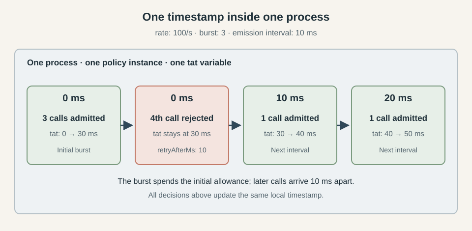
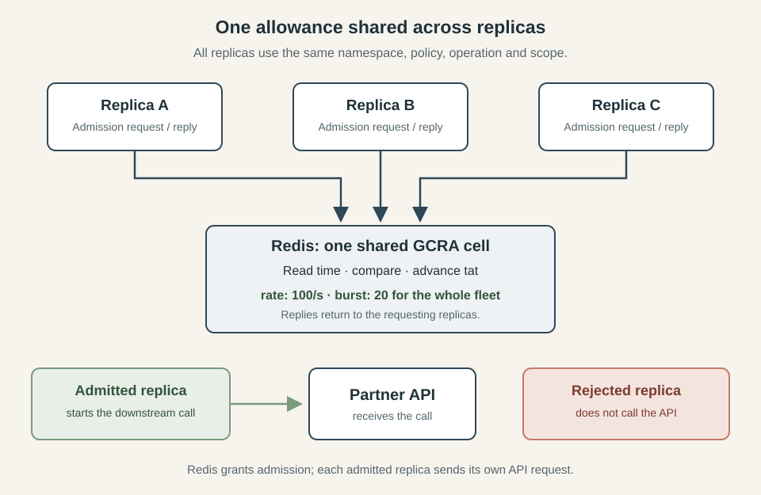
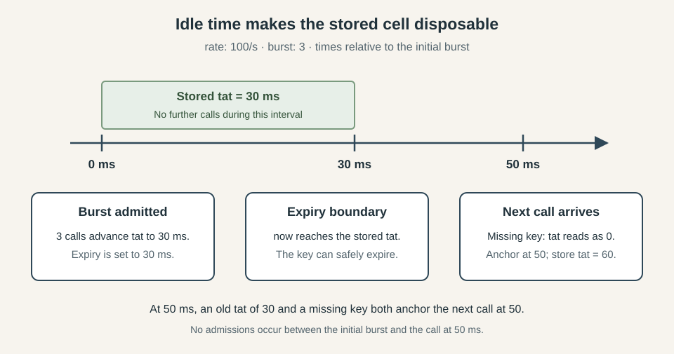
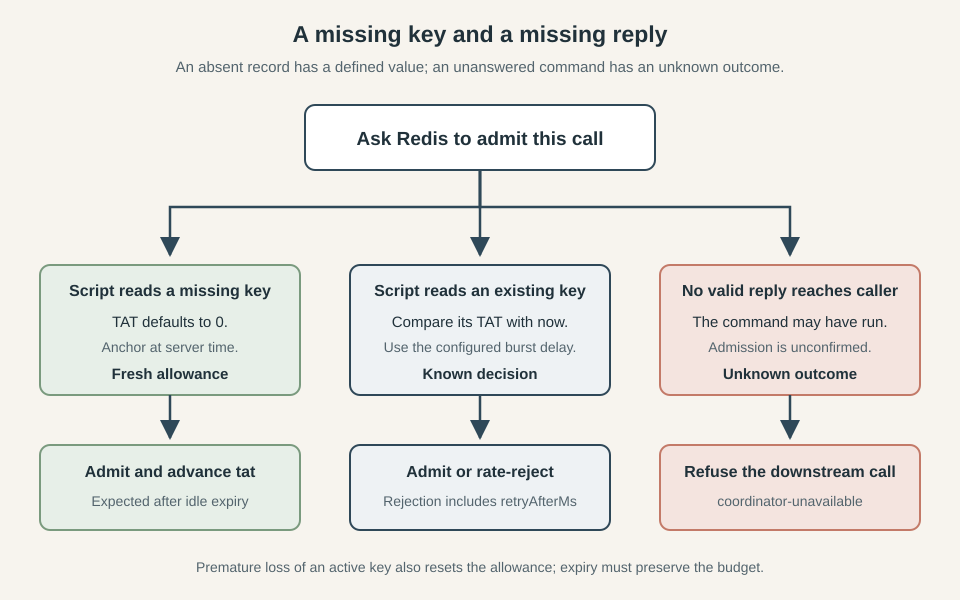

*This series explores three classic resilience patterns: circuit breakers, bulkheads, and rate limiters. We build each from its in-process foundations and examine what changes when multiple replicas must share the same decisions. The examples come from [Caracal](https://github.com/gkoos/caracal), a TypeScript resilience library with working Redis-backed implementations.*

1. [How to Implement a Distributed Circuit Breaker](/posts/2026-09-14-How-to-Implement-a-Distributed-Circuit-Breaker/)
2. [How to Implement a Distributed Bulkhead](/posts/2026-09-17-How-to-Implement-a-Distributed-Bulkhead/)
3. [Rate Limiting Without the Refill Loop: Token Bucket vs GCRA](/posts/2026-09-22-Rate-Limiting-Without-the-Refill-Loop-Token-Bucket-vs-GCRA/)
4. [How to Implement a Distributed Rate Limiter](/posts/2026-09-24-How-to-Implement-a-Distributed-Rate-Limiter/)

You run a service on twenty replicas that all call the same API, with a shared budget of 100 calls a second. You need **rate limiting** across the whole fleet so that adding capacity to your service does not overwhelm the callee. Giving each replica its own limit of 100 calls a second allows 2,000 calls a second under sustained demand, so every admission needs to account for traffic sent by the other replicas.

The usual first idea is a **token bucket**: tokens accumulate at a fixed rate up to a maximum capacity, and each call spends one before it starts. The **Generic Cell Rate Algorithm**, or **GCRA**, represents the same allowance as a schedule stored in a single timestamp, which each admission checks and advances. That makes its bookkeeping simpler to share across replicas, because the coordinator only needs to read and update one value atomically. [Rate Limiting Without the Refill Loop: Token Bucket vs GCRA](/posts/2026-09-22-Rate-Limiting-Without-the-Refill-Loop-Token-Bucket-vs-GCRA/) explains both algorithms and their admission decisions in more depth. Here we will use GCRA and work through what happens when that timestamp moves into shared storage.

The [distributed circuit breaker](/posts/2026-09-14-How-to-Implement-a-Distributed-Circuit-Breaker/) and [distributed bulkhead](/posts/2026-09-17-How-to-Implement-a-Distributed-Bulkhead/) articles established how to put shared state behind a key and make decisions where that state lives. They also dealt with what happens when the coordinator becomes unreachable. We will use the same approach here, with code from the Redis implementation in [Caracal](https://github.com/gkoos/caracal), and concentrate on what changes when the shared state represents a rate allowance.

Of these mechanisms, the rate limiter has the least state to distribute: one timestamp, with no permit holder whose death would leave something to reclaim. Its idle state can expire without a cleanup worker. That simplicity puts more weight on the clock, because every admission depends on comparing the stored schedule with the current time. Once Redis makes that comparison for the whole fleet, its clock determines when your service may send the next call.

## What a rate limit is

A rate limit bounds how quickly calls may start, while a [bulkhead](/posts/2026-09-17-How-to-Implement-a-Distributed-Bulkhead/) bounds how many may be in flight at once. If your service keeps admitting 100 calls a second while the API takes progressively longer to answer, unfinished calls accumulate even though you remain within the rate budget. A concurrency limit addresses that separate problem, and the two controls can work together around the same dependency. For rate limiting, GCRA keeps the admission schedule in a single theoretical arrival time (TAT), as described in the [algorithm article](/posts/2026-09-22-Rate-Limiting-Without-the-Refill-Loop-Token-Bucket-vs-GCRA/). We will carry its `rate` and `burst` settings into the distributed implementation and examine their interaction in [The settings are not independent](#the-settings-are-not-independent). First, the local implementation gives us the exact state transition that every replica will need to share.

## The in-process rate limiter

Caracal's local limiter keeps `let tat = 0` in the policy instance's closure, alongside the timing values calculated from its configuration. The complete `execute` method is small enough to show here, including the cancellation check and runtime events:

```ts
async execute<Result>(
  context: ExecutionContext,
  next: Next<Result>,
): Promise<Result> {
  admissionSignal(context)?.throwIfAborted()
  const now = Date.now()
  const anchored = Math.max(tat, now)
  if (anchored - now > burstDelayMs) {
    const retryAfterMs = anchored - burstDelayMs - now
    event(
      context,
      "local",
      name,
      "process",
      "rejected",
      retryAfterMs,
      "rate-exceeded",
    )
    throw new RateLimitExceededError("local", name, "process", retryAfterMs)
  }
  tat = anchored + emissionIntervalMs
  event(context, "local", name, "process", "admitted")
  return await next(context)
},
```

The admission path reads and advances one variable before handing control to the next policy or the operation itself. There is no `await` between reading `tat` and updating it, so executions sharing this policy instance cannot interleave that decision on the JavaScript event loop. A rejected call leaves the timestamp untouched and receives a `RateLimitExceededError` carrying the retry delay. The limiter itself does not queue the call or arrange another attempt.

For a small example, set the burst to three and keep the rate at 100 calls a second. Three calls can start together, but a fourth at the same instant must wait for the next 10 ms interval, as the sequence below shows.



*The local allowance lives in one timestamp inside one policy instance. Rejection leaves that timestamp unchanged.*

The [local bulkhead](/posts/2026-09-17-How-to-Implement-a-Distributed-Bulkhead/#the-in-process-bulkhead) needed an occupancy counter and a queue for waiting calls, while the circuit breaker kept a window of outcomes. Here, the schedule contains all the admission state, and completion requires no `finally` block to release anything. Whether the admitted call succeeds or fails, the timestamp has already advanced.

That state belongs to one policy instance, so twenty replicas with separate instances still admit twenty times the configured sustained rate. To enforce the shared budget, every replica must perform this same read-and-advance operation against the same stored timestamp.

## Moving the cell out of the process

The shared implementation keeps the same admission rule, with Redis storing the timestamp and executing the comparison. Before looking at the script, we need to establish which calls share that timestamp and what an admission leaves behind.

### Whose rate is it

The `scope` function maps an execution to a string, and the coordinator combines it with the namespace, policy name and operation name to identify the stored cell. This follows the key selection described in the [circuit breaker](/posts/2026-09-14-How-to-Implement-a-Distributed-Circuit-Breaker/#whose-window-is-it) and [bulkhead](/posts/2026-09-17-How-to-Implement-a-Distributed-Bulkhead/#whose-limit-is-it) articles. Every replica enforcing the same budget must resolve to the same identity, including the operation name: matching scope strings alone do not combine budgets across different operations.

For a rate limiter, that identity also determines who shares the burst allowance. With `burst: 20`, twenty replicas sharing a cell can admit twenty calls together after sufficient idle time, in whatever distribution reaches Redis first. One busy replica can consume that entire allowance, because the shared schedule provides no fairness between replicas. Use stable, non-secret scope values with bounded cardinality so that incoming traffic cannot create an unrestricted number of independent budgets.

The diagram separates admission traffic from the downstream call. Redis returns a decision to the requesting replica, and that replica contacts the API only after it receives permission.



*Every replica shares the same allowance. Redis coordinates admission; the replicas send the API requests.*

### One cell, nothing to own

The bulkhead needed leases because [a dead process cannot return its permit](/posts/2026-09-17-How-to-Implement-a-Distributed-Bulkhead/#a-permit-that-nobody-can-return). The rate limiter has no holder to track after admission, so a process disappearing leaves no claim that another process must reclaim. Its timestamp remains valid, and elapsed time restores the allowance without any renewal or release operation.

This also determines what happens to abandoned calls. Once Redis has admitted an attempt, an outer timeout cancelling that attempt does not refund its allowance, even if the downstream work never completes. Admission has already advanced the shared schedule, and the rate limiter has no settlement step that reverses it. The `ratelimit.admitted` event reports a confirmed admission, while the timestamp retains only the aggregate schedule rather than a record of individual calls.

### The decision moves to the data

The [read-and-decide race](/posts/2026-09-14-How-to-Implement-a-Distributed-Circuit-Breaker/#reading-and-deciding-are-no-longer-one-step) is the same one we encountered with the breaker: separate reads and writes would let replicas spend the same allowance. Caracal moves the complete transition into this Lua script, passing the emission interval and burst delay as arguments:

```lua
local emission = tonumber(ARGV[1])
local burstDelay = tonumber(ARGV[2])
local t = redis.call('TIME')
local now = t[1] * 1000 + math.floor(t[2] / 1000)
local tat = tonumber(redis.call('GET', KEYS[1]) or '0')
local anchored = math.max(tat, now)
if anchored - now > burstDelay then
  return {0, anchored - burstDelay - now}
end
local nextTat = anchored + emission
redis.call('SET', KEYS[1], nextTat)
redis.call('PEXPIREAT', KEYS[1], nextTat)
return {1, 0}
```

The return value carries the admission flag and retry delay, which the TypeScript coordinator converts into `{ allowed, retryAfterMs }`. A rejection returns before changing the key, while an admission stores the advanced timestamp and sets its expiry in the same script execution. Other admissions cannot interleave with those steps.

The breaker needed several keys to track its window and generations, and the bulkhead used a sorted set to track leased permits. This script touches one string key, so it needs no coordination between multiple keys or additional Redis Cluster placement rules. The shared key builder still supplies a hash tag, but this transition has no second key that must land beside it.

### The clock is the whole story

Every admission reads the current time from Redis, so application replicas never compare their own clocks with the shared timestamp. A schedule advanced on behalf of replica A is later read on behalf of replica B using the same Redis server's time. Clock differences between those application processes therefore do not change the admission decision.

The remaining dependency is the server clock itself. The stored TAT is an absolute timestamp: moving the clock forward makes allowance available sooner, while moving it backward extends the wait against a timestamp already stored. Using one clock removes disagreement between application replicas, but admission still depends on how that clock progresses.

The script also makes an explicit precision choice: it converts the seconds and microseconds returned by `TIME` into whole milliseconds. Together with Caracal's minimum emission interval of one millisecond, that limits this implementation to a configured rate of 1,000 calls a second. The [GCRA article](/posts/2026-09-22-Rate-Limiting-Without-the-Refill-Loop-Token-Bucket-vs-GCRA/) covers the rounding involved; the millisecond resolution here comes from the implementation's conversion.

Time also provides a natural expiry point. Once the clock reaches `nextTat`, reading the old timestamp or finding no key produces the same anchor for the next admission. Setting `PEXPIREAT` to that timestamp therefore lets an idle scope's state expire without changing its future admission behaviour. There is no lease to recover and no application cleanup worker to run.

For example, three admissions at time zero with a 10 ms interval leave the timestamp at 30 ms. If no more calls arrive, the key expires at that boundary; a call at 50 ms then starts from the current time, exactly as it would if the old timestamp were still present.



*Once the stored schedule is in the past, retaining it and letting it expire produce the same next admission.*

### When the coordinator itself is the problem

As with the [bulkhead's shared storage](/posts/2026-09-17-How-to-Implement-a-Distributed-Bulkhead/#when-the-shared-storage-itself-fails), a missing record and an unanswered request mean different things. A missing key reads as zero and admits against a fresh allowance, which is the expected behaviour after idle expiry. If an active key is lost prematurely, the same rule resets its budget early, so that guarantee depends on retaining state until it is safe to expire.

An unanswered admission request leaves its outcome unknown: Redis may have advanced the timestamp before the reply was lost. Caracal refuses to continue to the downstream call in that case. It emits `ratelimit.degraded` with reason `admission-unknown`, followed by `ratelimit.rejected` with reason `coordinator-unavailable`, and propagates the coordinator error. The Redis implementation wraps failures in `CoordinatorUnavailableError`, keeping them distinct from an ordinary rate rejection with a known retry delay.

There is no `onCoordinatorError` option that allows the request through. Continuing without a confirmed admission would abandon the shared rate guarantee, and a local fallback would recreate the per-replica budgets discussed in the [breaker article](/posts/2026-09-14-How-to-Implement-a-Distributed-Circuit-Breaker/#when-the-coordinator-itself-is-the-problem). Refusing the call can leave an unused admission charged in Redis, but the schedule recovers as time passes.

The branches below keep an ordinary rate rejection separate from a failure to confirm admission. An existing key gives the script enough state to decide, while a missing reply leaves the caller unable to establish whether the budget was charged.



*Idle expiry restores the fresh allowance. An unanswered admission command stops the downstream call, with the coordinator failure attached.*

### Trusting logic that runs somewhere else

The [breaker's conformance testing approach](/posts/2026-09-14-How-to-Implement-a-Distributed-Circuit-Breaker/#trusting-logic-that-runs-somewhere-else) applies to this transition too. Caracal's `memory-rate-limit.ts` implements the same rule in TypeScript behind the single `command(identity, params)` method, with an explicit `setNow` clock for deterministic unit tests. The current tests use it to check rejection and admission exactly one millisecond later, while Redis integration tests cover expiry and refusal after disconnect. Those checks establish individual behaviours, but a generated suite comparing the two implementations would provide stronger evidence that they agree across sequences of calls.

The comparison needs to cover both `allowed` and `retryAfterMs` after every command. Checking only admission would miss a limiter that rejects correctly but tells callers to retry too soon, while checking the final timestamp would miss an incorrect decision earlier in the sequence. With a rate of 100 calls a second and a burst of three, this small trace gives the suite concrete expectations:

| Server time | Attempt | Expected reply | TAT after the attempt |
|---|---|---|---|
| 0 ms | First three calls, in order | Each allowed, retry delay 0 | 10, then 20, then 30 ms |
| 0 ms | Fourth call | Rejected, retry delay 10 ms | 30 ms |
| 9 ms | Another call | Rejected, retry delay 1 ms | 30 ms |
| 10 ms | Call at the admission boundary | Allowed, retry delay 0 | 40 ms |
| 50 ms | Three calls after an idle period | Each allowed, retry delay 0 | 60, then 70, then 80 ms |
| 50 ms | Fourth call at that instant | Rejected, retry delay 10 ms | 80 ms |

Both implementations must consume the same clock values for that comparison to mean anything. Calling `setNow(10)` controls the TypeScript model, but the production Lua script still reads Redis's `TIME`; sleeping for 10 ms in the test does not make those clocks agree. A deterministic conformance harness would need a test-only way to supply the Lua transition's time while preserving its admission logic, with separate integration tests exercising the shipped script's server clock and expiry commands. That harness must also evaluate expiry against its controlled clock, because synthetic timestamps passed to the real `PEXPIREAT` would still be interpreted against Redis wall time. Without a consistent time source, a one-millisecond difference in execution can look like a logic bug exactly where the boundary assertions matter most.

Generated sequences should deliberately reach those boundaries and mix identities to check that consuming one scope's allowance leaves another scope untouched. Count boundary admissions and burst exhaustion separately, and fail the run if either count stays at zero; also require an idle recovery followed by a full burst. Retaining the random seed and command trace makes a disagreement reproducible. The in-memory model keeps old timestamps rather than expiring keys, so idle recovery also checks whether that retained state behaves like Redis's missing key. Its `setNow` method rejects backward movement, leaving backward clock changes outside this model's coverage even if every generated comparison passes.

## The settings are not independent

The public settings meet in the timing values sent to Redis on every admission. Caracal calculates them as follows:

```ts
const emissionIntervalMs = Math.round(1000 / rate)
const burstDelayMs = (burst - 1) * emissionIntervalMs
```

At `rate: 100` and `burst: 20`, the emission interval is 10 ms and the burst delay is 190 ms. Changing the rate also changes how far ahead the schedule may advance for that same burst size. As the [GCRA article](/posts/2026-09-22-Rate-Limiting-Without-the-Refill-Loop-Token-Bucket-vs-GCRA/) explains, rounding affects the sustained allowance too: `rate: 30` produces a 33 ms interval, corresponding to about 30.3 calls a second under continuous demand. Configuration accepts rates up to 1,000 calls a second, subject to the whole-millisecond representation already discussed.

The burst setting applies to the entire shared identity, so adding replicas gives you more processes competing for the same allowance. If you carry `burst: 20` over from a local limiter on twenty replicas, you reduce their combined initial allowance from 400 calls to 20. Whether that is appropriate depends on the API's budget and how your traffic arrives; the number of replicas alone does not determine the right burst.

Every replica sharing a cell must also use the same rate and burst settings. Redis stores only the timestamp, and each caller supplies the timing parameters for its own admission. A replica configured for 100 calls a second advances the schedule by 10 ms when admitted, while one configured for 200 advances it by 5 ms. Both can update the same key successfully, but the resulting schedule follows whichever parameters each caller supplies. A rolling deployment that changes these settings therefore needs to account for the period when old and new replicas share the cell, because the coordinator does not detect or reject that disagreement.

For a controlled change, pause new admissions across the fleet and let outstanding coordinator commands finish before replacing the settings everywhere. Resume against the same key so the timestamp still accounts for the allowance already spent. That timestamp was built using the old parameters, however, so the transition follows the new admission rule against the remaining old schedule: reducing the burst can make callers wait longer, while increasing it can make more calls immediately eligible. If you need a fresh start under the new settings, keep admissions paused until the old schedule has elapsed and its key has expired before resuming. Changing the namespace or policy name during a rolling deployment creates a separate allowance, letting old and new replicas spend independent budgets. A change without a fleet-wide pause needs additional coordination, such as coordinator-owned configuration with an enforced version, which this implementation does not provide.

Validation checks that the timing calculations remain safe integers and that the inputs are within their supported ranges. The [breaker's threshold validation](/posts/2026-09-14-How-to-Implement-a-Distributed-Circuit-Breaker/#the-threshold-does-not-survive-the-trip-intact) could reject thresholds its stored window could not resolve; here, a numerically valid configuration can still permit a burst your dependency cannot absorb. Choosing that allowance and keeping it consistent across replicas remain deployment decisions.

## Closing

Distributing GCRA preserves the small state transition we started with: an admission compares the current time with a stored schedule and advances that schedule when the call is allowed. Putting the timestamp in Redis makes that decision visible to the whole fleet, provided every replica uses the same identity and settings. The server's clock then governs the allowance, and a caller that cannot confirm admission has to stop before starting the downstream work.

The circuit breaker needed to preserve a history of outcomes, while the bulkhead had to account for permits held by processes that might disappear. The rate limiter carries less bookkeeping because an admission leaves no ownership to resolve. That simplicity makes the clock especially consequential: elapsed time restores the budget, and a change in the clock changes when calls become admissible.

The [previous article](/posts/2026-09-22-Rate-Limiting-Without-the-Refill-Loop-Token-Bucket-vs-GCRA/) ended where the timestamp became shared. We now have an implementation that lets replicas spend one allowance together, with explicit behaviour when coordination fails. The complete code is in [Caracal](https://github.com/gkoos/caracal), including the local and Redis-backed policies and their tests, if you want to follow the transition from the in-process variable to the shared cell.
