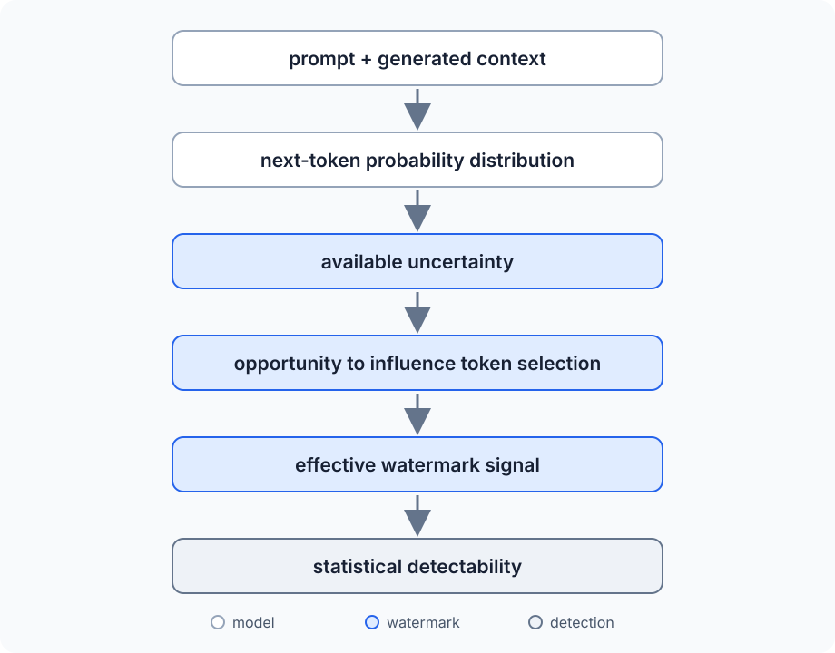
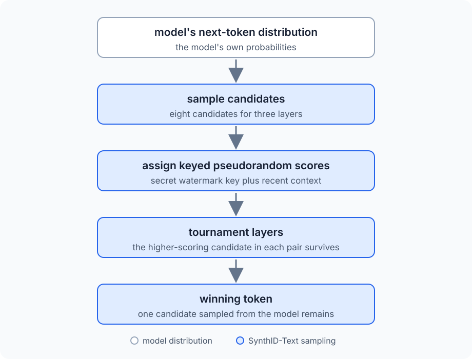
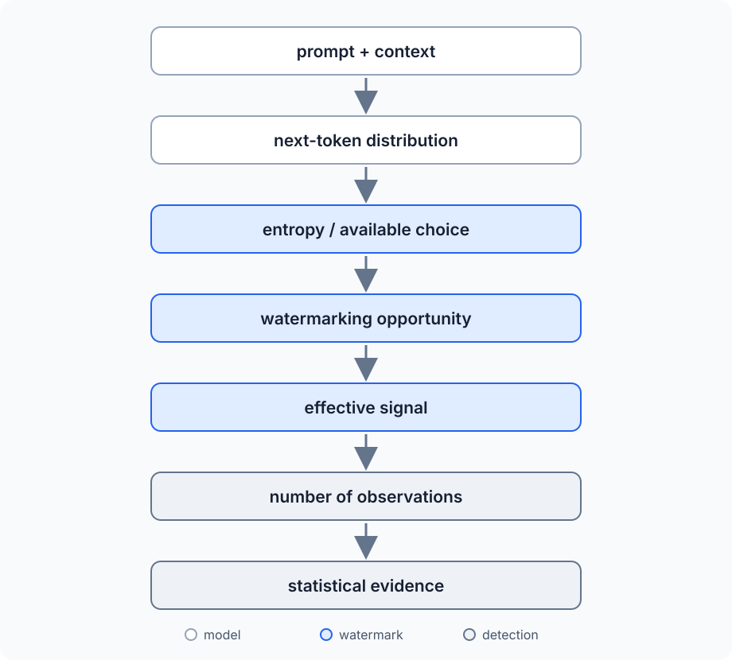

In [Text Watermarking for Non-Academics](/posts/2026-08-12-Text-Watermarking-for-Non-Academics/), we looked into how an LLM can leave a statistical signal in generated text. The basic idea is to slightly favor some token choices over others during generation. One choice tells us nothing, but repeat the process over enough tokens and the small bias starts to become statistically detectable.

There is a question hidden inside that explanation: how much freedom does the watermark have to change those choices?

An LLM generates text one token at a time. At each step, it calculates a probability distribution for the next token based on the prompt and everything it has generated so far. We can write that as:

$$
P(x_t \mid x_{<t}, p)
$$

Here, $x_t$ is the token we are about to generate, $x_{<t}$ represents all the tokens generated before it, and $p$ is the prompt. The expression describes the probability distribution of the next token given all that context. This is the distribution from which the next token will eventually be selected. This basic autoregressive setup is also where modern watermarking systems such as SynthID-Text [[1]](#ref1) intervene in the generation process.

The prompt in that expression can contain anything. Consider these two prompts:

> Write the opening paragraph of a detective story set in London.

and:

> The capital of France is...

The first leaves the model with an enormous number of reasonable ways to continue. The second leaves very little freedom. `Paris` should dominate the probability distribution, and a watermark cannot replace it with an unrelated token simply because that token happens to carry a stronger watermark signal. The output still has to answer the prompt correctly.

This means that the amount of freedom available to a watermark changes while the model is generating text. At one position there may be several plausible next tokens with similar probabilities. At another, one token may be overwhelmingly likely. The prompt influences those probabilities, and every generated token changes the context used to calculate the next distribution.

That gives us the question **how much room is actually available for a watermark?**

To answer it, we need to put a number on how much choice the model has, look at how a small bias turns into statistical evidence, and work out why the amount of text matters so much. We can do all of that with a deliberately simple watermark model, a few probability formulas, and about ten lines of Python.

## A Watermark Needs Choices

Consider a point where the model has produced the following simplified distribution for its next token:

| Token | Probability |
|---|---:|
| `cold` | 27% |
| `dark` | 22% |
| `quiet` | 19% |
| `empty` | 15% |
| `wet` | 10% |
| everything else | 7% |

As we can see, the model has several plausible choices. A watermarking algorithm can slightly favor `dark` over `cold`, for example, while still producing a perfectly reasonable continuation. There is room to influence the choice without forcing the model far away from what it would otherwise have generated.

Now consider a very different continuation:

> *Principia ___*

Imagine the distribution looks like this:

| Token | Probability |
|---|---:|
| `Mathematica` | 99.7% |
| everything else | 0.3% |

This time the model has almost no meaningful choice. Promoting some unrelated token enough to beat `Mathematica` would preserve the watermark at the expense of the text itself.

This constraint is fundamental to watermarking: **the signal has to be introduced while preserving the quality and meaning of the generated output**. The original green-list watermark proposed by Kirchenbauer et al. [[2]](#ref2), for example, adds a bias toward a pseudorandomly selected set of preferred tokens rather than simply forcing the model to choose from that set. The underlying model probabilities still matter when the final token is sampled. The paper describes this as a "soft" watermark and contrasts it with hard restrictions on token selection.

The useful distinction, then, is how much choice the model has at a particular point in generation. A distribution spread across several plausible tokens gives a watermark more opportunities to influence the result. A distribution concentrated almost entirely on one token gives it very little room.

We need a way to measure that difference. Information theory already gives us one: **entropy**.

## Putting a Number on Choice

We can see the difference between the two distributions above, but we need a way to quantify it. We want a number that is small when one outcome is almost certain and larger when probability is spread across several plausible outcomes.

Information theory calls that quantity **entropy** [[3]](#ref3). For a probability distribution $X$, Shannon entropy is:

$$
H(X) = -\sum_x p(x)\log_2 p(x)
$$

Here, $X$ is the probability distribution, $x$ represents one possible outcome, and $p(x)$ is the probability of that outcome. We calculate $p(x)\log_2 p(x)$ for every possible outcome, add the results, and negate the sum. Using a base-2 logarithm means that entropy is measured in **bits**.

The easiest way to understand the formula is to start with a model that has no choice at all. Suppose there are four possible tokens, but the first one has a probability of 1:

$$
P = (1, 0, 0, 0)
$$

Its entropy is:

$$
H(X) = 0
$$

There is no uncertainty to measure. We already know which token will be selected. The zero-probability terms contribute nothing to the sum, while the certain outcome contributes $-1\log_2 1$, which is also zero.

Now distribute the probability equally across all four tokens:

$$
P = (0.25, 0.25, 0.25, 0.25)
$$

The entropy becomes:

$$
H(X)
= -4(0.25\log_2 0.25)
= 2 \text{ bits}
$$

The result has a useful interpretation. There are four equally likely possibilities, and:

$$
2^2 = 4
$$

Two bits are enough to distinguish four equally likely outcomes. If there were eight equally likely choices, the entropy would be 3 bits because $2^3 = 8$. The entropy increases as uncertainty increases.

Real next-token distributions are not this tidy. One token might have a probability of 30%, another 20%, several more might sit around 5%, followed by thousands of increasingly unlikely tokens. The same formula still gives us a single number describing how spread out that uncertainty is.

This gives us a mathematical version of the distinction from the previous section. When the next-token distribution is concentrated almost entirely on one token, its entropy is low. When several continuations have meaningful probability, its entropy is higher.

A watermark needs usable alternatives, and higher entropy can provide more opportunities to influence token selection while remaining within the model's plausible continuations. Entropy itself is not the watermark capacity, and the relationship depends on the watermarking scheme. It tells us how much uncertainty exists in the distribution that the watermark can work with.

This connection is also part of the formal watermarking literature. Recent work on watermarking low-entropy LLM outputs [[4]](#ref4) studies what guarantees remain possible when the model provides much less per-token entropy than earlier watermarking constructions assume.

We now have a way to describe how much choice the model has. The next step is to simplify the watermark itself enough that we can calculate how a tiny preference among those choices becomes detectable.

## Build a Deliberately Stupid Watermark

Now we need a watermark simple enough that we can follow the math ourselves.

A useful starting point is the green-list watermark proposed by Kirchenbauer et al. in *A Watermark for Large Language Models* [[2]](#ref2). During generation, the algorithm uses a pseudorandom function to divide the vocabulary into a preferred **green list** and the remaining tokens. The division depends on the preceding context, so the preferred set changes as generation proceeds. The logits of green tokens receive a positive bias before the next token is sampled. The paper calls this a soft watermark because tokens outside the green list remain possible, never being completely excluded.

We can represent the split at position $t$ as:

$$
V = G_t \cup R_t
$$

Here, $V$ is the model's vocabulary, $G_t$ is the green set at position $t$, and $R_t$ contains the remaining tokens. Note that we don't use one fixed green list for the entire response: the context changes, and with it the pseudorandom partition used by the watermark. The actual scheme has several parameters and details that we do not need for the experiment. We are going to replace it with a deliberately stupid version.

Suppose half of the vocabulary is green. Without any watermarking, assume that the probability of selecting a green token is exactly:

$$
P(G_t) = 0.50
$$

Now suppose our watermark biases the distribution just enough to make the probability:

$$
P(G_t) = 0.55
$$

The 55% is an illustrative value chosen to make the calculations easy. It is not a claimed watermark strength for the Kirchenbauer scheme, SynthID, or any other production system.

Our entire watermark has now become a slightly biased coin. An unwatermarked generator produces a green token half the time, while our watermarked generator produces one 55% of the time. Looking at a single token tells us almost nothing because either generator can produce either outcome. Even a short sequence can easily look suspicious by accident. The watermark only becomes useful if the small preference accumulates across enough token choices that we can distinguish it from ordinary randomness.

So the next question is no longer about language models at all. **How many times do we need to flip a 55% coin before we can tell that it probably isn't a 50% coin?**

## Randomness Looks Suspicious Too

Suppose we examine 100 tokens and find that 56 of them are green. Our unwatermarked model predicts 50, so 56 looks like evidence of the 55% bias we introduced above.

The problem is that a fair coin does not produce exactly 50 heads every time we flip it 100 times. Sometimes we get 47, sometimes 53, and occasionally we get something considerably farther from 50. The same applies to our simplified watermark. Unwatermarked text can contain more green tokens than expected purely by chance.

We therefore need to know both how many green tokens we expect and how much random variation around that number is normal. If every token has a 50% chance of being green, the number of green tokens follows a **binomial distribution**:

$$
X \sim \operatorname{Binomial}(n, 0.5)
$$

Here, $n$ is the number of token choices we observe, and $X$ is the number of those choices that land in the green set. The $0.5$ is the probability that any individual choice is green under our unwatermarked model.

For a binomial distribution, the expected number of successes is:

$$
\mu = np
$$

The symbol $\mu$ represents the mean, $n$ is the number of observations, and $p$ is the probability of success for each one. In our case, "success" simply means selecting a green token, and $p=0.5$. This gives us:

$$
\mu = n(0.5) = \frac{n}{2}
$$

For 100 tokens, we therefore expect:

$$
\mu = \frac{100}{2} = 50
$$

Knowing the expected value is only half of what we need. We also need to know how widely random results normally spread around it. For a binomial distribution, the standard deviation is:

$$
\sigma = \sqrt{np(1-p)}
$$

The standard deviation gives us a scale for the amount of variation we should expect from randomness alone. Substituting $p=0.5$ gives:

$$
\sigma
= \sqrt{n(0.5)(1-0.5)}
= \sqrt{\frac{n}{4}}
= \frac{\sqrt n}{2}
$$

For our 100-token example:

$$
\sigma
= \frac{\sqrt{100}}{2}
= 5
$$

So while we expect 50 green tokens, random variation naturally moves the observed count around that value on a scale of about five tokens. Seeing 56 green tokens is only a little more than one standard deviation above the expectation. It may look like our 55% watermark, but it is not particularly surprising behavior for an unwatermarked sequence.

There is also an important relationship hiding in these formulas. The expected number of green tokens grows directly with the amount of text:

$$
\mu = \frac{n}{2}
$$

The scale of the random variation grows much more slowly:

$$
\sigma = \frac{\sqrt n}{2}
$$

Double the amount of text and the expected count doubles. Multiply the amount of text by four and the standard deviation only doubles.

**That difference between $n$ and $\sqrt n$ is what eventually allows a small systematic watermark signal to emerge from ordinary randomness**. We just need a way to express how large that signal is compared with the noise around it.

## Signal Versus Noise: The z-Score

The previous section gave us two numbers for an unwatermarked sequence: the number of green tokens we expect to see and the amount of random variation around that expectation. We can combine them into a single number that tells us how unusual an observed result is.

That number is the **z-score**. It measures how many standard deviations an observation is above or below the expected value:

$$
z = \frac{X - \mu}{\sigma}
$$

Here, $X$ is the number of green tokens we actually observed, $\mu$ is the number we expected under the unwatermarked model, and $\sigma$ is the standard deviation of that model. The numerator measures the difference between observation and expectation, while the denominator puts that difference on the scale of ordinary random variation.

We already derived both values for our simplified watermark:

$$
\mu = \frac{n}{2}
$$

and:

$$
\sigma = \frac{\sqrt n}{2}
$$

Substituting them into the z-score gives:

$$
z =
\frac{X - n/2}{\sqrt n/2}
$$

The top half of this expression:

$$
X - \frac{n}{2}
$$

is the **signal** we observed: how many more green tokens appeared than we would expect from an unwatermarked sequence.

The bottom half:

$$
\frac{\sqrt n}{2}
$$

is the scale of the **noise**: how much the green-token count naturally varies even when there is no watermark.

We can now return to the 100-token example from the previous section. We observed 56 green tokens, while the unwatermarked model expects 50 with a standard deviation of 5:

$$
z = \frac{56 - 50}{5} = 1.2
$$

The six extra green tokens looked suspicious when we compared them only with the expected count of 50. Once we account for normal random variation, they are only 1.2 standard deviations above the expectation.

Now suppose we observe 560 green tokens out of 1,000. The proportion is actually slightly lower, 56% rather than 56 out of 100, but the larger sample changes the amount of evidence. The unwatermarked expectation is:

$$
\mu = 500
$$

and the standard deviation is:

$$
\sigma
= \frac{\sqrt{1000}}{2}
\approx 15.81
$$

Our z-score is therefore:

$$
z
= \frac{560 - 500}{15.81}
\approx 3.79
$$

The excess proportion is almost the same, but it is much harder for ordinary randomness to produce that excess across 1,000 observations.

This is the same basic statistical idea used by the green-list detector in *A Watermark for Large Language Models* [[2]](#ref2): count how often generated tokens fall into the green list and measure how far that count lies above the null expectation. Our version uses the deliberately simplified 50% green-list model, so the formula above should not be read as a universal LLM watermark detector.

The useful interpretation for us is that the z-score compares accumulated watermark signal with the random noise that could produce a similar pattern by accident. As the amount of text grows, those two quantities grow at different rates. That lets us calculate exactly how quickly our tiny 5% bias should become visible.

## Why Long Text Is Easier to Watermark

We can now calculate how the 5% bias in our toy watermark behaves as the text gets longer. Without watermarking, a token has a 50% chance of being green. Our watermark increases that probability to 55%. After observing $n$ tokens, the expected number of green tokens in the watermarked text is therefore:

$$
E[X] = 0.55n
$$

Here, $E[X]$ means the expected value of $X$, our green-token count. The unwatermarked model expects:

$$
E[X] = 0.50n
$$

The difference between the two is the signal introduced by the watermark:

$$
0.55n - 0.50n = 0.05n
$$

This tells us that the expected signal grows directly with the amount of text. Every additional 100 token choices contribute another five excess green tokens on average.

In the previous section, however, we saw that the noise produced by an unwatermarked sequence does not grow at the same rate. Its standard deviation is:

$$
\sigma = \frac{\sqrt n}{2}
$$

We can put the expected watermark signal and the expected random variation into the z-score we derived earlier:

$$
E[z]
=
\frac{0.05n}{\sqrt n/2}
$$

Dividing by $\sqrt n/2$ is the same as multiplying by $2/\sqrt n$, so:

$$
E[z]
=
0.05n \times \frac{2}{\sqrt n}
$$

which simplifies to:

$$
\boxed{E[z] = 0.1\sqrt n}
$$

This formula tells us how the expected statistical strength of our watermark grows with the amount of text. The watermark contributes a systematic bias on every token choice, so its accumulated signal grows with $n$. Random variation grows with $\sqrt n$. The signal therefore becomes progressively larger relative to the noise.

Putting some values into the formula makes the relationship easier to see:

| Observed tokens $n$ | Expected $z$ |
|---:|---:|
| 100 | 1 |
| 400 | 2 |
| 900 | 3 |
| 1,600 | 4 |
| 2,500 | 5 |

For 100 tokens, the expected watermark signal is only one standard deviation above the unwatermarked expectation. At 400 tokens it reaches two. At 1,600 tokens it reaches four.

These values describe our simplified 50% to 55% model. They are not detection thresholds or token requirements for the Kirchenbauer watermark [[2]](#ref2), SynthID [[1]](#ref1), or another real system. The useful result is the relationship between signal, noise, and sample length.

It also explains why statistical watermarking becomes difficult with short pieces of text. A small bias can be present from the first generated token, but there may not yet be enough observations to distinguish that bias from the variation we would expect by chance.

We have derived all of this without generating a single word. A few lines of Python are enough to watch the same statistical effect emerge experimentally.

## The Whole Experiment in Ten Lines

We can simulate everything we have done so far without an LLM, a tokenizer, or even a vocabulary. Our simplified model only cares whether each token lands in the green set, so a random number is enough.

There is one complication. If we simulate each text length only once, randomness can easily obscure the relationship we just derived. An expected z-score of 2 does not mean that every experiment will produce 2. It means that if we repeat the experiment many times, the average should approach 2.

So let's do exactly that:

```python
import random
from math import sqrt

def detect(n, p):
    green = sum(random.random() < p for _ in range(n))
    return (green - n / 2) / sqrt(n / 4)

for n in (100, 400, 900, 1600, 2500):
    zs = [detect(n, 0.55) for _ in range(1000)]
    print(n, round(sum(zs) / len(zs), 2))
```

The expression `random.random() < p` produces `True` with probability $p$. Python treats `True` as 1 when we sum the results, so `green` becomes the number of simulated tokens that landed in the green set.

We pass `0.55` as $p$, giving every simulated token a 55% chance of being green. That is our entire toy watermark.

The return value is the z-score we derived earlier:

$$
z =
\frac{X - n/2}{\sqrt{n/4}}
$$

Here, `green` is $X$, the observed number of green tokens. The term $n/2$ is the count expected from an unwatermarked 50% process, while $\sqrt{n/4}$ is its standard deviation.

The important part is the list comprehension. Instead of generating one sequence for each value of $n$, we generate 1,000 independent sequences and calculate their z-scores. We then take the average.

A run should produce numbers roughly like these:

```text
100   1.01
400   2.03
900   2.98
1600  4.01
2500  5.02
```

The exact values change every time, but they settle close to the values we calculated in the previous section:

$$
E[z] = 0.1\sqrt n
$$

For $n=100$, that predicts an average z-score of 1. For $n=400$, it predicts 2. At 900 we expect 3, at 1,600 we expect 4, and at 2,500 we expect 5.

Individual experiments can look very different. A 400-token sequence whose expected z-score is 2 might produce a z-score close to zero simply through random variation. Another might produce 3 or 4. Repeating the experiment does not remove that variation from individual samples, but it lets us see the expected value underneath it. Saying that a watermark has an expected z-score of 4 at a particular text length does not mean every watermarked text of that length will produce $z=4$. Detection is still statistical. Some watermarked samples will produce weaker evidence and some stronger evidence.

This program is not generating watermarked text, and it is not implementing an LLM watermark. It isolates one property of our toy model: a small systematic bias accumulates faster than the random variation around it, producing the $\sqrt n$ relationship we derived mathematically.

So far, we have fixed that bias at 5%. That's fine, but we don't have to, and changing it has a surprisingly large effect on how much text we need.

## Stop Assuming the Watermark Is 5%

Our experiment used a watermark that changed the probability of selecting a green token from 50% to 55%. The 5% difference made the arithmetic convenient, but there is nothing special about it.

Let's call the size of that difference $\epsilon$. Instead of fixing the watermarked probability at 55%, we can write:

$$
P(G_t) = 0.5 + \epsilon
$$

Here, $P(G_t)$ is the probability that the token selected at position $t$ belongs to the green set, and $\epsilon$ is the additional probability introduced by the watermark. In our previous example, $\epsilon=0.05$.

After $n$ token choices, the watermarked process therefore produces an expected green-token count of:

$$
E[X] = (0.5 + \epsilon)n
$$

The unwatermarked process still expects $0.5n$. Subtracting the two gives us the expected excess:

$$
(0.5 + \epsilon)n - 0.5n = \epsilon n
$$

So the watermark signal grows as $\epsilon n$. The noise under our unwatermarked model is still:

$$
\sigma = \frac{\sqrt n}{2}
$$

We can put both into the z-score:

$$
E[z]
=
\frac{\epsilon n}{\sqrt n/2}
$$

which simplifies to:

$$
\boxed{E[z] = 2\epsilon\sqrt n}
$$

This is the more general version of the formula from the previous section. Set $\epsilon=0.05$ and we get:

$$
E[z]
=
2(0.05)\sqrt n
=
0.1\sqrt n
$$

More importantly, we can now turn the question around. Instead of asking what z-score we expect from a given amount of text, suppose we want some target expected z-score $z$. How many token observations do we need?

Starting with:

$$
z = 2\epsilon\sqrt n
$$

divide both sides by $2\epsilon$:

$$
\sqrt n = \frac{z}{2\epsilon}
$$

and square both sides:

$$
\boxed{n = \left(\frac{z}{2\epsilon}\right)^2}
$$

Now the effect of watermark strength becomes much clearer. Suppose we use an expected z-score of 4 as a convenient comparison point:

| Effective bias $\epsilon$ | Tokens needed for $E[z]=4$ |
|---:|---:|
| 10% | 400 |
| 5% | 1,600 |
| 2.5% | 6,400 |
| 1% | 40,000 |

These are results from our toy model, not recommended detection thresholds or measured requirements for a real watermarking system. The important part is how quickly the required sample size grows as the signal becomes weaker.

If we halve $\epsilon$, we do not need twice as many tokens. We need four times as many:

$$
n \propto \frac{1}{\epsilon^2}
$$

That inverse-square relationship is one of the most useful results from our simplified model. A watermark that can introduce only half as much effective bias needs four times the text to produce the same expected statistical evidence.

Until now, though, we have treated $\epsilon$ as a knob that the watermark designer can turn freely. Real language generation does not work that way. The watermark receives whatever next-token distribution the model produces, and that distribution depends on the prompt and everything generated so far.

Our neat little $\epsilon$ is about to become messy.

## And Now the Prompt Ruins Our Nice Model

Our toy model treats $\epsilon$ as a constant. Every token has a 50% chance of being green without the watermark and a $0.5+\epsilon$ chance with it. That assumption made the statistics easy to follow, but an actual language model gives the watermark something much messier to work with.

At every position, the model produces the conditional distribution we started with:

$$
P(x_t \mid x_{<t}, p)
$$

Here, $p$ is the prompt, $x_{<t}$ is everything generated so far, and $x_t$ is the next token. The watermark does not get to replace this distribution with an arbitrary one. It has to modify the token-selection process while keeping the resulting text useful.

This means our $\epsilon$ cannot be understood as a fixed amount of bias that can always be added to the next decision. Its effective size depends on the distribution available at that position.

Consider creative prose:

> The abandoned house at the end of the street looked...

There may be many plausible continuations. `empty`, `dark`, `different`, `quiet`, `smaller`, and plenty of other tokens could all fit the sentence. If several of those alternatives already have meaningful probability, a watermark has room to influence which one gets selected.

Now consider:

> The capital of France is...

The distribution is much more constrained. If `Paris` dominates it, the watermark has less freedom. A strong preference for some unrelated green token would damage the answer rather than subtly influence it.

The same problem appears in other forms of constrained output. Source code can reach positions where syntax, an identifier already established in the program, or an API signature sharply limits reasonable continuations. Structured output can require a particular delimiter or field name. Factual text can contain names, dates, and other completions for which only a small set of tokens makes sense.

This brings entropy back into the picture. We can think about each generation step as having its own entropy:

$$
H(X_t)
=
-\sum_x P(x_t=x \mid x_{<t},p)
\log_2 P(x_t=x \mid x_{<t},p)
$$

This is the same entropy formula we used earlier, now applied to the model's next-token distribution at position $t$. $X_t$ represents the next-token choice, while the probabilities come from the model given the current prompt and generated context.

The value can change at every token. A high-entropy step has probability spread across more plausible alternatives, a low-entropy step is concentrated on fewer alternatives, sometimes overwhelmingly on one.

Research on watermarking low-entropy LLM outputs [[4]](#ref4) deals directly with this problem. Entropy assumptions matter because watermarking opportunities depend on the randomness available in the model's output distribution. Production schemes also have to work within the model's existing sampling process. SynthID-Text [[1]](#ref1), for example, modifies token sampling rather than treating generation as a sequence of identical coin flips.

So the process we have been compressing into one number, $\epsilon$, actually looks more like this:



Our toy model assumes that all of this produces the same $\epsilon$ at every position. Real generation does not.

That also explains why there cannot be one universal answer to "how many tokens do you need to detect a watermark?" The same number of tokens can contain very different amounts of usable choice. A thousand tokens of unconstrained prose and a thousand tokens of highly predictable output do not necessarily provide the watermark with the same opportunities.

And there is another way to reduce the effective signal even after generation has finished: we can edit the text.

## Editing Makes the Maths Hurt

Suppose our generated text starts with the same effective bias as before:

$$
\epsilon = 0.05
$$

Now the text is edited. Some sentences are rewritten, words are replaced, sections are removed, or parts of the output are mixed with text from another source. The exact effect depends on the watermark and the kind of editing, but for our toy model we can represent the result as a weaker effective signal.

Suppose the editing cuts it in half:

$$
\epsilon' = 0.025
$$

We already derived the amount of text required to reach a target expected z-score:

$$
n = \left(\frac{z}{2\epsilon}\right)^2
$$

If the signal is halved, the new requirement becomes:

$$
n'
=
\left(\frac{z}{2(\epsilon/2)}\right)^2
$$

The denominator is now half as large, so the fraction doubles. Squaring it gives:

$$
n' = 4n
$$

In other words:

$$
\boxed{\text{half the effective signal} \Rightarrow \text{four times as much text}}
$$

Using our previous example, with $\epsilon=0.05$, an expected z-score of 4 required:

$$
n
=
\left(\frac{4}{2(0.05)}\right)^2
=
1{,}600
$$

If editing reduces the effective bias to $\epsilon=0.025$, the same calculation becomes:

$$
n
=
\left(\frac{4}{2(0.025)}\right)^2
=
6{,}400
$$

Nothing about the detector changed, we simply weakened the statistical pattern it was looking for.

This is a result of our toy model, not a claim that rewriting real watermarked text always cuts its watermark strength by a particular percentage. Real editing is much less tidy. Changing one token can alter the context used to construct later green lists, and different watermarking schemes respond differently to deletion, insertion, paraphrasing, and mixing text from multiple sources.

The broader robustness problem has been tested experimentally. In *On the Reliability of Watermarks for Large Language Models* [[5]](#ref5), Kirchenbauer et al. evaluate watermark detection after several forms of modification, including human editing, machine paraphrasing, and mixing watermarked text with non-watermarked text. The watermark signal can survive substantial modification, but detection becomes a question of how much statistical evidence remains after that modification.

This is also the problem I touched on in [Import Chaos #6](https://gaborkoos.substack.com/i/211091230/directors-cut): watermarking does not end when the model produces its last token. The text can immediately enter another process that rewrites, shortens, expands, translates, or combines it with something else.

Our little inverse-square relationship shows why losing signal matters so much. A moderate reduction in effective watermark strength can require a much larger sample to recover the same expected statistical evidence.

There is still one major problem with all the calculations we have done so far: we have been pretending that token choices behave like independent coin flips. They don't.

## Our Coin-Flipping Model Is Wrong

Our toy model has made one enormous simplification. We treated every token as an independent coin flip with the same probability:

$$
P(G_t) = 0.5 + \epsilon
$$

That gave us a binomial distribution and let us derive the relationship between watermark strength, text length, and statistical evidence. But language generation is not a sequence of independent trials, the probability distribution for token $t$ depends on everything that came before it:

$$
P(x_t \mid x_{<t}, p)
$$

Once the model selects $x_t$, that token becomes part of the context used to calculate the distribution for $x_{t+1}$. Selecting one token can therefore change the probabilities of many later tokens.

Even the green list itself does not have to remain independent of previous choices. In the scheme proposed by Kirchenbauer et al. [[2]](#ref2), the preceding token is used to seed the pseudorandom function that determines the green list for the next position. The detector reconstructs those lists from the text and counts how often the observed tokens belong to them.

So a real sequence looks less like this:

$$
X_1, X_2, X_3, \ldots
$$

where every $X_t$ is another identical independent trial, and more like a chain of conditional decisions:

$$
P(x_1 \mid p)
$$

$$
P(x_2 \mid x_1,p)
$$

$$
P(x_3 \mid x_1,x_2,p)
$$

and so on.

And because of this, the clean binomial assumptions behind our toy detector no longer automatically hold. Real watermark detectors have to account for the construction of the watermark, the sampling procedure, and dependencies introduced during generation. Statistical calibration becomes part of the design.

That does not make our simplified model useless: it isolates the relationship we actually wanted to understand. A watermark introduces a small systematic signal, random generation produces noise around that signal. More observations help because systematic effects accumulate differently from random variation. A weaker effective signal requires substantially more evidence, and editing can weaken the signal after generation.

Those relationships survive the fact that real language models are considerably messier than our simulation.

What does not survive is the idea that our ten-line Python program is an AI-text detector, though. Given arbitrary text, it cannot tell whether an LLM wrote it, whether a watermark is present, or whether a particular model generated it.

To see what happens when those details are added back in, we can look at a watermark that has actually been deployed at production scale: SynthID-Text [[1]](#ref1).

## What Real Watermarking Looks Like: SynthID

A real production watermark has to solve the same underlying problem while preserving output quality, adding little computational overhead, and producing a signal that can later be detected. Google DeepMind's SynthID-Text is useful here because it has actually been deployed at scale. It doesn't retrain the language model. Instead, it modifies the sampling procedure used to choose tokens from the model's existing next-token distribution.

One of the sampling methods introduced in the paper [[1]](#ref1) is called **Tournament sampling**.

Suppose the model has already calculated its normal distribution:

$$
P(x_t \mid x_{<t},p)
$$

SynthID does not simply replace that distribution with a list of allowed tokens. It first samples multiple candidate tokens from it. In the example used to explain the algorithm in the paper, three tournament layers require:

$$
2^3 = 8
$$

candidate tokens.

Those candidates are sampled from the model's next-token distribution, so high-probability tokens are still more likely to appear in the tournament. The same token can also appear more than once.

SynthID then assigns pseudorandom watermark scores to tokens. Those scores depend on a secret watermark key and the recent generation context. The candidates compete in pairs. The higher-scoring token from each pair survives the first layer, the survivors are paired again using another watermarking function, and the process continues until one token remains.

Conceptually, the process looks like this:



The important connection to our toy model is where the watermark gets its freedom.

Imagine that one token has almost all of the probability mass. Sampling eight candidates is then likely to produce that token repeatedly. There is little for the tournament to choose between. If the probability distribution is spread across several plausible tokens, the candidate set is more varied. The tournament has more opportunities to prefer candidates with favorable watermark scores while still selecting tokens that came from the model's own distribution.

This is a much more sophisticated mechanism than our 55% green coin, but the underlying constraint is familiar. **The watermark works through choices that the model already has.** SynthID-Text was also tested in a live Gemini production experiment [[1]](#ref1). The researchers analyzed approximately 20 million watermarked and unwatermarked responses. They report that the thumbs-up rates differed by 0.01% and the thumbs-down rates by 0.02%, with both differences statistically insignificant and within the reported confidence intervals. The paper uses this experiment as evidence that its non-distortionary configuration could preserve response quality at production scale.

That is important because detectability alone would be easy to improve if we did not care what happened to the generated text. We could force the model toward tokens carrying an enormous statistical signal. A useful watermark has to leave enough evidence for a detector while preserving the behavior of the underlying model.

Our toy $\epsilon$ compressed that entire engineering problem into one number. SynthID shows what is hiding inside it: the model produces a probability distribution, the watermark uses the choices available inside that distribution, and repeated small preferences create a statistical pattern that a detector can later test.

We can now return to the question in the title. Given everything we have seen about entropy, sample size, watermark strength, and editing, how much watermark can we actually hide in AI text?

## So How Much Watermark Can You Hide?

The amount of watermark signal available during generation depends on the choices the model has at each token. The prompt and the generated context determine that distribution. Sometimes it is spread across many plausible continuations. Sometimes almost all of the probability mass sits on one token.

Entropy gives us a way to quantify that uncertainty. A higher value means the distribution contains more uncertainty. A lower value means the next token is more predictable. This does not make entropy a measure of watermark capacity. It tells us something about the raw material available to a watermark: the uncertainty in the choice the model is about to make. The importance of entropy assumptions is explicit in theoretical watermarking research, including recent work specifically addressing low-entropy LLM outputs [[4]](#ref4).

Our toy model compressed all of those changing opportunities into one effective bias:

$$
P(G_t)=0.5+\epsilon
$$

That simplification gave us the central statistical relationship:

$$
E[z]=2\epsilon\sqrt n
$$

The effective watermark signal grows with $\epsilon$, but the evidence accumulated over more text grows only with the square root of the number of observations. Rearranging the equation gave us:

$$
n=\left(\frac{z}{2\epsilon}\right)^2
$$

This is why small changes in effective watermark strength matter so much. Halving $\epsilon$ requires four times as many observations to reach the same expected z-score in our model.

We can now connect the whole argument:



Editing can enter the chain after generation and weaken the effective signal further. Constrained output can reduce the opportunities available during generation. Longer text gives small biases more chances to accumulate. None of these factors can be reduced to a universal number of bits per token or a universal minimum text length.

The original green-list work [[2]](#ref2) already treats watermark detection as a statistical problem and develops an information-theoretic analysis of its sensitivity. More recent work makes the dependence on entropy even more explicit: low-entropy watermarking remains an active research problem [[4]](#ref4), rather than something solved by choosing one fixed watermark strength.

So "how much watermark can you hide"? has to be answered in terms of the particular generation process. There is more room when the model has genuine alternatives and less when the continuation is highly constrained. The watermark then has to turn those opportunities into enough repeated statistical structure to survive the noise, the length of the sample, and whatever happens to the text afterward.

There is one final distinction to make: even when a detector finds that statistical structure, we need to be precise about what the result actually proves.

## What Does Detection Actually Prove?

Throughout our toy example, we have talked about detecting a watermark, but the detector never directly observes one. It observes a statistical pattern and asks how surprising that pattern would be if no watermark were present. For our simplified detector, the null hypothesis is that every token has a 50% probability of being green:

$$
H_0: P(G_t)=0.5
$$

The z-score then measures how far the observed green-token count lies above what this unwatermarked model predicts:

$$
z =
\frac{X-n/2}{\sqrt n/2}
$$

A large positive value means that the observed sequence would be increasingly unusual under our null model. It does not mean that the z-score is the probability that the text was written by AI, or even the probability that the watermark is present.

This distinction also applies to real statistical watermark detectors. In the green-list scheme from Kirchenbauer et al. [[2]](#ref2), detection is formulated as a hypothesis test based on the number of green-list tokens observed in the text. The detector evaluates evidence against the null hypothesis that the text was generated independently of the watermarking rule.

That makes watermark detection fundamentally different from trying to recognize "AI writing style". A keyed watermark detector is looking for a specific statistical structure deliberately introduced during generation. Without the key and the corresponding watermark algorithm, our green-token test cannot even be constructed.

The result is therefore evidence about a particular hypothesis: **is this text unusually consistent with the statistical pattern produced by this watermark?**

How strong that evidence needs to be before a system acts on it is a separate decision involving thresholds, false positives, false negatives, text length, and the requirements of the application. The mathematics can tell us how surprising the observed signal is under a specified null model, but cannot turn that statistical statement into certainty about the history of a piece of text.

## Conclusion — The Watermark Lives in the Choices

We started with the probability distribution an LLM calculates every time it generates a token. Everything else follows from that distribution. Sometimes it contains many plausible continuations. Sometimes one token dominates almost completely. Entropy gives us a way to describe that difference, while real watermarking algorithms try to use whatever freedom exists without damaging the generated text.

Our deliberately simple watermark reduced the process to a tiny bias, $\epsilon$, and that was enough to expose the important statistical relationship: a weak signal can become detectable when it is repeated enough times. Reducing that signal makes the required amount of text grow quickly, while editing, constrained output, and low-entropy token distributions can all reduce the useful signal available to the detector.

Real systems such as SynthID-Text use much more sophisticated sampling and detection methods, but they operate under the same fundamental constraint: they have to work with the probability distribution produced by the model.

An LLM watermark doesn't hide a message in the words, **it hides a statistical signal in the choices the model was free to make.** The watermark is not in the text itself, but in the pattern of how that text was generated.

## References

<a id="ref1"></a>[1] S. Dathathri et al., "Scalable watermarking for identifying large language model outputs," *Nature*, vol. 634, pp. 818–823, Oct. 2024, doi: [10.1038/s41586-024-08025-4](https://doi.org/10.1038/s41586-024-08025-4).

<a id="ref2"></a>[2] J. Kirchenbauer, J. Geiping, Y. Wen, J. Katz, I. Miers, and T. Goldstein, "A watermark for large language models," in *Proc. 40th Int. Conf. on Machine Learning (ICML)*, ser. Proceedings of Machine Learning Research, vol. 202, 2023, pp. 17061–17084. [Online]. Available: [https://proceedings.mlr.press/v202/kirchenbauer23a.html](https://proceedings.mlr.press/v202/kirchenbauer23a.html)

<a id="ref3"></a>[3] C. E. Shannon, "A mathematical theory of communication," *Bell System Technical Journal*, vol. 27, no. 3, pp. 379–423, Jul. 1948, doi: [10.1002/j.1538-7305.1948.tb01338.x](https://doi.org/10.1002/j.1538-7305.1948.tb01338.x).

<a id="ref4"></a>[4] N. Mazor, A. Morgan, and R. Pass, "Can we watermark low-entropy LLM outputs?," in *Proc. 7th Symp. on Foundations of Responsible Computing (FORC)*, ser. Leibniz International Proceedings in Informatics (LIPIcs), 2026, Art. no. 8, doi: [10.4230/LIPIcs.FORC.2026.8](https://doi.org/10.4230/LIPIcs.FORC.2026.8).

<a id="ref5"></a>[5] J. Kirchenbauer et al., "On the reliability of watermarks for large language models," in *Proc. Int. Conf. on Learning Representations (ICLR)*, 2024. [Online]. Available: [https://arxiv.org/abs/2306.04634](https://arxiv.org/abs/2306.04634)