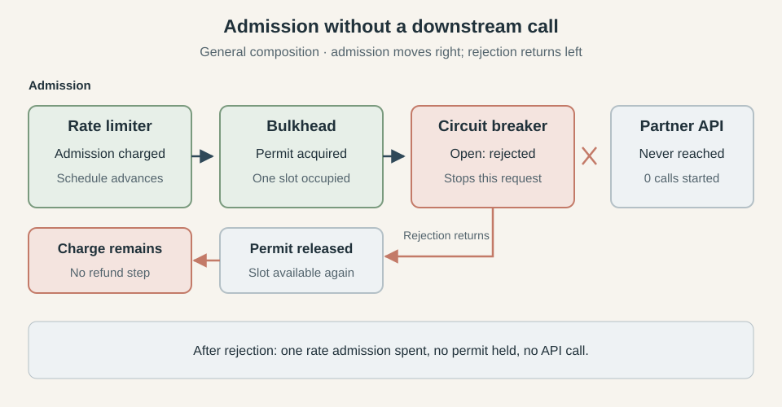
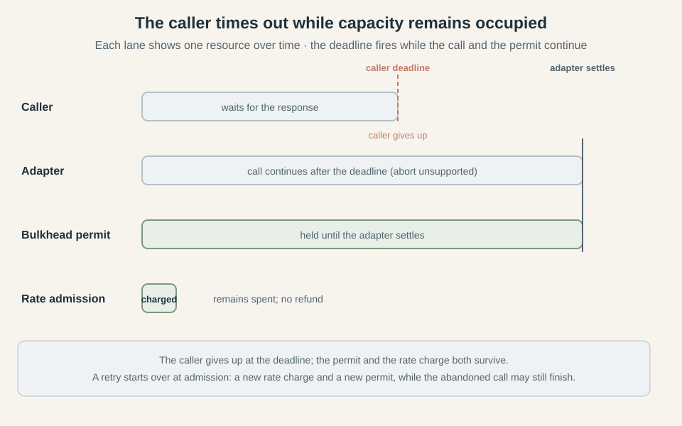

---
layout: layouts/post.njk
title: How to Combine Circuit Breakers, Bulkheads, and Rate Limiters
date: 2027-09-25
description: Combining distributed resilience policies changes what each one counts and protects. How to choose their order and handle the failures that appear between admission and execution.
excerpt: "A rate limiter admits a request, then a full bulkhead refuses it. The API receives no call, but the rate allowance has already been spent. Put the policies in the opposite order and a concurrency permit is held while the rate limiter decides. Each arrangement accounts for different work, and that choice shapes how the system behaves under load."
tags:
- posts
- javascript
- typescript
- distributed systems
- resilience
- series--Distributed Resilience
---
*This series follows circuit breakers, bulkheads, and rate limiters from their in-process foundations to implementations that coordinate across a fleet. This final article examines how they behave together, using configuration examples from [Caracal](https://github.com/gkoos/caracal).*

1. [How to Implement a Distributed Circuit Breaker](/posts/2026-09-14-How-to-Implement-a-Distributed-Circuit-Breaker/)
2. [How to Implement a Distributed Bulkhead](/posts/2026-09-17-How-to-Implement-a-Distributed-Bulkhead/)
3. [Rate Limiting Without the Refill Loop: Token Bucket vs GCRA](/posts/2026-09-22-Rate-Limiting-Without-the-Refill-Loop-Token-Bucket-vs-GCRA/)
4. [How to Implement a Distributed Rate Limiter](/posts/2026-09-24-How-to-Implement-a-Distributed-Rate-Limiter/)
5. How to Combine Circuit Breakers, Bulkheads, and Rate Limiters

Your service runs on twenty replicas that all call the same API. Following the earlier articles, you have given them a shared rate budget of 100 calls a second, with a burst allowance of 20. A distributed bulkhead caps concurrent calls at 20, and a circuit breaker records their outcomes so the fleet can stop calling when the API starts failing. Under normal load, the partner answers in about 80 ms and requests pass through all the policies nicely.

Then response times rise to two seconds, while the calls continue to succeed within their timeout. The rate limiter still permits its configured admission rate, but at 100 calls a second, two-second calls would require about 200 calls in flight once traffic settled into a steady flow. The bulkhead allows only 20, so with every slot occupied for two seconds, the service completes about ten calls a second and sheds the excess. These figures describe steady traffic with a fixed call duration; bursts and varying response times change when the slots fill. The failure-based breaker remains closed because the calls that reach the partner keep succeeding.

Now suppose that the breaker wraps the bulkhead and counts its admission rejections as failures. Its window starts filling with errors from requests that never reached the API, and eventually it opens against a dependency that is still answering successfully. If the breaker is intended to measure dependency health, those observations give it the wrong evidence. Caracal ignores bulkhead admission refusals by default, but a custom classifier or its explicit option to count them changes that behavior. Classifying every thrown error as a dependency failure therefore changes the protection the composed system provides.

Even with the classification corrected, the order has a cost. A request that passes the rate limiter before reaching the full bulkhead has spent allowance without making a downstream call. Put the bulkhead first and that charge is avoided when capacity is full, but an admitted request now holds a permit while the rate coordinator decides whether it may proceed. A slow coordinator extends that hold before the partner has received any work.

The previous articles established how each shared policy makes its own decision. Here we will follow requests through the combined system and examine what an earlier admission leaves behind when a later policy refuses them. The useful arrangement depends on what the budget represents: charging an incoming request can be intentional for a tenant quota, while charging a call that never reaches a partner wastes part of the allowance reserved for that partner. We will use Caracal configurations where they express the arrangement being discussed and identify version limitations where they do not. Start with the request that passed the rate limiter and stopped at the bulkhead, because its unused admission already shows why each policy's accounting has to be understood across the whole call.

## What each admission commits

In the rate-limiter-first arrangement, the request refused by the full bulkhead has already changed the limiter's state. The shared schedule records its admission even though no API call follows, so the number of rate admissions can exceed the number of downstream calls. That difference comes from where the limiter makes its decision: it charges before handing control to the next policy, whose decision is still unknown.

There are also two different units of work to keep track of: a logical request is the caller's invocation, such as fetching an order, while an attempt is one execution of the underlying adapter. Retries can turn one logical request into several adapter attempts, each making another call to the dependency. An admission rejection stops the path before the adapter starts, so that rejected path produces no downstream call at all.

Each policy leaves different state behind when it admits that path:

| Policy | What admission commits | What a later rejection requires |
| --- | --- | --- |
| Rate limiter | Advances the shared schedule by one admission | The charge remains, and elapsed time restores allowance |
| Bulkhead | Acquires an owned concurrency permit | Release the permit, if release cannot be confirmed, its lease provides eventual recovery |
| Circuit breaker | Allows execution and, in half-open, claims a probe slot | Classify the returned outcome and settle any probe claim, including when the outcome is ignored |

The rate limiter has no completion step that reverses its admission. As [One cell, nothing to own](/posts/2026-09-24-How-to-Implement-a-Distributed-Rate-Limiter/#one-cell-nothing-to-own) explained, GCRA retains an aggregate schedule, with no individual claim to return when a call is abandoned. The bulkhead retains an identifiable permit, so a later refusal gives it something specific to release. Once work starts, that permit follows the underlying adapter's settlement, as described in [What a permit actually holds](/posts/2026-09-17-How-to-Implement-a-Distributed-Bulkhead/#what-a-permit-actually-holds).

To see both forms of accounting on one path, let the bulkhead have a free slot and put an open breaker after it. The request spends a rate admission and acquires a permit before the breaker refuses it. As the rejection returns through the enclosing policies, the bulkhead releases the permit, leaving no occupied slot for this request. The rate schedule stays advanced, despite the API having received no call.



*The rejection releases the permit while the rate charge remains.*

Each distributed admission can be atomic without the whole path forming a transaction. The limiter's Redis operation has finished before the bulkhead asks for capacity, and other replicas can spend allowance between those decisions. Sharing a Redis server does not join the separate policy operations into one admission that either commits everything or changes nothing.

Cleanup therefore follows the state each policy owns. Removing a bulkhead's specific permit token leaves other holders' claims intact, while restoring an old GCRA timestamp would erase admissions made by other callers in the meantime. Even subtracting one interval from the current timestamp needs a separately defined refund policy, because the schedule has continued to interact with elapsed time and later traffic. The limiter from this series provides no such operation, so composition has to account for charges left behind by later refusals.

The breaker adds an observation to this return path. An inner refusal reaches an enclosing breaker as an outcome to classify, and ignoring it must still release a half-open probe claim without counting it toward recovery. We will return to classification after choosing where the admissions belong, because their order determines which refusals the breaker gets to observe.


## Order changes what gets protected

The previous diagram puts the breaker last to expose the cost of a poor arrangement for our partner API. Once the breaker is open, acquiring downstream capacity and spending the partner's rate allowance achieves nothing for that request. Checking the breaker first avoids both commitments, although a distributed breaker still needs to consult its coordinator.

In the arrangements below, arrows show admission from the outermost policy toward the API, and outcomes return in the opposite direction. We will keep the breaker first while comparing the rate limiter with the bulkhead, then consider the different requirement that justifies a rate limiter outside the breaker.

### Rate limiter before bulkhead

With breaker → rate limiter → bulkhead → API, a request rejected by the rate limiter never reaches the capacity check. This is useful when arrivals greatly exceed the rate budget: the limiter sheds that excess before the system performs permit acquisition and cleanup. A distributed limiter still asks Redis about every arrival that reaches it, so this placement reduces work for the later policies without removing the coordinator cost of rate checking.

The cost appears when the limiter admits a request and the bulkhead is full. Suppose the partner has become slow and all twenty permits are occupied, but the rate schedule allows another admission. The limiter spends that admission before the bulkhead refuses the request, leaving less allowance for traffic arriving after a slot becomes available. If this budget represents calls allowed by the partner, the charge consumes useful allowance without using any of the partner's quota.

The same behavior has a purpose when the budget represents traffic accepted from a tenant. A tenant making repeated requests against a saturated service continues to consume its allowance, which limits how often it can reach later admission checks. The distinction belongs in the budget's definition: a tenant-facing admission quota and a quota for calls sent to a provider account for different activity.

### Bulkhead before rate limiter

With breaker → bulkhead → rate limiter → API, a full bulkhead rejects before the rate schedule changes. This preserves allowance for requests that have capacity available, making it a useful starting point for the partner API example. After the bulkhead acquires a permit, the rate limiter either admits the request or refuses it and causes the permit to be released.

The diagram compares those orders with identical starting conditions. All twenty permits are held by existing calls, and the rate budget has allowance for one more admission, so neither arrangement starts another API call.


*With capacity already full, checking it first preserves the available rate allowance. The existing twenty calls keep their permits in both cases.*

When a slot is available, checking capacity first has a different cost: the acquired permit remains occupied while the rate coordinator responds. A slow coordinator lengthens that interval, and a rate rejection adds a release operation for work that never reached the API. Choosing this order therefore trades wasted rate admissions during saturation for temporary permit ownership during rate checks.

A waiting limiter would extend that ownership through the wait for allowance. Enough waiting requests could occupy every permit while the dependency receives no work, defeating a bulkhead intended to count active downstream calls. Caracal's limiter rejects immediately, but systems that need waiting must decide where to put it. A bounded queue before permit acquisition keeps those waiters outside the concurrency count, with queue time included in the caller's deadline and admission checked again before execution.

### Breaker before the admission budgets

Keeping the breaker outside both budgets lets an open breaker stop a request before either budget is touched. For our partner API, that avoids the waste shown in the previous section. It also places the later policies' refusals inside the breaker's observation boundary, which requires the classification rules introduced earlier.

Half-open introduces another consequence of this placement. A request can claim a probe slot and then encounter a full bulkhead or an exhausted rate budget, so the breaker has admitted a recovery attempt without obtaining a downstream observation. An ignored refusal releases that claim without making progress toward closing. The recovery section will examine what happens when other traffic keeps competing for the capacity those probes need.

### A rate limiter outside the breaker

An ingress quota has a reason to run before the health check. With ingress limiter → breaker → bulkhead → provider limiter → API, a tenant spends its ingress allowance even while the partner's breaker is open. The provider allowance is charged only on paths that pass the breaker and find capacity, giving each limiter a placement consistent with its purpose.

This arrangement also keeps ingress refusals outside the breaker's observations. Putting a downstream bulkhead before the breaker solely to obtain that separation adds permit work to requests the breaker will reject, so an explicit classifier is the better fit for our example. A bulkhead intended to bound an entire workflow has a broader accounting unit and needs to be evaluated against that workflow instead.

Caracal 0.7.0's built-in rate limiters run around adapter attempts, inside its breaker, so moving a limiter earlier in the policy array does not create this ingress arrangement. It needs admission at a separate application boundary or a composition mechanism that supports that placement. The arrangement remains useful, and the next section will distinguish it from the orders Caracal's policy array actually expresses.

| Requirement | Admission order | Cost to account for |
| --- | --- | --- |
| Preserve partner allowance when capacity is full | Breaker → bulkhead → provider limiter | A permit is held during the rate check |
| Shed rate excess before capacity checks | Breaker → provider limiter → bulkhead | A later capacity refusal leaves the rate charge spent |
| Charge ingress traffic during a partner outage | Ingress limiter → breaker → downstream budgets | Requests refused by the breaker still consume ingress allowance |

For the running example, we will use breaker → bulkhead → provider limiter because the rate budget belongs to the partner and capacity exhaustion should leave that budget available. This choice assumes prompt rate-admission decisions, and we will account for coordinator delays when setting the surrounding timeouts.


## Expressing the chosen arrangement in Caracal

Caracal 0.7.0 builds its execution path in two groups. The breaker belongs to the outer group, alongside timeout and retry policies, while bulkheads and rate limiters declare `phase: "attempt"` and wrap each adapter call. The `policies` array preserves order within each group, then the outer group wraps the attempt group.

That means swapping the bulkhead and rate limiter changes which admission happens first. Moving either across a breaker in the array leaves it inside that breaker, and moving it across a retry policy leaves it around each individual attempt. Keep the array written in execution order so readers can follow it without mentally applying that partition.

### Configure the shared policies

For the example below, `breakerCoordinator`, `bulkheadCoordinator`, and `rateCoordinator` are the policy-specific wrappers around one connected Redis client, all using the namespace `checkout:prod`. They come from `redisCircuitBreakerCoordinator`, `redisCoordinator`, and `redisRateLimitCoordinator`, respectively, as shown in the earlier implementation articles. Sharing the client reuses the connection while each policy retains its own state.

```ts
import {
  bulkhead,
  circuitBreaker,
  operation,
  rateLimit,
  RateLimitExceededError,
  timeout,
} from "@gkoos/caracal"
import { fetchAdapter } from "@gkoos/caracal/fetch"
import { CoordinatorUnavailableError } from "@gkoos/caracal/redis"

const sharedBreaker = circuitBreaker.distributed({
  name: "partner-health",
  coordinator: breakerCoordinator,
  scope: () => "partner:eu",
  minimumThroughput: 20,
  failureThreshold: 0.5,
  openMs: 10_000,
  halfOpenProbes: 1,
  halfOpenSuccesses: 2,
  probeLeaseTtlMs: 15_000,
})

const sharedCapacity = bulkhead.distributed({
  name: "partner-capacity",
  coordinator: bulkheadCoordinator,
  scope: () => "partner:eu",
  limit: 20,
  leaseMs: 30_000,
})

const sharedRate = rateLimit.distributed({
  name: "partner-quota",
  coordinator: rateCoordinator,
  scope: () => "credential:primary",
  rate: 100,
  burst: 20,
})
```

The quota belongs to the credential used for API calls, while the breaker and capacity limit describe the partner's European service. Those scopes name different resources, each distributed identity also includes the operation name, so these policies will share state across replicas executing the same operation, but reusing them under another operation name creates separate budgets. The next section develops that distinction beyond this single operation.

The breaker waits for at least twenty observations before evaluating its failure threshold. After opening for ten seconds, it allows one probe at a time and requires two successful probes to close. Its fifteen-second probe lease gives an abandoned claim a finite lifetime, while the bulkhead's thirty-second lease is renewed while its permit remains held. These values are assumptions for this example, with the sizing tradeoffs covered in [The settings are not independent](/posts/2026-09-14-How-to-Implement-a-Distributed-Circuit-Breaker/#the-settings-are-not-independent).

### Put the operation around them

The adapter needs to distinguish a refused admission from a failed HTTP call before we use this configuration. Here the fetch adapter ignores a local rate rejection and a Redis coordinator error for outcome classification, while retaining its default HTTP response classification. The breaker already ignores ordinary bulkhead admission refusals by default, and we will examine the remaining classification choices in a later section.

```ts
const adapter = fetchAdapter({
  classifyError: (error) => {
    if (
      error instanceof RateLimitExceededError ||
      error instanceof CoordinatorUnavailableError
    ) {
      return "ignored"
    }
    return "retryable"
  },
})

const getOrder = operation({
  name: "partner-order",
  adapter,
  policies: [
    timeout({ ms: 5_000 }),
    sharedBreaker,
    timeout({ ms: 3_000 }),
    sharedCapacity,
    sharedRate,
  ],
})
```

Returning `"ignored"` changes the policy's interpretation of an error without hiding the error from the caller. The remaining thrown errors are classified as retryable for this example, but no retry policy has been configured, so each invocation makes at most one adapter attempt. If retries are added later, this same classifier also controls which outcomes qualify for another attempt.

The outer five-second timeout bounds the caller's wait, including time spent communicating with the breaker coordinator. The inner three-second timeout begins after breaker admission and covers the attempt policies as well as the adapter call. Breaker outcome recording takes place outside that inner timer, which is why the caller's total deadline has its own position.

For this example, the shared Redis client retains its default one-second command timeout. That bounds each coordinator command separately, and several commands can consume time during one invocation. The outer deadline can therefore expire before all policy bookkeeping finishes. Neither deadline reverses a rate charge or proves that remote work stopped, and the probe lease must leave room for settlement after the inner timeout fires.

### Change the admission order deliberately

To shed excess rate before checking capacity, swap only the final pair. The outer policies stay in the same positions, so their timing boundaries remain the same.

```ts
policies: [
  timeout({ ms: 5_000 }),
  sharedBreaker,
  timeout({ ms: 3_000 }),
  sharedRate,
  sharedCapacity,
]
```

This variation pays the cost described in the previous section: a successful rate admission remains charged if the bulkhead then refuses it. Moving `sharedRate` to the beginning of this array would still leave it in the attempt group, so it would not create a request-level quota outside the breaker.

The same phase rule prevents a built-in bulkhead from holding one permit across an entire retry sequence through array placement. That broader limit can be useful for counting active workflows, but it requires a separate boundary in this version. Breaker and retry placement does remain configurable within the outer group, allowing a breaker to observe either the retry sequence's final result or each attempt, which we will use when introducing retries.

## Scope each policy to the resource it protects

The scopes in the previous section were chosen to name different resources, not to keep the example tidy. The rate limiter keys on the credential the service presents to the partner, while the breaker and the bulkhead key on the European region that serves those calls. A scope selects the shared state a policy reads and updates, so naming a scope is the same act as naming the resource the policy protects. The cases that follow develop that choice.

### Provider quota and dependency health

A provider quota and a dependency health signal measure different things and deserve different granularities. The partner meters the credential wherever it is presented, so that allowance can span regions and endpoints. Health is narrower: the European deployment can start failing while the credential still has allowance and another region keeps answering, so the breaker should key on the region while the limiter keys on the credential. Sharing a rate budget across the fleet does not oblige the fleet to share one breaker window, and a region whose breaker has opened should not drain allowance that a healthy region still needs.

The scope string is only one part of the coordination identity. Caracal keys each distributed policy by the namespace, the policy name, the operation name, and the scope. The operation name is the interesting part for sharing: reusing one rate-limiter instance across operations with different names gives each operation its own budget, whatever the scope callback returns, because the operation name is folded into the key. A credential-wide quota that spans several operations therefore needs a coordinator that drops the operation name from its key; writing the same scope callback into each operation does not merge them. Caracal 0.7.0 supplies no such coordinator, so the quota remains a custom coordination design rather than a scope choice. [Whose rate is it](/posts/2026-09-24-How-to-Implement-a-Distributed-Rate-Limiter/#whose-rate-is-it) covers whose schedule the limiter should advance.

### Tenant isolation and shared capacity

Per-tenant rate limits and a shared capacity limit answer different questions, and neither replaces the other. A tenant rate bounds how quickly one tenant may arrive, yet many tenants can each remain under their own rate and together exceed what the partner can serve at once. A single shared bulkhead bounds that combined concurrency but promises no tenant a share of it, since one busy tenant can occupy every slot. Guarding both axes needs both policies, which raises the question of how the two bulkheads relate.

Two bulkheads can nest a per-tenant cap inside a global cap, or the reverse. Acquiring the tenant permit first stops a tenant that has already reached its own limit from taking a global permit, so its excess sheds before it touches the shared resource. Acquiring the global permit first surfaces fleet exhaustion sooner, because every request checks the aggregate cap before any tenant-specific work, at the cost of consulting the tenant limit only after a global permit is held. Both orders owe the same cleanup when the inner admission refuses: the outer permit must be released before the rejection returns. Hold a consistent order across every path and reject rather than queue between the two, because a waiter would keep its first permit while nothing reaches the dependency. Caracal's distributed bulkhead sheds immediately and has no queue, so this version does not create that waiting-holder state, but systems that add a queue do. [Multiple bulkheads, acquired in order](/posts/2026-09-17-How-to-Implement-a-Distributed-Bulkhead/#multiple-bulkheads-acquired-in-order) develops the acquisition discipline.

Because Caracal's bulkheads are attempt policies, two of them nest through their order inside the attempt group and both wrap each adapter call, so the tenant and global caps in that arrangement apply per attempt rather than across an entire workflow.

### Foreground traffic and batch work

Workload class is another axis that deserves its own capacity. Interactive requests that must answer within a few hundred milliseconds and batch jobs that run for minutes should not draw from one concurrency pool, since a burst of batch work could occupy every slot while foreground callers wait. Separate compartments give each class its own bound, but they also strand capacity: when batch work sits idle, its slots cannot be lent to interactive traffic, and the reverse holds. Whether that stranded capacity matters depends on whether the dependency has a hard aggregate budget.

When it does, keep a shared total cap beside the class caps. Interactive and batch each get a bulkhead, and a third bounds their combined concurrency, with the acquisition-order question from the tenant case applying between each class cap and the total cap. The built-in bulkheads express these fixed compartments and the shared cap through nesting. They do not provide weighted fairness, priority queues, or work-conserving borrowing that would let an idle class lend capacity to a busy one. Those are scheduling capabilities for a queue or a caller-side dispatcher, outside the admission policies described in this series.


*The figure shows scope boundaries, not one prescribed nesting order. The full identity adds the namespace, the policy name, and the operation name to each scope.*

## Decide what the breaker is learning

A circuit breaker learns only what its classifier records, and a breaker scoped to the partner's health should record only outcomes that say something about the partner. The table separates the outcomes the running example can produce by whether a call reached the partner.

| Outcome | Did the downstream call start? | What does this reveal? | How should this breaker classify it? |
| --- | --- | --- | --- |
| Successful response | Yes | The partner answered | success |
| Downstream timeout | Yes | The partner did not answer in time | failure |
| Local rate rejection | No | Our quota was spent before the call | ignored |
| Bulkhead saturation | No | Our capacity was full before the call | ignored |
| Coordinator failure | No | Our shared state was unreachable before the call | ignored |
| Caller cancellation | No | The caller left before the call | ignored |

The dividing line is the adapter call itself: a refusal that fires before the adapter starts reveals how our own limits are behaving, not how the partner is behaving, so it stays outside a health breaker's window. Only the first two rows, and the transport errors that follow a started call, are evidence about the callee.

A provider returning HTTP 429 is different from our own limiter rejecting. 429 is the provider answering, and its admission policy is part of what a health breaker can learn, while our limiter rejecting before a network call says nothing about the provider. The fetch adapter's default response classification treats a 429 as retryable, which the breaker counts as a failure, while the `classifyError` callback shown earlier returns `"ignored"` for a local `RateLimitExceededError` so our own quota spending stays out of the window.

Caracal 0.7.0 builds part of that distinction in. Bulkhead refusals with reasons `capacity`, `wait-timeout`, and `admission-expired` are ignored by default, because the adapter never started, `countBulkheadRejections: true` records them as failures instead, for a breaker that measures overload rather than dependency health. A custom `classify` callback on the breaker takes precedence over that setting and over the adapter's verdict. A `lease-lost` refusal is excluded from that default on purpose: the permit was held and the call had started before the lease expired, so it needs the reasoning of a timeout, not of a pre-call refusal.

The rate limiter's rejection gets no built-in exemption. The fetch adapter classifies thrown errors as retryable by default, and the breaker counts retryable as failure, so without the `classifyError` callback a spent quota would accumulate as partner failures. The callback also returns `"ignored"` for `CoordinatorUnavailableError`, because an unreachable Redis server is our problem, not the partner's; coordinator health deserves its own signal separate from the partner's.

That callback controls more than the breaker. Its `"ignored"` verdict keeps rate and coordinator errors out of any later retry policy too, while the `"retryable"` fallback marks the remaining transport errors as worth another attempt. The fallback is a choice that must match the application's error taxonomy: the example treats everything else the adapter throws as retryable, but a real service reserves that label for errors a retry can plausibly fix and adds caller cancellation to the ignored set.

A custom breaker `classify` callback cannot replace the adapter's response classification. It receives only whether the adapter resolved and, on failure, the thrown error, so its `isSuccess` flag means the promise resolved, not that the response was healthy. A resolved HTTP 503 still needs the adapter's `classifyResponse` to mark it retryable; a breaker callback that reads only `isSuccess` would record the 503 as a success. Response classification therefore stays in the adapter, and the breaker callback is for overriding the refusal default, not for reading status codes.

Fallback placement changes what the breaker observes. A cached response returned inside the breaker's boundary turns a dependency failure into a successful observation, because the wrapped execution settled successfully, so the breaker sees recovery where none happened. Returning the fallback outside the boundary preserves the actual dependency outcome and lets the breaker open on real evidence. Caracal has no built-in fallback, so the boundary is whichever composition you write.

An `"ignored"` result still settles a half-open probe claim, releasing its slot without recording an outcome or advancing recovery; [The probe budget has to be a global one](/posts/2026-09-14-How-to-Implement-a-Distributed-Circuit-Breaker/#the-probe-budget-has-to-be-a-global-one) covers that settlement.

## Retries, timeouts, and waiting alter the accounting

As we saw, retries change what a single request spends. A logical request that retries can consume several rate admissions and hold several permits over the course of its attempts, while the caller's deadline, the attempt's timeout, and the permit's lifetime each measure a different span. The subsections that follow trace those consequences through the accounting established earlier.

### One logical request can spend several admissions

A provider quota must count every attempt, since each retry passes through the rate limiter and the bulkhead again, and a request-level limit charges once per request instead. The two belong at separate boundaries. Caracal's built-in rate limiter is an attempt policy, so it is the quota form, while a request-level limiter lives outside the operation, as the ingress arrangement in the ordering section described.

Retry placement relative to the breaker changes what the breaker observes. With the breaker outside the retry policy, it records only the final outcome of the retry sequence, so a request that fails twice and then succeeds records a single success. With the retry outside the breaker, the breaker records each attempt, and the failed attempts count even though the request ultimately succeeded. The first arrangement conceals intermediate failures from the breaker, and in half-open a probe that wraps the retry admits once but can start several downstream attempts during its one probe execution.

Two policies arrays show the difference, keeping the rate limiter and the bulkhead around each attempt in both.

```ts
policies: [
  timeout({ ms: 5_000 }),
  sharedBreaker,
  retry({ maxAttempts: 2 }),
  timeout({ ms: 3_000 }),
  sharedCapacity,
  sharedRate,
]
```

The breaker sits before the retry policy, so it records the final result of the whole sequence; a retry that recovers from an intermediate failure never reaches the breaker as a failure.

```ts
policies: [
  timeout({ ms: 5_000 }),
  retry({ maxAttempts: 2 }),
  sharedBreaker,
  timeout({ ms: 3_000 }),
  sharedCapacity,
  sharedRate,
]
```

With the retry policy before the breaker, each attempt is classified and recorded on its own. `maxAttempts` bounds the sequence, and the retry policy schedules another attempt only when the adapter declares `replay: "safe"` and the classifier calls the outcome retryable. The fetch adapter infers `"safe"` from a GET or HEAD, so the running example qualifies; a POST would be declined as replay-unsafe. Retry fundamentals, including idempotency and replay safety, are covered in [Beyond Happy Path Engineering: the Network](/posts/2026-07-01-Beyond-Happy-Path-Engineering-the-Network/).

A `retryAfterMs` value, whether from the rate limiter or an HTTP `Retry-After` header, is the earliest time the request would be eligible again under the state observed when it was refused. It is not a reservation: competing replicas can spend the restored allowance first, so a retry that fires at exactly the minimum can find the budget gone again. Bounded retries therefore wait at least the minimum and add positive jitter so the fleet does not retry in lockstep. The retry policy accepts a `delay` option for that purpose, and this article stops at naming it rather than publishing a backoff schedule.

### What a permit spans

A permit held across a retry sequence would count active workflows rather than downstream calls, and the configuration section noted that the built-in bulkhead cannot reach that placement through array order. The price of that broader unit is the permit spent during backoff: a workflow that sleeps between attempts keeps its slot occupied while the partner receives nothing. Workflow concurrency and attempt concurrency are different axes, and a system that wants both needs a separate boundary for each.

The attempt-level permit also follows the adapter's settlement, not the caller's patience. When the adapter does not support abort, an earlier attempt can keep running after the caller's deadline has fired and a retry has begun, so the old attempt's permit stays held while the new attempt asks for another. Caracal's fetch adapter declares abort support, but an adapter that does not retains its permit until it settles on its own.

### Deadlines and real work

The configuration section separated the caller's deadline from the inner timeout and the Redis command timeout. Retries give that separation a second meaning: the inner timeout restarts for each attempt, so it bounds one call, while the caller's deadline spans the whole retry sequence and gives up even when a timed-out attempt keeps running.

The permit follows the adapter's settlement, and for the fetch adapter that settlement is the response headers, not the body. A caller that stops reading a streamed body still holds the permit until the body is cancelled or consumed, a boundary distinct from the timeout that bounds the caller's wait. [What a permit actually holds](/posts/2026-09-17-How-to-Implement-a-Distributed-Bulkhead/#what-a-permit-actually-holds) covers that distinction.



*The caller gives up at the deadline while the permit and the rate charge survive; a retry spends another admission.*

## Recovery must pass through the other gates

A breaker that has opened still has to close, and closing requires probes that pass through the rate limiter and the bulkhead before they reach the dependency. The breaker moves to half-open after its open window, admits one probe at a time, and waits for two successes. If that probe is refused by an exhausted rate budget or a full bulkhead, the classification chosen earlier decides what happens next. An ignored refusal releases the probe claim without recording an outcome, so the breaker stays half-open and tries again; a refusal recorded as a failure would re-open the breaker and restart its open window. The same classification that keeps admission rejections out of the failure window is what lets a recovering breaker keep probing.

Why the rate budget is empty is important, because it decides whether the probe can ever succeed. The limiter keys on the credential, and other healthy traffic on that credential keeps spending while this operation sits behind its open breaker. At 100 calls a second with a burst of 20, the allowance refills its burst in about a fifth of a second, so the ten-second open window restores it long before the first probe; an empty budget at probe time is other traffic on the shared credential, not this scope's own past calls. A slow-replenishing budget produces the same symptom for a different reason, and the two should not be confused.

The bulkhead can starve probes the same way. Other work sharing the "partner:eu" scope can keep all twenty permits occupied, so a probe is refused for capacity and never reaches the partner even though the dependency is healthy. Recovery then stalls behind traffic the breaker is not governing. Reserving a little capacity for probes would prevent that starvation, but the reserve must sit inside the hard provider quota and the total concurrency limit rather than bypass them, and this version of Caracal has no built-in reserved probe lane or gradual recovery ramp.

Once two probes succeed and the breaker closes, ordinary traffic returns all at once. The half-open probe limit throttled only the recovery window; nothing ramps the returning load. The rate limiter's burst has been replenishing during the open period, so a closed breaker can spend it immediately, sending a fresh burst into a dependency that just proved it can answer two calls. Closing is not a capacity decision.

The gates also feed the breaker's evidence. The breaker opens on a failure ratio computed from a window of observations, and it needs at least `minimumThroughput` of them before the window expires. Heavy shedding admits few calls, so a mostly-refused dependency can fail to collect enough observations to open; the shedding that protects the fleet also slows its health detection. Admission settings and observation settings are one problem, not two. [The settings are not independent](/posts/2026-09-14-How-to-Implement-a-Distributed-Circuit-Breaker/#the-settings-are-not-independent) and [Spending and rebuilding the burst](/posts/2026-09-22-Rate-Limiting-Without-the-Refill-Loop-Token-Bucket-vs-GCRA/#spending-and-rebuilding-the-burst) cover those interactions.


*Recovery depends on the shared quota, not only on the dependency's health: a blocked probe releases its claim without advancing or undoing recovery.*

## The composed system depends on its coordinator

Consider a request with the rate limiter ahead of the bulkhead. The limiter's coordinator confirms the charge, so that admission is spent, and then the bulkhead's acquisition loses its reply when the Redis command times out. No downstream call starts, because capacity was never confirmed, the bulkhead fails closed and rethrows the coordinator error. The rate charge stays spent, and if the bulkhead's acquire did grant a permit before the reply vanished, the lease recovers it later. A partial admission leaves a real charge behind and hands the uncertain part to the lease rather than to the caller.

A breaker configured to fail open cannot rescue this. Its `onCoordinatorError` setting governs only the breaker's own admission, and only when the coordinator is unreachable while the last known state was closed. The rate limiter and the bulkhead have no such escape: each fails closed on uncertain admission. An outage of the shared Redis service therefore stops every distributed gate at once, whatever the breaker's fallback says.

Missing state is different from an unreachable coordinator. The latter reports a transport error, missing state reports nothing. If Redis loses the rate limiter's theoretical arrival time, the allowance silently returns to full and the fleet can overspend. If it loses a running bulkhead lease, those permits are forgotten and more concurrency is admitted than the limit allows. No admission call sees an error, because the state is simply gone.

A local fallback changes the guarantee. Falling back to per-process rate limiting or bulkheads keeps the service up, but a per-process budget is not the shared budget it replaces: 20 replicas each allowing their own share can together exceed the provider quota and the concurrency cap. Keeping the shared limit through a fallback requires an explicit aggregate bound and fleet assumptions that no longer hold when the coordinator is the thing that failed. Caracal's distributed limiter and bulkhead do not implement this fallback, and in the inspected version they fail closed instead.

Coordinator overhead belongs in capacity planning. Every admission check, breaker outcome recording, permit release, and renewal is a Redis command, and all of them share one coordinator service. Each policy added to the pipeline adds remote work and another point where a reply can be lost, and the round-trip counts that look small in isolation add up across the fleet.

Deployment decides whether the fleet actually shares one budget. Replicas with different names or namespaces keep independent state, so a mixed configuration can disagree about a single provider quota without any replica noticing. Changing a name or namespace during a migration splits the budget into two independent cells for as long as both configurations run. [The settings are not independent](/posts/2026-09-24-How-to-Implement-a-Distributed-Rate-Limiter/#the-settings-are-not-independent) covers that hazard in the rate limiter.

## Verify the whole request path

The earlier articles verified each policy in isolation, and those unit and integration suites still apply. The composed system needs assertions about the whole path, because one logical request can produce several outcomes and the metrics must separate them. The scenarios below pair each hazard from this article with what the composition should demonstrate under test.

| Scenario | What the composition should demonstrate |
| --- | --- |
| Slow successful calls | Capacity shedding without fabricated dependency failures |
| Fast downstream failures | Breaker detection with retry load included in rate accounting |
| Rate budget exhausted | No downstream start and intentional breaker classification |
| Open breaker | Inner budgets untouched in the breaker-first arrangement |
| Reply lost after rate admission | No assumption that the charge was undone |
| Later permit acquisition uncertain | No downstream start without confirmed ownership |
| Caller deadline with unsupported abort | Permit follows underlying settlement |
| Recovery under shared traffic | Ignored refusals release probe claims; real probe outcomes govern closing |
| One replica dies or loses its lease | Recovery of claims measured separately from actual downstream concurrency |

The path is measured through six counts: logical requests, actual adapter starts, policy admissions, rejections by cause, permit occupancy, and breaker observations. They diverge: a rate admission is not a downstream start, and a low downstream error rate says little about user success when most requests are shed before they reach the dependency, so the counters have to be read together. The rejection events carry the cause, and the breaker events carry the outcome, which is how the counts are reconciled.

Lease-loss tests need an independent downstream witness: a live-lease count alone does not prove that an expired holder stopped working, because the lease can outlive the work it was meant to bound, and asserting actual downstream concurrency requires watching the dependency itself.

These are scenarios to build against, not measurements already taken. It is possible to run a test suite that exercises the whole path and counts the outcomes, but it is not possible to prove that a production fleet behaves the same way. The fleet's traffic is not under test control, and the coordinator can lose state or fail at any time. The scenarios above are therefore a guide for what to verify in a test environment, not a checklist of what has been observed in production.

## Closing

The example settled on one arrangement: the caller's deadline wraps a breaker, an inner timeout, a bulkhead, and a rate limiter, with the breaker and the bulkhead keyed to the API's European region and the limiter keyed to the credential. Each boundary accounts for a different resource: the limiter for the credential's allowance, the bulkhead for the region's concurrency, and the breaker for the region's health. The order decides what each observes and what it owes when a later boundary refuses. The bulkhead sits ahead of the limiter so a request refused for capacity sheds without spending allowance, and it releases its permit when a later boundary refuses. The breaker sits outside both, so it records only outcomes that followed a started call. The limiter, which has no refund step, charges last, immediately before the adapter runs.

That arrangement is a choice, not a default. Before configuring any policy, name the concrete resource and the failure behavior each boundary expresses: which credential, which region, which refusals count as failures, and what to do when the coordinator is unreachable. The policies in Caracal turn those decisions into configuration, and the inspected version has limits this article noted where they arise.

